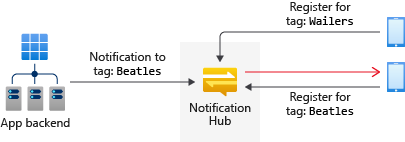
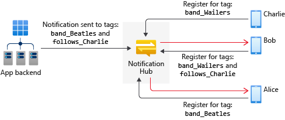
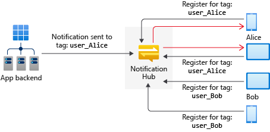
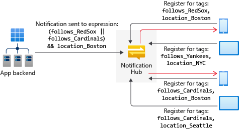

# Routing and tag expressions

## Overview

Tag expressions enable you to target specific sets of devices, or more specifically registrations, when sending a push notification through Notification Hubs.

## Targeting specific registrations

The only way to target specific notification registrations is to associate tags with them, then target those tags. As discussed in [Registration Management](notification-hubs-push-notification-registration-management.md), in order to receive push notifications an app has to register a device handle on a notification hub. Once a registration is created on a notification hub, the application backend can send push notifications to it. The application backend can choose the registrations to target with a specific notification in the following ways:

1. **Broadcast**: all registrations in the notification hub receive the notification.
2. **Tag**: all registrations that contain the specified tag receive the notification.
3. **Tag expression**: all registrations whose set of tags match the specified expression receive the notification.

## Tags

A tag can be any string, up to 120 characters, containing alphanumeric and the following non-alphanumeric characters: ‘_’, ‘@’, ‘#’, ‘.’, ‘:’, ‘-’. The following example shows an application from which you can receive toast notifications about specific music groups. In this scenario, a simple way to route notifications is to label registrations with tags that represent the different bands, as in the following picture:



In this picture, the message tagged **Beatles** reaches only the tablet that registered with the tag **Beatles**.

For more information about creating registrations for tags, see [Registration Management](notification-hubs-push-notification-registration-management.md).

You can send notifications to tags using the send notifications methods of the `Microsoft.Azure.NotificationHubs.NotificationHubClient` class in the [Microsoft Azure Notification Hubs](https://www.nuget.org/packages/Microsoft.Azure.NotificationHubs/) SDK. You can also use Node.js, or the Push Notifications REST APIs.  Here's an example using the SDK.

```csharp
Microsoft.Azure.NotificationHubs.NotificationOutcome outcome = null;

// Windows 8.1 / Windows Phone 8.1
var toast = @"<toast><visual><binding template=""ToastText01""><text id=""1"">" +
"You requested a Beatles notification</text></binding></visual></toast>";
outcome = await Notifications.Instance.Hub.SendWindowsNativeNotificationAsync(toast, "Beatles");

// Windows 10
toast = @"<toast><visual><binding template=""ToastGeneric""><text id=""1"">" +
"You requested a Wailers notification</text></binding></visual></toast>";
outcome = await Notifications.Instance.Hub.SendWindowsNativeNotificationAsync(toast, "Wailers");
```

Tags do not have to be pre-provisioned and can refer to multiple app-specific concepts. For example, users of this example application can comment on bands and want to receive toasts, not only for the comments on their favorite bands, but also for all comments from their friends, regardless of the band on which they are commenting. The following picture shows an example of this scenario:



In this picture, Alice is interested in updates for the Beatles, and Bob is interested in updates for the Wailers. Bob is also interested in Charlie’s comments, and Charlie is in interested in the Wailers. When a notification is sent for Charlie’s comment on the Beatles, both Alice and Bob receive it.

While you can encode multiple concerns in tags (for example, “band_Beatles” or “follows_Charlie”), tags are simple strings and not properties with values. A registration is matched only on the presence or absence of a specific tag.

For a full step-by-step tutorial on how to use tags for sending to interest groups, see [Breaking News](notification-hubs-windows-notification-dotnet-push-xplat-segmented-wns.md).

> [!NOTE]
> Azure Notification Hubs supports a maximum of 60 tags per registration.

## Using tags to target users

Another way to use tags is to identify all the devices of a particular user. Registrations can be tagged with a tag that contains a user ID, as in the following picture:



In this picture, the message tagged uid: Alice reaches all registrations tagged "uid:Alice"; hence, all of Alice’s devices.

## Tag expressions

There are cases in which a notification has to target a set of registrations that is identified not by a single tag, but by a Boolean expression on tags.

Consider a sports application that sends a reminder to everyone in Boston about a game between the Red Sox and Cardinals. If the client app registers tags about interest in teams and location, then the notification should be targeted to everyone in Boston who is interested in either the Red Sox or the Cardinals. This condition can be expressed with the following Boolean expression:

```csharp
(follows_RedSox || follows_Cardinals) && location_Boston
```



Tag expressions can contain all Boolean operators, such as AND (&&), OR (||), and NOT (!). They can also contain parentheses. Tag expressions are limited to 20 tags if they contain only ORs; otherwise they are limited to 6 tags.

Here's an example for sending notifications with tag expressions using the SDK.

```csharp
Microsoft.Azure.NotificationHubs.NotificationOutcome outcome = null;

String userTag = "(location_Boston && !follows_Cardinals)";

// Windows 8.1 / Windows Phone 8.1
var toast = @"<toast><visual><binding template=""ToastText01""><text id=""1"">" +
"You want info on the Red Sox</text></binding></visual></toast>";
outcome = await Notifications.Instance.Hub.SendWindowsNativeNotificationAsync(toast, userTag);

// Windows 10
toast = @"<toast><visual><binding template=""ToastGeneric""><text id=""1"">" +
"You want info on the Red Sox</text></binding></visual></toast>";
outcome = await Notifications.Instance.Hub.SendWindowsNativeNotificationAsync(toast, userTag);
```
