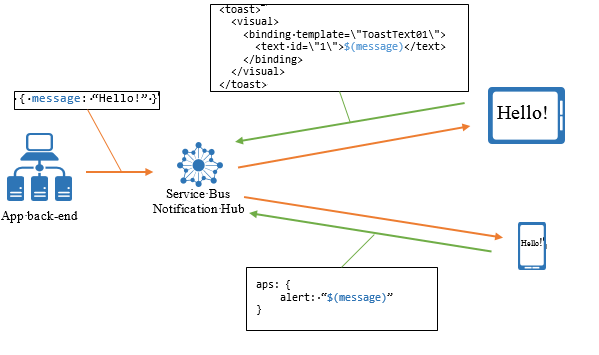
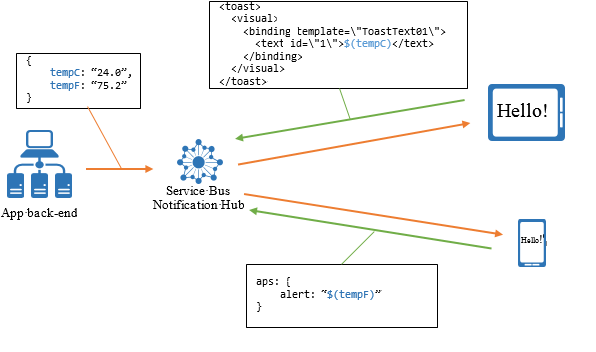

# Templates

Templates enable a client application to specify the exact format of the notifications it wants to receive. Using templates, an app can realize several different benefits, including the following:

- A platform-agnostic backend
- Personalized notifications
- Client-version independence
- Easy localization

This section provides two in-depth examples of how to use templates to send platform-agnostic notifications targeting all your devices across platforms, and to personalize broadcast notification to each device.

## Using templates cross-platform

The standard way to send push notifications is to send, for each notification that is to be sent, a specific payload to platform notification services (WNS, APNS). For example, to send an alert to APNS, the payload is a JSON object of the following form:

```json
{"aps": {"alert" : "Hello!" }}
```

To send a similar toast message on a Windows Store application, the XML payload is as follows:

```xml
<toast>
  <visual>
    <binding template=\"ToastText01\">
      <text id=\"1\">Hello!</text>
    </binding>
  </visual>
</toast>
```

You can create similar payloads for MPNS (Windows Phone) and FCM (Android) platforms.

This requirement forces the app backend to produce different payloads for each platform, and effectively makes the backend responsible for part of the presentation layer of the app. Some concerns include localization and graphical layouts (especially for Windows Store apps that include notifications for various types of tiles).

The Notification Hubs template feature enables a client app to create special registrations, called template registrations, which include, in addition to the set of tags, a template. The Notification Hubs template feature enables a client app to associate devices with templates whether you are working with Installations (preferred) or Registrations. Given the preceding payload examples, the only platform-independent information is the actual alert message (Hello!). A template is a set of instructions for the Notification Hub on how to format a platform-independent message for the registration of that specific client app. In the preceding example, the platform-independent message is a single property: `message = Hello!`.

The following picture illustrates the process:



The template for the iOS client app registration is as follows:

```json
{"aps": {"alert": "$(message)"}}
```

The corresponding template for the Windows Store client app is:

```xml
<toast>
    <visual>
        <binding template=\"ToastText01\">
            <text id=\"1\">$(message)</text>
        </binding>
    </visual>
</toast>
```

Notice that the actual message is substituted for the expression $(message). This expression instructs the Notification Hub, whenever it sends a message to this particular registration, to build a message that follows it and switches in the common value.

If you are working with Installation model, the installation “templates” key holds a JSON of multiple templates. If you are working with Registration model, the client application can create multiple registrations in order to use multiple templates; for example, a template for alert messages and a template for tile updates. Client applications can also mix native registrations (registrations with no template) and template registrations.

The Notification Hub sends one notification for each template without considering whether they belong to the same client app. This behavior can be used to translate platform-independent notifications into more notifications. For example, the same platform-independent message to the Notification Hub can be seamlessly translated in a toast alert and a tile update, without requiring the backend to be aware of it. Some platforms (for example, iOS) might collapse multiple notifications to the same device if they are sent in a short period of time.

## Using templates for personalization

Another advantage to using templates is the ability to use Notification Hubs to perform per-registration personalization of notifications. For example, consider a weather app that displays a tile with the weather conditions at a specific location. A user can choose between Celsius or Fahrenheit degrees, and a single or five-day forecast. Using templates, each client app installation can register for the format required (1-day Celsius, 1-day Fahrenheit, 5-days Celsius, 5-days Fahrenheit), and have the backend send a single message that contains all the information required to fill those templates (for example, a five-day forecast with Celsius and Fahrenheit degrees).

The template for the one-day forecast with Celsius temperatures is as follows:

```xml
<tile>
  <visual>
    <binding template="TileWideSmallImageAndText04">
      <image id="1" src="$(day1_image)" alt="alt text"/>
      <text id="1">Seattle, WA</text>
      <text id="2">$(day1_tempC)</text>
    </binding>  
  </visual>
</tile>
```

The message sent to the Notification Hub contains all the following properties:

```html
<table border="1">

<tr><td>day1_image</td><td>day2_image</td><td>day3_image</td><td>day4_image</td><td>day5_image</td></tr>

<tr><td>day1_tempC</td><td>day2_tempC</td><td>day3_tempC</td><td>day4_tempC</td><td>day5_tempC</td></tr>

<tr><td>day1_tempF</td><td>day2_tempF</td><td>day3_tempF</td><td>day4_tempF</td><td>day5_tempF</td></tr>
</table><br/>
```

By using this pattern, the backend only sends a single message without having to store specific personalization options for the app users. The following picture illustrates this scenario:



## How to register templates

To register with templates using the Installation model (preferred), or the Registration model, see [Registration Management](notification-hubs-push-notification-registration-management.md).

## Template expression language

Templates are limited to XML or JSON document formats. Also, you can only place expressions in particular places; for example, node attributes or values for XML, string property values for JSON.

The following table shows the language allowed in templates:

| Expression       | Description |
| ---------------- | --- |
| $(prop)          | Reference to an event property with the given name. Property names are not case-sensitive. This expression resolves into the property’s text value or into an empty string if the property is not present. |
| $(prop, n)       | As above, but the text is explicitly clipped at n characters, for example $(title, 20) clips the contents of the title property at 20 characters. |
| .(prop, n)       | As above, but the text is suffixed with three dots as it is clipped. The total size of the clipped string and the suffix does not exceed n characters. .(title, 20) with an input property of “This is the title line” results in **This is the title...** |
| %(prop)          | Similar to $(name) except that the output is URI-encoded. |
| #(prop)          | Used in JSON templates (for example, for iOS and Android templates).<br><br>This function works exactly the same as $(prop) previously specified, except when used in JSON templates (for example, Apple templates). In this case, if this function is not surrounded by “{‘,’}” (for example, ‘myJsonProperty’ : ‘#(name)’), and it evaluates to a number in Javascript format, for example, regexp: (0&#124;(&#91;1-9&#93;&#91;0-9&#93;*))(\.&#91;0-9&#93;+)?((e&#124;E)(+&#124;-)?&#91;0-9&#93;+)?, then the output JSON is a number.<br><br>For example, ‘badge: ‘#(name)’ becomes ‘badge’ : 40 (and not ‘40‘). |
| ‘text’ or “text” | A literal. Literals contain arbitrary text enclosed in single or double quotes. |
| expr1 + expr2    | The concatenation operator joining two expressions into a single string. |

The expressions can be any of the preceding forms.

When using concatenation, the entire expression must be surrounded with `{}`. For example, `{$(prop) + ‘ - ’ + $(prop2)}`.

For example, the following template is not a valid XML template:

```xml
<tile>
  <visual>
    <binding $(property)>
      <text id="1">Seattle, WA</text>
    </binding>  
  </visual>
</tile>
```

As explained earlier, when using concatenation, expressions must be wrapped in curly brackets. For example:

```xml
<tile>
  <visual>
    <binding template="ToastText01">
      <text id="1">{'Hi, ' + $(name)}</text>
    </binding>  
  </visual>
</tile>
```
