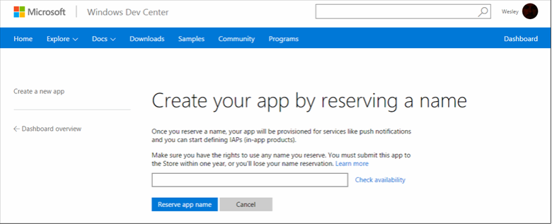
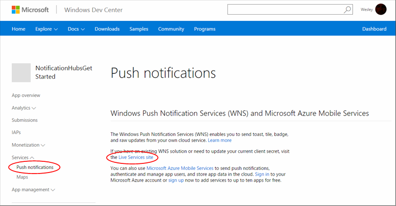
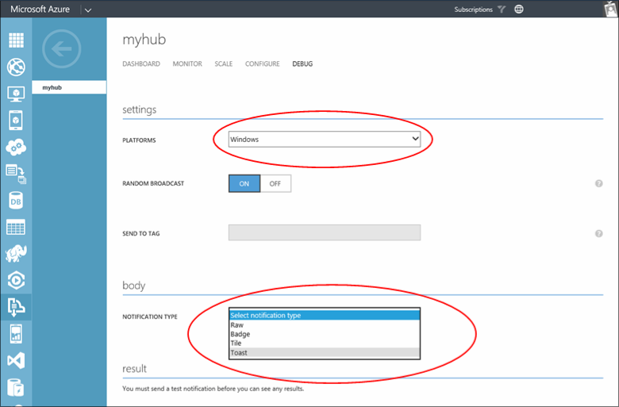

<properties
	pageTitle="Get started with Azure Notification Hubs for Windows Store Apps | Microsoft Azure"
	description="In this tutorial, you learn how to use Azure Notification Hubs to push notifications to a Windows Store or Windows Phone 8.1 (non-Silverlight) application."
	services="notification-hubs"
	documentationCenter="windows"
	authors="wesmc7777"
	manager="erikre"
	editor="erikre"/>

<tags
	ms.service="notification-hubs"
	ms.workload="mobile"
	ms.tgt_pltfrm="mobile-windows"
	ms.devlang="dotnet"
	ms.topic="hero-article"
	ms.date="06/29/2016"
	ms.author="wesmc"/>

# Getting started with Notification Hubs for Windows Store Apps

[AZURE.INCLUDE [notification-hubs-selector-get-started](../../includes/notification-hubs-selector-get-started.md)]

##Overview

This tutorial shows you how to use Azure Notification Hubs to send push notifications to a Windows Store or Windows Phone 8.1 (non-Silverlight) application. If you are targeting Windows Phone 8.1 Silverlight, please refer to the [Windows Phone](notification-hubs-windows-mobile-push-notifications-mpns.md) version.
In this tutorial, you create a blank Windows Store app that receives push notifications by using the Windows Push Notification Service (WNS). When you're finished, you'll be able to use your notification hub to broadcast push notifications to all the devices running your app.

## Before you begin

[AZURE.INCLUDE [notification-hubs-hero-slug](../../includes/notification-hubs-hero-slug.md)]

The completed code for this tutorial can be found on GitHub [here](https://github.com/Azure/azure-notificationhubs-samples/tree/master/dotnet/GetStartedWindowsUniversal).

##Prerequisites

This tutorial requires the following:

+ Microsoft Visual Studio Express 2013 for Windows with Update 2 or later This version of Visual Studio is required to create a universal app project. If you just want to create a Windows Store app, you need Visual Studio 2012 Express for Windows 8.

+ An active Windows Store account

+ An active Azure account  If you don't have an account, you can create a free trial account in just a couple of minutes. For details, see [Azure Free Trial](https://azure.microsoft.com/pricing/free-trial/?WT.mc_id=A0E0E5C02&amp;returnurl=http%3A%2F%2Fazure.microsoft.com%2Fen-us%2Fdocumentation%2Farticles%2Fnotification-hubs-windows-store-dotnet-get-started%2F).

Completing this tutorial is a prerequisite for all other Notification Hubs tutorials for Windows Store apps.

##Register your app for the Windows Store

To send push notifications to Windows Store apps, you must associate your app to the Windows Store. You must then configure your notification hub to integrate with WNS.

1. If you have not already registered your app, navigate to the [Windows Dev Center](http://go.microsoft.com/fwlink/p/?LinkID=266582), sign in with your Microsoft account, and then click **Create a new app**.

2. Type a name for your app and click **Reserve app name**.

   	

   	This creates a new Windows Store registration for your app.

3. In Visual Studio, create a new Visual C# Store Apps project by using the **Blank App** template.

   	![][2]

4. In Solution Explorer, right-click the Windows Store app project, click **Store**, and then click **Associate App with the Store...**.

   	![][3]

   	The **Associate Your App with the Windows Store** wizard appears.

5. In the wizard, click **Sign in** and then sign in with your Microsoft account.

6. Click the app that you registered in step 2, click **Next**, and then click **Associate**.

   	![][4]

   	This adds the required Windows Store registration information to the application manifest.

7. (Optional) Repeat steps 4–6 for the Windows Phone Store app project.  

8. Back on the [Windows Dev Center](http://go.microsoft.com/fwlink/p/?LinkID=266582) page for your new app, click **Services**, click **Push notifications**, and then click **Live Services site** under **Windows Push Notification Services (WNS) and Microsoft Azure Mobile Services**.

   	

9. On the **App Settings** tab, make a note of the values of **Client secret** and **Package security identifier (SID)**.

   	![][6]

 	> [AZURE.WARNING]
	The client secret and package SID are important security credentials. Do not share these values with anyone or distribute them with your app.

##Configure your notification hub

[AZURE.INCLUDE [notification-hubs-portal-create-new-hub](../../includes/notification-hubs-portal-create-new-hub.md)]

<ol start="7">
<li>
Select the <b>Configure</b> tab at the top, enter the <b>Client secret</b> and <b>Package SID</b> values that you obtained from WNS in the previous section, and then click <b>Save</b>.

</li>
</ol>

&emsp;&emsp;

Your notification hub is now configured to work with WNS, and you have the connection strings to register your app and send notifications.

##Connect your app to the notification hub

1. In Visual Studio, right-click the solution, and then click **Manage NuGet Packages**.

	This displays the **Manage NuGet Packages** dialog box.

2. Search for `WindowsAzure.Messaging.Managed` and click **Install**, select all projects in the solution, and accept the terms of use.

	![][20]

	This downloads, installs, and adds a reference in all projects to the Azure Messaging library for Windows by using the <a href="http://nuget.org/packages/WindowsAzure.Messaging.Managed/">WindowsAzure.Messaging.Managed NuGet package</a>.

3. Open the App.xaml.cs project file and add the following `using` statements. In a universal project, this file is located in the `<project_name>.Shared` folder.

        using Windows.Networking.PushNotifications;
        using Microsoft.WindowsAzure.Messaging;
		using Windows.UI.Popups;

4. Also in App.xaml.cs, add the following **InitNotificationsAsync** method definition to the **App** class:

	    private async void InitNotificationsAsync()
        {
            var channel = await PushNotificationChannelManager.CreatePushNotificationChannelForApplicationAsync();

            var hub = new NotificationHub("<hub name>", "<connection string with listen access>");
			var result = await hub.RegisterNativeAsync(channel.Uri);

            // Displays the registration ID so you know it was successful
            if (result.RegistrationId != null)
            {
                var dialog = new MessageDialog("Registration successful: " + result.RegistrationId);
                dialog.Commands.Add(new UICommand("OK"));
                await dialog.ShowAsync();
            }

        }

    This code retrieves the channel URI for the app from WNS, and then registers that channel URI with your notification hub.

    >[AZURE.NOTE]Make sure to replace the "hub name" placeholder with the name of the notification hub that appears in the [Azure Classic Portal] on the **Notification Hubs** tab (for example, **mynotificationhub2** in the previous example). Also replace the connection string placeholder with the **DefaultListenSharedAccessSignature** connection string that you obtained in the previous section.

5. At the top of the **OnLaunched** event handler in App.xaml.cs, add the following call to the new **InitNotificationsAsync** method:

        InitNotificationsAsync();

    This guarantees that the channel URI is registered in your notification hub each time the application is launched.

6. In Solution Explorer, double-click **Package.appxmanifest** of the Windows Store app, and then in **Notifications**, set **Toast capable** to **Yes**:

   	![][18]

   	From the **File** menu, click **Save All**.

7. (Optional) Repeat the previous step in the Windows Phone Store app project.

8. Press the **F5** key to run the app. A pop-up dialog that contains the registration key is displayed.

   	![][19]

9. (Optional) Repeat the previous step to run the Windows Phone project to register the app on a Windows Phone device.

Your app is now ready to receive toast notifications.

##Send notifications 

You can test receiving notifications in your app by sending notifications in the [Azure Classic Portal] via the debug tab on the notification hub, as shown in the screen below.

Push notifications are normally sent in a back-end service like Mobile Services or ASP.NET using a compatible library. You can also use the REST API directly to send notification messages if a library is not available for your back-end. 

In this tutorial, we will keep it simple and just demonstrate testing your client app by sending notifications using the .NET SDK for notification hubs in a console application instead of a backend service. We recommend the [Use Notification Hubs to push notifications to users] tutorial as the next step for sending notifications from an ASP.NET backend. However, the following approaches can be used for sending notifications:

* **REST Interface**:  You can support notification on any backend platform using  the [REST interface](http://msdn.microsoft.com/library/windowsazure/dn223264.aspx).

* **Microsoft Azure Notification Hubs .NET SDK**: In the Nuget Package Manager for Visual Studio, run [Install-Package Microsoft.Azure.NotificationHubs](https://www.nuget.org/packages/Microsoft.Azure.NotificationHubs/).

* **Node.js** : [How to use Notification Hubs from Node.js](notification-hubs-nodejs-push-notification-tutorial.md).

* **Azure Mobile Apps**: For an example of how to send notifications from an Azure Mobile App that's integrated with Notification Hubs, see [Add push notifications for Mobile Apps](../app-service-mobile/app-service-mobile-windows-store-dotnet-get-started-push.md).

* **Java / PHP**: For an example of how to send notifications by using the REST APIs, see "How to use Notification Hubs from Java/PHP" ([Java](notification-hubs-java-push-notification-tutorial.md) | [PHP](notification-hubs-php-push-notification-tutorial.md)).

## (Optional) Send notifications from a console app

To send notifications by using a .NET console application follow these steps. 

1. Right-click the solution, select **Add** and **New Project...**, and then under **Visual C#**, click **Windows** and **Console Application**, and click **OK**.

   	![][13]

	This adds a new Visual C# console application to the solution. You can also do this in a separate solution.

2. In Visual Studio, click **Tools**, click **NuGet Package Manager**, and then click **Package Manager Console**.

	This displays the Package Manager Console in Visual Studio.

3. In the Package Manager Console window, set the **Default project** to your new console application project, and then in the console window, execute the following command:

        Install-Package Microsoft.Azure.NotificationHubs

	This adds a reference to the Azure Notification Hubs SDK using the <a href="http://www.nuget.org/packages/Microsoft.Azure.NotificationHubs/">Microsoft.Azure.Notification Hubs NuGet package</a>.

	

4. Open the Program.cs file and add the following `using` statement:

        using Microsoft.Azure.NotificationHubs;

5. In the **Program** class, add the following method:

        private static async void SendNotificationAsync()
        {
            NotificationHubClient hub = NotificationHubClient
				.CreateClientFromConnectionString("<connection string with full access>", "<hub name>");
            var toast = @"<toast><visual><binding template=""ToastText01""><text id=""1"">Hello from a .NET App!</text></binding></visual></toast>";
            await hub.SendWindowsNativeNotificationAsync(toast);
        }

   	Make sure to replace the "hub name" placeholder with the name of the notification hub that appears in the [Azure Classic Portal] on the **Notification Hubs** tab. Also, replace the connection string placeholder with the connection string called **DefaultFullSharedAccessSignature** that you obtained in the section "Configure your notification hub."

	>[AZURE.NOTE]Make sure that you use the connection string that has **Full** access, not **Listen** access. The listen-access string does not have permissions to send notifications.

6. Add the following lines in the **Main** method:

         SendNotificationAsync();
		 Console.ReadLine();

7. Right-click the console application project in Visual Studio, and click **Set as StartUp Project** to set it as the startup project. Then press the **F5** key to run the application.

   	![][14]

	You will receive a toast notification on all registered devices. Clicking or tapping the toast banner loads the app.

You can find all the supported payloads in the [toast catalog], [tile catalog], and [badge overview] topics on MSDN.

##Next steps

In this simple example, you sent broadcast notifications to all your Windows devices using the portal or a console app. We recommend the [Use Notification Hubs to push notifications to users] tutorial as the next step. It will show you how to send notifications from an ASP.NET backend using tags to target specific users.

If you want to segment your users by interest groups, see [Use Notification Hubs to send breaking news]. 

To learn more general information about Notification Hubs, see [Notification Hubs Guidance].

<!-- Images. -->
[2]: ./media/notification-hubs-windows-store-dotnet-get-started/notification-hub-create-windows-universal-app.png
[3]: ./media/notification-hubs-windows-store-dotnet-get-started/notification-hub-associate-win8-app.png
[4]: ./media/notification-hubs-windows-store-dotnet-get-started/mobile-services-select-app-name.png
[6]: ./media/notification-hubs-windows-store-dotnet-get-started/mobile-services-win8-app-push-auth.png
[11]: ./media/notification-hubs-windows-store-dotnet-get-started/notification-hub-configure-wns.png
[13]: ./media/notification-hubs-windows-store-dotnet-get-started/notification-hub-create-console-app.png
[14]: ./media/notification-hubs-windows-store-dotnet-get-started/notification-hub-windows-toast.png
[15]: ./media/notification-hubs-windows-store-dotnet-get-started/notification-hub-scheduler1.png
[16]: ./media/notification-hubs-windows-store-dotnet-get-started/notification-hub-scheduler2.png
[18]: ./media/notification-hubs-windows-store-dotnet-get-started/notification-hub-win8-app-toast.png
[19]: ./media/notification-hubs-windows-store-dotnet-get-started/notification-hub-windows-reg.png
[20]: ./media/notification-hubs-windows-store-dotnet-get-started/notification-hub-windows-universal-app-install-package.png

<!-- URLs. -->
[Azure Classic Portal]: https://manage.windowsazure.com/
[Notification Hubs Guidance]: http://msdn.microsoft.com/library/jj927170.aspx

[Use Notification Hubs to push notifications to users]: notification-hubs-aspnet-backend-windows-dotnet-notify-users.md
[Use Notification Hubs to send breaking news]: notification-hubs-windows-store-dotnet-send-breaking-news.md

[toast catalog]: http://msdn.microsoft.com/library/windows/apps/hh761494.aspx
[tile catalog]: http://msdn.microsoft.com/library/windows/apps/hh761491.aspx
[badge overview]: http://msdn.microsoft.com/library/windows/apps/hh779719.aspx
