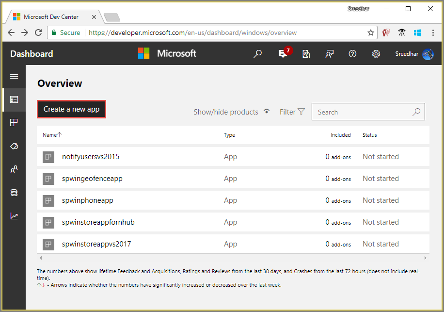
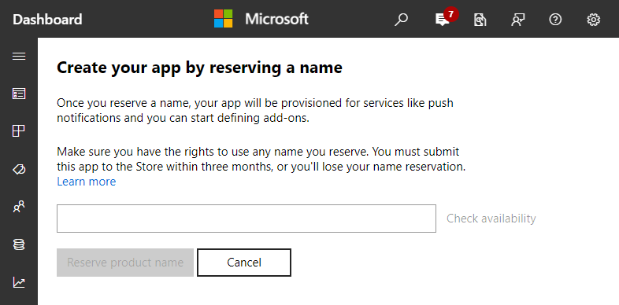
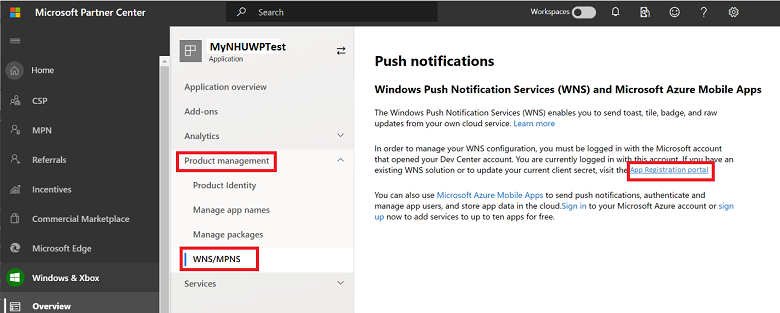
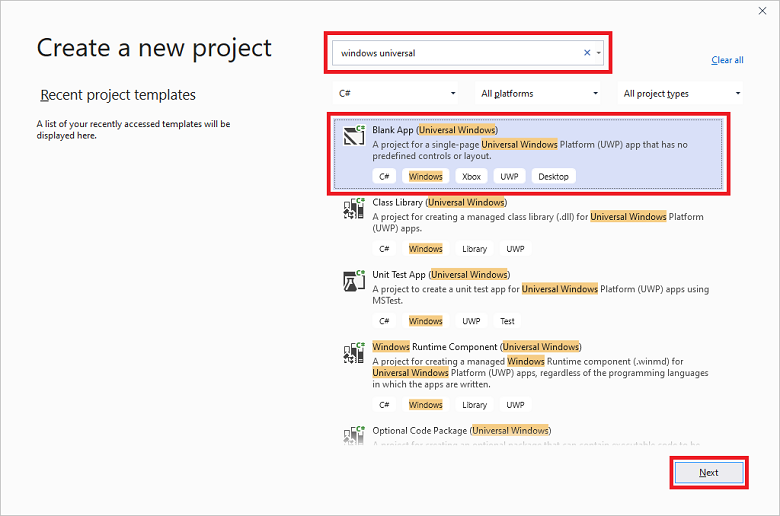
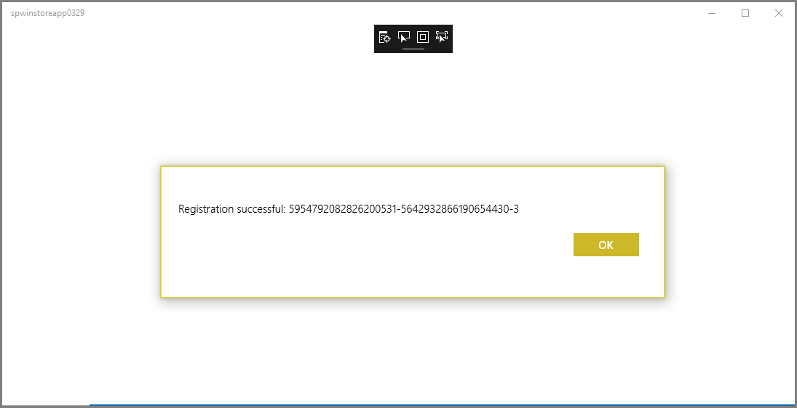
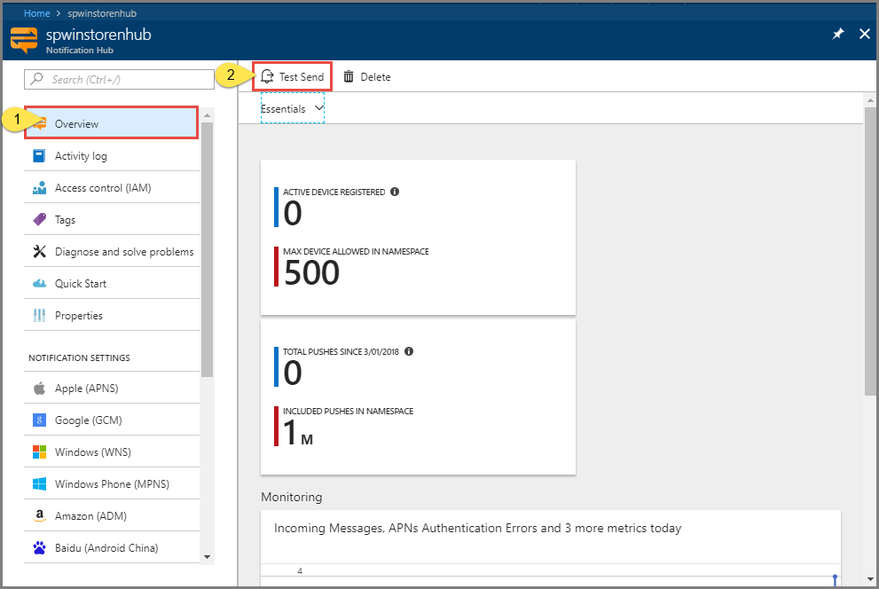
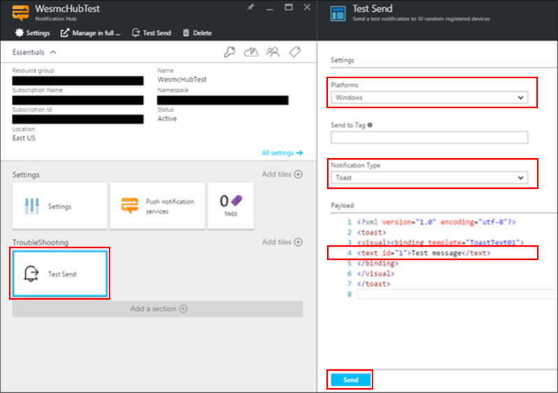
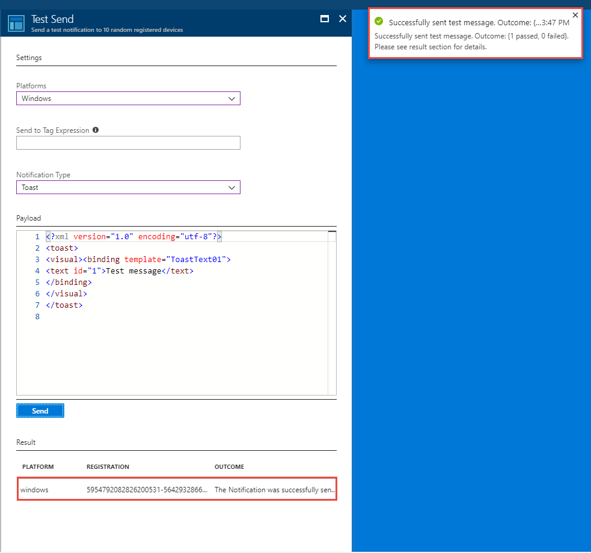
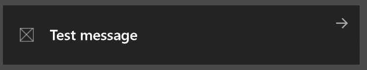

# Tutorial: Send notifications to Universal Windows Platform apps using Azure Notification Hubs

[!INCLUDE [notification-hubs-selector-get-started](../../includes/notification-hubs-selector-get-started.md)]

In this tutorial, you create a notification hub to send push notifications to a Universal Windows Platform (UWP) app. You create a blank Windows Store app that receives push notifications by using the Windows Push Notification Service (WNS). Then, you use your notification hub to broadcast push notifications to all devices that are running your app.

> [!NOTE]
> You can find the completed code for this tutorial on [GitHub](https://github.com/Azure/azure-notificationhubs-dotnet/tree/master/Samples/UwpSample).

You take the following steps:

> [!div class="checklist"]
> * Create an app in Windows Store
> * Create a notification hub
> * Create a sample Windows app
> * Send test notifications

## Prerequisites

- **Azure subscription**. If you don't have an Azure subscription, [create a free Azure account](https://azure.microsoft.com/free/?WT.mc_id=A261C142F) before you begin.
- Microsoft Visual Studio 2017 or later. The example in this tutorial uses [Visual Studio 2019](https://www.visualstudio.com/products).
- [UWP app-development tools installed](/windows/uwp/get-started/get-set-up)
- An active Windows Store account
- Confirm that **Get notifications from apps and other senders** setting is enabled. 
    - Launch **Settings** window on your computer.
    - Select the **System** tile.
    - Select **Notifications & actions** from the left menu. 
    - Confirm that the **Get notifications from apps and other senders** setting is enabled. If it isn't enabled, enable it.

Completing this tutorial is a prerequisite for all other Notification Hubs tutorials for UWP apps.

## Create an app in Windows Store

> [!NOTE]
> Microsoft Push Notification Service (MPNS) has been deprecated and is no longer supported.

To send push notifications to UWP apps, associate your app to the Windows Store. Then, configure your notification hub to integrate with WNS.

1. Navigate to the [Windows Dev Center](https://partner.microsoft.com/dashboard/windows/first-run-experience), sign in with your Microsoft account, and then select **Create a new app**.

    
2. Type a name for your app, and then select **Reserve product name**. Doing so creates a new Windows Store registration for your app.

    
3. Expand **Product management**, and then select **Product Identity**. Take note of the **Package SID**, **Package/Identity/Name**, **Package/Identity/Publisher**, and **Package/Properties/PublisherDisplayName** values.

    :::image type="content" source="media/notification-hubs-windows-store-dotnet-get-started/product-identity.png" alt-text="Partner center apps":::
4. Under **Product management**, select **WNS/MPNS**, and then select **App Registration portal**. Sign in to your Microsoft account. The application registration page opens in a new tab.

    

5. Under **Essentials**, select **Client credentials: Add a certificate or secret**.

    :::image type="content" source="media/notification-hubs-windows-store-dotnet-get-started/hub-azure-portal.png" alt-text="Notification Hub settings on Azure portal":::

6. On the **Certificates & secrets** page, under **Client secrets**, select **New client secret**. After you create a client secret (also called an application secret), take note of it before you leave the page.

   > [!WARNING]
   > You can only view client secret (application secret) values immediately after creating them. Make sure to save the secret before leaving the page.

    :::image type="content" source="media/notification-hubs-windows-store-dotnet-get-started/new-client-secret.png" alt-text="Client secret on portal":::

   > [!WARNING]
   > The application secret and package SID are important security credentials. Do not share these values with anyone or distribute them with your app.


## Create a Notification Hub

[!INCLUDE [notification-hubs-portal-create-new-hub](../../includes/notification-hubs-portal-create-new-hub.md)]

### Configure WNS settings for the hub

1. In the **NOTIFICATION SETTINGS** category, select **Windows (WNS)**.
2. Enter values for **Package SID** (like this "ms-app://`<Your Package SID>`") and **Security Key** (the **Application Secret**) you noted from the previous section.
3. Click **Save** on the toolbar.

    

Your notification hub is now configured to work with WNS. You have the connection strings to register your app and send notifications.

## Create a sample Windows app

1. In Visual Studio, open the **File** menu, select **New**, and then select **Project**.
2. In the **Create a new project** dialog, complete the following steps:

    1. In the search box at the top, type **Windows Universal**.
    2. In the search results, select **Blank App (Universal Windows)**, and then select **Next**.

       

    3. In the **Configure your new project** dialog, enter a **Project name**, and a **Location** for the project files.
    4. Select **Create**.

3. Accept the defaults for the **target** and **minimum** platform versions, and select **OK**.
4. In Solution Explorer, right-click the Windows Store app project, select **Publish**, and then select **Associate App with the Store**. The **Associate Your App with the Windows Store** wizard appears.
5. In the wizard, sign in with your Microsoft account.
6. Select the app that you registered in step 2, select **Next**, and then select **Associate**. Doing so adds the required Windows Store registration information to the application manifest.
7. In Visual Studio, right-click the solution, and then select **Manage NuGet Packages**. The **Manage NuGet Packages** window opens.
8. In the search box, enter **WindowsAzure.Messaging.Managed**, select **Install**, and accept the terms of use.

    ![The Manage NuGet Packages window][20]

    This action downloads, installs, and adds a reference to the Azure Notification Hubs library for Windows by using the [Microsoft.Azure.NotificationHubs NuGet package](https://www.nuget.org/packages/Microsoft.Azure.NotificationHubs).
9. Open the `App.xaml.cs` project file, and add the following statements:

    ```csharp
    using Windows.Networking.PushNotifications;
    using Microsoft.WindowsAzure.Messaging;
    using Windows.UI.Popups;
    ```

10. In the project's `App.xaml.cs` file, locate the `App` class, and add the following `InitNotificationsAsync` method definition. Replace `<your hub name>` with the name of the notification hub you created in the Azure portal, and replace `<Your DefaultListenSharedAccessSignature connection string>` with the `DefaultListenSharedAccessSignature` connection string from the **Access Polices** page of your notification hub:

    ```csharp
    private async void InitNotificationsAsync()
    {
        var channel = await PushNotificationChannelManager.CreatePushNotificationChannelForApplicationAsync();

        var hub = new NotificationHub("<your hub name>", "<Your DefaultListenSharedAccessSignature connection string>");
        var result = await hub.RegisterNativeAsync(channel.Uri);

        // Displays the registration ID so you know it was successful
        if (result.RegistrationId != null)
        {
            var dialog = new MessageDialog("Registration successful: " + result.RegistrationId);
            dialog.Commands.Add(new UICommand("OK"));
            await dialog.ShowAsync();
        }
    }
    ```

    This code retrieves the channel URI for the app from WNS, and then registers that channel URI with your notification hub.

    >[!NOTE]
    > Replace the `hub name` placeholder with the name of the notification hub that appears in the Azure portal. Also replace the connection string placeholder with the `DefaultListenSharedAccessSignature` connection string that you obtained from the **Access Polices** page of your notification hub in a previous section.

11. At the top of the `OnLaunched` event handler in `App.xaml.cs`, add the following call to the new `InitNotificationsAsync` method:

    ```csharp
    InitNotificationsAsync();
    ```

    This action guarantees that the channel URI is registered in your notification hub each time the application launches.

12. Right-click `Package.appxmanifest` and select **View Code (F7)**. Locate  `<Identity .../>` and replace the **Name** value with the **Package/Identity/Name**, and replace its **Publisher** value with the **Package/Identity/Publisher** value from the app you created [earlier](#create-an-app-in-windows-store).

13. To run the app, press the keyboard's **F5** key. A dialog box containing the registration key will display. To close the dialog, click **OK**.

    

Your app is now ready to receive toast notifications.

## Send test notifications

You can quickly test receiving notifications in your app by sending notifications in the [Azure portal](https://portal.azure.com/).

1. In the Azure portal, switch to the Overview tab, and select **Test Send** on the toolbar.

    
2. In the **Test Send** window, do the following actions:
    1. For **Platforms**, select **Windows**.
    2. For **Notification Type**, select **Toast**.
    3. Select **Send**.

        
3. See the result of the Send operation in the **Result** list at the bottom of the window. You also see an alert message.

    
4. You see the notification message: **Test message** on your desktop.

    

## Next steps
You have sent broadcast notifications to all your Windows devices by using the portal or a console app. To learn how to push notifications to specific devices, advance to the following tutorial:

> [!div class="nextstepaction"]
>[Push notifications to specific devices](
notification-hubs-windows-notification-dotnet-push-xplat-segmented-wns.md)

<!-- Images. -->
[13]: ./media/notification-hubs-windows-store-dotnet-get-started/notification-hub-create-console-app.png
[14]: ./media/notification-hubs-windows-store-dotnet-get-started/notification-hub-windows-toast.png
[19]: ./media/notification-hubs-windows-store-dotnet-get-started/notification-hub-windows-reg.png
[20]: ./media/notification-hubs-windows-store-dotnet-get-started/notification-hub-windows-universal-app-install-package.png

<!-- URLs. -->
[Use Notification Hubs to push notifications to users]: notification-hubs-aspnet-backend-windows-dotnet-wns-notification.md
[Use Notification Hubs to send breaking news]: notification-hubs-windows-notification-dotnet-push-xplat-segmented-wns.md
[toast catalog]: /previous-versions/windows/apps/hh761494(v=win.10)
[tile catalog]: /previous-versions/windows/apps/hh761491(v=win.10)
[badge overview]: /previous-versions/windows/apps/hh779719(v=win.10)
