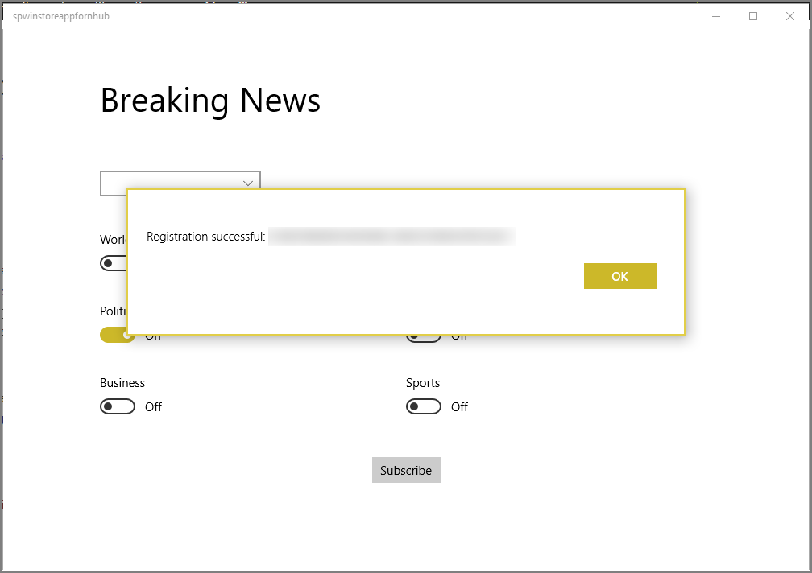
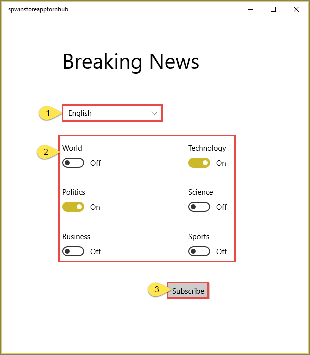
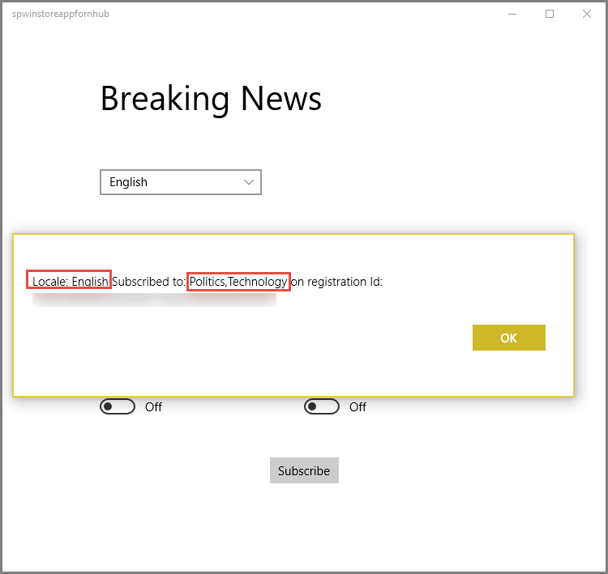
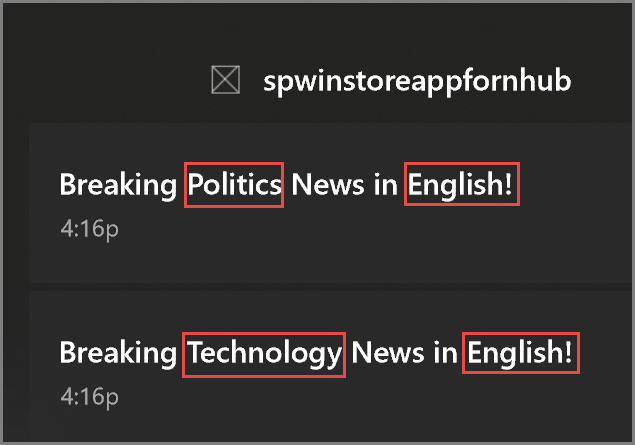

# Tutorial: Push localized notifications to Windows apps by using Azure Notification Hubs

> [!div class="op_single_selector"]
> * [Windows Store C#](notification-hubs-windows-store-dotnet-xplat-localized-wns-push-notification.md)
> * [iOS](notification-hubs-ios-xplat-localized-apns-push-notification.md)

## Overview

This tutorial shows you how to push localized notifications to mobile devices registered with the Notification Hubs service. In the tutorial, you update applications created in the [Tutorial: Send notifications to specific devices (Universal Windows Platform)](notification-hubs-windows-phone-push-xplat-segmented-mpns-notification.md) to support the following scenarios:

- The Windows Store app allows client devices to specify a language, and to subscribe to different breaking news categories.
- The back-end app broadcasts notifications, using the **tag** and **template** features of Azure Notification Hubs.

When you complete the tutorial, the mobile application lets you register for categories you are interested in, and also specify a language in which to receive the notifications. The backend application sends notifications that are localized by language and device.

In this tutorial, you learn how to:

> [!div class="checklist"]
> * Update Windows app to support locale information
> * Update back-end app to send localized notifications
> * Test the app

## Prerequisites

Complete the [Tutorial: Send notifications to specific devices (Universal Windows Platform)](notification-hubs-windows-phone-push-xplat-segmented-mpns-notification.md).

In the [Tutorial: Send notifications to specific devices (Universal Windows Platform)](notification-hubs-windows-phone-push-xplat-segmented-mpns-notification.md), you built an app that used **tags** to subscribe to notifications for different news **categories**. In this tutorial, you use the **template** feature of Notification Hubs to easily deliver **localized** breaking news notifications.

At a high level, templates are a way to specify the format in which a specific device should receive a notification. The template specifies the exact payload format by referring to properties that are part of the message sent by your app back-end. In this tutorial, the backend application sends a locale-agnostic message containing all supported languages:

```json
{
    "News_English": "...",
    "News_French": "...",
    "News_Mandarin": "..."
}
```

The devices register with a template that refers to the correct property. For instance, a Windows Store app that wants to receive a toast message in English registers for the following template with any corresponding tags:

```xml
<toast>
    <visual>
    <binding template=\"ToastText01\">
        <text id=\"1\">$(News_English)</text>
    </binding>
    </visual>
</toast>
```

To learn more about templates, see [Push Templates](notification-hubs-templates-cross-platform-push-messages.md).

## Update Windows app to support locale information

1. Open the Visual Studio solution you created for the [Tutorial: Send notifications to specific devices (Universal Windows Platform)](notification-hubs-windows-phone-push-xplat-segmented-mpns-notification.md).
2. Update the solution's `MainPage.xaml` file to include a locale combobox:

    ```xml
    <Grid Margin="120, 58, 120, 80"  
            Background="{StaticResource ApplicationPageBackgroundThemeBrush}">
        <Grid.RowDefinitions>
            <RowDefinition />
            <RowDefinition />
            <RowDefinition />
            <RowDefinition />
            <RowDefinition />
            <RowDefinition />
        </Grid.RowDefinitions>
        <Grid.ColumnDefinitions>
            <ColumnDefinition />
            <ColumnDefinition />
        </Grid.ColumnDefinitions>
        <TextBlock Grid.Row="0" Grid.Column="0" Grid.ColumnSpan="2"  TextWrapping="Wrap" Text="Breaking News" FontSize="42" VerticalAlignment="Top"/>
        <ComboBox Name="Locale" HorizontalAlignment="Left" VerticalAlignment="Center" Width="200" Grid.Row="1" Grid.Column="0">
            <x:String>English</x:String>
            <x:String>French</x:String>
            <x:String>Mandarin</x:String>
        </ComboBox>
        <ToggleSwitch Header="World" Name="WorldToggle" Grid.Row="2" Grid.Column="0"/>
        <ToggleSwitch Header="Politics" Name="PoliticsToggle" Grid.Row="3" Grid.Column="0"/>
        <ToggleSwitch Header="Business" Name="BusinessToggle" Grid.Row="4" Grid.Column="0"/>
        <ToggleSwitch Header="Technology" Name="TechnologyToggle" Grid.Row="2" Grid.Column="1"/>
        <ToggleSwitch Header="Science" Name="ScienceToggle" Grid.Row="3" Grid.Column="1"/>
        <ToggleSwitch Header="Sports" Name="SportsToggle" Grid.Row="4" Grid.Column="1"/>
        <Button Content="Subscribe" HorizontalAlignment="Center" Grid.Row="5" Grid.Column="0" Grid.ColumnSpan="2" Click="SubscribeButton_Click" />
    </Grid>
    ```
3. In the `Notifications` class, add a locale parameter to the  `StoreCategoriesAndSubscribe` and `SubscribeToCategories` methods.

    ```csharp
    public async Task<Registration> StoreCategoriesAndSubscribe(string locale, IEnumerable<string> categories)
    {
        ApplicationData.Current.LocalSettings.Values["categories"] = string.Join(",", categories);
        ApplicationData.Current.LocalSettings.Values["locale"] = locale;
        return await SubscribeToCategories(locale, categories);
    }

    public async Task<Registration> SubscribeToCategories(string locale, IEnumerable<string> categories = null)
    {
        var channel = await PushNotificationChannelManager.CreatePushNotificationChannelForApplicationAsync();

        if (categories == null)
        {
            categories = RetrieveCategories();
        }

        // Using a template registration. This makes supporting notifications across other platforms much easier.
        // Using the localized tags based on locale selected.
        string templateBodyWNS = String.Format("<toast><visual><binding template=\"ToastText01\"><text id=\"1\">$(News_{0})</text></binding></visual></toast>", locale);

        return await hub.RegisterTemplateAsync(channel.Uri, templateBodyWNS, "localizedWNSTemplateExample", categories);
    }
    ```

    Instead of calling the `RegisterNativeAsync` method, call `RegisterTemplateAsync`. You register a specific notification format in which the template depends on the locale. You also provide a name for the template ("localizedWNSTemplateExample"), because you might want to register more than one template (for instance one for toast notifications and one for tiles). You also need to name them to update or delete them.

    If a device registers multiple templates with the same tag, an incoming message targeting that tag results in multiple notifications delivered to the device (one for each template). This behavior is useful when the same logical message has to result in multiple visual notifications, for instance showing both a badge and a toast in a Windows Store application.
4. Add the following method to retrieve the stored locale:

    ```csharp
    public string RetrieveLocale()
    {
        var locale = (string) ApplicationData.Current.LocalSettings.Values["locale"];
        return locale != null ? locale : "English";
    }
    ```

5. In the `MainPage.xaml.cs` file, update the button click handler to retrieve the current value of the Locale combo box and provide it to the call to the `Notifications` class:

    ```csharp
    private async void SubscribeButton_Click(object sender, RoutedEventArgs e)
    {
        var locale = (string)Locale.SelectedItem;

        var categories = new HashSet<string>();
        if (WorldToggle.IsOn) categories.Add("World");
        if (PoliticsToggle.IsOn) categories.Add("Politics");
        if (BusinessToggle.IsOn) categories.Add("Business");
        if (TechnologyToggle.IsOn) categories.Add("Technology");
        if (ScienceToggle.IsOn) categories.Add("Science");
        if (SportsToggle.IsOn) categories.Add("Sports");

        var result = await ((App)Application.Current).notifications.StoreCategoriesAndSubscribe(locale,
                categories);

        var dialog = new MessageDialog("Locale: " + locale + " Subscribed to: " + 
            string.Join(",", categories) + " on registration Id: " + result.RegistrationId);
        dialog.Commands.Add(new UICommand("OK"));
        await dialog.ShowAsync();
    }
    ```
6. Finally, in the `App.xaml.cs` file, update the `InitNotificationsAsync` method to retrieve the locale and use it when subscribing:

    ```csharp
    private async void InitNotificationsAsync()
    {
        var result = await notifications.SubscribeToCategories(notifications.RetrieveLocale());

        // Displays the registration ID so you know it was successful
        if (result.RegistrationId != null)
        {
            var dialog = new MessageDialog("Registration successful: " + result.RegistrationId);
            dialog.Commands.Add(new UICommand("OK"));
            await dialog.ShowAsync();
        }
    }
    ```


## Run the UWP application

1. Run the Universal Windows Platform application. Wait until you see the **Registration successful** message.

    
2. Select the **categories** and **locale**, and click **Subscribe**. The app converts the selected categories into tags and requests a new device registration for the selected tags from the notification hub.

    
3. You see a **confirmation** message about the **subscriptions**.

    

## Update console app to send localized notifications

When you send template notifications you only need to provide a set of properties, in this tutorial, the backend application sends the set of properties containing the localized version of the current news, for instance:

```json
{
    "News_English": "World News in English!",
    "News_French": "World News in French!",
    "News_Mandarin": "World News in Mandarin!"
}
```

In this section, you update the console application project in the solution. Modify the `SendTemplateNotificationAsync` method in the console app you previously created with the following code:

> [!IMPORTANT]
> Specify the name and connection string with full access for your notification hub in the code.

```csharp
private static async void SendTemplateNotificationAsync()
{
    // Define the notification hub.
    NotificationHubClient hub = NotificationHubClient.CreateClientFromConnectionString(
        "<connection string with full access>", "<hub name>");

    // Sending the notification as a template notification. All template registrations that contain
    // "messageParam" or "News_<local selected>" and the proper tags will receive the notifications.
    // This includes APNS, FCM, WNS, and MPNS template registrations.
    Dictionary<string, string> templateParams = new Dictionary<string, string>();

    // Create an array of breaking news categories.
    var categories = new string[] { "World", "Politics", "Business", "Technology", "Science", "Sports"};
    var locales = new string[] { "English", "French", "Mandarin" };

    foreach (var category in categories)
    {
        templateParams["messageParam"] = "Breaking " + category + " News!";

        // Sending localized News for each tag too...
        foreach( var locale in locales)
        {
            string key = "News_" + locale;

            // Your real localized news content would go here.
            templateParams[key] = "Breaking " + category + " News in " + locale + "!";
        }

        await hub.SendTemplateNotificationAsync(templateParams, category);
    }
}
```

This simple call delivers the localized piece of news to **all** devices, irrespective of the platform, as your Notification Hub builds and delivers the correct native payload to all the devices subscribed to a specific tag.

## Run console app to send localized notification
Run the **console app** to send notifications for each category and in each supported language. Verify that you only receive a notification for the categories you have subscribed to and the message is for the locale you selected.



## Next steps

In this tutorial, you learned how to push localized notifications to specific devices that have tags associated with their registrations. To learn how to push notifications to specific users who may be using more than one device, advance to the following tutorial:

> [!div class="nextstepaction"]
>[Push notifications to specific users](notification-hubs-aspnet-backend-windows-dotnet-wns-notification.md)

<!-- Anchors. -->
[Template concepts]: #concepts
[The app user interface]: #ui
[Building the Windows Store client app]: #building-client
[Send notifications from your back-end]: #send
[Next Steps]:#next-steps

<!-- Images. -->

<!-- URLs. -->
[Mobile Service]: /develop/mobile/tutorials/get-started
[Notify users with Notification Hubs: ASP.NET]: notification-hubs-aspnet-backend-ios-apple-apns-notification.md
[Notify users with Notification Hubs: Mobile Services]: notification-hubs-aspnet-backend-windows-dotnet-wns-notification.md
[Use Notification Hubs to send breaking news]: notification-hubs/notification-hubs-windows-notification-dotnet-push-xplat-segmented-wns.md
[Submit an app page]: https://go.microsoft.com/fwlink/p/?LinkID=266582
[My Applications]: https://go.microsoft.com/fwlink/p/?LinkId=262039
[Live SDK for Windows]: https://go.microsoft.com/fwlink/p/?LinkId=262253
[Get started with Mobile Services]: /develop/mobile/tutorials/get-started/#create-new-service
[Get started with data]: /develop/mobile/tutorials/get-started-with-data-dotnet
[Get started with authentication]: /develop/mobile/tutorials/get-started-with-users-dotnet
[Get started with push notifications]: /develop/mobile/tutorials/get-started-with-push-dotnet
[Push notifications to app users]: /develop/mobile/tutorials/push-notifications-to-app-users-dotnet
[Authorize users with scripts]: /develop/mobile/tutorials/authorize-users-in-scripts-dotnet
[JavaScript and HTML]: /develop/mobile/tutorials/get-started-with-push-js
[wns object]: https://go.microsoft.com/fwlink/p/?LinkId=260591
[Notification Hubs Guidance]: https://msdn.microsoft.com/library/jj927170.aspx
[Notification Hubs How-To for iOS]: https://msdn.microsoft.com/library/jj927168.aspx
[Notification Hubs How-To for Windows Store]: https://msdn.microsoft.com/library/jj927172.aspx
