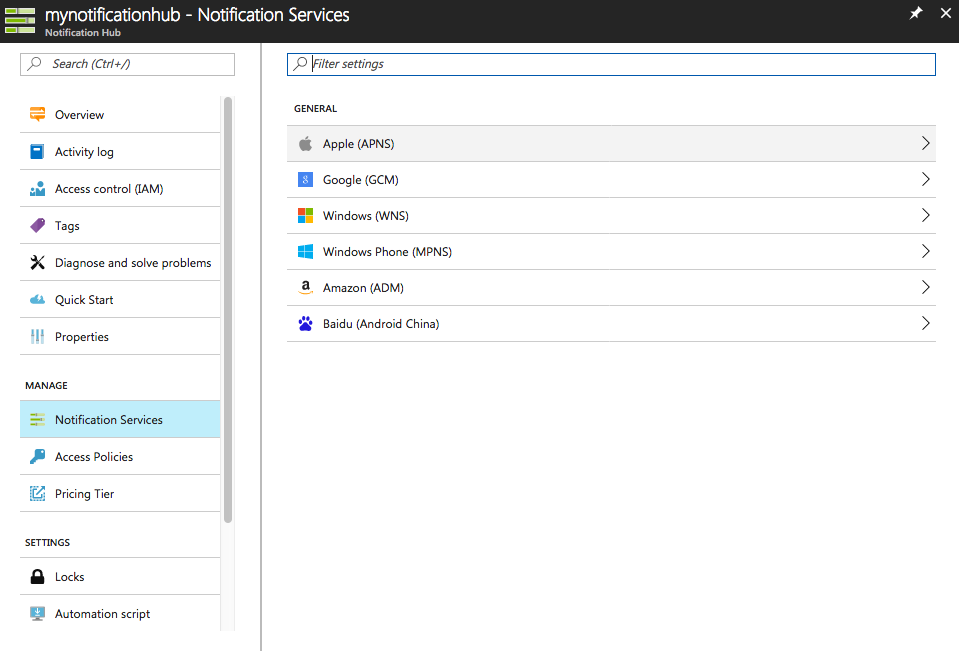
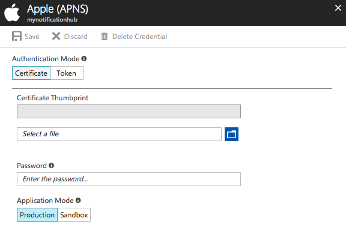
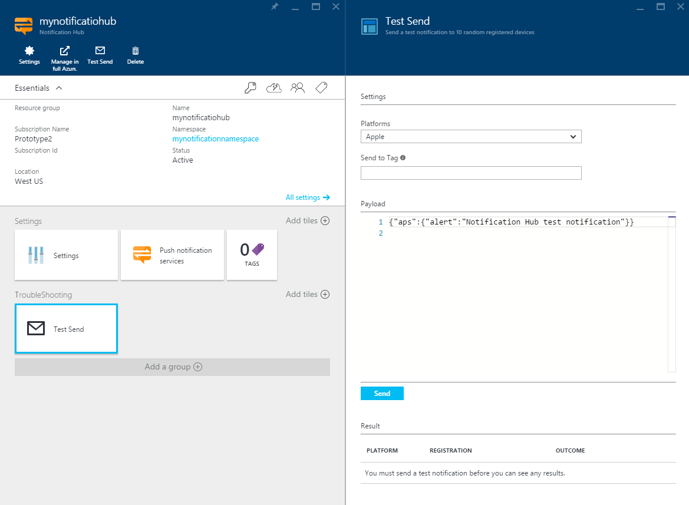

<properties
	pageTitle="iOS Push Notifications with Notification Hubs for Xamarin apps | Microsoft Azure"
	description="In this tutorial, you learn how to use Azure Notification Hubs to send push notifications to a Xamarin iOS application."
	services="notification-hubs"
    keywords="ios push notifications,push messages,push notifications,push message"
	documentationCenter="xamarin"
	authors="wesmc7777"
	manager="erikre"
	editor=""/>

<tags
	ms.service="notification-hubs"
	ms.workload="mobile"
	ms.tgt_pltfrm="mobile-xamarin-ios"
	ms.devlang="dotnet"
	ms.topic="hero-article"
	ms.date="06/29/2016"
	ms.author="wesmc"/>

# iOS Push Notifications with Notification Hubs for Xamarin apps

[AZURE.INCLUDE [notification-hubs-selector-get-started](../../includes/notification-hubs-selector-get-started.md)]

##Overview
> [AZURE.IMPORTANT] To complete this tutorial, you must have an active Azure account. If you don't have an account, you can create a free trial account in just a couple of minutes. For details, see [Azure Free Trial](https://azure.microsoft.com/pricing/free-trial/?WT.mc_id=A643EE910&amp;returnurl=http%3A%2F%2Fazure.microsoft.com%2Fen-us%2Fdocumentation%2Farticles%2Fpartner-xamarin-notification-hubs-ios-get-started).

This tutorial shows you how to use Azure Notification Hubs to send push notifications to an iOS application.
You'll create a blank Xamarin.iOS app that receives push notifications by using the [Apple Push Notification Service (APNs)](https://developer.apple.com/library/ios/documentation/NetworkingInternet/Conceptual/RemoteNotificationsPG/Chapters/ApplePushService.html). When you're finished, you'll be able to use your notification hub to broadcast push notifications to all the devices running your app. The finished code is available in the [NotificationHubs app][GitHub] sample.

This tutorial demonstrates the simple push message broadcast scenario with Notification Hubs.

##Prerequisites

This tutorial requires the following:

+ [Xcode 6.0][Install Xcode]
+ An iOS 7.0 (or later version) compatible device
+ iOS Developer Program membership
+ [Xamarin Studio]

   > [AZURE.NOTE] Because of configuration requirements for iOS push notifications, you must deploy and test the sample application on a physical iOS device (iPhone or iPad) instead of in the simulator.

Completing this tutorial is a prerequisite for all other Notification Hubs tutorials for Xamarin iOS apps.

[AZURE.INCLUDE [Notification Hubs Enable Apple Push Notifications](../../includes/notification-hubs-enable-apple-push-notifications.md)]

##Configure your notification hub

This section walks you through creating a new notification hub and configuring authentication with APNS using the **.p12** push certificate that you created. If you want to use a notification hub that you have already created, you can skip to step 5.

[AZURE.INCLUDE [notification-hubs-portal-create-new-hub](../../includes/notification-hubs-portal-create-new-hub.md)]

<ol start="7">
<li>

As we want to configure the APNS connection, in the Azure Portal, open your Notification Hub settings, ande click on <b>Notification Services</b>, and then click the <b>Apple (APNS)</b> item in the list. Once done, click on <b>Upload Certificate</b> and select the <b>.p12</b> certificate that you exported earlier, as well as the password for the certificate.

Make sure to select <b>Sandbox</b> mode since you will be sending push messages in a development environment. Only use the <b>Production</b> setting if you want to send push notifications to users who already purchased your app from the store.

</li>
</ol>
&emsp;&emsp;

&emsp;&emsp;

Your notification hub is now configured to work with APNS, and you have the connection strings to register your app and send push notifications.

##Connect your app to the notification hub

#### Create a new project

1. In Xamarin Studio, create a new iOS project and select the **Unified API** > **Single View Application** template.

   	![Xamarin Studio - Select Application Type][31]

2. Add a reference to the Azure Messaging component. In the Solution view, right-click the **Components** folder for your project and choose **Get More Components**. Search for the **Azure Messaging** component and add the component to your project.

3. In **AppDelegate.cs**, add the following using statement:

    	using WindowsAzure.Messaging;

4. Declare an instance of **SBNotificationHub**:

		private SBNotificationHub Hub { get; set; }

5. Create a **Constants.cs** class with the following variables:

        // Azure app-specific connection string and hub path
        public const string ConnectionString = "<Azure connection string>";
        public const string NotificationHubPath = "<Azure hub path>";

6. In **AppDelegate.cs**, update **FinishedLaunching()** to match the following:

        public override bool FinishedLaunching(UIApplication application, NSDictionary launchOptions)
        {
            if (UIDevice.CurrentDevice.CheckSystemVersion (8, 0)) {
    			var pushSettings = UIUserNotificationSettings.GetSettingsForTypes (
                       UIUserNotificationType.Alert | UIUserNotificationType.Badge | UIUserNotificationType.Sound,
                       new NSSet ());

			    UIApplication.SharedApplication.RegisterUserNotificationSettings (pushSettings);
			    UIApplication.SharedApplication.RegisterForRemoteNotifications ();
			} else {
			    UIRemoteNotificationType notificationTypes = UIRemoteNotificationType.Alert | UIRemoteNotificationType.Badge | UIRemoteNotificationType.Sound;
			    UIApplication.SharedApplication.RegisterForRemoteNotificationTypes (notificationTypes);
			}

            return true;
        }

7. Override the **RegisteredForRemoteNotifications()** method in **AppDelegate.cs**:

        public override void RegisteredForRemoteNotifications(UIApplication application, NSData deviceToken)
        {
            Hub = new SBNotificationHub(Constants.ConnectionString, Constants.NotificationHubPath);

            Hub.UnregisterAllAsync (deviceToken, (error) => {
                if (error != null)
                {
                    Console.WriteLine("Error calling Unregister: {0}", error.ToString());
                    return;
                }

                NSSet tags = null; // create tags if you want
                Hub.RegisterNativeAsync(deviceToken, tags, (errorCallback) => {
                    if (errorCallback != null)
                        Console.WriteLine("RegisterNativeAsync error: " + errorCallback.ToString());
                });
            });
        }

8. Override the **ReceivedRemoteNotification()** method in **AppDelegate.cs**:

        public override void ReceivedRemoteNotification(UIApplication application, NSDictionary userInfo)
        {
            ProcessNotification(userInfo, false);
        }

9. Create the following **ProcessNotification()** method in **AppDelegate.cs**:

        void ProcessNotification(NSDictionary options, bool fromFinishedLaunching)
        {
            // Check to see if the dictionary has the aps key.  This is the notification payload you would have sent
            if (null != options && options.ContainsKey(new NSString("aps")))
            {
                //Get the aps dictionary
                NSDictionary aps = options.ObjectForKey(new NSString("aps")) as NSDictionary;

                string alert = string.Empty;

                //Extract the alert text
                // NOTE: If you're using the simple alert by just specifying
                // "  aps:{alert:"alert msg here"}  ", this will work fine.
                // But if you're using a complex alert with Localization keys, etc.,
                // your "alert" object from the aps dictionary will be another NSDictionary.
                // Basically the JSON gets dumped right into a NSDictionary,
                // so keep that in mind.
                if (aps.ContainsKey(new NSString("alert")))
                    alert = (aps [new NSString("alert")] as NSString).ToString();

                //If this came from the ReceivedRemoteNotification while the app was running,
                // we of course need to manually process things like the sound, badge, and alert.
                if (!fromFinishedLaunching)
                {
                    //Manually show an alert
                    if (!string.IsNullOrEmpty(alert))
                    {
                        UIAlertView avAlert = new UIAlertView("Notification", alert, null, "OK", null);
                        avAlert.Show();
                    }
                }
            }
        }

    > [AZURE.NOTE] You can choose to override **FailedToRegisterForRemoteNotifications()** to handle situations such as no network connection. This is especially important where the user might start your application in offline mode (e.g. Airplane) and you want to handle push messaging scenarios specific to your app.

10. Run the app on your device.

## Sending Push Notifications

You can test receiving push notifications in your app by sending notifications in the [Azure Portal] via the **Test Send** capability in the **Troubleshooting** toolset, right in the notification hub page, as shown in the screen below.

Push notifications are normally sent through a back-end service like Mobile Services or ASP.NET using a compatible library. You can also use the REST API directly to send push messages if a library is not available in your scenario. 

In this tutorial, we will keep it simple and just demonstrate testing your client app by sending notifications using the .NET SDK for notification hubs in a console application instead of a backend service. We recommend the [Use Notification Hubs to push notifications to users](notification-hubs-aspnet-backend-ios-apple-apns-notification.md) tutorial as the next step for sending notifications from an ASP.NET backend. However, the following approaches can be used for sending notifications:

* **REST Interface**:  You can support push notification on any backend platform using  the [REST interface](http://msdn.microsoft.com/library/windowsazure/dn223264.aspx).

* **Microsoft Azure Notification Hubs .NET SDK**: In the Nuget Package Manager for Visual Studio, run [Install-Package Microsoft.Azure.NotificationHubs](https://www.nuget.org/packages/Microsoft.Azure.NotificationHubs/).

* **Node.js** : [How to use Notification Hubs from Node.js](notification-hubs-nodejs-push-notification-tutorial.md).

* **Azure Mobile Services**: For an example of how to send push notifications from an Azure Mobile Services backend that's integrated with Notification Hubs, see "Get started with push notifications in Mobile Services" ([.NET backend](../mobile-services/mobile-services-dotnet-backend-windows-universal-dotnet-get-started-push.md) | [JavaScript backend](../mobile-services/mobile-services-javascript-backend-windows-universal-dotnet-get-started-push.md)).

* **Java / PHP**: For an example of how to send push notifications by using the REST APIs, see "How to use Notification Hubs from Java/PHP" ([Java](notification-hubs-java-push-notification-tutorial.md) | [PHP](notification-hubs-php-push-notification-tutorial.md)).

####(Optional) Send Push Notifications from a .NET Console App

In this section, we will send push notifications by using a simple .NET console app. For the purposes of this example, we will switch to a Windows development environment that has Visual Studio already installed.

1. In Visual Studio, create a new Visual C# console application:

   	![Visual Studio - Create a new console application][213]

2. In Visual Studio, click **Tools**, click **NuGet Package Manager**, and then click **Package Manager Console**.

	The package manager console should appear docked to the bottom of your Visual Studio workspace.

3. In the Package Manager Console window, set the **Default project** to your new console application project, and then in the console window, execute the following command:

        Install-Package Microsoft.Azure.NotificationHubs

	This adds a reference to the Azure Notification Hubs SDK using the <a href="http://www.nuget.org/packages/Microsoft.Azure.NotificationHubs/">Microsoft.Azure.Notification Hubs NuGet package</a>.

	

4. Open the `Program.cs` file and add the following `using` statement, ensuring that we can use Azure classes and functions within your main class:

        using Microsoft.Azure.NotificationHubs;

3. In your `Program` class, add the following method (don't forget to replace the **connection string** and **hub name**):

        private static async void SendNotificationAsync()
        {
            NotificationHubClient hub = NotificationHubClient.CreateClientFromConnectionString("<connection string with full access>", "<hub name>");
            var alert = "{\"aps\":{\"alert\":\"Hello from .NET!\"}}";
            await hub.SendAppleNativeNotificationAsync(alert);
        }

4. Add the following lines in your `Main` method:

         SendNotificationAsync();
		 Console.ReadLine();

5. Press the F5 key to run the app. Within seconds, you should see a push notification appear on your device. Whether you are using Wi-Fi or a cellular data network, make sure that you have an active internet connection on the device.

You can find all the possible payloads in the Apple [Local and Push Notification Programming Guide].

####(Optional) Send Notifications from a Mobile Service

In this section, we will send push notifications using a mobile service through a node script.

To send a notification by using a mobile service, follow [Get started with Mobile Services], and then:

1. Sign in to the [Azure Classic Portal], and select your mobile service.

2. Select the **Scheduler** tab on the top.

   	![Azure Classic Portal - Scheduler][215]

3. Create a new scheduled job, insert a name, and select **On demand**.

   	![Azure Classic Portal - Create new job][216]

4. When the job is created, click the job name. Then click the **Script** tab on the top bar.

5. Insert the following script inside your scheduler function. Make sure to replace the placeholders with your notification hub name and the connection string for *DefaultFullSharedAccessSignature* that you obtained earlier. Click **Save**.

		var azure = require('azure');
		var notificationHubService = azure.createNotificationHubService('<Hubname>', '<SAS Full access >');
		notificationHubService.apns.send(
	    	null,
    		{"aps":
        		{
          		"alert": "Hello from Mobile Services!"
        		}
    		},
    		function (error)
    		{
	        	if (!error) {
    	        	console.warn("Notification successful");
        		}
    		}
		);

6. Click **Run Once** on the bottom bar. You should receive an alert on your device.

##Next steps

In this simple example, you broadcasted push notifications to all your iOS devices. In order to target specific users, refer to the tutorial [Use Notification Hubs to push notifications to users]. If you want to segment your users by interest groups, you can read [Use Notification Hubs to send breaking news]. Learn more about how to use Notification Hubs in [Notification Hubs Guidance] and in the [Notification Hubs How-To for iOS].

<!-- Images. -->

[213]: ./media/partner-xamarin-notification-hubs-ios-get-started/notification-hub-create-console-app.png

[215]: ./media/partner-xamarin-notification-hubs-ios-get-started/notification-hub-scheduler1.png
[216]: ./media/partner-xamarin-notification-hubs-ios-get-started/notification-hub-scheduler2.png

[31]: ./media/partner-xamarin-notification-hubs-ios-get-started/notification-hub-create-ios-app.png

<!-- URLs. -->
[Mobile Services iOS SDK]: http://go.microsoft.com/fwLink/?LinkID=266533
[Submit an app page]: http://go.microsoft.com/fwlink/p/?LinkID=266582
[My Applications]: http://go.microsoft.com/fwlink/p/?LinkId=262039
[Live SDK for Windows]: http://go.microsoft.com/fwlink/p/?LinkId=262253

[Get started with Mobile Services]: /develop/mobile/tutorials/get-started-xamarin-ios
[Azure Classic Portal]: https://manage.windowsazure.com/
[Notification Hubs Guidance]: http://msdn.microsoft.com/library/jj927170.aspx
[Notification Hubs How-To for iOS]: http://msdn.microsoft.com/library/jj927168.aspx
[Install Xcode]: https://go.microsoft.com/fwLink/p/?LinkID=266532
[iOS Provisioning Portal]: http://go.microsoft.com/fwlink/p/?LinkId=272456

[Use Notification Hubs to push notifications to users]: /manage/services/notification-hubs/notify-users-aspnet
[Use Notification Hubs to send breaking news]: /manage/services/notification-hubs/breaking-news-dotnet

[Local and Push Notification Programming Guide]: http://developer.apple.com/library/mac/#documentation/NetworkingInternet/Conceptual/RemoteNotificationsPG/Chapters/ApplePushService.html#//apple_ref/doc/uid/TP40008194-CH100-SW1
[Apple Push Notification Service]: http://go.microsoft.com/fwlink/p/?LinkId=272584

[Azure Mobile Services Component]: http://components.xamarin.com/view/azure-mobile-services/
[GitHub]: http://go.microsoft.com/fwlink/p/?LinkId=331329
[Xamarin Studio]: http://xamarin.com/download
[WindowsAzure.Messaging]: https://github.com/infosupport/WindowsAzure.Messaging.iOS
[Azure Portal]: https://portal.azure.com
