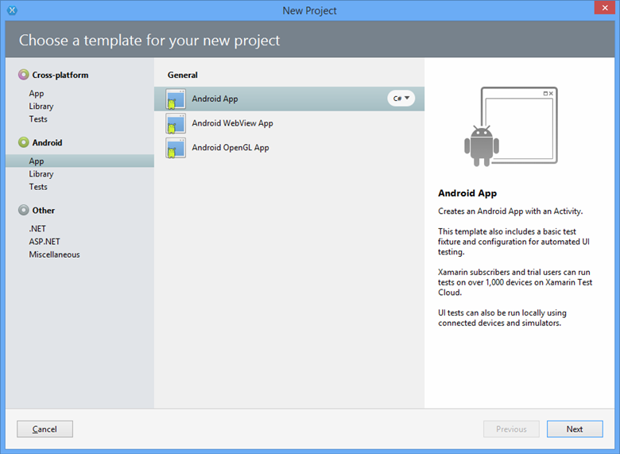
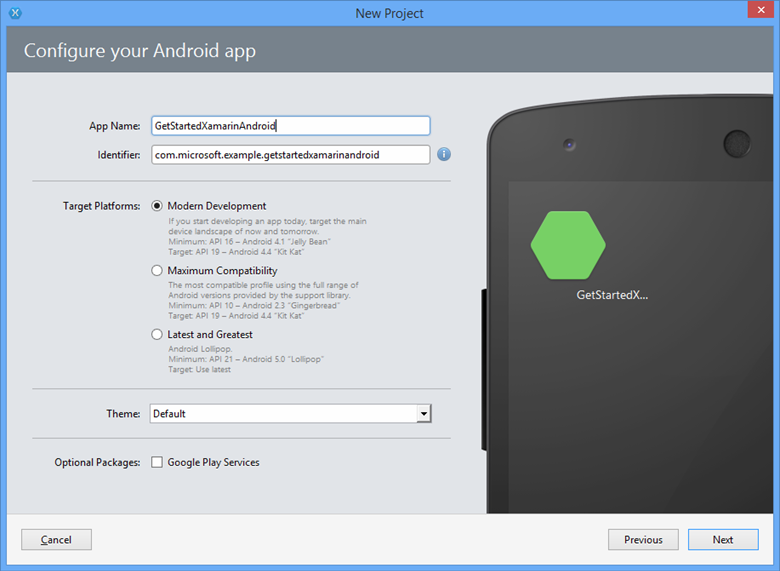
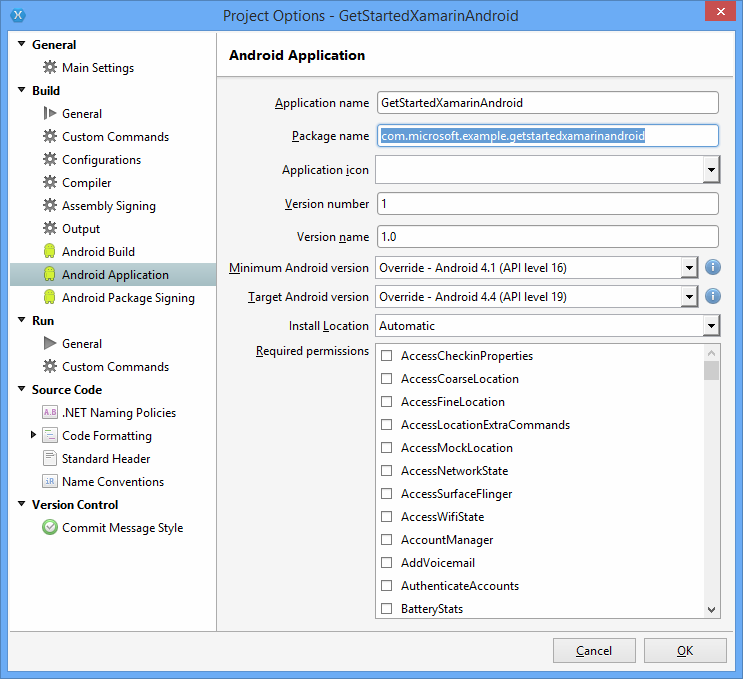

<properties
	pageTitle="Get started with Notification Hubs for Xamarin.Android apps | Microsoft Azure"
	description="In this tutorial, you learn how to use Azure Notification Hubs to send push notifications to a Xamarin Android application."
	authors="wesmc7777"
	manager="erikre"
	editor=""
	services="notification-hubs"
	documentationCenter="xamarin"/>

<tags
	ms.service="notification-hubs"
	ms.workload="mobile"
	ms.tgt_pltfrm="mobile-xamarin-android"
	ms.devlang="dotnet"
	ms.topic="hero-article"
	ms.date="06/29/2016"
	ms.author="wesmc"/>

# Get started with Notification Hubs with Xamarin for Android

[AZURE.INCLUDE [notification-hubs-selector-get-started](../../includes/notification-hubs-selector-get-started.md)]

##Overview

This tutorial shows you how to use Azure Notification Hubs to send push notifications to a Xamarin.Android application.
You'll create a blank Xamarin.Android app that receives push notifications by using Google Cloud Messaging (GCM). When you're finished, you'll be able to use your notification hub to broadcast push notifications to all the devices running your app. The finished code is available in the [NotificationHubs app][GitHub] sample.

This tutorial demonstrates the simple broadcast scenario in using Notification Hubs.

## Before you begin

[AZURE.INCLUDE [notification-hubs-hero-slug](../../includes/notification-hubs-hero-slug.md)]

The completed code for this tutorial can be found on GitHub [here](https://github.com/Azure/azure-notificationhubs-samples/tree/master/dotnet/Xamarin/GetStartedXamarinAndroid).

##Prerequisites

This tutorial requires the following:

+ Visual Studio with Xamarin on Windows or Xamarin Studio on Mac OS X. Complete installation instructions are on [Setup and Install for Visual Studio and Xamarin](https://msdn.microsoft.com/library/mt613162.aspx).
+ Active Google account
+ [Azure Messaging Component]
+ [Google Cloud Messaging Client Component]

Completing this tutorial is a prerequisite for all other Notification Hubs tutorials for Xamarin.Android apps.

> [AZURE.IMPORTANT] To complete this tutorial, you must have an active Azure account. If you don't have an account, you can create a free trial account in just a couple of minutes. For details, see [Azure Free Trial](https://azure.microsoft.com/pricing/free-trial/?WT.mc_id=A9C9624B5&amp;returnurl=http%3A%2F%2Fazure.microsoft.com%2Fen-us%2Fdocumentation%2Farticles%2Fpartner-xamarin-notification-hubs-android-get-started%2F).

##Enable Google Cloud Messaging

[AZURE.INCLUDE [mobile-services-enable-Google-cloud-messaging](../../includes/mobile-services-enable-google-cloud-messaging.md)]

##Configure your notification hub

[AZURE.INCLUDE [notification-hubs-portal-create-new-hub](../../includes/notification-hubs-portal-create-new-hub.md)]

<ol start="7">
<li>
Click the <b>Configure</b> tab at the top, enter the <b>API Key</b> value you obtained in the previous section, and then click <b>Save</b>.

</li>
</ol>
&emsp;&emsp;

Your notification hub is now configured to work with GCM, and you have the connection strings to both register your app to receive notifications and to send push notifications.

##Connect your app to the notification hub

###Create a new project

1. In Xamarin Studio, click **New Solution**, click **Android App**, and click **Next**.

   	

2. Enter your **App Name** and **Identifier**. Click the **Target Plaforms** you want to support and then click **Next** and **Create**.

   	

	This creates a new Android project.

2. Open the project properties by right-clicking your new project in the Solution view and choosing **Options**. Select the **Android Application** item in the **Build** section.

	Ensure that the first letter of your **Package name** is lowercase.

	> [AZURE.IMPORTANT] The first letter of the package name must be lowercase. Otherwise, you will receive application manifest errors when you register your **BroadcastReceiver** and **IntentFilter** for push notifications below.

   	

3. Optionally, set the **Minimum Android version** to another API Level.

4. Optionally, set the **Target Android version** to the another API version that you want to target (must be API level 8 or higher).

Click **OK** and close the Project Options dialog.

###Add the required components to your project

The Google Cloud Messaging Client available on the Xamarin Component Store simplifies the process of supporting push notifications in Xamarin.Android.

1. Right-click the Components folder in Xamarin.Android app and choose **Get More Components**.

2. Search for the **Azure Messaging** component and add it to the project.

3. Search for the **Google Cloud Messaging Client** component and add it to the project.

###Set up notification hubs in your project

1. Gather the following information for your Android app and notification hub:

	- **GoogleProjectNumber**:  Get this Project Number value from the overview of your app on the Google Developer Portal. You made a note of this value earlier when you created the app on the portal.
	- **Listen connection string**: On the dashboard in the [Azure Classic Portal], click **View connection strings**. Copy the *DefaultListenSharedAccessSignature* connection string for this value.
	- **Hub name**: This is the name of your hub from the [Azure Classic Portal]. For example, *mynotificationhub2*.

	Create a **Constants.cs** class for your Xamarin project and define the following constant values in the class. Replace the placeholders with your values.

		public static class Constants
		{
			public const string SenderID = "<GoogleProjectNumber>"; // Google API Project Number
			public const string ListenConnectionString = "<Listen connection string>";
			public const string NotificationHubName = "<hub name>";
		}

2. Add the following using statements to **MainActivity.cs**:

		using Android.Util;
		using Gcm.Client;

3. Add an instance variable to the `MainActivity` class that will be used to show an alert dialog when the app is running:

		public static MainActivity instance;

3. Create the following method in the **MainActivity** class:

		private void RegisterWithGCM()
		{
			// Check to ensure everything's set up right
			GcmClient.CheckDevice(this);
			GcmClient.CheckManifest(this);

			// Register for push notifications
			Log.Info("MainActivity", "Registering...");
			GcmClient.Register(this, Constants.SenderID);
		}

4. In the `OnCreate` method of **MainActivity.cs**, initialize the `instance` variable and add a call to `RegisterWithGCM`:

		protected override void OnCreate (Bundle bundle)
		{
			instance = this;

			base.OnCreate (bundle);

			// Set your view from the "main" layout resource
			SetContentView (Resource.Layout.Main);

			// Get your button from the layout resource,
			// and attach an event to it
			Button button = FindViewById<Button> (Resource.Id.myButton);

			RegisterWithGCM();
		}

4. Create a new class, **MyBroadcastReceiver**.

	> [AZURE.NOTE] We will walk through creating a **BroadcastReceiver** class from scratch below. However, a quick alternative to manually creating **MyBroadcastReceiver.cs** is to refer to the **GcmService.cs** file found in the sample Xamarin.Android project included with the [NotificationHubs samples][GitHub]. Duplicating **GcmService.cs** and changing class names can be a great place to start as well.

5. Add the following using statements to **MyBroadcastReceiver.cs** (referring to the component and assembly that you added earlier):

		using System.Collections.Generic;
		using System.Text;
		using Android.App;
		using Android.Content;
		using Android.Util;
		using Gcm.Client;
		using WindowsAzure.Messaging;

5. In **MyBroadcastReceiver.cs**, add the following permission requests between the **using** statements and the **namespace** declaration:

		[assembly: Permission(Name = "@PACKAGE_NAME@.permission.C2D_MESSAGE")]
		[assembly: UsesPermission(Name = "@PACKAGE_NAME@.permission.C2D_MESSAGE")]
		[assembly: UsesPermission(Name = "com.google.android.c2dm.permission.RECEIVE")]

		//GET_ACCOUNTS is needed only for Android versions 4.0.3 and below
		[assembly: UsesPermission(Name = "android.permission.GET_ACCOUNTS")]
		[assembly: UsesPermission(Name = "android.permission.INTERNET")]
		[assembly: UsesPermission(Name = "android.permission.WAKE_LOCK")]

6. In **MyBroadcastReceiver.cs**, change the **MyBroadcastReceiver** class to match the following:

    	[BroadcastReceiver(Permission=Gcm.Client.Constants.PERMISSION_GCM_INTENTS)]
        [IntentFilter(new string[] { Gcm.Client.Constants.INTENT_FROM_GCM_MESSAGE },
			Categories = new string[] { "@PACKAGE_NAME@" })]
        [IntentFilter(new string[] { Gcm.Client.Constants.INTENT_FROM_GCM_REGISTRATION_CALLBACK },
			Categories = new string[] { "@PACKAGE_NAME@" })]
        [IntentFilter(new string[] { Gcm.Client.Constants.INTENT_FROM_GCM_LIBRARY_RETRY },
			Categories = new string[] { "@PACKAGE_NAME@" })]
        public class MyBroadcastReceiver : GcmBroadcastReceiverBase<PushHandlerService>
        {
            public static string[] SENDER_IDS = new string[] { Constants.SenderID };

            public const string TAG = "MyBroadcastReceiver-GCM";
        }

7. Add another class in **MyBroadcastReceiver.cs** named **PushHandlerService**, which derives from **GcmServiceBase**. Make sure to apply the **Service** attribute to the class:

    	[Service] // Must use the service tag
    	public class PushHandlerService : GcmServiceBase
    	{
        	public static string RegistrationID { get; private set; }
        	private NotificationHub Hub { get; set; }

        	public PushHandlerService() : base(Constants.SenderID)
       		{
            	Log.Info(MyBroadcastReceiver.TAG, "PushHandlerService() constructor");
        	}
    	}

8. **GcmServiceBase** implements methods **OnRegistered()**, **OnUnRegistered()**, **OnMessage()**, **OnRecoverableError()**, and **OnError()**. Our **PushHandlerService** implementation class must override these methods, and these methods will fire in response to interacting with the notification hub.

9. Override the **OnRegistered()** method in **PushHandlerService** by using the following code:

		protected override void OnRegistered(Context context, string registrationId)
		{
			Log.Verbose(MyBroadcastReceiver.TAG, "GCM Registered: " + registrationId);
			RegistrationID = registrationId;

			createNotification("PushHandlerService-GCM Registered...",
								"The device has been Registered!");

			Hub = new NotificationHub(Constants.NotificationHubName, Constants.ListenConnectionString,
										context);
			try
			{
				Hub.UnregisterAll(registrationId);
			}
			catch (Exception ex)
			{
				Log.Error(MyBroadcastReceiver.TAG, ex.Message);
			}

			//var tags = new List<string>() { "falcons" }; // create tags if you want
			var tags = new List<string>() {};

			try
			{
				var hubRegistration = Hub.Register(registrationId, tags.ToArray());
			}
			catch (Exception ex)
			{
				Log.Error(MyBroadcastReceiver.TAG, ex.Message);
			}
		}

	> [AZURE.NOTE] In the **OnRegistered()** code above, you should note the ability to specify tags to register for specific messaging channels.

10. Override the **OnMessage** method in **PushHandlerService** by using the following code:

		protected override void OnMessage(Context context, Intent intent)
		{
			Log.Info(MyBroadcastReceiver.TAG, "GCM Message Received!");

			var msg = new StringBuilder();

			if (intent != null && intent.Extras != null)
			{
				foreach (var key in intent.Extras.KeySet())
					msg.AppendLine(key + "=" + intent.Extras.Get(key).ToString());
			}

			string messageText = intent.Extras.GetString("message");
			if (!string.IsNullOrEmpty (messageText))
			{
				createNotification ("New hub message!", messageText);
			}
			else
			{
				createNotification ("Unknown message details", msg.ToString ());
			}
		}

11. Add the following **createNotification** and **dialogNotify** methods to **PushHandlerService** for notifying users when a notification is received.

	>[AZURE.NOTE] Notification design in Android version 5.0 and later represents a significant departure from that of previous versions. If you test this on Android 5.0 or later, the app will need to be running to receive the notification. For more information, see [Android Notifications](http://go.microsoft.com/fwlink/?LinkId=615880).

        void createNotification(string title, string desc)
        {
            //Create notification
            var notificationManager = GetSystemService(Context.NotificationService) as NotificationManager;

            //Create an intent to show UI
            var uiIntent = new Intent(this, typeof(MainActivity));

            //Create the notification
            var notification = new Notification(Android.Resource.Drawable.SymActionEmail, title);

            //Auto-cancel will remove the notification once the user touches it
            notification.Flags = NotificationFlags.AutoCancel;

            //Set the notification info
            //we use the pending intent, passing our ui intent over, which will get called
            //when the notification is tapped.
            notification.SetLatestEventInfo(this, title, desc, PendingIntent.GetActivity(this, 0, uiIntent, 0));

            //Show the notification
            notificationManager.Notify(1, notification);
			dialogNotify (title, desc);
        }

		protected void dialogNotify(String title, String message)
		{

			MainActivity.instance.RunOnUiThread(() => {
				AlertDialog.Builder dlg = new AlertDialog.Builder(MainActivity.instance);
				AlertDialog alert = dlg.Create();
				alert.SetTitle(title);
				alert.SetButton("Ok", delegate {
					alert.Dismiss();
				});
				alert.SetMessage(message);
				alert.Show();
			});
		}

12. Override abstract members **OnUnRegistered()**, **OnRecoverableError()**, and **OnError()** so that your code compiles:

		protected override void OnUnRegistered(Context context, string registrationId)
		{
			Log.Verbose(MyBroadcastReceiver.TAG, "GCM Unregistered: " + registrationId);

			createNotification("GCM Unregistered...", "The device has been unregistered!");
		}

		protected override bool OnRecoverableError(Context context, string errorId)
		{
			Log.Warn(MyBroadcastReceiver.TAG, "Recoverable Error: " + errorId);

			return base.OnRecoverableError (context, errorId);
		}

		protected override void OnError(Context context, string errorId)
		{
			Log.Error(MyBroadcastReceiver.TAG, "GCM Error: " + errorId);
		}

##Run your app in the emulator

If you run this app in the emulator, make sure that you use an Android Virtual Device (AVD) that supports Google APIs.

> [AZURE.IMPORTANT] In order to receive push notifications, you must set up a Google account on your Android Virtual Device. (In the emulator, navigate to **Settings** and click **Add Account**.) Also, make sure that the emulator is connected to the Internet.

>[AZURE.NOTE] Notification design in Android version 5.0 and later represents a significant departure from that of previous versions. For more information, see [Android Notifications](http://go.microsoft.com/fwlink/?LinkId=615880).

1. From **Tools**, click **Open Android Emulator Manager**, select your device, and then click **Edit**.

   	![][18]

2. Select **Google APIs** in **Target**, and then click **OK**.

   	![][19]

3. On the top toolbar, click **Run**, and then select your app. This starts the emulator and runs the app.

  The app retrieves the *registrationId* from GCM and registers with the notification hub.

##Send notifications from your backend

You can test receiving notifications in your app by sending notifications in the [Azure Classic Portal] via the debug tab on the notification hub, as shown in the screen below.

![][30]

Push notifications are normally sent in a backend service like Mobile Services or ASP.NET through a compatible library. You can also use the REST API directly to send notification messages if a library is not available for your backend.

Here is a list of some other tutorials that you may want to review for sending notifications:

- ASP.NET: See [Use Notification Hubs to push notifications to users].
- Azure Notification Hubs Java SDK: See [How to use Notification Hubs from Java](notification-hubs-java-push-notification-tutorial.md) for sending notifications from Java. This has been tested in Eclipse for Android Development.
- PHP: See [How to use Notification Hubs from PHP](notification-hubs-php-push-notification-tutorial.md).

In the next subsections of the tutorial, you send notifications by using a .NET console app, and by using a mobile service through a node script.

####(Optional) Send notifications by using a .NET app

In this section, we will send notifications by using a .NET console app

1. Create a new Visual C# console application:

   	![][20]

2. In Visual Studio, click **Tools**, click **NuGet Package Manager**, and then click **Package Manager Console**.

	This displays the Package Manager Console in Visual Studio.

3. In the Package Manager Console window, set the **Default project** to your new console application project, and then in the console window, execute the following command:

        Install-Package Microsoft.Azure.NotificationHubs

	This adds a reference to the Azure Notification Hubs SDK using the <a href="http://www.nuget.org/packages/Microsoft.Azure.NotificationHubs/">Microsoft.Azure.Notification Hubs NuGet package</a>.

	

4. Open the Program.cs file and add the following `using` statement:

        using Microsoft.Azure.NotificationHubs;

5. In your `Program` class, add the following method. Update the placeholder text with your *DefaultFullSharedAccessSignature* connection string and hub name from the [Azure Classic Portal].

        private static async void SendNotificationAsync()
        {
            NotificationHubClient hub = NotificationHubClient.CreateClientFromConnectionString("<connection string with full access>", "<hub name>");
            await hub.SendGcmNativeNotificationAsync("{ \"data\" : {\"message\":\"Hello from Azure!\"}}");
        }

6. Add the following lines in your **Main** method:

         SendNotificationAsync();
		 Console.ReadLine();

7. Press the F5 key to run the app. You should receive a notification in the app.

   	![][21]

####(Optional) Send notifications by using a mobile service

1. Follow [Get started with Mobile Services].

1. Sign in to the [Azure Classic Portal], and select your mobile service.

2. Select the **Scheduler** tab on the top.

   	![][22]

3. Create a new scheduled job, insert a name, and select **On demand**.

   	![][23]

4. When the job is created, click the job name. Then click the **Script** tab on the top bar.

5. Insert the following script inside your scheduler function. Make sure to replace the placeholders with your notification hub name and the connection string for *DefaultFullSharedAccessSignature* that you obtained earlier. Click **Save**.

        var azure = require('azure');
		var notificationHubService = azure.createNotificationHubService('<hub name>', '<connection string>');
		notificationHubService.gcm.send(null,'{"data":{"message" : "Hello from Mobile Services!"}}',
    	  function (error)
    	  {
        	if (!error) {
               console.warn("Notification successful");
            }
            else
            {
              console.warn("Notification failed" + error);
            }
          }
	    );

6. Click **Run Once** on the bottom bar. You should receive a toast notification.

##Next steps

In this simple example, you broadcasted notifications to all your Android devices. In order to target specific users, refer to the tutorial [Use Notification Hubs to push notifications to users]. If you want to segment your users by interest groups, you can read [Use Notification Hubs to send breaking news]. Learn more about how to use Notification Hubs in [Notification Hubs Guidance] and in the [Notification Hubs How-To for Android].

<!-- Anchors. -->
[Enable Google Cloud Messaging]: #register
[Configure your Notification Hub]: #configure-hub
[Connecting your app to the Notification Hub]: #connecting-app
[Run your app with the emulator]: #run-app
[Send notifications from your back-end]: #send
[Next steps]:#next-steps

<!-- Images. -->

[11]: ./media/partner-xamarin-notification-hubs-android-get-started/notification-hub-configure-android.png

[13]: ./media/partner-xamarin-notification-hubs-android-get-started/notification-hub-create-xamarin-android-app1.png
[15]: ./media/partner-xamarin-notification-hubs-android-get-started/notification-hub-create-xamarin-android-app3.png

[18]: ./media/partner-xamarin-notification-hubs-android-get-started/notification-hub-create-android-app7.png
[19]: ./media/partner-xamarin-notification-hubs-android-get-started/notification-hub-create-android-app8.png

[20]: ./media/partner-xamarin-notification-hubs-android-get-started/notification-hub-create-console-app.png
[21]: ./media/partner-xamarin-notification-hubs-android-get-started/notification-hub-android-toast.png
[22]: ./media/partner-xamarin-notification-hubs-android-get-started/notification-hub-scheduler1.png
[23]: ./media/partner-xamarin-notification-hubs-android-get-started/notification-hub-scheduler2.png

[30]: ./media/partner-xamarin-notification-hubs-android-get-started/notification-hubs-debug-hub-gcm.png

<!-- URLs. -->
[Submit an app page]: http://go.microsoft.com/fwlink/p/?LinkID=266582
[My Applications]: http://go.microsoft.com/fwlink/p/?LinkId=262039
[Live SDK for Windows]: http://go.microsoft.com/fwlink/p/?LinkId=262253
[Get started with Mobile Services]: /develop/mobile/tutorials/get-started-xamarin-android/#create-new-service
[JavaScript and HTML]: /develop/mobile/tutorials/get-started-with-push-js

[Azure Classic Portal]: https://manage.windowsazure.com/
[wns object]: http://go.microsoft.com/fwlink/p/?LinkId=260591
[Notification Hubs Guidance]: http://msdn.microsoft.com/library/jj927170.aspx
[Notification Hubs How-To for Android]: http://msdn.microsoft.com/library/dn282661.aspx

[Use Notification Hubs to push notifications to users]: /manage/services/notification-hubs/notify-users-aspnet
[Use Notification Hubs to send breaking news]: /manage/services/notification-hubs/breaking-news-dotnet
[GCMClient Component page]: http://components.xamarin.com/view/GCMClient
[Xamarin.NotificationHub GitHub page]: https://github.com/SaschaDittmann/Xamarin.NotificationHub
[GitHub]: http://go.microsoft.com/fwlink/p/?LinkId=331329
[Google Cloud Messaging Client Component]: http://components.xamarin.com/view/GCMClient/
[Azure Messaging Component]: http://components.xamarin.com/view/azure-messaging
