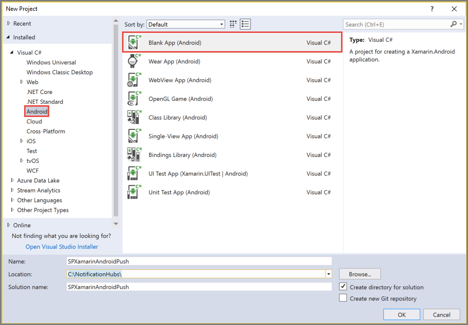
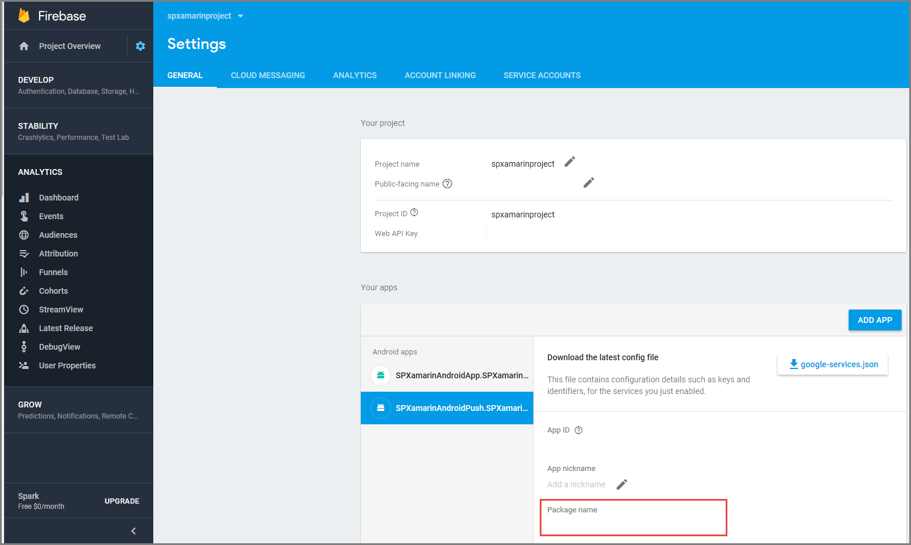
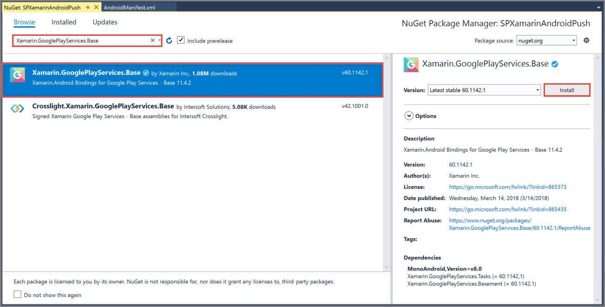
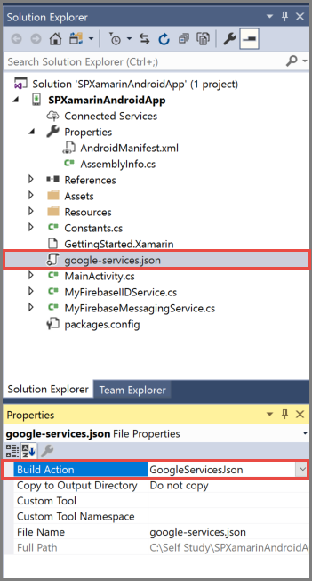
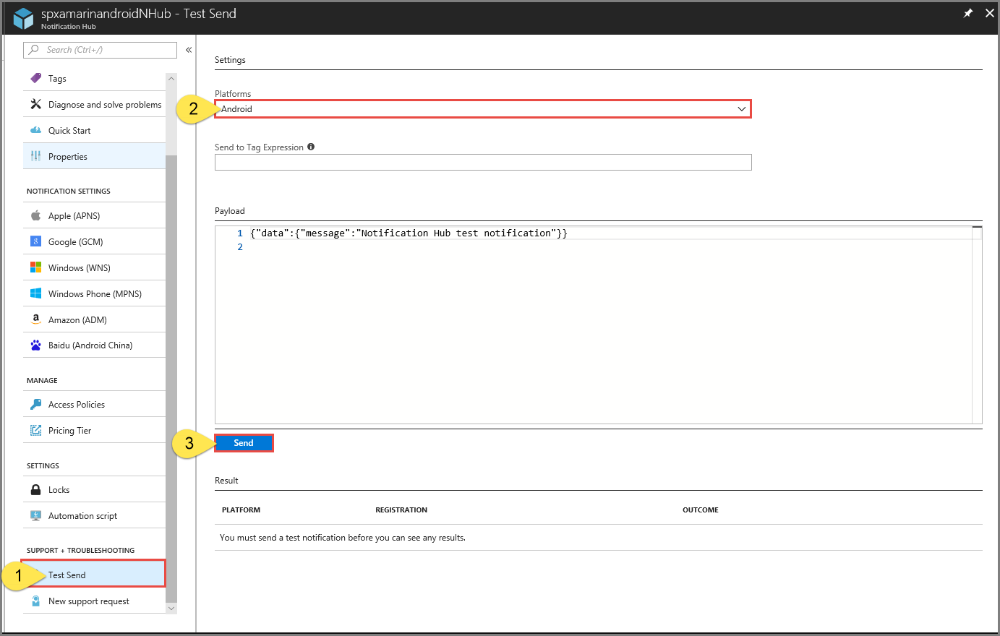

# Tutorial: Push notifications to Xamarin.Android apps using Azure Notification Hubs
[!INCLUDE [notification-hubs-selector-get-started](../../includes/notification-hubs-selector-get-started.md)]

## Overview
This tutorial shows you how to use Azure Notification Hubs to send push notifications to a Xamarin.Android application. You create a blank Xamarin.Android app that receives push notifications by using Firebase Cloud Messaging (FCM). You use your notification hub to broadcast push notifications to all the devices running your app. The finished code is available in the [NotificationHubs app][GitHub] sample.

In this tutorial, you take the following steps:

> [!div class="checklist"]
> * Create a Firebase project and enable Firebase Cloud Messaging
> * Create a notification hub
> * Create a Xamarin.Android app and connect it to the notification hub
> * Send test notifications from the Azure portal

## Prerequisites

- **Azure subscription**. If you don't have an Azure subscription, create a [free account](https://azure.microsoft.com/free/?WT.mc_id=A261C142F) before you begin.
- [Visual Studio with Xamarin] on Windows or [Visual Studio for Mac] on OS X.
- Active Google account

## Create a Firebase project and enable Firebase Cloud Messaging
[!INCLUDE [notification-hubs-enable-firebase-cloud-messaging](../../includes/notification-hubs-enable-firebase-cloud-messaging.md)]

## Create a notification hub
[!INCLUDE [notification-hubs-portal-create-new-hub](../../includes/notification-hubs-portal-create-new-hub.md)]

### Configure GCM settings for the notification hub

1. Select **Google (GCM)** in the **NOTIFICATION SETTINGS** section. 
2. Enter the **Legacy server key** you noted down from the Google Firebase Console. 
3. Select **Save** on the toolbar. 

    

Your notification hub is configured to work with FCM, and you have the connection strings to both register your app to receive notifications and to send push notifications.

## Create Xamarin.Android app and connect it to notification hub

### Create Visual Studio project and add NuGet packages
1. In Visual Studio, point to **File**, select **New**, and then select **Project**. 
   
      
2. In the **Solution Explorer** window, expand **Properties**, and click **AndroidManifest.xml**. Update the package name to match the package name you entered when adding Firebase Cloud Messaging to your project in the Google Firebase Console. 

      
3. Right-click your project, and select **Manage NuGet Packages...**. 
4. Select the **Browse** tab. Search for **Xamarin.GooglePlayServices.Base**. Select **Xamarin.GooglePlayServices.Base** in the result list. Then, select **Install**. 

      
5. In the **NuGet Package Manager** window, search for **Xamarin.Firebase.Messaging**. Select **Xamarin.Firebase.Messaging** in the result list. Then, select **Install**. 
6. Now, search for **Xamarin.Azure.NotificationHubs.Android**. Select **Xamarin.Azure.NotificationHubs.Android** in the result list. Then, select **Install**. 

### Add the Google Services JSON File

1. Copy **google-services.json** that you downloaded from the Google Firebase Console to the project folder.
2. Add **google-services.json** to the project.
3. Select **google-services.json** in the **Solution Explorer** window.
4. In the **Properties** pane, set the Build Action to **GoogleServicesJson**. If you don't see **GoogleServicesJson**, close Visual Studio, relaunch it, reopen the project, and retry. 

      

### Set up notification hubs in your project

#### Registering with Firebase Cloud Messaging

Open the **AndroidManifest.xml** file and insert the following `<receiver>` elements into the `<application>` element:

        <receiver android:name="com.google.firebase.iid.FirebaseInstanceIdInternalReceiver" android:exported="false" />
        <receiver android:name="com.google.firebase.iid.FirebaseInstanceIdReceiver" android:exported="true" android:permission="com.google.android.c2dm.permission.SEND">
          <intent-filter>
            <action android:name="com.google.android.c2dm.intent.RECEIVE" />
            <action android:name="com.google.android.c2dm.intent.REGISTRATION" />
            <category android:name="${applicationId}" />
          </intent-filter>
        </receiver>

1. Gather the following information for your Android app and notification hub:
   
   * **Listen connection string**: On the dashboard in the [Azure portal], choose **View connection strings**. Copy the *DefaultListenSharedAccessSignature* connection string for this value.
   * **Hub name**: Name of your hub from the [Azure portal]. For example, *mynotificationhub2*.
     
2. Right-click your **project** in the **Solution Explorer** window, point to **Add**, and select **Class**. 
4. Create a **Constants.cs** class for your Xamarin project and define the following constant values in the class. Replace the placeholders with your values.
    
    ```csharp
        public static class Constants
        {
           public const string ListenConnectionString = "<Listen connection string>";
           public const string NotificationHubName = "<hub name>";
        }
    ```
3. Add the following using statements to **MainActivity.cs**:
   
    ```csharp
        using Android.Util;
    ```
4. Add an instance variable to **MainActivity.cs** that will be used to show an alert dialog when the app is running:
   
    ```csharp
        public const string TAG = "MainActivity";
    ```
5. Add the following code to `OnCreate` in **MainActivity.cs** after `base.OnCreate(savedInstanceState)`:

    ```csharp   
        if (Intent.Extras != null)
        {
            foreach (var key in Intent.Extras.KeySet())
            {
                if(key!=null)
                {
                    var value = Intent.Extras.GetString(key);
                    Log.Debug(TAG, "Key: {0} Value: {1}", key, value);
                }
            }
        }
    ```
7. Create a new class, **MyFirebaseIIDService** like you created the **Constants** class. 
8. Add the following using statements to **MyFirebaseIIDService.cs**:
   
    ```csharp
    using Android.App;
    using Android.Util;
    using WindowsAzure.Messaging;
    using Firebase.Iid;
    ```

9. In **MyFirebaseIIDService.cs**, add the following **class** declaration, and have your class inherit from **FirebaseInstanceIdService**:
   
    ```csharp
        [Service]
        [IntentFilter(new[] { "com.google.firebase.INSTANCE_ID_EVENT" })]
        public class MyFirebaseIIDService : FirebaseInstanceIdService
    ```
10. In **MyFirebaseIIDService.cs**, add the following code:
   
    ```csharp
        const string TAG = "MyFirebaseIIDService";
        NotificationHub hub;

        public override void OnTokenRefresh()
        {
            var refreshedToken = FirebaseInstanceId.Instance.Token;
            Log.Debug(TAG, "FCM token: " + refreshedToken);
            SendRegistrationToServer(refreshedToken);
        }

        void SendRegistrationToServer(string token)
        {
            // Register with Notification Hubs
            hub = new NotificationHub(Constants.NotificationHubName,
                                      Constants.ListenConnectionString, this);

            var tags = new List<string>() { };
            var regID = hub.Register(token, tags.ToArray()).RegistrationId;

            Log.Debug(TAG, $"Successful registration of ID {regID}");
        }
    ```
11. Create another new class for your project, name it **MyFirebaseMessagingService**.
12. Add the following using statements to **MyFirebaseMessagingService.cs**.
    
    ```csharp
        using Android.App;
        using Android.Util;
        using Firebase.Messaging;
    ```
13. Add the following above your class declaration, and have your class inherit from **FirebaseMessagingService**:
    
    ```csharp
        [Service]
        [IntentFilter(new[] { "com.google.firebase.MESSAGING_EVENT" })]
        public class MyFirebaseMessagingService : FirebaseMessagingService
    ```    
14. Add the following code to **MyFirebaseMessagingService.cs**:
    
    ```csharp
        const string TAG = "MyFirebaseMsgService";
        public override void OnMessageReceived(RemoteMessage message)
        {
            Log.Debug(TAG, "From: " + message.From);
            if(message.GetNotification()!= null)
            {
                //These is how most messages will be received
                Log.Debug(TAG, "Notification Message Body: " + message.GetNotification().Body);
                SendNotification(message.GetNotification().Body);
            }
            else 
            {
                //Only used for debugging payloads sent from the Azure portal
                SendNotification(message.Data.Values.First());

            }

        }

        void SendNotification(string messageBody)
        {
            var intent = new Intent(this, typeof(MainActivity));
            intent.AddFlags(ActivityFlags.ClearTop);
            var pendingIntent = PendingIntent.GetActivity(this, 0, intent, PendingIntentFlags.OneShot);

            var notificationBuilder = new Notification.Builder(this)
                        .SetContentTitle("FCM Message")
                        .SetSmallIcon(Resource.Drawable.ic_launcher)
                        .SetContentText(messageBody)
                        .SetAutoCancel(true)
                        .SetContentIntent(pendingIntent);

            var notificationManager = NotificationManager.FromContext(this);

            notificationManager.Notify(0, notificationBuilder.Build());
        }
    ```
15. **Build** your project. 
16. **Run** your app on your device or loaded emulator

## Send test notification from the Azure portal
You can test receiving notifications in your app with the *Test Send* option in the [Azure portal]. It sends a test push notification to your device.



Push notifications are normally sent in a back-end service like Mobile Services or ASP.NET through a compatible library. If a library is not available for your back-end, you can also use the REST API directly to send notification messages.

## Next steps
In this tutorial, you sent broadcast notifications to all your Android devices registered with the backend. To learn how to push notifications to specific Android devices, advance to the following tutorial: 

> [!div class="nextstepaction"]
>[Push notifications to specific devices](notification-hubs-aspnet-backend-android-xplat-segmented-gcm-push-notification.md)


<!-- Anchors. -->
[Enable Google Cloud Messaging]: #register
[Configure your Notification Hub]: #configure-hub
[Connecting your app to the Notification Hub]: #connecting-app
[Run your app with the emulator]: #run-app
[Send notifications from your back-end]: #send
[Next steps]:#next-steps

<!-- Images. -->

[11]: ./media/partner-xamarin-notification-hubs-android-get-started/notification-hub-configure-android.png

[13]: ./media/partner-xamarin-notification-hubs-android-get-started/notification-hub-create-xamarin-android-app1.png
[15]: ./media/partner-xamarin-notification-hubs-android-get-started/notification-hub-create-xamarin-android-app3.png

[18]: ./media/partner-xamarin-notification-hubs-android-get-started/notification-hub-create-android-app7.png
[19]: ./media/partner-xamarin-notification-hubs-android-get-started/notification-hub-create-android-app8.png

[20]: ./media/partner-xamarin-notification-hubs-android-get-started/notification-hub-create-console-app.png
[21]: ./media/partner-xamarin-notification-hubs-android-get-started/notification-hub-android-toast.png
[22]: ./media/partner-xamarin-notification-hubs-android-get-started/notification-hub-create-xamarin-android-project1.png
[23]: ./media/partner-xamarin-notification-hubs-android-get-started/notification-hub-create-xamarin-android-project2.png
[24]: ./media/partner-xamarin-notification-hubs-android-get-started/notification-hub-xamarin-android-app-options.png
[25]: ./media/partner-xamarin-notification-hubs-android-get-started/notification-hub-google-services-json.png

[30]: ./media/notification-hubs-android-get-started/notification-hubs-test-send.png


<!-- URLs. -->
[Submit an app page]: http://go.microsoft.com/fwlink/p/?LinkID=266582
[My Applications]: http://go.microsoft.com/fwlink/p/?LinkId=262039
[Live SDK for Windows]: http://go.microsoft.com/fwlink/p/?LinkId=262253
[Get started with Mobile Services]: /develop/mobile/tutorials/get-started-xamarin-android/#create-new-service
[JavaScript and HTML]: /develop/mobile/tutorials/get-started-with-push-js
[Visual Studio with Xamarin]: https://docs.microsoft.com/visualstudio/install/install-visual-studio
[Visual Studio for Mac]: https://www.visualstudio.com/vs/visual-studio-mac/

[Azure portal]: https://portal.azure.com/
[wns object]: http://go.microsoft.com/fwlink/p/?LinkId=260591
[Notification Hubs Guidance]: http://msdn.microsoft.com/library/jj927170.aspx
[Notification Hubs How-To for Android]: http://msdn.microsoft.com/library/dn282661.aspx

[Use Notification Hubs to push notifications to users]: notification-hubs-aspnet-backend-ios-apple-apns-notification.md
[Use Notification Hubs to send breaking news]: notification-hubs-windows-notification-dotnet-push-xplat-segmented-wns.md
[GitHub]: https://github.com/Azure/azure-notificationhubs-samples/tree/master/dotnet/Xamarin/GetStartedXamarinAndroid
