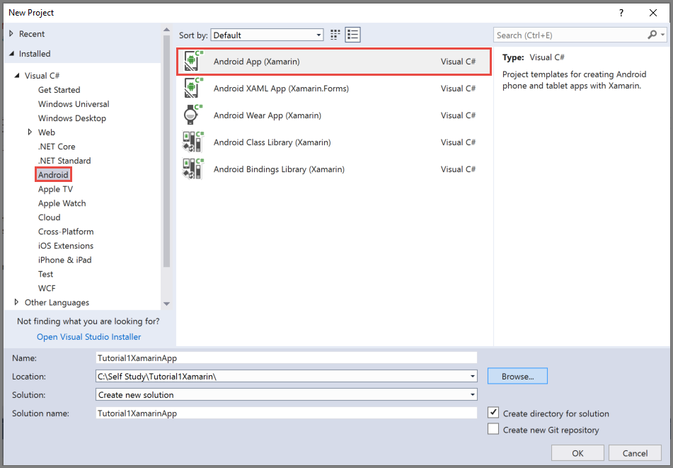
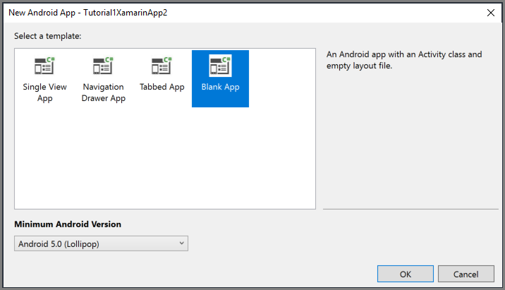

# Tutorial: Send push notifications to Xamarin.Android apps using Notification Hubs

[!INCLUDE [notification-hubs-selector-get-started](../../includes/notification-hubs-selector-get-started.md)]

## Overview

This tutorial shows you how to use Azure Notification Hubs to send push notifications to a Xamarin.Android application. You create a blank Xamarin.Android app that receives push notifications by using Firebase Cloud Messaging (FCM). You use your notification hub to broadcast push notifications to all the devices running your app. The finished code is available in the [NotificationHubs app](https://github.com/Azure/azure-notificationhubs-dotnet/tree/master/Samples/Xamarin/GetStartedXamarinAndroid) sample.

In this tutorial, you take the following steps:

> [!div class="checklist"]
> * Create a Firebase project and enable Firebase Cloud Messaging
> * Create a notification hub
> * Create a Xamarin.Android app and connect it to the notification hub
> * Send test notifications from the Azure portal

## Prerequisites

* **Azure subscription**. If you don't have an Azure subscription, [create a free Azure account](https://azure.microsoft.com/free/?WT.mc_id=A261C142F) before you begin.
* [Visual Studio with Xamarin] on Windows or [Visual Studio for Mac] on OS X.
* Active Google account

## Create a Firebase project and enable Firebase Cloud Messaging

[!INCLUDE [notification-hubs-enable-firebase-cloud-messaging](../../includes/notification-hubs-enable-firebase-cloud-messaging-xamarin.md)]

## Create a notification hub

[!INCLUDE [notification-hubs-portal-create-new-hub](../../includes/notification-hubs-portal-create-new-hub.md)]

### Configure GCM/FCM settings for the notification hub

1. Select **Google (GCM/FCM)/** in the **Settings** section on the left menu.
2. Enter the **server key** you noted down from the Google Firebase Console.
3. Select **Save** on the toolbar.

    

Your notification hub is configured to work with FCM, and you have the connection strings to both register your app to receive notifications and to send push notifications.

## Create a Xamarin.Android app and connect it to notification hub

### Create Visual Studio project and add NuGet packages

> [!NOTE]
> The steps documented in this tutorial are for Visual Studio 2017. 

1. In Visual Studio, open the **File** menu, select **New**, and then select **Project**. In the **New Project** window, do these steps:
    1. Expand **Installed**, **Visual C#**, and then click **Android**.
    2. Select **Android App (Xamarin)** from the list.
    3. Enter a **name** for the project.
    4. Select a **location** for the project.
    5. Select **OK**

        
2. On the **New Android App** dialog box, select **Blank App**, and select **OK**.

    
3. In the **Solution Explorer** window, expand **Properties**, and click **AndroidManifest.xml**. Update the package name to match the package name you entered when adding Firebase Cloud Messaging to your project in the Google Firebase Console.

    
4. Set the target Android version for the project to **Android 10.0** by following these steps: 
    1. Right-click your project, and select **Properties**. 
    1. For the **Compile using Android version: (Target framework)** field, select **Android 10.0**. 
    1. Select **Yes** on the message box to continue with changing the target framework.
1. Add required NuGet packages to the project by following these steps:
    1. Right-click your project, and select **Manage NuGet Packages...**.
    1. Switch to the **Installed** tab, select **Xamarin.Android.Support.Design**, and select **Update** in the right pane to update the package to the latest version.
    1. Switch to the **Browse** tab. Search for **Xamarin.GooglePlayServices.Base**. Select **Xamarin.GooglePlayServices.Base** in the result list. Then, select **Install**.

        
    6. In the **NuGet Package Manager** window, search for **Xamarin.Firebase.Messaging**. Select **Xamarin.Firebase.Messaging** in the result list. Then, select **Install**.
    7. Now, search for **Xamarin.Azure.NotificationHubs.Android**. Select **Xamarin.Azure.NotificationHubs.Android** in the result list. Then, select **Install**.

### Add the Google Services JSON File

1. Copy the `google-services.json` file that you downloaded from the Google Firebase Console to the project folder.
2. Add `google-services.json` to the project.
3. Select `google-services.json` in the **Solution Explorer** window.
4. In the **Properties** pane, set the Build Action to **GoogleServicesJson**. If you don't see **GoogleServicesJson**, close Visual Studio, relaunch it, reopen the project, and retry.

    

### Set up notification hubs in your project

#### Registering with Firebase Cloud Messaging

1. If you're migrating from Google Cloud Messaging to Firebase, your project's `AndroidManifest.xml` file might contain an outdated GCM configuration, which may cause notification duplication. Edit the file and remove the following lines inside the `<application>` section, if present:

    ```xml
    <receiver
        android:name="com.google.firebase.iid.FirebaseInstanceIdInternalReceiver"
        android:exported="false" />
    <receiver
        android:name="com.google.firebase.iid.FirebaseInstanceIdReceiver"
        android:exported="true"
        android:permission="com.google.android.c2dm.permission.SEND">
        <intent-filter>
            <action android:name="com.google.android.c2dm.intent.RECEIVE" />
            <action android:name="com.google.android.c2dm.intent.REGISTRATION" />
            <category android:name="${applicationId}" />
        </intent-filter>
    </receiver>
    ```

2. Add the following statements **before the application** element.

    ```xml
    <uses-permission android:name="android.permission.INTERNET" />
    <uses-permission android:name="com.google.android.c2dm.permission.RECEIVE" />
    <uses-permission android:name="android.permission.WAKE_LOCK" />
    <uses-permission android:name="android.permission.GET_ACCOUNTS"/>
    ```

3. Gather the following information for your Android app and notification hub:

   * **Listen connection string**: On the dashboard in the [Azure portal], choose **View connection strings**. Copy the `DefaultListenSharedAccessSignature` connection string for this value.
   * **Hub name**: Name of your hub from the [Azure portal]. For example, *mynotificationhub2*.
4. In the **Solution Explorer** window, right-click your **project**, select **Add**, and then select **Class**.
5. Create a `Constants.cs` class for your Xamarin project and define the following constant values in the class. Replace the placeholders with your values.

    ```csharp
    public static class Constants
    {
        public const string ListenConnectionString = "<Listen connection string>";
        public const string NotificationHubName = "<hub name>";
    }
    ```

6. Add the following using statements to `MainActivity.cs`:

    ```csharp
    using WindowsAzure.Messaging.NotificationHubs;
    ```

7. Add the following properties to the MainActivity class:

    ```csharp
    internal static readonly string CHANNEL_ID = "my_notification_channel";

8. In `MainActivity.cs`, add the following code to `OnCreate` after `base.OnCreate(savedInstanceState)`:

    ```csharp
    // Listen for push notifications
    NotificationHub.SetListener(new AzureListener());

    // Start the SDK
    NotificationHub.Start(this.Application, HubName, ConnectionString);
    ```

9. Add a class named `AzureListener` to your project.
10. Add the following using statements to `AzureListener.cs`.

    ```csharp
    using Android.Content;
    using WindowsAzure.Messaging.NotificationHubs;
    ```

11. Add the following above your class declaration, and have your class inherit from `Java.Lang.Object` and implement the `INotificationListener`:

    ```csharp
    public class AzureListener : Java.Lang.Object, INotificationListener
    ```

12. Add the following code inside `AzureListener` class, to process messages that are received.

    ```csharp
        public void OnPushNotificationReceived(Context context, INotificationMessage message)
        {
            var intent = new Intent(this, typeof(MainActivity));
            intent.AddFlags(ActivityFlags.ClearTop);
            var pendingIntent = PendingIntent.GetActivity(this, 0, intent, PendingIntentFlags.OneShot);
    
            var notificationBuilder = new NotificationCompat.Builder(this, MainActivity.CHANNEL_ID);
    
            notificationBuilder.SetContentTitle(message.Title)
                        .SetSmallIcon(Resource.Drawable.ic_launcher)
                        .SetContentText(message.Body)
                        .SetAutoCancel(true)
                        .SetShowWhen(false)
                        .SetContentIntent(pendingIntent);
    
            var notificationManager = NotificationManager.FromContext(this);
    
            notificationManager.Notify(0, notificationBuilder.Build());
        }
    ```

1. **Build** your project.
1. **Run** your app on your device or loaded emulator

## Send test notification from the Azure portal

You can test receiving notifications in your app with the **Test Send** option in the [Azure portal]. It sends a test push notification to your device.


Push notifications are normally sent in a back-end service like Mobile Services or ASP.NET through a compatible library. If a library isn't available for your back-end, you can also use the REST API directly to send notification messages.

## Next steps

In this tutorial, you sent broadcast notifications to all your Android devices registered with the backend. To learn how to push notifications to specific Android devices, advance to the following tutorial:

> [!div class="nextstepaction"]
>[Push notifications to specific devices](push-notifications-android-specific-devices-firebase-cloud-messaging.md)

<!-- Anchors. -->
[Enable Google Cloud Messaging]: #register
[Configure your Notification Hub]: #configure-hub
[Connecting your app to the Notification Hub]: #connecting-app
[Run your app with the emulator]: #run-app
[Send notifications from your back-end]: #send
[Next steps]:#next-steps

<!-- Images. -->
[11]: ./media/partner-xamarin-notification-hubs-android-get-started/notification-hub-configure-android.png
[13]: ./media/partner-xamarin-notification-hubs-android-get-started/notification-hub-create-xamarin-android-app1.png
[15]: ./media/partner-xamarin-notification-hubs-android-get-started/notification-hub-create-xamarin-android-app3.png
[18]: ./media/partner-xamarin-notification-hubs-android-get-started/notification-hub-create-android-app7.png
[19]: ./media/partner-xamarin-notification-hubs-android-get-started/notification-hub-create-android-app8.png
[20]: ./media/partner-xamarin-notification-hubs-android-get-started/notification-hub-create-console-app.png
[21]: ./media/partner-xamarin-notification-hubs-android-get-started/notification-hub-android-toast.png
[22]: ./media/partner-xamarin-notification-hubs-android-get-started/notification-hub-create-xamarin-android-project1.png
[23]: ./media/partner-xamarin-notification-hubs-android-get-started/notification-hub-create-xamarin-android-project2.png
[24]: ./media/partner-xamarin-notification-hubs-android-get-started/notification-hub-xamarin-android-app-options.png
[25]: ./media/partner-xamarin-notification-hubs-android-get-started/notification-hub-google-services-json.png
[30]: ./media/notification-hubs-android-get-started/notification-hubs-test-send.png

<!-- URLs. -->
[Submit an app page]: https://go.microsoft.com/fwlink/p/?LinkID=266582
[My Applications]: https://go.microsoft.com/fwlink/p/?LinkId=262039
[Live SDK for Windows]: https://go.microsoft.com/fwlink/p/?LinkId=262253
[Get started with Mobile Services]: /develop/mobile/tutorials/get-started-xamarin-android/#create-new-service
[JavaScript and HTML]: /develop/mobile/tutorials/get-started-with-push-js
[Visual Studio with Xamarin]: /visualstudio/install/install-visual-studio
[Visual Studio for Mac]: https://www.visualstudio.com/vs/visual-studio-mac/
[Azure portal]: https://portal.azure.com/
[wns object]: /previous-versions/azure/reference/jj860484(v=azure.100)
[Notification Hubs Guidance]: /previous-versions/azure/azure-services/jj927170(v=azure.100)
[Notification Hubs How-To for Android]: /previous-versions/azure/dn282661(v=azure.100)
[Use Notification Hubs to push notifications to users]: notification-hubs-aspnet-backend-ios-apple-apns-notification.md
[Use Notification Hubs to send breaking news]: notification-hubs-windows-notification-dotnet-push-xplat-segmented-wns.md
[GitHub]: https://github.com/Azure/azure-notificationhubs-android
