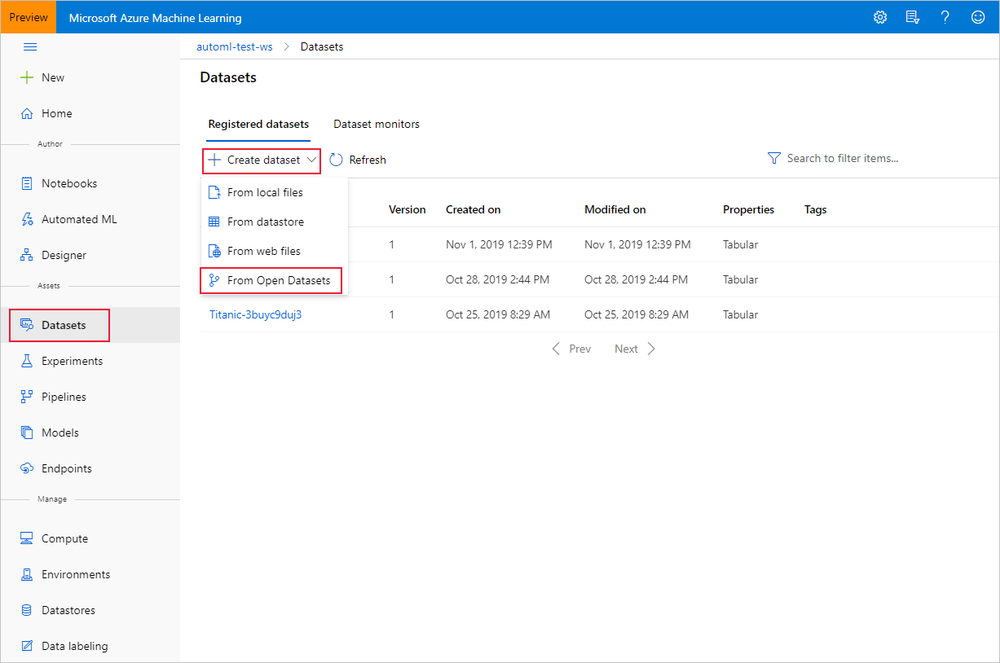
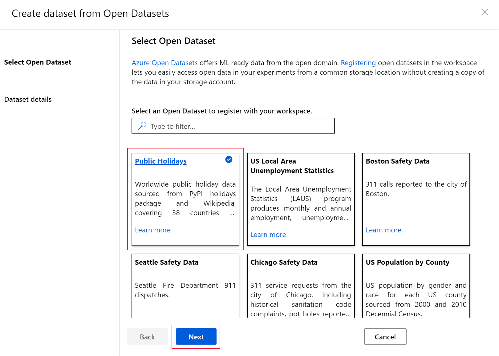
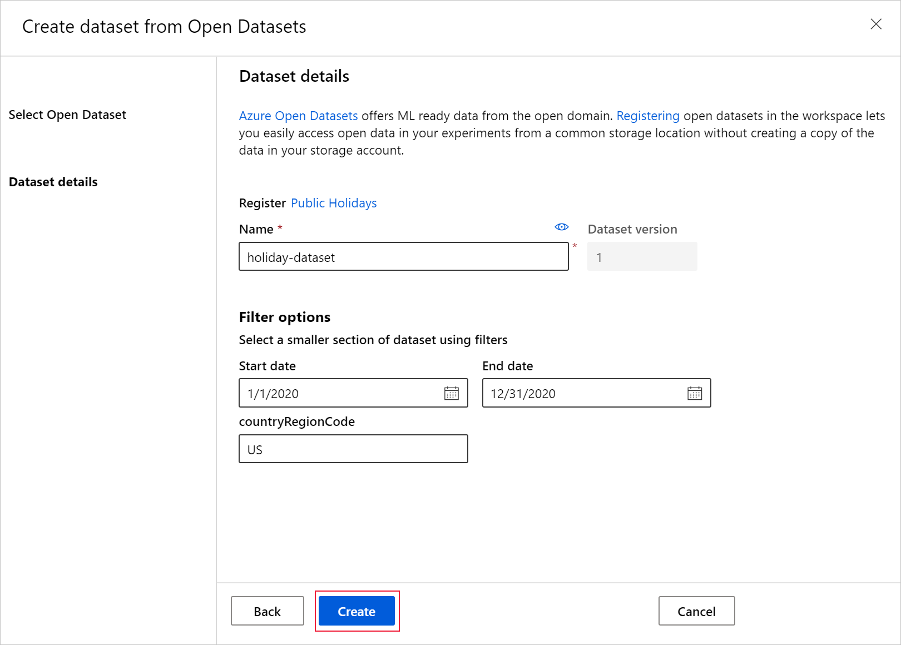

# Create Azure Machine Learning datasets from Azure Open Datasets

In this article, you learn how to bring curated enrichment data into your local or remote machine learning experiments with [Azure Machine Learning](../machine-learning/overview-what-is-azure-machine-learning.md) datasets and [Azure Open Datasets](./index.yml). 

By creating an [Azure Machine Learning dataset](../machine-learning/v1/how-to-create-register-datasets.md), you create a reference to the data source location, along with a copy of its metadata. Because datasets are lazily evaluated, and the data remains in its existing location, you
* Incur no extra storage cost.
* Don't risk unintentionally changing your original data sources. 
* Improve ML workflow performance speeds.

To understand where datasets fit in Azure Machine Learning's overall data access workflow, see  the [Securely access data](../machine-learning/v1/concept-data.md#data-workflow) article.

Azure Open Datasets are curated public datasets that you can use to add scenario-specific features to enrich your predictive solutions and improve their accuracy. See the [Open Datasets catalog](https://azure.microsoft.com/services/open-datasets/catalog/) for public-domain data that can help you train machine learning models, like:

* [weather](https://azure.microsoft.com/services/open-datasets/catalog/noaa-integrated-surface-data/)
* [census](https://azure.microsoft.com/services/open-datasets/catalog/us-decennial-census-zip/)
* [holidays](https://azure.microsoft.com/services/open-datasets/catalog/public-holidays/)
* [public safety](https://azure.microsoft.com/services/open-datasets/catalog/chicago-safety-data/)
* location

Open Datasets are in the cloud on Microsoft Azure and are included in both the [Azure Machine Learning Python SDK](#create-datasets-with-the-sdk) and the [Azure Machine Learning studio](#create-datasets-with-the-studio).


## Prerequisites

For this article, you need:

* An Azure subscription. If you don't have one, create a free account before you begin. Try the [free or paid version of Azure Machine Learning](https://aka.ms/AMLFree).

* An [Azure Machine Learning workspace](../machine-learning/how-to-manage-workspace.md).

* The [Azure Machine Learning SDK for Python installed](/python/api/overview/azure/ml/install), which includes the `azureml-datasets` package.

    * Create an [Azure Machine Learning compute instance](../machine-learning/how-to-create-compute-instance.md), which is a fully configured and managed development environment that includes integrated notebooks and the SDK already installed.

    **OR**

    * Work on your own Python environment and install the SDK yourself with [these instructions](/python/api/overview/azure/ml/install).

> [!NOTE]
> Some dataset classes have dependencies on the azureml-dataprep package, which is only compatible with 64-bit Python. For Linux users, these classes are supported only on the following distributions:  Red Hat Enterprise Linux (7, 8), Ubuntu (14.04, 16.04, 18.04), Fedora (27, 28), Debian (8, 9), and CentOS (7).

## Create datasets with the SDK

To create Azure Machine Learning datasets via Azure Open Datasets classes in the Python SDK, make sure you've installed the package with `pip install azureml-opendatasets`. Each discrete data set is represented by its own class in the SDK, and certain classes are available as either an Azure Machine Learning [`TabularDataset`, `FileDataset`](../machine-learning/v1/how-to-create-register-datasets.md#dataset-types), or both. See the [reference documentation](/python/api/azureml-opendatasets/azureml.opendatasets) for a full list of `opendatasets` classes.

You can retrieve certain `opendatasets` classes as either a `TabularDataset` or `FileDataset`, which allows you to manipulate and/or download the files directly. Other classes can get a dataset **only** by using the `get_tabular_dataset()` or `get_file_dataset()` functions from the `Dataset`class in the Python SDK.

The following code shows that the MNIST `opendatasets` class can return either a `TabularDataset` or `FileDataset`. 


```python
from azureml.core import Dataset
from azureml.opendatasets import MNIST

# MNIST class can return either TabularDataset or FileDataset
tabular_dataset = MNIST.get_tabular_dataset()
file_dataset = MNIST.get_file_dataset()
```

In this example, the Diabetes `opendatasets` class is only available as a `TabularDataset`, hence the use of `get_tabular_dataset()`.

```python

from azureml.opendatasets import Diabetes
from azureml.core import Dataset

# Diabetes class can return ONLY TabularDataset and must be called from the static function
diabetes_tabular = Diabetes.get_tabular_dataset()
```
## Register datasets

Register an Azure Machine Learning dataset with your workspace, so you can share them with others and reuse them across experiments in your workspace. When you register an Azure Machine Learning dataset created from Open Datasets, no data is immediately downloaded, but the data will be accessed later when requested (during training, for example) from a central storage location.

To register your datasets with a workspace, use the [`register()`](/python/api/azureml-core/azureml.data.abstract_dataset.abstractdataset#register-workspace--name--description-none--tags-none--create-new-version-false-) method. 

```Python
titanic_ds = titanic_ds.register(workspace=workspace,
                                 name='titanic_ds',
                                 description='titanic training data')
```

## Create datasets with the studio

You can also create Azure Machine Learning datasets from Azure Open Datasets with the [Azure Machine Learning studio](https://ml.azure.com), a consolidated web interface that includes machine learning tools to perform data science scenarios for data science practitioners of all skill levels.

> [!Note]
> Datasets created through Azure Machine Learning studio are automatically registered to the workspace.

1. In your workspace, select the **Datasets** tab under **Assets**. On the **Create dataset** drop-down menu, select **From Open Datasets**.

    

1. Select a dataset by selecting its tile. (You have the option to filter by using the search bar.) Select **Next**.

    

1. Choose a name under which to register the dataset, and optionally filter the data by using the available filters. In this case, for the **public holidays** dataset, you filter the time period to one year and the country code to only the US. See the [Azure Open Datasets Catalog](https://azure.microsoft.com/services/open-datasets/catalog) for data detail such as, field descriptions and date ranges. Select **Create**.

    

    The dataset is now available in your workspace under **Datasets**. You can use it in the same way as other datasets you've created.


## Access datasets for your experiments

Use your datasets in your machine learning experiments for training ML models. [Learn more about how to train with datasets](../machine-learning/v1/how-to-train-with-datasets.md).

## Example notebooks

For examples and demonstrations of Open Datasets functionality,  see these [sample notebooks](samples.md).

## Next steps

* [Train your first ML model](../machine-learning/tutorial-1st-experiment-sdk-train.md).

* [Train with datasets](../machine-learning/v1/how-to-train-with-datasets.md).

* [Create an Azure machine learning dataset](../machine-learning/v1/how-to-create-register-datasets.md).
