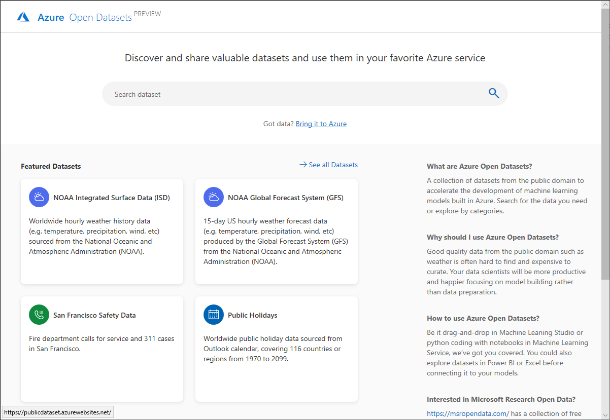

# What are Azure Open Datasets (preview) and how can you use them?

[Azure Open Datasets](https://opendatasets.azure.com) are curated public datasets that you can use to add scenario-specific features to machine learning solutions for more accurate models. Open Datasets are in the cloud on Microsoft Azure and are readily available to Azure Databricks, Machine Learning service, and Machine Learning Studio. You can also access the datasets through APIs and use them in other products, such as Power BI and Azure Data Factory.

Datasets include public-domain data for weather, census, holidays, public safety, and location that help you train machine learning models and enrich predictive solutions. You can also share your public datasets on Azure Open Datasets. 

## Curated, prepared datasets
Curated open public datasets in Azure Open Datasets are optimized for consumption in machine learning workflows. 

Data scientists often spend the majority of their time cleaning and preparing data for advanced analytics. Open Datasets are preprocessed to save you time. The datasets are also cohosted with cloud compute in Azure making access and manipulation easier.  

### Weather data
 
|Dataset         | Notebooks     | Description                                    |
|----------------|---------------|------------------------------------------------|
|[NOAA Integrated Surface Data (ISD)](https://publicdataset.azurewebsites.net/dataDetail/isd) | [Pandas](https://publicdataset.azurewebsites.net/dataDetail/isd/access?tab2=AzureNotebooks)   [Azure Databricks](https://publicdataset.azurewebsites.net/dataDetail/isd/access?tab2=AzureDatabricks) | Worldwide hourly weather history data from the National Oceanic and Atmospheric Administration (NOAA) with the best spatial coverage in North America, Europe, Australia, and parts of Asia. Updated daily. |
|[NOAA Global Forecast System (GFS)](https://publicdataset.azurewebsites.net/dataDetail/gfs) | [Pandas](https://publicdataset.azurewebsites.net/dataDetail/gfs/access?tab2=AzureNotebooks)   [Azure Databricks](https://publicdataset.azurewebsites.net/dataDetail/gfs/access?tab2=AzureDatabricks) | 15-day U.S. hourly weather forecast data from NOAA. Updated daily. |

### Calendar data

|Dataset         | Notebooks     | Description                                    |
|----------------|---------------|------------------------------------------------|
|[Public Holidays](https://publicdataset.azurewebsites.net/dataDetail/public_holiday) | [Pandas](https://publicdataset.azurewebsites.net/dataDetail/public_holiday/access?tab2=AzureNotebooks)   [Azure Databricks](https://publicdataset.azurewebsites.net/dataDetail/public_holiday/access?tab2=AzureDatabricks) | Worldwide public holiday data, covering 116 countries or regions from 1970 to 2099. Includes country and whether most people have paid time off. |

## Access to datasets in Azure 
With an Azure subscription you can access open datasets in the Azure portal, where the data is accessible to your machine learning solution and colocated with cloud compute resources. 

The Open Datasets site provides Python Pandas and Azure Databricks notebooks you can use to connect data to Azure Machine Learning service and Azure Databricks. Datasets can also be accessed through a Python SDK. [check this]

## How to contribute to Open Datasets
If you have a dataset to share, submit a request with a description of the dataset to [Azure Open Datasets site](https://opendatasets.azure.com). 

## Next steps
* [Open datasets examples](samples.md)
* [Tutorial: Regression modeling with NY taxi data](tutorial-opendatasets-automl.md)
* [Python SDK for Open Datasets](https://aka.ms/open-datasets-sdk)

<!---

## Ways to use the data

<Need scenarios for using public datasets>

It can also be accessed through REST APIs that you can code through your applications and notebooks. ​
Compete differentiator: Data curation (AWS offers only storage, and no curation) and ease of access (data appears in UI for AML service, Databricks, or can be accessed with a few lines of code via REST, CLI etc.)
An Azure subscription will be required for access

Value prop for Data scientists, Data analysts/engineers and Developers​
More relevant model features == better accuracy​
Save on data prep time with curated and optimized datasets (data scientists and engineers spend two thirds of their time cleaning and prepping data)​
Ease of access and use from co-location with cloud compute (Moving large datasets not easy nor cheap)​

Data Scientists spend two thirds of their time cleaning and prepping data. Azure Open Datasets are optimized for consumption in ML workflows.​
Making these datasets available to the customers creates efficiencies of scale while reducing costs associated with data storage and pre-processing. ​
Compete differentiator is the data curation and optimization (AWS offers only storage, and no curation) and ease of access (data appears in UI for AML service, Databricks or can be accessed with a few lines of code via REST, CLI etc.)​
Data Scientists, Data engineers and developers are the primary audience. Adding scenario specific data and features lends to greater accuracy in model predictions. Datasets are co-hosted with cloud compute in Azure making access and manipulation easier.​
They can be accessed through UX within Azure Machine Learning service, Azure Databricks and through REST APIs. Azure subscription will be required for access and creates attach for Azure services.​
Market opportunity: Data Scientists, Developers and ISVs.. Target public preview is May 6th at build. ​
Datasets included in preview - Weather 10 year historical and forecast, Holidays (for demand forecasting scenarios), NYC Taxi Trip datasets, Crime and Safety - top US cities , Census/population/socioeconomic data.​
-->
