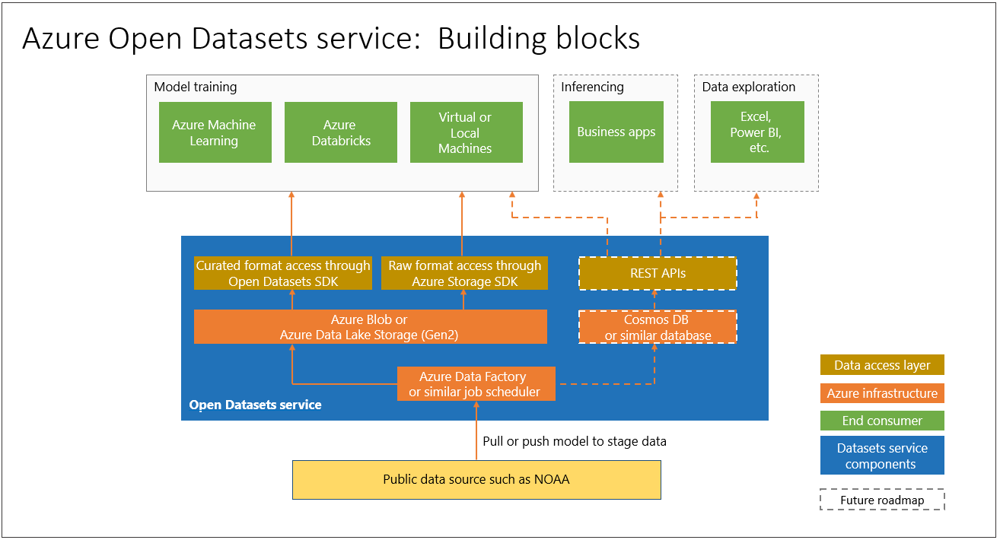

# What are Azure Open Datasets (preview) and how can you use them?

[Azure Open Datasets](https://azure.microsoft.com/services/open-datasets/) are curated public datasets that you can use to add scenario-specific features to machine learning solutions for more accurate models. Open Datasets are in the cloud on Microsoft Azure and are readily available to Azure Databricks, Machine Learning service, and Machine Learning Studio. You can also access the datasets through APIs and use them in other products, such as Power BI and Azure Data Factory.

Datasets include public-domain data for weather, census, holidays, public safety, and location that help you train machine learning models and enrich predictive solutions. You can also share your public datasets on Azure Open Datasets. 

## Curated, prepared datasets
Curated open public datasets in Azure Open Datasets are optimized for consumption in machine learning workflows. 

Data scientists often spend the majority of their time cleaning and preparing data for advanced analytics. Open Datasets are copied to the Azure cloud and preprocessed to save you time. At regular intervals data is pulled from the sources, such as by an FTP connection to the National Oceanic and Atmospheric Administration (NOAA), parsed into a structured format, and then enriched as appropriate with features such as zip code or location of the nearest weather station.

Datasets are cohosted with cloud compute in Azure making access and manipulation easier.  

Following are examples of datasets available. 

### Weather data
 
|Dataset         | Notebooks     | Description                                    |
|----------------|---------------|------------------------------------------------|
|[NOAA Integrated Surface Data (ISD)](https://azure.microsoft.com/services/open-datasets/catalog/noaa-integrated-surface-data/) | [Azure Notebooks](https://azure.microsoft.com/services/open-datasets/catalog/noaa-integrated-surface-data/?tab=data-access#AzureNotebooks)   [Azure Databricks](https://azure.microsoft.com/services/open-datasets/catalog/noaa-integrated-surface-data/?tab=data-access#AzureDatabricks) | Worldwide hourly weather data from NOAA with the best spatial coverage in North America, Europe, Australia, and parts of Asia. Updated daily. |
|[NOAA Global Forecast System (GFS)](https://azure.microsoft.com/services/open-datasets/catalog/noaa-global-forecast-system/) | [Azure Notebooks](https://azure.microsoft.com/services/open-datasets/catalog/noaa-global-forecast-system/?tab=data-access#AzureNotebooks)   [Azure Databricks](https://azure.microsoft.com/services/open-datasets/catalog/noaa-global-forecast-system/?tab=data-access#AzureDatabricks) | 15-day U.S. hourly weather forecast data from NOAA. Updated daily. |

### Calendar data

|Dataset         | Notebooks     | Description                                    |
|----------------|---------------|------------------------------------------------|
|[Public Holidays](https://azure.microsoft.com/services/open-datasets/catalog/noaa-global-forecast-system/) | [Azure Notebooks](https://azure.microsoft.com/services/open-datasets/catalog/noaa-global-forecast-system/?tab=data-access#AzureNotebooks)   [Azure Databricks](https://azure.microsoft.com/services/open-datasets/catalog/noaa-global-forecast-system/?tab=data-access#AzureDatabricks) | Worldwide public holiday data, covering 41 countries or regions from 1970 to 2099. Includes country and whether most people have paid time off. |

## Access to datasets  
With an Azure account you can access open datasets using code or through the Azure service interface. The data is colocated with Azure cloud compute resources for use in your machine learning solution.  

Open Datasets provides Azure Notebooks and Azure Databricks notebooks you can use to connect data to Azure Machine Learning service and Azure Databricks. Datasets can also be accessed through a Python SDK. 

However, you don't need an Azure account to access Open Datasets; they can be access in any Python environment without or without Spark.

## Request or share data
If you can't find the data you want, [send email](mailto:contactazureopendatasets@microsoft.com) to let us know what you're looking for or if you want to bring your data to Azure. 

## Next steps
* [Sample notebook](samples.md)
* [Tutorial: Regression modeling with NY taxi data](tutorial-opendatasets-automl.md)
* [Python SDK for Open Datasets](https://aka.ms/open-datasets-sdk)
