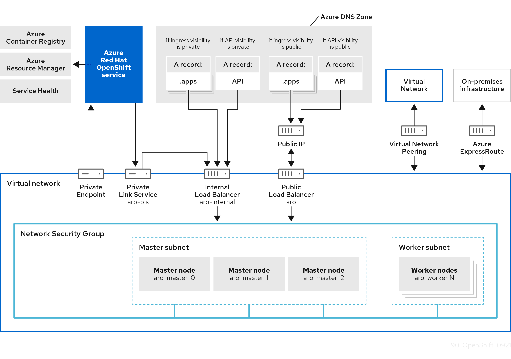

# Overview of Azure Red Hat OpenShift egress lockdown

Egress lockdown provides access to the URLs and endpoints an Azure Red Hat OpenShift cluster needs to function effectively.

Egress lockdown ensures that you have access to URLs, such as management.azure.com, so you can create another worker node backed by Azure VMs. Egress lockdown ensures access even if the outbound (egress) traffic is restricted by a firewall appliance or other means.

Egress lockdown takes a collection of domains required for an Azure Red Hat OpenShift cluster to function and proxies calls to these domains through the Azure Red Hat OpenShift service. The domains, which are region-specific, can't be configured by  customers.

Egress lockdown doesn't rely on customer internet access for Azure Red Hat OpenShift services to work. In order for clusters  to reach any Azure Red Hat OpenShift service, cluster traffic exits through an Azure private endpoint created within the cluster resource group where all of the Azure Red Hat OpenShift resources are available.

The following image displays the architecture changes that encompass egress lockdown.


[ ](./media/concepts-networking/190-azure-red-hat-openshift-network-architecture-0921.png#lightbox)

A well-known subset of domains (that the Azure Red Hat OpenShift clusters need to function) validates the destination of the cluster traffic. Finally, the traffic passes through the Azure Red Hat OpenShift service to connect to these URLs and endpoints.

## Enable egress lockdown

In order to function, egress lockdown relies on the Server Name Indication (SNI) extension to the Transport Layer Security (TLS). All customer workloads that communicate with the well-known subset of domains must have SNI enabled. 

Egress lockdown is enabled by default for new cluster creation. However, to enable egress lockdown on existing clusters, you must have SNI enabled on the customer workloads. To enable egress lockdown on your existing clusters, submit a support case to either [Microsoft Support](https://support.microsoft.com) or [Red Hat Support](https://www.redhat.com/en/services/support).

## Verify egress lockdown is enabled on a cluster

To verify whether egress lockdown is enabled on a cluster, sign in to your Azure cluster and run the following command:

  ```azurecli
  $ oc get cluster.aro.openshift.io cluster -o go-template='{{ if .spec.gatewayDomains }}{{ "Egress Lockdown Feature Enabled" }}{{ else }}{{ "Egress Lockdown Feature Disabled" }}{{ end }}{{ "\n" }}'
  ```
Depending on whether egress lockdown is enabled or disabled, you'll see one of the following messages:

- `Egress Lockdown Feature Enabled`
- `Egress Lockdown Feature Disabled`

## Next steps

For more information on controlling egress traffic on your Azure Red Hat OpenShift cluster, see [Control egress traffic for your Azure Red Hat OpenShift (ARO) cluster (preview)](howto-restrict-egress.md).
