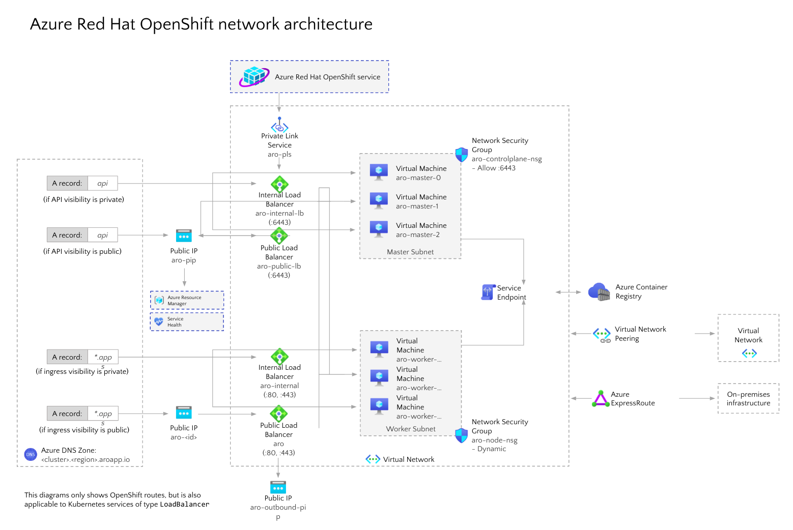

# Networking in Azure Red Hat on OpenShift 4

This guide covers an overview of networking in Azure Red Hat on OpenShift 4 clusters, along with a diagram and a list of important endpoints.

For more details on core OpenShift networking concepts, see the [Azure Red Hat OpenShift 4 networking documentation](https://docs.openshift.com/aro/4/networking/understanding-networking.html).

## Networking concepts in Azure Red Hat OpenShift

When you deploy Azure Red Hat on OpenShift 4, your entire cluster is contained within a virtual network. Within this virtual network, your master nodes and workers nodes each live in their own subnet. Each subnet uses a public and internal load balancer.

## Explanation of endpoints

The following list covers important endpoints in an Azure Red Hat OpenShift cluster.

* **aro-pls**
    * This is an Azure Private Link endpoint, used by Microsoft and Red Hat site reliability engineers to help manage the cluster.
* **aro-internal-lb**
    * This endpoint balances traffic to the api server. For this load balancer, the master nodes are in the backend pool.
* **aro-public-lb**
    * If the api is public, this endpoint routes and balances traffic to the api server. This endpoint assigns a public outgoing IP so masters can access Azure Resource Manager and report back on cluster health.
* **aro-internal**
    * This endpoint balances internal service traffic. For this load balancer, the worker nodes are in the backend pool.
    * This load balancer is not created by default. This load balancer is created once you create a service of type LoadBalancer with the correct annotations. For example: service.beta.kubernetes.io/azure-load-balancer-internal: "true".
* **Network Policies (ingress)**
    * Supported as part of the OpenShift SDN
    * Enabled by default, enforcement done by customers
    * V1 NetworkPolicy compliant, however, "Egress and IPBlock" Types are not supported yet
    * **aro**
    * This endpoint balances traffic to the api server. For this load balancer, the master nodes are in the backend pool.
  * **aro-internal-lb**
    * This endpoint is used for any public traffic. When you create and application and a route, this is the path for ingress traffic.
    * This load balancer also covers egress Internet connectivity from any pod running in the worker nodes through Azure Load Balancer Outbound Rules.
        * Currently outbound rules are not configurable. They allocate 1,024 TCP ports to each node.
        * DisableOutboundSnat is not configured in the LB rules, so pods could get as egress IP any public IP configured in this ALB.
        * As a consequence of the two previous points, the only way of adding ephemeral SNAT ports is by adding public LoadBalancer-type services to ARO.
* **Network Policies (Egress)**
    * Egress Policies are supported by using the Egress Firewall feature in OpenShift.
    * Only one per namespace/project.
    * Egress policies are not supported on "default" namespace.
    * Egress policy rules are evaluated in order (first to last).
    * **aro-outbound-pip**
        * This endpoint serves as a Public IP (PIP) for the worker nodes.
        * This endpoint enables services to add a specific IP coming from an Azure Red Hat OpenShift cluster to an allow list.
* **aro-node-nsg**
    * When you expose a service, the api creates a rule in this network security group so traffic flow through and reach the nodes.
    * By default this network security group allows all outbound traffic. Currently, outbound traffic can only be restricted to the Azure Red Hat OpenShift control plane.
* **aro-controlplane-nsg**
    * This endpoint only allows traffic to enter through port 6443 for the master nodes.
* **Azure Container Registry**
    * This is a container registry that provided and used by Microsoft internally.
        * This registry provides host platform images and cluster components. For example, monitoring or logging containers.
        * Not intended for use by Azure Red Hat OpenShift customers.  
        * Read only.
        * Connections to this registry occur over the service endpoint (internal connectivity between Azure services).
        * This internal registry is not available outside of the cluster by default.
* **Private Link**
    * Allows network connectivity from the management plane into a cluster for cluster management.
    * Microsoft and Red Hat site reliability engineers to help manage your cluster.

## Networking basics in OpenShift

OpenShift Software Defined Networking (SDN) is used to configure an overlay network using Open vSwitch (OVS), an OpenFlow implementation based on Container Network Interface (CNI) specification. The SDN supports different plugins, and Network Policy is the plugin used in Azure Red Hat on OpenShift 4. All network communication is managed by the SDN, so no extra routes are needed on your virtual networks to achieve pod to pod communication.

## Azure Red Hat OpenShift networking specifics

The following features are specific to Azure Red Hat OpenShift:
* Bring your own virtual network is supported.
* Pod and Service Network CIDRs are configurable.
* Nodes and masters are in different subnets.
* Nodes and masters virtual network subnets should be minimum /27.
* Pod CIDR should be minimum /18 in size (The pod network is non-routable IPs, and is only used inside the OpenShift SDN).
* Each node is allocated /23 subnet (512 IPs) for its pods. This value cannot be changed.
* You cannot attach a pod to multiple networks.
* You cannot configure Egress static IP. (This is an OpenShift feature. For information, see [configuring egress IPs](https://docs.openshift.com/aro/4/networking/openshift_sdn/assigning-egress-ips.html)).

## Network settings

The following network settings are available in Azure Red Hat OpenShift 4:

* **API Visibility** - Set the API visibility when running the [az aro create command](tutorial-create-cluster.md#create-the-cluster).
    * "Public" - API Server is accessible by external networks.
    * "Private" - API Server assigned a private IP from the masters subnet, only accessible using connected networks (peered virtual networks, other subnets in the cluster). A private DNS Zone will be created on the customer's behalf.
* **Ingress Visibility** - Set the API visibility when running the [az aro create command](tutorial-create-cluster.md#create-the-cluster).
    * "Public" routes will default to public Azure Standard Load Balancer (this can be changed).
    * "Private" routes will default to internal load balancer (this can be changed).

## Network security groups
Network security groups will be created in the node's resource group, which is locked. The network security groups are assigned directly to the subnets, not on the node's NICs. The network security groups are immutable, which means you do not have the permissions to change them. 

However, with a publicly visible API server, you cannot create network security groups and assign them to the NICs.

## Domain forwarding
Azure Red Hat OpenShift uses CoreDNS. Domain forwarding can be configured (see the documentation on [using DNS forwarding](https://docs.openshift.com/aro/4/networking/dns-operator.html#nw-dns-forward_dns-operator) for more details).

Currently, you cannot bring your own DNS to your virtual networks.

For more information on outbound traffic and what Azure Red Hat OpenShift supports for egress, see the [support policies](support-policies-v4.md) documentation.
