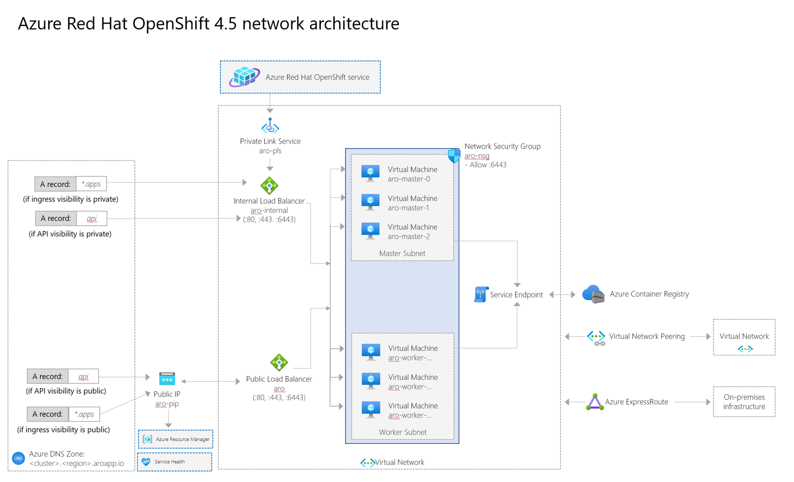

# Network concepts for Azure Red Hat OpenShift (ARO)

This guide covers an overview of networking in Azure Red Hat OpenShift on OpenShift 4 clusters, along with a diagram and a list of important endpoints. For more information on core OpenShift networking concepts, see the [Azure Red Hat OpenShift 4 networking documentation](https://docs.openshift.com/container-platform/4.6/networking/understanding-networking.html).

When you deploy Azure Red Hat on OpenShift 4, your entire cluster is contained within a virtual network. Within this virtual network, your master nodes and workers nodes each live in their own subnet. Each subnet uses an internal load balancer and a public load balancer.

## Networking components

The following list covers important networking components in an Azure Red Hat OpenShift cluster.

* **aro-pls**
    * This is an Azure Private Link endpoint, used by Microsoft and Red Hat site reliability engineers to manage the cluster.
* **aro-internal-lb**
    * This endpoint balances traffic to the api server. For this load balancer, the master nodes are in the backend pool.
* **aro-public-lb**
    * If the api is public, this endpoint routes and balances traffic to the api server. This endpoint assigns a public outgoing IP so masters can access Azure Resource Manager and report back on cluster health.
* **aro-internal**
    * This endpoint balances internal service traffic. For this load balancer, the worker nodes are in the backend pool.
    * This load balancer is not created by default. This load balancer is created once you create a service of type LoadBalancer with the correct annotations. For example: service.beta.kubernetes.io/azure-load-balancer-internal: "true".
* **aro-internal-lb**
    * This endpoint is used for any public traffic. When you create and application and a route, this is the path for ingress traffic.
    * This load balancer also covers egress Internet connectivity from any pod running in the worker nodes through Azure Load Balancer Outbound Rules.
        * Currently outbound rules aren't configurable. They allocate 1,024 TCP ports to each node.
        * DisableOutboundSnat is not configured in the LB rules, so pods could get as egress IP any public IP configured in this ALB.
        * As a consequence of the two previous points, the only way of adding ephemeral SNAT ports is by adding public LoadBalancer-type services to ARO.
* **aro-outbound-pip**
    * This endpoint serves as a Public IP (PIP) for the worker nodes.
    * This endpoint enables services to add a specific IP coming from an Azure Red Hat OpenShift cluster to an allow list.
* **aro-nsg**
    * When you expose a service, the api creates a rule in this network security group so traffic flow through and reach the control plane and nodes.
    * By default this network security group allows all outbound traffic. Currently, outbound traffic can only be restricted to the Azure Red Hat OpenShift control plane.
* **aro-controlplane-nsg**
  * This endpoint only allows traffic to enter through port 6443 for the master nodes.
* **Azure Container Registry**
    * This is a container registry that provided and used by Microsoft internally. This registry is read-only and not intended for use by Azure Red Hat OpenShift users.
        * This registry provides host platform images and cluster components. For example, monitoring or logging containers.
        * Connections to this registry occur over the service endpoint (internal connectivity between Azure services).
        * This internal registry is not available outside of the cluster by default.
* **Private Link**
    * Allows network connectivity from the management plane into a cluster for Microsoft and Red Hat site reliability engineers to help manage your cluster.

## Networking policies

* **Ingress**: The ingress networking policy is supported as a part of [OpenShift SDN](https://docs.openshift.com/container-platform/4.5/networking/openshift_sdn/about-openshift-sdn.html). This network policy is enabled by default, and the enforcement is carried out by users. While the ingress network policy is V1 NetworkPolicy compliant, the Egress and IPBlock Types are not supported.

* **Egress**: The egress network policies are supported by using the [egress firewall](https://docs.openshift.com/container-platform/4.5/networking/openshift_sdn/configuring-egress-firewall.html) feature in OpenShift. There is only one egress policy per namespace/project. Egress policies are not supported on the "default" namespace and are evaluated in order (first to last).

## Networking basics in OpenShift

OpenShift Software Defined Networking [(SDN)](https://docs.openshift.com/container-platform/4.6/networking/openshift_sdn/about-openshift-sdn.html) is used to configure an overlay network using Open vSwitch [(OVS)](https://www.openvswitch.org/), an OpenFlow implementation based on Container Network Interface (CNI) specification. The SDN supports different plugins -- Network Policy is the plugin used in Azure Red Hat on OpenShift 4. All network communication is managed by the SDN, so no extra routes are needed on your virtual networks to achieve pod to pod communication.

## Networking  for Azure Red Hat OpenShift

The following networking features are specific to Azure Red Hat OpenShift:	
* Users can create their ARO cluster in an existing virtual network or create an virtual network when creating their ARO cluster.
* Pod and Service Network CIDRs are configurable.
* Nodes and masters are in different subnets.
* Nodes and masters virtual network subnets should be minimum /27.
* Default Pod CIDR is 10.128.0.0/14.
* Default Service CIDR is 172.30.0.0/16.
* Pod and Service Network CIDRs shouldn't overlap with other address ranges in use on your network, and must not be within the virtual network IP address range of your cluster.
* Pod CIDR should be minimum /18 in size. (The pod network is non-routable IPs, and is only used inside the OpenShift SDN.)
* Each node is allocated /23 subnet (512 IPs) for its pods. This value cannot be changed.
* You cannot attach a pod to multiple networks.
* You cannot configure Egress static IP. (This is an OpenShift feature. For information, see [configuring egress IPs](https://docs.openshift.com/container-platform/4.6/networking/openshift_sdn/assigning-egress-ips.html)).

## Network settings

The following network settings are available for Azure Red Hat OpenShift 4 clusters:

* **API Visibility** - Set the API visibility when running the [az aro create command](tutorial-create-cluster.md#create-the-cluster).
    * "Public" - API Server is accessible by external networks.
    * "Private" - API Server assigned a private IP from the masters subnet, only accessible using connected networks (peered virtual networks, other subnets in the cluster). A private DNS Zone will be created on the customer's behalf.
* **Ingress Visibility** - Set the API visibility when running the [az aro create command](tutorial-create-cluster.md#create-the-cluster).
    * "Public" routes will default to a public Standard Load Balancer (this can be changed).
    * "Private" routes will default to internal load balancer (this can be changed).

## Network security groups
Network security groups are created in the node's resource group, which is locked to users. The network security groups are assigned directly to the subnets, not on the node's NICs. The network security groups are immutable, and users do not have the permissions to change them.

With a publicly visible API server, you cannot create network security groups and assign them to the NICs.

## Domain forwarding
Azure Red Hat OpenShift uses CoreDNS. Domain forwarding can be configured. You cannot bring your own DNS to your virtual networks. For more information, see the documentation on [using DNS forwarding](https://docs.openshift.com/container-platform/4.6/networking/dns-operator.html#nw-dns-forward_dns-operator).

## What's new in OpenShift 4.5

With the support of OpenShift 4.5, Azure Red Hat OpenShift introduced a few significant architectural changes. These changes only apply to newly created clusters running OpenShift 4.5. Existing clusters that have been upgraded to OpenShift 4.5 will not have their networking architecture changed by the upgrade process. Users will need to re-create their clusters to use this new architecture.

As included in the diagram above, you'll notice a few changes:
* Previously, ARO used two public LoadBalancers: one for the API server, and one for the worker node pool. With this architecture update, this has been consolidated under a single LoadBalancer. 
* To reduce complexity, the dedicated outbound IP address resources have been removed.
* The ARO control plane now shares the same network security group as the ARO worker nodes.

For more information on OpenShift 4.5, check out the [OpenShift 4.5 release notes](https://docs.openshift.com/container-platform/4.5/release_notes/ocp-4-5-release-notes.html).

## Next steps
For more information on outbound traffic and what Azure Red Hat OpenShift supports for egress, see the [support policies](support-policies-v4.md) documentation.
