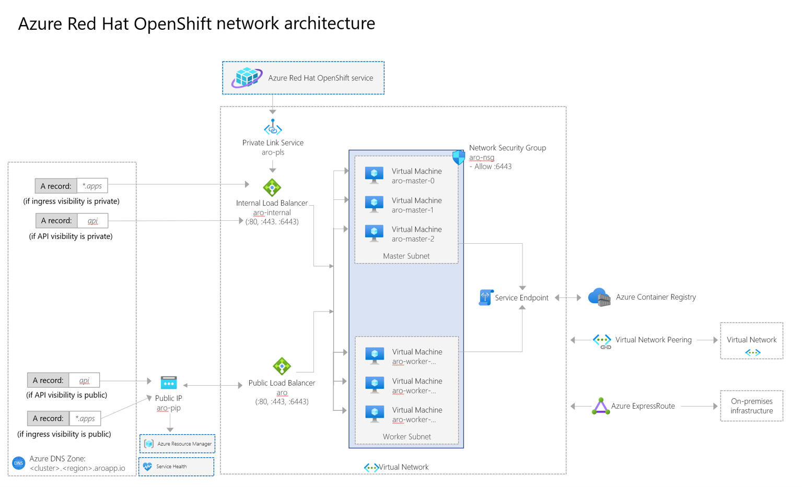

# Network concepts for Azure Red Hat OpenShift

This guide covers an overview of Azure Red Hat OpenShift networking on OpenShift 4 clusters, along with a diagram and a list of important endpoints. For more information on core OpenShift networking concepts, see the [Azure Red Hat OpenShift 4 networking documentation](https://docs.openshift.com/container-platform/4.11/networking/understanding-networking.html).

When you deploy Azure Red Hat OpenShift on OpenShift 4, your entire cluster is contained within a virtual network. Within this virtual network, your control plane nodes and worker nodes each live in their own subnet. Each subnet uses an internal load balancer and a public load balancer.

> [!NOTE]
> For information on the latest changes introduced to ARO, check out [What's new with Azure Red Hat OpenShift](azure-redhat-openshift-release-notes.md). 

## Networking components

The following list covers important networking components in an Azure Red Hat OpenShift cluster.

* **aro-pls**
    * This Azure Private Link endpoint is used by Microsoft and Red Hat site reliability engineers to manage the cluster.

* **aro-internal**
    * This endpoint balances traffic to the API server and internal service traffic. Control plane nodes and worker nodes are in the backend pool.
    * This load balancer isn't created by default. It's created once you create a service of type LoadBalancer with the correct annotations. For example: service.beta.kubernetes.io/azure-load-balancer-internal: "true".

* **aro**
    * This endpoint is used for any public traffic. When you create an application and a route, this endpoint is the path for ingress traffic.
    * This endpoint also routes and balances traffic to the API server (if the API is public). This endpoint assigns a public outgoing IP so control planes can access Azure Resource Manager and report back on cluster health.
    * This load balancer also covers egress Internet connectivity from any pod running in the worker nodes through Azure Load Balancer outbound rules.
        * Currently outbound rules aren't configurable. They allocate 1,024 TCP ports to each node.
        * DisableOutboundSnat isn't configured in the LB rules, so pods could get as egress IP any public IP configured in this ALB.
        * As a consequence of the two previous points, the only way of adding ephemeral SNAT ports is by adding public LoadBalancer-type services to ARO.

* **aro-nsg**
    * When you expose a service, the API creates a rule in this network security group so traffic flows through and reaches the control plane and nodes through port 6443.
    * By default this network security group allows all outbound traffic. Currently, outbound traffic can only be restricted to the Azure Red Hat OpenShift control plane.

* **Azure Container Registry**
    * This container registry is provided and used by Microsoft internally. It's read-only and not intended for use by Azure Red Hat OpenShift users.
        * This registry provides host platform images and cluster components. For example, monitoring or logging containers.
        * Connections to this registry occur over the service endpoint (internal connectivity between Azure services).
        * By default, this internal registry isn't available outside of the cluster.

* **Private Link**
    * A Private Link allows network connectivity from the management plane into a cluster. This is used by Microsoft and Red Hat site reliability engineers to help manage your cluster.

## Networking policies

* **Ingress**: The ingress networking policy is supported as a part of [OpenShift SDN](https://docs.openshift.com/container-platform/4.5/networking/openshift_sdn/about-openshift-sdn.html). This network policy is enabled by default, and the enforcement is carried out by users. While the ingress network policy is V1 NetworkPolicy compliant, the Egress and IPBlock Types aren't supported.

* **Egress**: The egress network policies are supported by using the [egress firewall](https://docs.openshift.com/container-platform/4.5/networking/openshift_sdn/configuring-egress-firewall.html) feature in OpenShift. There's only one egress policy per namespace/project. Egress policies aren't supported on the "default" namespace and are evaluated in order (first to last).

## Networking basics in OpenShift

OpenShift Software Defined Networking [(SDN)](https://docs.openshift.com/container-platform/4.6/networking/openshift_sdn/about-openshift-sdn.html) is used to configure an overlay network using Open vSwitch [(OVS)](https://www.openvswitch.org/), an OpenFlow implementation based on Container Network Interface (CNI) specification. The SDN supports different plugins. Network Policy is the plugin used in Azure Red Hat on OpenShift 4. All network communication is managed by the SDN, so no extra routes are needed on your virtual networks to achieve pod to pod communication.

## Networking for Azure Red Hat OpenShift

The following networking features are specific to Azure Red Hat OpenShift:	
* Users can create their Azure Red Hat OpenShift cluster in an existing virtual network or create a new virtual network when creating their cluster.
* Pod and Service Network CIDRs are configurable.
* Nodes and control planes are in different subnets.
* Nodes and control plane virtual network subnets should be minimum /27.
* The default Pod CIDR is 10.128.0.0/14.
* The default Service CIDR is 172.30.0.0/16.
* Pod and Service Network CIDRs shouldn't overlap with other address ranges in use on your network. They must not be within the virtual network IP address range of your cluster.
* Pod CIDRs should be minimum /18 in size. (The pod network is non-routable IPs, and is only used inside the OpenShift SDN.)
* Each node is allocated /23 subnet (512 IPs) for its pods. This value can't be changed.
* You can't attach a pod to multiple networks.
* You can't configure an egress static IP. (This restriction is an OpenShift feature. For information, see [configuring egress IPs](https://docs.openshift.com/container-platform/4.6/networking/openshift_sdn/assigning-egress-ips.html)).

## Network settings

The following network settings are available for Azure Red Hat OpenShift 4 clusters:

* **API Visibility** - Set the API visibility when running the [az aro create command](tutorial-create-cluster.md#create-the-cluster).
    * "Public" - API Server is accessible by external networks.
    * "Private" - API Server assigned a private IP from the control plane subnet, only accessible using connected networks (peered virtual networks and other subnets in the cluster).
* **Ingress Visibility** - Set the API visibility when running the [az aro create command](tutorial-create-cluster.md#create-the-cluster).
    * "Public" routes default to a public Standard Load Balancer. (The default can be changed.)
    * "Private" routes default to an internal load balancer. (The default can be changed.)

## Network security groups

Network security groups are created in the node's resource group, which is locked to users. The network security groups are assigned directly to the subnets, not on the node's NICs. The network security groups are immutable. Users don't have the permissions to change them.

With a publicly visible API server, you can't create network security groups and assign them to the NICs.

## Domain forwarding

Azure Red Hat OpenShift uses CoreDNS. Domain forwarding can be configured. You can’t bring your own DNS to your virtual networks. For more information, see the documentation on [using DNS forwarding](https://docs.openshift.com/container-platform/4.6/networking/dns-operator.html#nw-dns-forward_dns-operator).

## Next steps
For more information on outbound traffic and what Azure Red Hat OpenShift supports for egress, see the [support policies](support-policies-v4.md) documentation.
