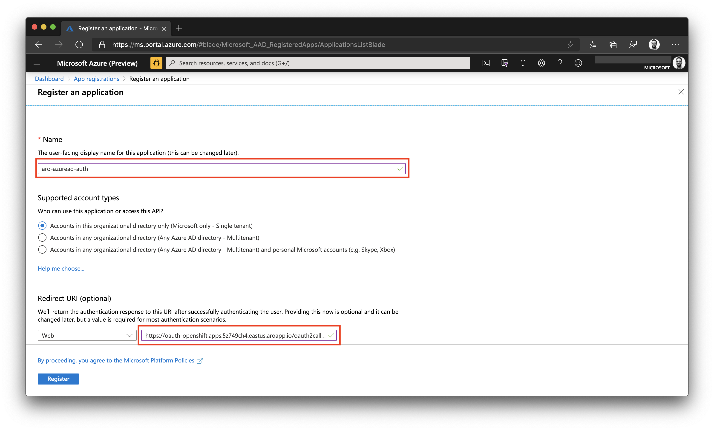
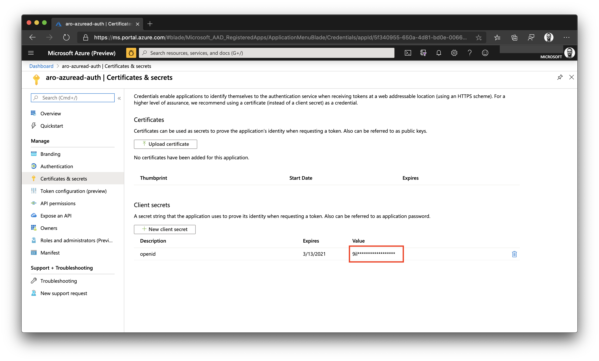
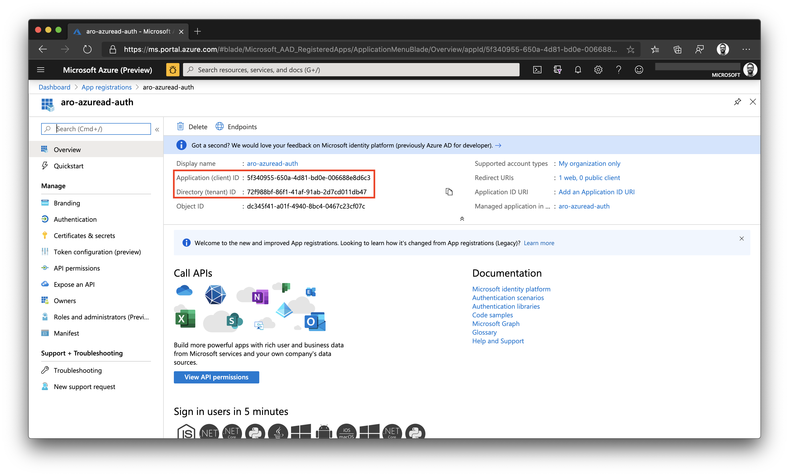
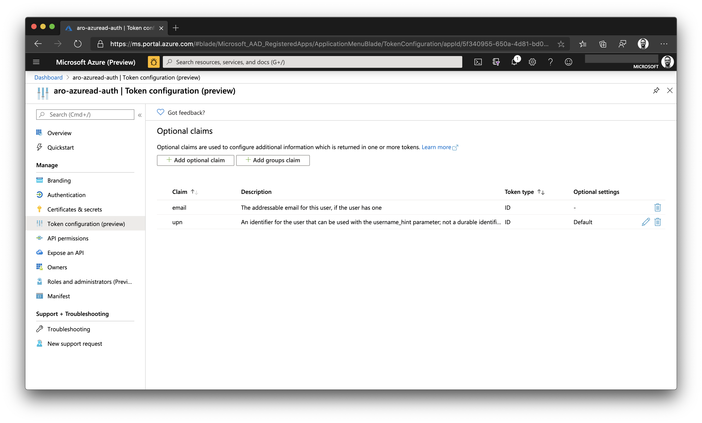
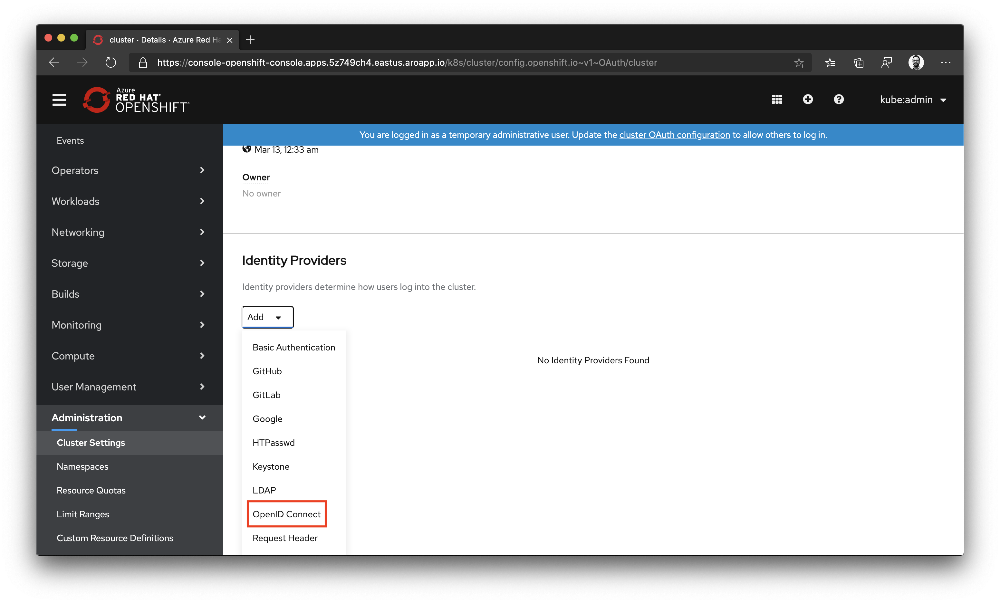
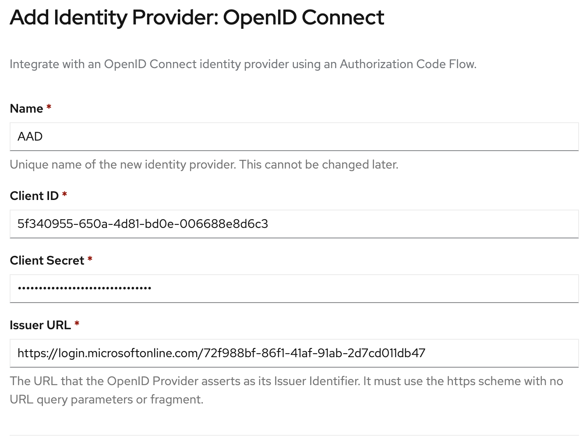
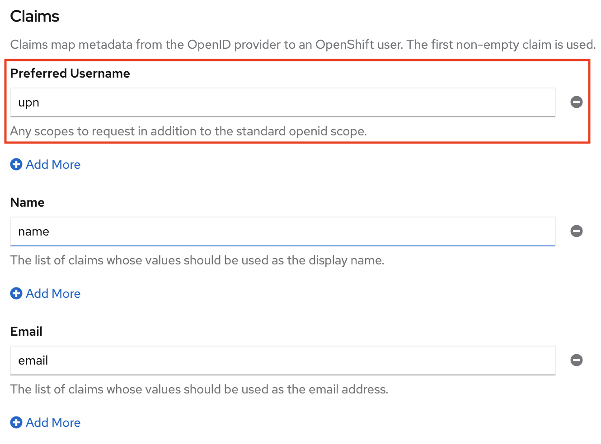
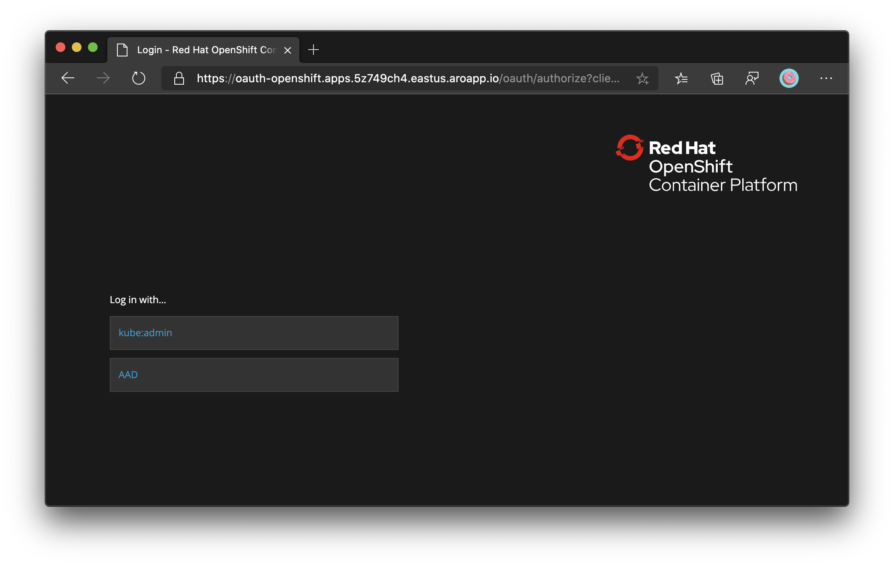

# Configure Azure Active Directory authentication for an Azure Red Hat OpenShift 4 cluster (Portal)

If you choose to install and use the CLI locally, this tutorial requires that you are running the Azure CLI version 2.6.0 or later. Run `az --version` to find the version. If you need to install or upgrade, see [Install Azure CLI](/cli/azure/install-azure-cli).

## Before you begin

Construct the cluster's **OAuth callback URL** and make note of it. Make sure to replace **aro-rg** with your resource group's name and **aro-cluster** with your cluster's name.

> [!NOTE]
> The `AAD` section in the OAuth callback URL should match the OAuth identity provider name you'll setup later.

```azurecli-interactive
domain=$(az aro show -g aro-rg -n aro-cluster --query clusterProfile.domain -o tsv)
location=$(az aro show -g aro-rg -n aro-cluster --query location -o tsv)
echo "OAuth callback URL: https://oauth-openshift.apps.$domain.$location.aroapp.io/oauth2callback/AAD"
```

## Create an Azure Active Directory application for authentication

Login to the Azure portal, and navigate to [App registrations blade](https://portal.azure.com/#blade/Microsoft_AAD_RegisteredApps/ApplicationsListBlade), then click on **New registration** to create a new application.

Provide a name for the application, for example **aro-azuread-auth**, and fill in the **Redirect URI** using the value of the OAuth callback URL you retrieved earlier.



Navigate to **Certificates & secrets** and click on **New client secret** and fill in the details. Make note of the key value, as you'll use it in a later stage. You won't be able to retrieve it again.



Navigate to the **Overview** and make note of the **Application (client) ID** and **Directory (tenant) ID**. You'll need them in a later stage.



## Configure optional claims

Application developers can use [optional claims](../active-directory/develop/active-directory-optional-claims.md) in their Azure AD applications to specify which claims they want in tokens sent to their application.

You can use optional claims to:

* Select additional claims to include in tokens for your application.
* Change the behavior of certain claims that Azure AD returns in tokens.
* Add and access custom claims for your application.

We'll configure OpenShift to use the `email` claim and fall back to `upn` to set the Preferred Username by adding the `upn` as part of the ID token returned by Azure Active Directory.

Navigate to **Token configuration** and click on **Add optional claim**. Select **ID** then check the **email** and **upn** claims.



## Assign users and groups to the cluster (optional)

Applications registered in an Azure Active Directory (Azure AD) tenant are, by default, available to all users of the tenant who authenticate successfully. Azure AD allows tenant administrators and developers to restrict an app to a specific set of users or security groups in the tenant.

Follow the instructions on the Azure Active Directory documentation to [assign users and groups to the app](../active-directory/develop/howto-restrict-your-app-to-a-set-of-users.md).

## Configure OpenShift OpenID authentication

Retrieve the `kubeadmin` credentials. Run the following command to find the password for the `kubeadmin` user.

```azurecli-interactive
az aro list-credentials \
  --name aro-cluster \
  --resource-group aro-rg
```

The following example output shows the password will be in `kubeadminPassword`.

```json
{
  "kubeadminPassword": "<generated password>",
  "kubeadminUsername": "kubeadmin"
}
```

You can find the cluster console URL by running the following command, which will look like `https://console-openshift-console.apps.<random>.<region>.aroapp.io/`

```azurecli-interactive
 az aro show \
    --name aro-cluster \
    --resource-group aro-rg \
    --query "consoleProfile.url" -o tsv
```

Launch the console URL in a browser and login using the `kubeadmin` credentials.

Navigate to **Administration**, click on **Cluster Settings**, then select the **Global Configuration** tab. Scroll to select **OAuth**.

Scroll down to select **Add** under **Identity Providers** and select **OpenID Connect**.


Fill in the name as **AAD**, the **Client ID** as the **Application ID** and the **Client Secret**. The **Issuer URL** is formatted as such: `https://login.microsoftonline.com/xxxxxxxx-xxxx-xxxx-xxxx-xxxxxxxxxxxx/v2.0`. Replace the placeholder with the Tenant ID you retrieved earlier.



Scroll down to the **Claims** section and update the **Preferred Username** to use the value from the **upn** claim.



## Verify login through Azure Active Directory

If you now logout of the OpenShift Web Console and try to login again, you'll be presented with a new option to login with **AAD**. You may need to wait for a few minutes.


