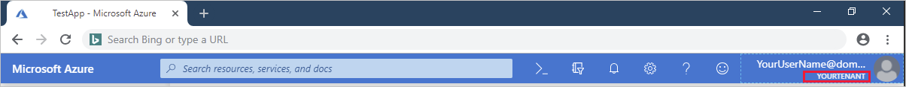
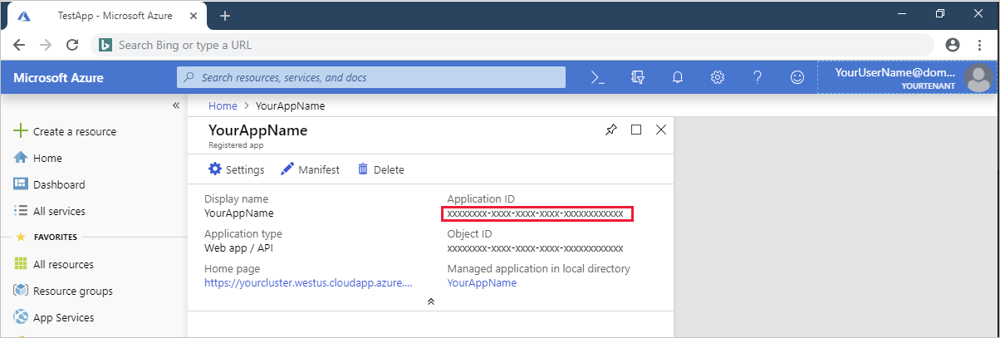
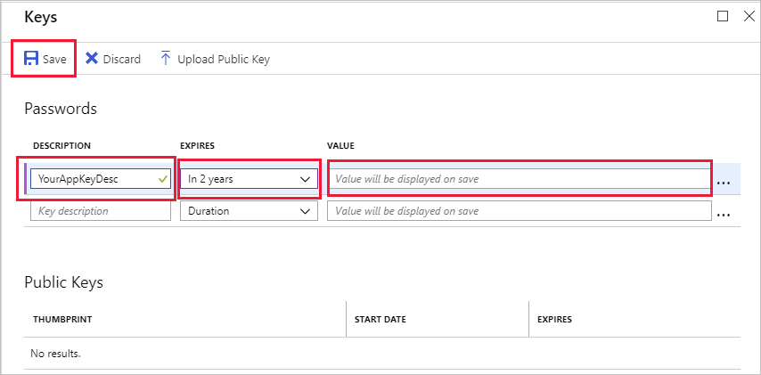
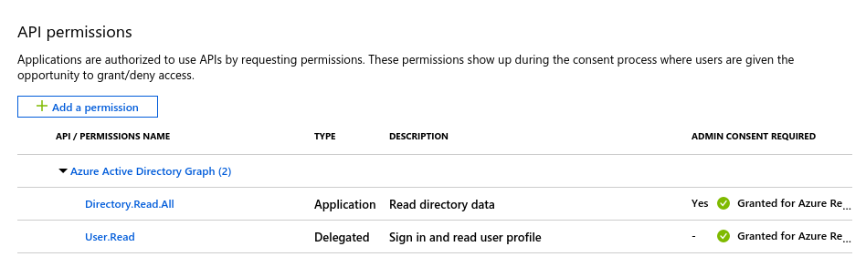

# Azure Active Directory integration for Azure Red Hat OpenShift

If you haven't already created an Azure Active Directory (Azure AD) tenant, follow the directions in [Create an Azure AD tenant for Azure Red Hat OpenShift](howto-create-tenant.md) before continuing with these instructions.

Microsoft Azure Red Hat OpenShift needs permissions to perform tasks on behalf of your cluster. If your organization doesn't already have an Azure AD user, Azure AD security group, or an Azure AD app registration to use as the service principal, follow these instructions to create them.

## Create a new Azure Active Directory user

In the [Azure portal](https://portal.azure.com), ensure that your tenant appears under your user name in the top right of the portal:

If the wrong tenant is displayed, click your user name in the top right, then click **Switch Directory**, and select the correct tenant from the **All Directories** list.

Create a new Azure Active Directory global administrator user to sign in to your Azure Red Hat OpenShift cluster.

1. Go to the [Users-All users](https://portal.azure.com/#blade/Microsoft_AAD_IAM/UsersManagementMenuBlade/AllUsers) blade.
2. Click **+New user** to open the **User** pane.
3. Enter a **Name** for this user.
4. Create a **User name** based on the name of the tenant you created, with  `.onmicrosoft.com` appended at the end. For example, `yourUserName@yourTenantName.onmicrosoft.com`. Write down this user name. You'll need it to sign in to your cluster.
5. Click **Directory role** to open the directory role pane, and select **Global administrator** and then click **Ok** at the bottom of the pane.
6. In the **User** pane, click **Show Password** and record the temporary password. After you sign in the first time, you'll be prompted to reset it.
7. At the bottom of the pane, click **Create** to create the user.

## Create an Azure AD security group

To grant cluster admin access, the memberships in an Azure AD security group are synced into the OpenShift group "osa-customer-admins". If not specified, no cluster admin access will be granted.

1. Open the [Azure Active Directory groups](https://portal.azure.com/#blade/Microsoft_AAD_IAM/GroupsManagementMenuBlade/AllGroups) blade.
2. Click **+New Group**.
3. Provide a group name and description.
4. Set **Group type** to **Security**.
5. Set **Membership type** to **Assigned**.

    Add the Azure AD user that you created in the earlier step to this security group.

6. Click **Members** to open the **Select members** pane.
7. In the members list, select the Azure AD user that you created above.
8. At the bottom of the portal, click on **Select** and then **Create** to create the security group.

    Write down the Group ID value.

9. When the group is created, you will see it in the list of all groups. Click on the new group.
10. On the page that appears, copy down the **Object ID**. We will refer to this value as `GROUPID` in the [Create an Azure Red Hat OpenShift cluster](tutorial-create-cluster.md) tutorial.

## Create an Azure AD app registration

You can automatically create an Azure Active Directory (Azure AD) app registration client as part of creating the cluster by omitting the `--aad-client-app-id` flag to the `az openshift create` command. This tutorial shows you how to create the Azure AD app registration for completeness.

If your organization doesn't already have an Azure Active Directory (Azure AD) app registration to use as a service principal, follow these instructions to create one.

1. Open the [App registrations blade](https://portal.azure.com/#blade/Microsoft_AAD_IAM/ActiveDirectoryMenuBlade/RegisteredAppsPreview) and click **+New  registration**.
2. In the **Register an application** pane, enter a name for your application registration.
3. Ensure that under **Supported account types** that **Accounts in this organizational directory only** is selected. This is the most secure choice.
4. We will add a redirect URI later once we know the URI of the cluster. Click the **Register** button to create the Azure AD application registration.
5. On the page that appears, copy down the **Application (client) ID**. We will refer to this value as `APPID` in the [Create an Azure Red Hat OpenShift cluster](tutorial-create-cluster.md) tutorial.

### Create a client secret

Generate a client secret for authenticating your app to Azure Active Directory.

1. In the **Manage** section of the app registrations page, click **Certificates & secrets**.
2. On the **Certificates & secrets** pane, click **+New client secret**.  The **Add a client secret** pane appears.
3. Provide a **Description**.
4. Set **Expires** to the duration you prefer, for example **In 2 Years**.
5. Click **Add** and the key value will appear in the **Client secrets** section of the page.
6. Copy down the key value. We will refer to this value as `SECRET` in the [Create an Azure Red Hat OpenShift cluster](tutorial-create-cluster.md) tutorial.

For more information about Azure Application Objects, see [Application and service principal objects in Azure Active Directory](https://docs.microsoft.com/azure/active-directory/develop/app-objects-and-service-principals).

For details on creating a new Azure AD application, see [Register an app with the Azure Active Directory v1.0 endpoint](https://docs.microsoft.com/azure/active-directory/develop/quickstart-v1-add-azure-ad-app).

## Add API permissions

1. In the **Manage** section click **API permissions**.
2. Click **Add permission** and select **Azure Active Directory Graph** then **Delegated permissions**
3. Expand **User** on the list below and make sure **User.Read** is enabled.
4. Scroll up and select **Application permissions**.
5. Expand **Directory** on the list below and enable **Directory.ReadAll**
6. Click **Add permissions** to accept the changes.
7. The API permissions panel should now show both *User.Read* and *Directory.ReadAll*. Please note the warning in **Admin consent required** column next to *Directory.ReadAll*.
8. If you are the *Azure Subscription Administrator*, click **Grant admin consent for *Subscription Name*** below. If you are not the *Azure Subscription Administrator*, request the consent from your administrator.

> [!IMPORTANT]
> Synchronization of the cluster administrators group will work only after consent has been granted. You will see a green circle with a checkmark and a message "Granted for *Subscription Name*" in the *Admin consent required* column.

For details on managing administrators and other roles, see [Add or change Azure subscription administrators](https://docs.microsoft.com/azure/billing/billing-add-change-azure-subscription-administrator).

## Resources

* [Applications and service principal objects in Azure Active Directory](https://docs.microsoft.com/azure/active-directory/develop/app-objects-and-service-principals)
* [Quickstart: Register an app with the Azure Active Directory v1.0 endpoint](https://docs.microsoft.com/azure/active-directory/develop/quickstart-v1-add-azure-ad-app)

## Next steps

If you've met all the [Azure Red Hat OpenShift prerequisites](howto-setup-environment.md), you're ready to create your first cluster!

Try the tutorial:
> [!div class="nextstepaction"]
> [Create an Azure Red Hat OpenShift cluster](tutorial-create-cluster.md)
