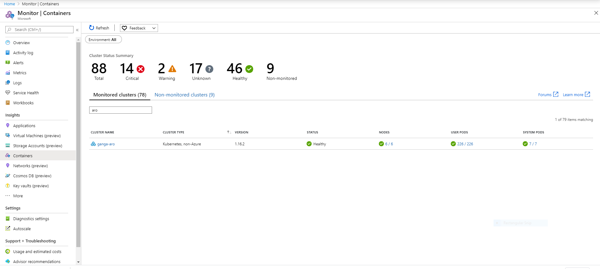
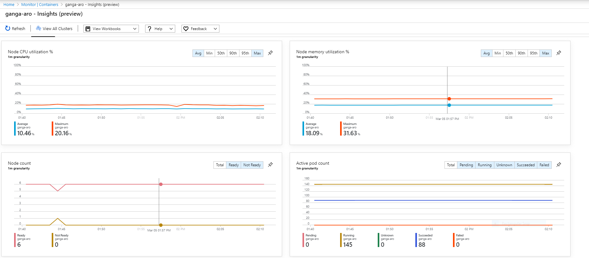
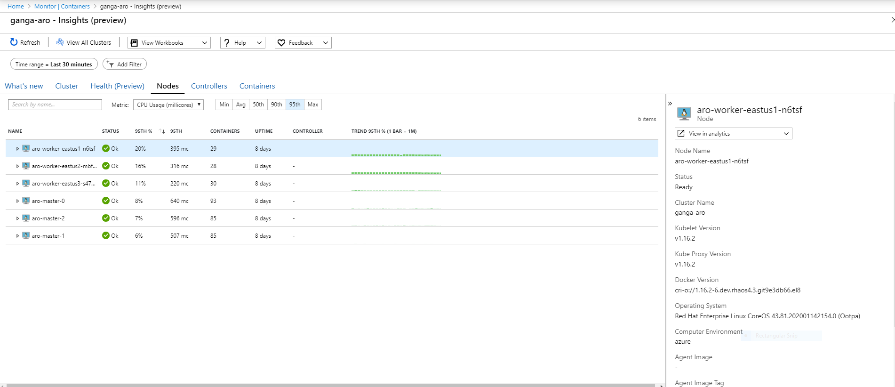
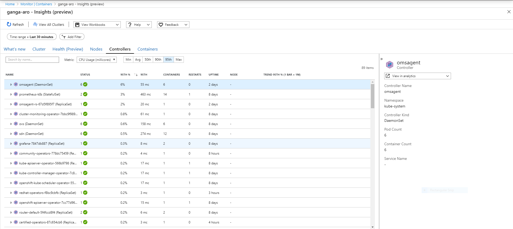
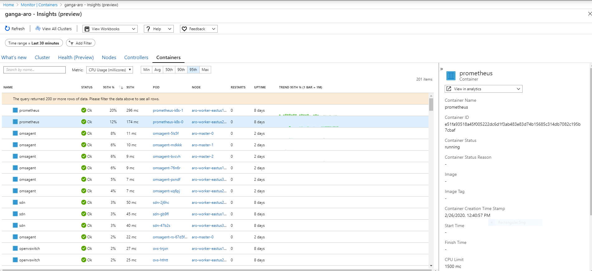
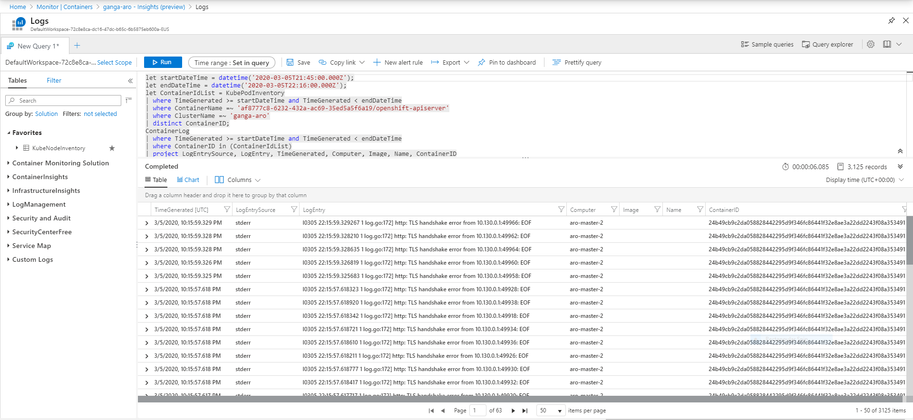

# Azure Monitor integration for Azure Red Hat OpenShift 4.3

This article describes how to enable the private preview of Azure Monitor for containers for OpenShift 4.3 clusters hosted on-prem or in any cloud environment. The same instructions also apply to enable monitoring for Azure Red Hat OpenShift (ARO) 4.3 clusters.  

## Prerequisites

- [Azure CLI](https://docs.microsoft.com/en-us/cli/azure/install-azure-cli?view=azure-cli-latest)
- [Helm 3](https://helm.sh/docs/intro/install/)
- Access to kubeconfig of the kubernetes cluster
- Access to an Azure subscription
- Access to the OpenShift 4.3 cluster to install the Azure Monitor for Containers Helm chart
- Minimum Contributor RBAC role permission on the Azure Subscription  
- Monitoring Agent requires the following outbound ports - and domains to send the monitoring data to the Azure Monitor backend (If blocked by proxy/firewall):
  - *.ods.opinsights.azure.com 443
  - *.oms.opinsights.azure.com 443
  - *.blob.core.windows.net 443
  - dc.services.visualstudio.com 443

## Onboarding

> [!TIP]
> The script uses bash 4 features, so make sure your bash is up to date. You can check your current version with `bash --version`.

### Download the Onboarding script

```bash
curl -LO  https://raw.githubusercontent.com/microsoft/OMS-docker/ci_feature/docs/openshiftV4/onboarding_azuremonitor_for_containers.sh
```

Execute below script with azureSubscriptionId, workspace Region, clusterName, and context of the Kubernetes cluster.

```bash
bash onboarding_azuremonitor_for_containers.sh <azureSubscriptionId> <azureRegionforLogAnalyticsWorkspace> <clusterName> <kubeconfigContextNameOftheCluster>
```

For Example:

```bash
 bash onboarding_azuremonitor_for_containers.sh 27ac26cf-a9f0-4908-b300-9a4e9a0fb205 eastus myocp42 admin 
```

## Configure agent data collection

By default, Monitoring Agent collects the {stdout; stderr} container logs of all the containers running in all the namespaces except kube-system.  If you want to configure the container log collection specific to particular namespace(s), you can  refer to https://docs.microsoft.com/en-us/azure/azure-monitor/insights/container-insights-agent-config. Here, you can configure Monitoring agent with desired data collection settings using config map.

## Configure scraping of Prometheus metrics

Azure Monitor for containers scrapes the Prometheus metrics and ingest to the Azure Monitor backend. Refer to https://docs.microsoft.com/en-us/azure/azure-monitor/insights/container-insights-prometheus-integration for the instructions how to configure Prometheus scraping.

After successful onboarding, navigate to https://aka.ms/azmon-containers-hybrid  and select Environment as **"All"** to view your newly onboarded OpenShift v4 cluster.

### Health of Monitored Clusters



### Cluster Health view (CPU, Memory, Node, and Pods)



### Nodes view



### Controllers view



### Containers view



### Container {stdout; stderr} Log view



## Disable Monitoring

If you would like to disable monitoring, you can delete the Azure Monitor for Containers Helm chart using the below command to stop collecting and ingesting monitoring data to Azure Monitor for containers backend.

``` bash
helm del azmon-containers-release-1
```

## Update Monitoring

Rerun the onboarding script as in Onboarding section with the same parameter to get updated to latest Helm chart.

## After Successful Onboarding

Navigate to https://aka.ms/azmon-containers-hybrid and you should be able to see your newly enabled OpenShift/ARO v4 cluster with Health status in the Monitored Clusters Tab  and you can get into deeper insights such as metrics, inventory, and logs etc. by clicking the Cluster column.

## Supported Features

For more information, see https://docs.microsoft.com/en-us/azure/azure-monitor/insights/container-insights-overview for more details on the supported features and functionality.

Contact us via askcoin@microsoft.com  the feedback and questions.

## References

https://docs.microsoft.com/en-us/azure/azure-monitor/insights/container-insights-overview

https://docs.microsoft.com/en-us/azure/azure-monitor/log-query/log-query-overview
