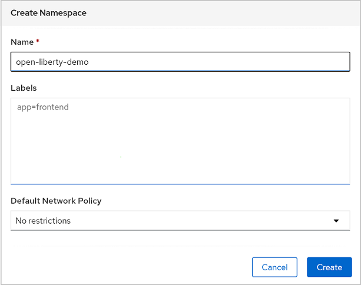
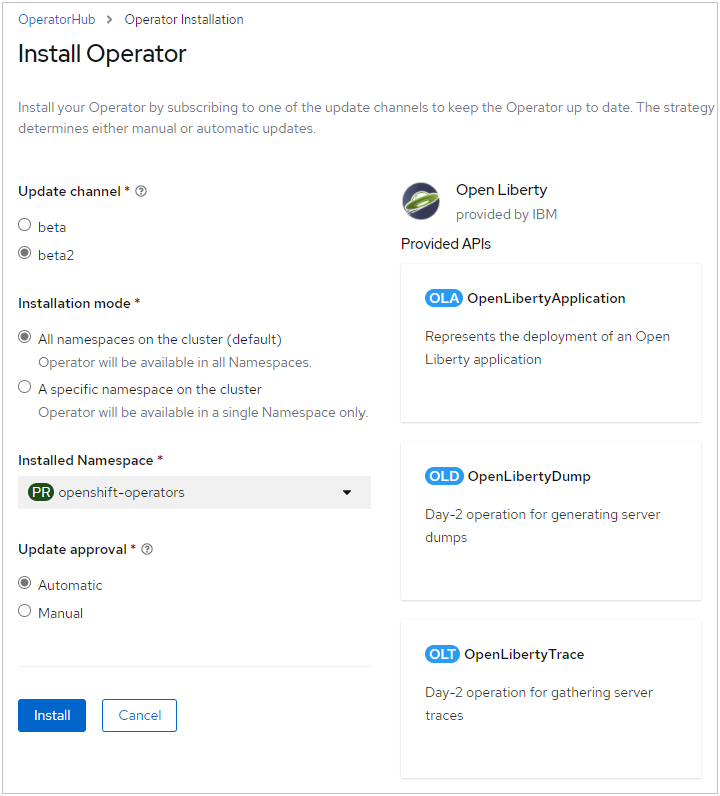
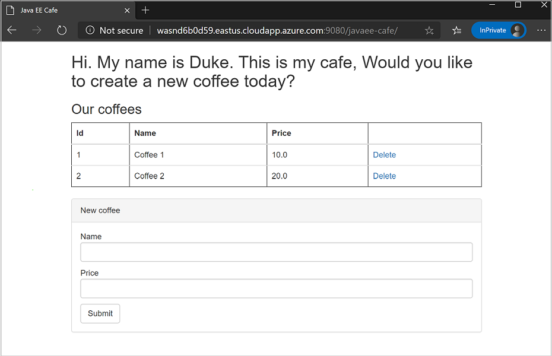
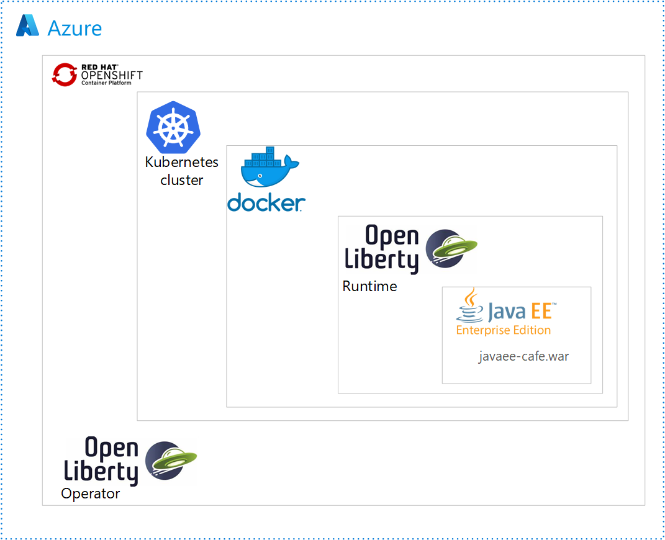

# Deploy a Java application with Open Liberty/WebSphere Liberty on an Azure Red Hat OpenShift 4 cluster

This guide demonstrates how to run your Java, Java EE, [Jakarta EE](https://jakarta.ee/), or [MicroProfile](https://microprofile.io/) application on the Open Liberty/WebSphere Liberty runtime and then deploy the containerized application to an Azure Red Hat OpenShift (ARO) 4 cluster using the Open Liberty Operator. This article will walk you through preparing a Liberty application, building the application Docker image and running the containerized application on an ARO 4 cluster.  For more details on Open Liberty, see [the Open Liberty project page](https://openliberty.io/). For more details on IBM WebSphere Liberty see [the WebSphere Liberty product page](https://www.ibm.com/cloud/websphere-liberty).

[!INCLUDE [aro-support](includes/aro-support.md)]

## Prerequisites

Complete the following prerequisites to successfully walk through this guide.

> [!NOTE]
> Azure Red Hat OpenShift requires a minimum of 40 cores to create and run an OpenShift cluster. The default Azure resource quota for a new Azure subscription does not meet this requirement. To request an increase in your resource limit, see [Standard quota: Increase limits by VM series](../azure-portal/supportability/per-vm-quota-requests.md). Note that the free trial subscription isn't eligible for a quota increase, [upgrade to a Pay-As-You-Go subscription](../cost-management-billing/manage/upgrade-azure-subscription.md) before requesting a quota increase.

1. Prepare a local machine with Unix-like operating system installed (for example, Ubuntu, macOS).
1. Install a Java SE implementation (for example, [AdoptOpenJDK OpenJDK 8 LTS/OpenJ9](https://adoptopenjdk.net/?variant=openjdk8&jvmVariant=openj9)).
1. Install [Maven](https://maven.apache.org/download.cgi) 3.5.0 or higher.
1. Install [Docker](https://docs.docker.com/get-docker/) for your OS.
1. Install [Azure CLI](/cli/azure/install-azure-cli) 2.0.75 or later.
1. Check and install [`envsubst`](https://command-not-found.com/envsubst) if it's not pre-installed in your operating system.
1. Clone the code for this sample on your local system. The sample is on [GitHub](https://github.com/Azure-Samples/open-liberty-on-aro).
1. Follow the instructions in [Create an Azure Red Hat OpenShift 4 cluster](./tutorial-create-cluster.md).

   Though the "Get a Red Hat pull secret" step is labeled as optional, **it is required for this article**.  The pull secret enables your Azure Red Hat OpenShift cluster to find the Open Liberty Operator.

   If you plan to run memory-intensive applications on the cluster, specify the proper virtual machine size for the worker nodes using the `--worker-vm-size` parameter. For example, `Standard_E4s_v3` is the minimum virtual machine size to install the Elasticsearch Operator on a cluster. For more information, see:

   * [Azure CLI to create a cluster](/cli/azure/aro#az_aro_create)
   * [Supported virtual machine sizes for memory optimized](./support-policies-v4.md#memory-optimized)
   * [Prerequisites to install the Elasticsearch Operator](https://docs.openshift.com/container-platform/4.3/logging/cluster-logging-deploying.html#cluster-logging-deploy-eo-cli_cluster-logging-deploying)

1. Connect to the cluster by following the steps in [Connect to an Azure Red Hat OpenShift 4 cluster](./tutorial-connect-cluster.md).
   * Be sure to follow the steps in "Install the OpenShift CLI" because we'll use the `oc` command later in this article.
   * Write down the cluster console URL which looks like `https://console-openshift-console.apps.<random>.<region>.aroapp.io/`.
   * Take note of the `kubeadmin` credentials.

1. Verify you can sign in to the OpenShift CLI with the token for user `kubeadmin`.

### Enable the built-in container registry for OpenShift

The steps in this tutorial create a Docker image which must be pushed to a container registry accessible to OpenShift. The simplest option is to use the built-in registry provided by OpenShift. To enable the built-in container registry, follow the steps in [Configure built-in container registry for Azure Red Hat OpenShift 4](built-in-container-registry.md). Three items from those steps are used in this article.

* The username and password of the Azure AD user for signing in to the OpenShift web console.
* The output of `oc whoami` after following the steps for signing in to the OpenShift CLI.  This value is called **aad-user** for discussion.
* The container registry URL.

Note these items down as you complete the steps to enable the built-in container registry.

### Create an OpenShift namespace for the Java app

1. Sign in to the OpenShift web console from your browser using the `kubeadmin` credentials.
2. Navigate to **Administration** > **Namespaces** > **Create Namespace**.
3. Fill in `open-liberty-demo` for **Name** and select **Create**, as shown next.

   

### Create an administrator for the demo project

Besides image management, the **aad-user** will also be granted administrative permissions for managing resources in the demo project of the ARO 4 cluster.  Sign in to the OpenShift CLI and grant the **aad-user** the necessary privileges by following these steps.

1. Sign in to the OpenShift web console from your browser using the `kubeadmin` credentials.
1. At the right-top of the web console, expand the context menu of the signed-in user, then select **Copy Login Command**.
1. Sign in to a new tab window with the same user if necessary.
1. Select **Display Token**.
1. Copy the value listed below **Login with this token** to the clipboard and run it in a shell, as shown here.
1. Execute the following commands to grant `admin` role to the **aad-user** in namespace `open-liberty-demo`.

   ```bash
   # Switch to project "open-liberty-demo"
   oc project open-liberty-demo
   Now using project "open-liberty-demo" on server "https://api.x8xl3f4y.eastus.aroapp.io:6443".
   # Note: replace "<aad-user>" with the one noted by executing the steps in
   # Configure built-in container registry for Azure Red Hat OpenShift 4
   oc adm policy add-role-to-user admin <aad-user>
   clusterrole.rbac.authorization.k8s.io/admin added: "kaaIjx75vFWovvKF7c02M0ya5qzwcSJ074RZBfXUc34"
   ```

### Install the Open Liberty OpenShift Operator

After creating and connecting to the cluster, install the Open Liberty Operator.  The main starting page for the Open Liberty Operator is on [GitHub](https://github.com/OpenLiberty/open-liberty-operator).

1. Sign in to the OpenShift web console from your browser using the `kubeadmin` credentials.
2. Navigate to **Operators** > **OperatorHub** and search for **Open Liberty Operator**.
3. Select **Open Liberty Operator** from the search results.
4. Select **Install**.
5. In the popup **Create Operator Subscription**, check **All namespaces on the cluster (default)** for **Installation Mode**, **beta** for **Update Channel**, and **Automatic** for **Approval Strategy**:

   
6. Select **Subscribe** and wait a minute or two until the Open Liberty Operator is displayed.
7. Observe the Open Liberty Operator with status of "Succeeded".  If you don't, diagnose and resolve the problem before continuing.
   :::image type="content" source="media/howto-deploy-java-liberty-app/open-liberty-operator-installed.png" alt-text="Installed Operators showing Open Liberty is installed.":::

## Prepare the Liberty application

We'll use a Java EE 8 application as our example in this guide. Open Liberty is a [Java EE 8 full profile](https://javaee.github.io/javaee-spec/javadocs/) compatible server, so it can easily run the application.  Open Liberty is also [Jakarta EE 8 full profile compatible](https://jakarta.ee/specifications/platform/8/apidocs/).

### Run the application on Open Liberty

To run the application on Open Liberty, you need to create an Open Liberty server configuration file so that the [Liberty Maven plugin](https://github.com/OpenLiberty/ci.maven#liberty-maven-plugin) can package the application for deployment. The Liberty Maven plugin is not required to deploy the application to OpenShift.  However, we'll use it in this example with Open Liberty’s developer (dev) mode.  Developer mode lets you easily run the application locally. Complete the following steps on your local computer.

1. Copy `2-simple/src/main/liberty/config/server.xml` to `1-start/src/main/liberty/config`, overwriting the existing zero-length file. This `server.xml` configures the Open Liberty server with Java EE features.
1. Copy `2-simple/pom.xml` to `1-start/pom.xml`.  This step adds the `liberty-maven-plugin` to the POM.
1. Change directory to `1-start` of your local clone.
1. Run `mvn clean package` in a console to generate a war package `javaee-cafe.war` in the directory `./target`.
1. Run `mvn liberty:dev` to start Open Liberty in dev mode.
1. Wait until the server starts. The console output should end with the following message:

   ```Text
   [INFO] CWWKM2015I: Match number: 1 is [6/10/20 10:26:09:517 CST] 00000022 com.ibm.ws.kernel.feature.internal.FeatureManager            A CWWKF0011I: The defaultServer server is ready to run a smarter planet. The defaultServer server started in 6.447 seconds..
   [INFO] Press the Enter key to run tests on demand. To stop the server and quit dev mode, use Ctrl-C or type 'q' and press the Enter key.
   [INFO] Source compilation was successful.
   ```

1. Open `http://localhost:9080/` in your browser to visit the application home page. The application will look similar to the following image:

   
1. Press **Control-C** to stop the application and Open Liberty server.

The directory `2-simple` of your local clone shows the Maven project with the above changes already applied.

## Prepare the application image

To deploy and run your Liberty application on an ARO 4 cluster, containerize your application as a Docker image using [Open Liberty container images](https://github.com/OpenLiberty/ci.docker) or [WebSphere Liberty container images](https://github.com/WASdev/ci.docker).

### Build application image

Complete the following steps to build the application image:

1. Change directory to `2-simple` of your local clone.
2. Run `mvn clean package` to package the application.
3. Run one of the following commands to build the application image.
   * Build with Open Liberty base image:

     ```bash
     # Build and tag application image. This will cause Docker to pull the necessary Open Liberty base images.
     docker build -t javaee-cafe-simple:1.0.0 --pull .
     ```

   * Build with WebSphere Liberty base image:

     ```bash
     # Build and tag application image. This will cause Docker to pull the necessary WebSphere Liberty base images.
     docker build -t javaee-cafe-simple:1.0.0 --pull --file=Dockerfile-wlp .
     ```

### Run the application locally with Docker

Before deploying the containerized application to a remote cluster, run with your local Docker to verify whether it works:

1. Run `docker run -it --rm -p 9080:9080 javaee-cafe-simple:1.0.0` in your console.
2. Wait for Liberty server to start and the application to deploy successfully.
3. Open `http://localhost:9080/` in your browser to visit the application home page.
4. Press **Control-C** to stop the application and Liberty server.

### Push the image to the container image registry

When you're satisfied with the state of the application, push it to the built-in container image registry by following the instructions below.

#### Log in to the OpenShift CLI as the Azure AD user

1. Sign in to the OpenShift web console from your browser using the credentials of an Azure AD user.

   1. Use an InPrivate, Incognito or other equivalent browser window feature to sign in to the console.
   1. Select **openid**

   > [!NOTE]
   > Take note of the username and password you use to sign in here. This username and password will function as an administrator for other actions in this and other articles.
1. Sign in with the OpenShift CLI by using the following steps.  For discussion, this process is known as `oc login`.
   1. At the right-top of the web console, expand the context menu of the signed-in user, then select **Copy Login Command**.
   1. Sign in to a new tab window with the same user if necessary.
   1. Select **Display Token**.
   1. Copy the value listed below **Login with this token** to the clipboard and run it in a shell, as shown here.

       ```bash
       oc login --token=XOdASlzeT7BHT0JZW6Fd4dl5EwHpeBlN27TAdWHseob --server=https://api.aqlm62xm.rnfghf.aroapp.io:6443
       Logged into "https://api.aqlm62xm.rnfghf.aroapp.io:6443" as "kube:admin" using the token provided.

       You have access to 57 projects, the list has been suppressed. You can list all projects with 'oc projects'

       Using project "default".
       ```

#### Push the container image to the container registry for OpenShift

Execute these commands to push the image to the container registry for OpenShift.

```bash
# Note: replace "<Container_Registry_URL>" with the fully qualified name of the registry
Container_Registry_URL=<Container_Registry_URL>

# Create a new tag with registry info that refers to source image
docker tag javaee-cafe-simple:1.0.0 ${Container_Registry_URL}/open-liberty-demo/javaee-cafe-simple:1.0.0

# Sign in to the built-in container image registry
docker login -u $(oc whoami) -p $(oc whoami -t) ${Container_Registry_URL}
```

Successful output will look similar to the following.

```bash
WARNING! Using --password via the CLI is insecure. Use --password-stdin.
Login Succeeded
```

Push image to the built-in container image registry with the following command.

```bash

docker push ${Container_Registry_URL}/open-liberty-demo/javaee-cafe-simple:1.0.0
```

## Deploy application on the ARO 4 cluster

Now you can deploy the sample Liberty application to the Azure Red Hat OpenShift 4 cluster you created earlier when working through the prerequisites.

### Deploy the application from the web console

Because we use the Open Liberty Operator to manage Liberty applications, we need to create an instance of its *Custom Resource Definition*, of type "OpenLibertyApplication". The Operator will then take care of all aspects of managing the OpenShift resources required for deployment.

1. Sign in to the OpenShift web console from your browser using the credentials of the Azure AD user.
1. Expand **Home**, Select **Projects** > **open-liberty-demo**.
1. Navigate to **Operators** > **Installed Operators**.
1. In the middle of the page, select **Open Liberty Operator**.
1. In the middle of the page, select **Open Liberty Application**.  The navigation of items in the user interface mirrors the actual containment hierarchy of technologies in use.
   <!-- Diagram source https://github.com/Azure-Samples/open-liberty-on-aro/blob/master/diagrams/aro-java-containment.vsdx -->
   
1. Select **Create OpenLibertyApplication**
1. Replace the generated yaml with yours, which is located at `<path-to-repo>/2-simple/openlibertyapplication.yaml`.
1. Select **Create**. You'll be returned to the list of OpenLibertyApplications.
1. Select **javaee-cafe-simple**.
1. In the middle of the page, select **Resources**.
1. In the table, select the link for **javaee-cafe-simple** with the **Kind** of **Route**.
1. On the page that opens, select the link below **Location**.

You'll see the application home page opened in the browser.

### Delete the application from the web console

When you're done with the application, follow these steps to delete the application from Open Shift.

1. In the left navigation pane, expand the entry for **Operators**.
1. Select **Installed Operators**.
1. Select **Open Liberty Operator**.
1. In the middle of the page select **Open Liberty Application**.
1. Select the vertical ellipsis (three vertical dots) then select **Delete OpenLiberty Application**.

### Deploy the application from CLI

Instead of using the web console GUI, you can deploy the application from the CLI. If you haven't already done so, download and install the `oc` command-line tool by following Red Hat documentation [Getting Started with the CLI](https://docs.openshift.com/container-platform/4.2/cli_reference/openshift_cli/getting-started-cli.html).

1. Sign in to the OpenShift web console from your browser using the credentials of the Azure AD user.
2. Sign in to the OpenShift CLI with the token for the Azure AD user.
3. Change directory to `2-simple` of your local clone, and run the following commands to deploy your Liberty application to the ARO 4 cluster.  Command output is also shown inline.

   ```bash
   # Switch to namespace "open-liberty-demo" where resources of demo app will belong to
   oc project open-liberty-demo

   Now using (or already on) project "open-liberty-demo" on server "https://api.aqlm62xm.rnfghf.aroapp.io:6443".

   # Create OpenLibertyApplication "javaee-cafe-simple"
   oc create -f openlibertyapplication.yaml

   openlibertyapplication.openliberty.io/javaee-cafe-simple created

   # Check if OpenLibertyApplication instance is created
   oc get openlibertyapplication javaee-cafe-simple

   NAME                 IMAGE                      EXPOSED   RECONCILED   AGE
   javaee-cafe-simple   javaee-cafe-simple:1.0.0   true      True         36s

   # Check if deployment created by Operator is ready
   oc get deployment javaee-cafe-simple

   NAME                 READY   UP-TO-DATE   AVAILABLE   AGE
   javaee-cafe-simple   1/1     1            0           102s
   ```

4. Check to see `1/1` under the `READY` column before you continue.  If not, investigate and resolve the problem before continuing.
5. Discover the host of route to the application with the `oc get route` command, as shown here.

   ```bash
   # Get host of the route
   HOST=$(oc get route javaee-cafe-simple --template='{{ .spec.host }}')
   echo "Route Host: $HOST"

   Route Host: javaee-cafe-simple-open-liberty-demo.apps.aqlm62xm.rnfghf.aroapp.io
   ```

   Once the Liberty application is up and running, open the output of **Route Host** in your browser to visit the application home page.

### Delete the application from CLI

Delete the application from the CLI by executing this command.

```bash
oc delete -f openlibertyapplication.yaml
```

## Clean up resources

Delete the ARO cluster by following the steps in [Tutorial: Delete an Azure Red Hat OpenShift 4 cluster](./tutorial-delete-cluster.md)

## Next steps

In this guide, you learned how to:
> [!div class="checklist"]
>
> * Prepare the Liberty application
> * Build the application image
> * Run the containerized application on an ARO 4 cluster using the GUI and the CLI

You can learn more from references used in this guide:

* [Open Liberty](https://openliberty.io/)
* [Azure Red Hat OpenShift](https://azure.microsoft.com/services/openshift/)
* [Open Liberty Operator](https://github.com/OpenLiberty/open-liberty-operator)
* [Open Liberty Server Configuration](https://openliberty.io/docs/ref/config/)
* [Liberty Maven Plugin](https://github.com/OpenLiberty/ci.maven#liberty-maven-plugin)
* [Open Liberty Container Images](https://github.com/OpenLiberty/ci.docker)
* [WebSphere Liberty Container Images](https://github.com/WASdev/ci.docker)