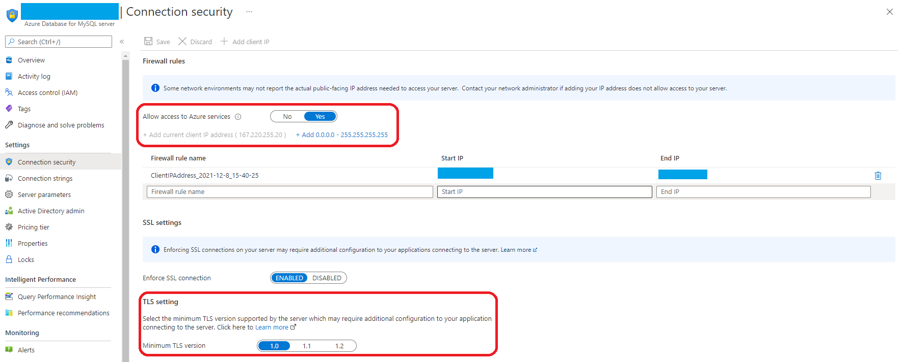

# Deploy a Java application with Open Liberty/WebSphere Liberty on an ARO cluster

This guide demonstrates how to run your Java, Java EE, [Jakarta EE](https://jakarta.ee/), or [MicroProfile](https://microprofile.io/) application on the Open Liberty/WebSphere Liberty runtime and then deploy the containerized application to an Azure Red Hat OpenShift (ARO) 4 cluster using the Open Liberty Operator. This article will walk you through preparing a Liberty application, building the application Docker image and running the containerized application on an ARO 4 cluster. For more information on Open Liberty, see [the Open Liberty project page](https://openliberty.io/).For more information on WebSphere Liberty, see [the WebSphere Liberty product page](https://www.ibm.com/cloud/websphere-liberty).

[!INCLUDE [aro-support](includes/aro-support.md)]

## Prerequisites

[!INCLUDE [aro-quota](includes/aro-quota.md)]

Complete the following prerequisites to successfully walk through this guide.


1. Prepare a local machine with Unix-like operating system installed (for example, Ubuntu, macOS).
1. Install a Java SE implementation (for example, [AdoptOpenJDK OpenJDK 8 LTS/OpenJ9](https://adoptopenjdk.net/?variant=openjdk8&jvmVariant=openj9)).
1. Install [Maven](https://maven.apache.org/download.cgi) 3.5.0 or higher.
1. Install [Docker](https://docs.docker.com/get-docker/) for your OS.
1. Install [Azure CLI](/cli/azure/install-azure-cli) 2.0.75 or later.
1. Check and install [`envsubst`](https://command-not-found.com/envsubst) if it's not pre-installed in your operating system.
1. Clone the code for this sample on your local system. The sample is on [GitHub](https://github.com/Azure-Samples/open-liberty-on-aro).
1. Follow the instructions in [Create an Azure Red Hat OpenShift 4 cluster](./tutorial-create-cluster.md).

   Though the "Get a Red Hat pull secret" step is labeled as optional, **it is required for this article**. The pull secret enables your Azure Red Hat OpenShift cluster to find the Open Liberty Operator.

   If you plan to run memory-intensive applications on the cluster, specify the proper virtual machine size for the worker nodes using the `--worker-vm-size` parameter. For example, `Standard_E4s_v3` is the minimum virtual machine size to install the Elasticsearch Operator on a cluster. For more information, see:

   * [Azure CLI to create a cluster](/cli/azure/aro#az-aro-create)
   * [Supported virtual machine sizes for memory optimized](./support-policies-v4.md#memory-optimized)
   * [Prerequisites to install the Elasticsearch Operator](https://docs.openshift.com/container-platform/4.3/logging/cluster-logging-deploying.html#cluster-logging-deploy-eo-cli_cluster-logging-deploying)

1. Connect to the cluster by following the steps in [Connect to an Azure Red Hat OpenShift 4 cluster](./tutorial-connect-cluster.md).
   * Be sure to follow the steps in "Install the OpenShift CLI" because we'll use the `oc` command later in this article.
   * Write down the cluster console URL. It will look like `https://console-openshift-console.apps.<random>.<region>.aroapp.io/`.
   * Take note of the `kubeadmin` credentials.
   * Be sure to follow the steps in "Connect using the OpenShift CLI" with the `kubeadmin` credentials.

### Install the Open Liberty OpenShift Operator

After creating and connecting to the cluster, install the Open Liberty Operator. The main starting page for the Open Liberty Operator is on [GitHub](https://github.com/OpenLiberty/open-liberty-operator).

1. Sign in to the OpenShift web console from your browser using the `kubeadmin` credentials.
2. Navigate to **Operators** > **OperatorHub** and search for **Open Liberty**.
3. Select **Open Liberty** from the search results.
4. Select **Install**.
5. In the page **Install Operator**, check **beta2** for **Update channel**, **All namespaces on the cluster (default)** for **Installation mode**, and **Automatic** for **Update approval**:

   
6. Select **Install** and wait a minute or two until the installation completes.
7. Observe the Open Liberty Operator is successfully installed and ready for use. If you don't, diagnose and resolve the problem before continuing.

   :::image type="content" source="media/howto-deploy-java-liberty-app/open-liberty-operator-installed.png" alt-text="Installed Operators showing Open Liberty is installed.":::

### Create an OpenShift namespace for the Java app

Follow the instructions below to create an OpenShift namespace for use with your app.

1. Make sure you have signed in to the OpenShift web console from your browser using the `kubeadmin` credentials.
2. Navigate to **Administration** > **Namespaces** > **Create Namespace**.
3. Fill in `open-liberty-demo` for **Name** and select **Create**, as shown next.

   

### Create an Azure Database for MySQL

Follow the instructions below to set up an Azure Database for MySQL for use with your app. If your application doesn't require a database, you can skip this section.

1. Create a single database in Azure SQL Database by following the steps in: [Quickstart: Create an Azure Database for MySQL server by using the Azure portal](../mysql/quickstart-create-mysql-server-database-using-azure-portal.md). Return to this document after creating the database.
    > [!NOTE]
    >
    > * At the **Basics** step, write down the ***Server name**.mysql.database.azure.com*, **Server admin login** and **Password**.

2. Once your database is created, open **your SQL server** > **Connection security** and complete the following settings:
   1. Set **Allow access to Azure services** to **Yes**.
   2. Select **Add current client IP address**. 
   3. Set **Minimal TLS Version** to **>1.0** and select **Save**.

   

3. Open **your SQL database** > **Connection strings** > Select **JDBC**. Write down the **Port number** following sql server address. For example, **3306** is the port number in the example below.

   ```text
   String url ="jdbc:mysql://<Server name>.mysql.database.azure.com:3306/{your_database}?useSSL=true&requireSSL=false"; myDbConn = DriverManager.getConnection(url, "<Server admin login>", {your_password});
   ```

4. If you didn't create a database in above steps, follow the steps in [Quickstart: Create an Azure Database for MySQL server by using the Azure portal#connect-to-the-server-by-using-mysqlexe](../mysql/quickstart-create-mysql-server-database-using-azure-portal.md#connect-to-the-server-by-using-mysqlexe) to create one. Return to this document after creating the database.
    > [!NOTE]
    >
    > * Write down the **Database name** you created.

## Prepare the Liberty application

We'll use a Java EE 8 application as our example in this guide. Open Liberty is a [Java EE 8 full profile](https://javaee.github.io/javaee-spec/javadocs/) compatible server, so it can easily run the application. Open Liberty is also [Jakarta EE 8 full profile compatible](https://jakarta.ee/specifications/platform/8/apidocs/).

### Run the application on Open Liberty

To run the application on Open Liberty, you need to create an Open Liberty server configuration file so that the [Liberty Maven plugin](https://github.com/OpenLiberty/ci.maven#liberty-maven-plugin) can package the application for deployment. The Liberty Maven plugin is not required to deploy the application to OpenShift. However, we'll use it in this example with Open Liberty’s developer (dev) mode. Developer mode lets you easily run the application locally. Complete the following steps on your local computer.

# [with DB connection](#tab/with-mysql-devc)

Follow the steps in this section to prepare the sample application for later use in this article. These steps use Maven and the `liberty-maven-plugin`. To learn more about the `liberty-maven-plugin`, see [Building a web application with Maven](https://openliberty.io/guides/maven-intro.html).

#### Check out the application

Clone the sample code for this guide. The sample is on [GitHub](https://github.com/Azure-Samples/open-liberty-on-aro).
There are three samples in the repository. We will use *open-liberty-on-aro/3-integration/connect-db/mysql*. Here is the file structure of the application.

```
open-liberty-on-aro/3-integration/connect-db/mysql
├─ src/main/
│  ├─ aro/
│  │  ├─ db-secret.yaml
│  │  ├─ openlibertyapplication.yaml
│  ├─ docker/
│  │  ├─ Dockerfile
│  │  ├─ Dockerfile-local
│  │  ├─ Dockerfile-wlp
│  │  ├─ Dockerfile-wlp-local
│  ├─ liberty/config/
│  │  ├─ server.xml
│  ├─ java/
│  ├─ resources/
│  ├─ webapp/
├─ pom.xml
```

The directories *java*, *resources*, and *webapp* contain the source code of the sample application. The code declares and uses a data source named `jdbc/JavaEECafeDB`.

In the *aro* directory, we placed two deployment files. *db-secret.xml* is used to create [Secrets](https://docs.openshift.com/container-platform/4.6/nodes/pods/nodes-pods-secrets.html) with DB connection credentials. The file *openlibertyapplication.yaml* is used to deploy the application image.

In the *docker* directory, we placed four Dockerfiles. *Dockerfile-local* is used for local debugging, and *Dockerfile* is used to build the image for an ARO deployment. These two files work with Open Liberty. *Dockerfile-wlp-local* and *Dockerfile-wlp* are also used for local debugging and to build the image for an ARO deployment respectively, but instead work with WebSphere Liberty.

In the *liberty/config* directory, the *server.xml* is used to configure the DB connection for the Open Liberty and WebSphere Liberty cluster.

#### Build project

Now that you have gathered the necessary properties, you can build the application. The POM file for the project reads many properties from the environment.

```bash
cd <path-to-your-repo>/open-liberty-on-aro/3-integration/connect-db/mysql

# The following variables will be used for deployment file generation
export DB_SERVER_NAME=<Server name>.mysql.database.azure.com
export DB_PORT_NUMBER=3306
export DB_NAME=<Database name>
export DB_USER=<Server admin username>@<Server name>
export DB_PASSWORD=<Server admin password>
export NAMESPACE=open-liberty-demo

mvn clean install
```

#### Test your application locally

Use the `liberty:devc` command to run and test the project locally before dealing with any Azure complexity. For more information on `liberty:devc`, see the [Liberty Plugin documentation](https://github.com/OpenLiberty/ci.maven/blob/main/docs/dev.md#devc-container-mode).
In the sample application, we've prepared Dockerfile-local and Dockerfile-wlp-local for use with `liberty:devc`.

1. Start your local docker environment if you haven't done so already. The instructions for doing this vary depending on the host operating system.

1. Start the application in `liberty:devc` mode

   ```bash
   cd <path-to-your-repo>/open-liberty-on-aro/3-integration/connect-db/mysql
 
   # If you are running with Open Liberty
   mvn liberty:devc -Ddb.server.name=${DB_SERVER_NAME} -Ddb.port.number=${DB_PORT_NUMBER} -Ddb.name=${DB_NAME} -Ddb.user=${DB_USER} -Ddb.password=${DB_PASSWORD} -Ddockerfile=target/Dockerfile-local
  
   # If you are running with WebSphere Liberty
   mvn liberty:devc -Ddb.server.name=${DB_SERVER_NAME} -Ddb.port.number=${DB_PORT_NUMBER} -Ddb.name=${DB_NAME} -Ddb.user=${DB_USER} -Ddb.password=${DB_PASSWORD} -Ddockerfile=target/Dockerfile-wlp-local
   ```

1. Verify the application works as expected. You should see a message similar to `[INFO] [AUDIT] CWWKZ0003I: The application javaee-cafe updated in 1.930 seconds.` in the command output if successful. Go to `http://localhost:9080/` in your browser and verify the application is accessible and all functions are working.

1. Press `Ctrl+C` to stop `liberty:devc` mode.

# [without DB connection](#tab/without-mysql-dev)

1. Copy `2-simple/src/main/liberty/config/server.xml` to `1-start/src/main/liberty/config`, overwriting the existing zero-length file. This `server.xml` configures the Open Liberty server with Java EE features.
1. Copy `2-simple/pom.xml` to `1-start/pom.xml`. This step adds the `liberty-maven-plugin` to the POM.
1. Change directory to `1-start` of your local clone.
1. Run `mvn clean package` in a console to generate a war package `javaee-cafe.war` in the directory `./target`.
1. Run `mvn liberty:dev` to start Open Liberty in dev mode.
1. Wait until the server starts. The console output should end with the following message:

   ```Text
   [INFO] CWWKM2015I: Match number: 1 is [6/10/20 10:26:09:517 CST] 00000022 com.ibm.ws.kernel.feature.internal.FeatureManager            A CWWKF0011I: The defaultServer server is ready to run a smarter planet. The defaultServer server started in 6.447 seconds..
   [INFO] Press the Enter key to run tests on demand. To stop the server and quit dev mode, use Ctrl-C or type 'q' and press the Enter key.
   [INFO] Source compilation was successful.
   ```

1. Open `http://localhost:9080/` in your browser to visit the application home page. The application will look similar to the following image:

   
1. Press **Control-C** to stop the application and Open Liberty server.

The directory `2-simple` of your local clone shows the Maven project with the above changes already applied.

---

## Prepare the application image

To deploy and run your Liberty application on an ARO 4 cluster, containerize your application as a Docker image using [Open Liberty container images](https://github.com/OpenLiberty/ci.docker) or [WebSphere Liberty container images](https://github.com/WASdev/ci.docker).

Complete the following steps to build the application image:

# [with DB connection](#tab/with-mysql-image)

### Build the application and push to the image stream

Since you have already successfully run the app in the Liberty Docker container, you're going to build the image remotely on the cluster by executing the following commands.

1. Make sure you have already signed in to the OpenShift CLI using the `kubeadmin` credentials.
1. Identify the source directory and Dockerfile.

   ```bash
   cd <path-to-your-repo>/open-liberty-on-aro/3-integration/connect-db/mysql
   
   # Fetch maven artifactId as image name, maven build version as image version
   IMAGE_NAME=$(mvn -q -Dexec.executable=echo -Dexec.args='${project.artifactId}' --non-recursive exec:exec)
   IMAGE_VERSION=$(mvn -q -Dexec.executable=echo -Dexec.args='${project.version}' --non-recursive exec:exec)
   cd <path-to-your-repo>/open-liberty-on-aro/3-integration/connect-db/mysql/target

   # If you are building with Open Liberty base image, the existing Dockerfile is ready for you

   # If you are building with WebSphere Liberty base image, uncomment and execute the following two commands to rename Dockerfile-wlp to Dockerfile
   # mv Dockerfile Dockerfile.backup
   # mv Dockerfile-wlp Dockerfile
   ```

1. Create an image stream.

   ```bash
   oc create imagestream ${IMAGE_NAME}
   ```

1. Create a build configuration which specifies the image stream tag of the build output.

   ```bash
   oc new-build --name ${IMAGE_NAME}-config --binary --strategy docker --to ${IMAGE_NAME}:${IMAGE_VERSION}
   ```

1. Start the build to upload local contents, containerize, and output to the image stream tag specified before.

   ```bash
   oc start-build ${IMAGE_NAME}-config --from-dir . --follow
   ```

# [without DB connection](#tab/without-mysql-mage)

### Build and run the application locally with Docker

Before deploying the containerized application to a remote cluster, build and run with your local Docker to verify whether it works:

1. Change directory to `2-simple` of your local clone.
1. Run `mvn clean package` to package the application.
1. Run one of the following commands to build the application image.
   * Build with Open Liberty base image:

     ```bash
     # Build and tag application image. This will cause Docker to pull the necessary Open Liberty base images.
     docker build -t javaee-cafe-simple:1.0.0 --pull .
     ```

   * Build with WebSphere Liberty base image:

     ```bash
     # Build and tag application image. This will cause Docker to pull the necessary WebSphere Liberty base images.
     docker build -t javaee-cafe-simple:1.0.0 --pull --file=Dockerfile-wlp .
     ```

1. Run `docker run -it --rm -p 9080:9080 javaee-cafe-simple:1.0.0` in your console.
1. Wait for Liberty server to start and the application to deploy successfully.
1. Open `http://localhost:9080/` in your browser to visit the application home page.
1. Press **Control-C** to stop the application and Liberty server.

### Build the application and push to the image stream

When you're satisfied with the state of the application, you're going to build the image remotely on the cluster by executing the following commands.

1. Make sure you have already signed in to the OpenShift CLI using the `kubeadmin` credentials.
1. Identity the source directory and the Dockerfile.

   ```bash
   cd <path-to-your-repo>/open-liberty-on-aro/2-simple

   # If you are building with Open Liberty base image, the existing Dockerfile is ready for you

   # If you are building with WebSphere Liberty base image, uncomment and execute the following two commands to rename Dockerfile-wlp to Dockerfile
   # mv Dockerfile Dockerfile.backup
   # mv Dockerfile-wlp Dockerfile
   ```

1. Create an image stream.

   ```bash
   oc create imagestream javaee-cafe-simple
   ```

1. Create a build configuration which specifies the image stream tag of the build output.

   ```bash
   oc new-build --name javaee-cafe-simple-config --binary --strategy docker --to javaee-cafe-simple:1.0.0
   ```

1. Start the build to upload local contents, containerize, and output to the image stream tag specified before.

   ```bash
   oc start-build javaee-cafe-simple-config --from-dir . --follow
   ```

---

## Deploy application on the ARO 4 cluster

Now you can deploy the sample Liberty application to the Azure Red Hat OpenShift 4 cluster you created earlier when working through the prerequisites.

# [with DB from web console](#tab/with-mysql-deploy-console)

### Deploy the application from the web console

Because we use the Open Liberty Operator to manage Liberty applications, we need to create an instance of its *Custom Resource Definition*, of type "OpenLibertyApplication". The Operator will then take care of all aspects of managing the OpenShift resources required for deployment.

1. Sign in to the OpenShift web console from your browser using the `kubeadmin` credentials.
1. Expand **Home**, Select **Projects** > **open-liberty-demo**.
1. Navigate to **Operators** > **Installed Operators**.
1. In the middle of the page, select **Open Liberty Operator**.
1. In the middle of the page, select **Open Liberty Application**. The navigation of items in the user interface mirrors the actual containment hierarchy of technologies in use.
   <!-- Diagram source https://github.com/Azure-Samples/open-liberty-on-aro/blob/master/diagrams/aro-java-containment.vsdx -->
   
1. Select **Create OpenLibertyApplication**
1. Replace the generated yaml with yours, which is located at `<path-to-repo>/3-integration/connect-db/mysql/target/openlibertyapplication.yaml`.
1. Select **Create**. You'll be returned to the list of OpenLibertyApplications.
1. Navigate to **Workloads** > **Secrets**.
1. Select **Create** > From YAML.
1. Replace the generated yaml with yours, which is located at `<path-to-repo>/3-integration/connect-db/mysql/target/db-secret.yaml`.
1. Select **Create**. You'll be returned to the Secret details page.
1. Select **Add Secret to workload**, then select **javaee-cafe-mysql** from the dropdown box, then select **Save**.
1. Navigate to **Operators** > **Installed Operators** > **Open Liberty Operator** > **Open Liberty Application**.
1. Select **javaee-cafe-mysql**.
1. In the middle of the page, select **Resources**.
1. In the table, select the link for **javaee-cafe-mysql** with the **Kind** of **Route**.
1. On the page that opens, select the link below **Location**.

You'll see the application home page opened in the browser.

# [with DB from CLI](#tab/with-mysql-deploy-cli)

### Deploy the application from CLI

Instead of using the web console GUI, you can deploy the application from the CLI. If you haven't already done so, download and install the `oc` command-line tool by following the steps in Red Hat documentation: [Getting Started with the CLI](https://docs.openshift.com/container-platform/4.2/cli_reference/openshift_cli/getting-started-cli.html).

Now you can deploy the sample Liberty application to the ARO 4 cluster with the following steps.

1. Make sure you have already signed in to the OpenShift CLI using the `kubeadmin` credentials.
1. Run the following commands to deploy the application.
   ```bash
   # Change directory to "<path-to-repo>/3-integration/connect-db/mysql/target"
   cd <path-to-repo>/3-integration/connect-db/mysql/target

   # Change project to "open-liberty-demo"
   oc project open-liberty-demo 
   
   # Create DB secret
   oc create -f db-secret.yaml

   # Create the deployment
   oc create -f openlibertyapplication.yaml

   # Check if OpenLibertyApplication instance is created
   oc get openlibertyapplication ${IMAGE_NAME}

   # Check if deployment created by Operator is ready
   oc get deployment ${IMAGE_NAME}

   # Get host of the route
   HOST=$(oc get route ${IMAGE_NAME} --template='{{ .spec.host }}')
   echo "Route Host: $HOST"
   ```
Once the Liberty application is up and running, open the output of **Route Host** in your browser to visit the application home page.


# [without DB from web console](#tab/without-mysql-deploy-console)

### Deploy the application from the web console

Because we use the Open Liberty Operator to manage Liberty applications, we need to create an instance of its *Custom Resource Definition*, of type "OpenLibertyApplication". The Operator will then take care of all aspects of managing the OpenShift resources required for deployment.

1. Sign in to the OpenShift web console from your browser using the `kubeadmin` credentials.
1. Expand **Home**, Select **Projects** > **open-liberty-demo**.
1. Navigate to **Operators** > **Installed Operators**.
1. In the middle of the page, select **Open Liberty Operator**.
1. In the middle of the page, select **Open Liberty Application**. The navigation of items in the user interface mirrors the actual containment hierarchy of technologies in use.
   <!-- Diagram source https://github.com/Azure-Samples/open-liberty-on-aro/blob/master/diagrams/aro-java-containment.vsdx -->
   
1. Select **Create OpenLibertyApplication**
1. Replace the generated yaml with yours, which is located at `<path-to-repo>/2-simple/openlibertyapplication.yaml`.
1. Select **Create**. You'll be returned to the list of OpenLibertyApplications.
1. Select **javaee-cafe-simple**.
1. In the middle of the page, select **Resources**.
1. In the table, select the link for **javaee-cafe-simple** with the **Kind** of **Route**.
1. On the page that opens, select the link below **Location**.

You'll see the application home page opened in the browser.

### Delete the application from the web console

When you're done with the application, follow these steps to delete the application from Open Shift.

1. In the left navigation pane, expand the entry for **Operators**.
1. Select **Installed Operators**.
1. Select **Open Liberty Operator**.
1. In the middle of the page select **Open Liberty Application**.
1. Select the vertical ellipsis (three vertical dots) then select **Delete OpenLiberty Application**.

# [without DB from CLI](#tab/without-mysql-deploy-cli)

### Deploy the application from CLI

Instead of using the web console GUI, you can deploy the application from the CLI. If you haven't already done so, download and install the `oc` command-line tool by following Red Hat documentation [Getting Started with the CLI](https://docs.openshift.com/container-platform/4.2/cli_reference/openshift_cli/getting-started-cli.html).

1. Make sure you have already signed in to the OpenShift CLI using the `kubeadmin` credentials.
1. Change directory to `2-simple` of your local clone, and run the following commands to deploy your Liberty application to the ARO 4 cluster. Command output is also shown inline.

   ```bash
   # Switch to namespace "open-liberty-demo" where resources of demo app will belong to
   oc project open-liberty-demo

   Now using (or already on) project "open-liberty-demo" on server "https://api.aqlm62xm.rnfghf.aroapp.io:6443".

   # Create OpenLibertyApplication "javaee-cafe-simple"
   oc create -f openlibertyapplication.yaml

   openlibertyapplication.openliberty.io/javaee-cafe-simple created

   # Check if OpenLibertyApplication instance is created
   oc get openlibertyapplication javaee-cafe-simple

   NAME                 IMAGE                      EXPOSED   RECONCILED   AGE
   javaee-cafe-simple   javaee-cafe-simple:1.0.0   true      True         36s

   # Check if deployment created by Operator is ready
   oc get deployment javaee-cafe-simple

   NAME                 READY   UP-TO-DATE   AVAILABLE   AGE
   javaee-cafe-simple   1/1     1            0           102s
   ```

1. Check to see `1/1` under the `READY` column before you continue. If not, investigate and resolve the problem before continuing.
1. Discover the host of route to the application with the `oc get route` command, as shown here.

   ```bash
   # Get host of the route
   HOST=$(oc get route javaee-cafe-simple --template='{{ .spec.host }}')
   echo "Route Host: $HOST"

   Route Host: javaee-cafe-simple-open-liberty-demo.apps.aqlm62xm.rnfghf.aroapp.io
   ```

   Once the Liberty application is up and running, open the output of **Route Host** in your browser to visit the application home page.

### Delete the application from CLI

Delete the application from the CLI by executing this command.

```bash
oc delete -f openlibertyapplication.yaml
```
---

## Clean up resources

Delete the ARO cluster by following the steps in [Tutorial: Delete an Azure Red Hat OpenShift 4 cluster](./tutorial-delete-cluster.md)

## Next steps

In this guide, you learned how to:
> [!div class="checklist"]
>
> * Prepare the Liberty application
> * Build the application image
> * Run the containerized application on an ARO 4 cluster using the GUI and the CLI

You can learn more from references used in this guide:

* [Open Liberty](https://openliberty.io/)
* [Azure Red Hat OpenShift](https://azure.microsoft.com/services/openshift/)
* [Open Liberty Operator](https://github.com/OpenLiberty/open-liberty-operator)
* [Open Liberty Server Configuration](https://openliberty.io/docs/ref/config/)
* [Liberty Maven Plugin](https://github.com/OpenLiberty/ci.maven#liberty-maven-plugin)
* [Open Liberty Container Images](https://github.com/OpenLiberty/ci.docker)
* [WebSphere Liberty Container Images](https://github.com/WASdev/ci.docker)