# Deploy an application to Azure Red Hat OpenShift using OpenShift Serverless

In this article, you deploy an application to an Azure Red Hat OpenShift cluster using [OpenShift Serverless](https://www.openshift.com/learn/topics/serverless). OpenShift Serverless helps developers to deploy and run applications that will scale up or scale to zero on-demand, eliminating resource consumption when not in use.

Application code can be packaged in a container along with the appropriate runtimes, and the serverless functionality will start the application containers when they are triggered by an event. Applications can be triggered by various event sources, such as events from your own applications, cloud services from multiple providers, Software as a Service (SaaS) systems and other services.

Managing all aspects of deploying any container in a serverless fashion is built directly into the OpenShift interface. Developers can visually identify which events are driving the launch of their containerized applications, with multiple ways to modify the event parameters. OpenShift Serverless applications can be integrated with other OpenShift services, such as OpenShift Pipelines, Service Mesh, and Monitoring, delivering a complete serverless application development and deployment experience.

## Before you begin

[!INCLUDE [aro-howto-beforeyoubegin](includes/aro-howto-before-you-begin.md)]

### Install the Knative command-line tool (kn)

You can download the latest release of the CLI appropriate to your machine from <https://github.com/knative/client/releases/>

If you're running the commands on the Azure Cloud Shell, download the latest Knative CLI for Linux.

```azurecli-interactive
cd ~
wget https://github.com/knative/client/releases/download/v0.22.0/kn-linux-amd64

mkdir knative
chmod +x kn-linux-amd64
mv kn-linux-amd64 knative/kn
echo 'export PATH=$PATH:~/knative' >> ~/.bashrc && source ~/.bashrc
```

### Launch the web console

Find out the cluster web console URL by running:

```azurecli-interactive
 az aro show \
    --name <cluster name> \
    --resource-group <resource group> \
    --query "consoleProfile.url" -o tsv
```

You should get a URL similar to this one.

```output
https://console-openshift-console.apps.wzy5hg7x.eastus.aroapp.io/
```

Launch the console URL in a browser and login using the `kubeadmin` credentials.


## Install the OpenShift Serverless operator

Once you're logged in to the OpenShift web console, make sure you're in the *Administrator* perspective. Open the *Operator Hub* and look for the **OpenShift Serverless** operator and select it.

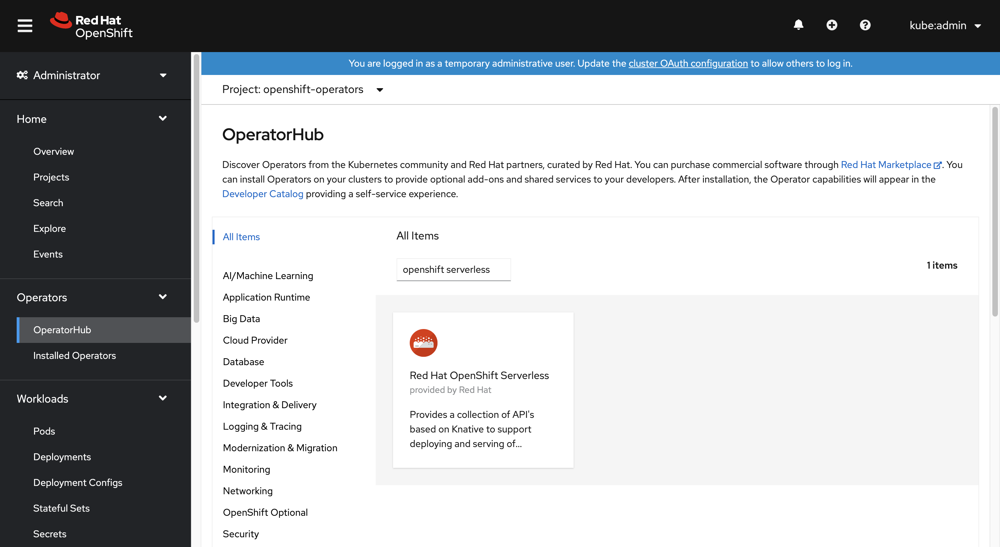

Next, open the operator installation page by clicking on **Install**.

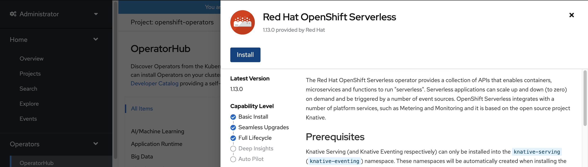

Choose the appropriate *Update Channel* for your Azure Red Hat OpenShift's cluster version and install the operator into the `openshift-serverless` namespace. Scroll down and click **Install**.

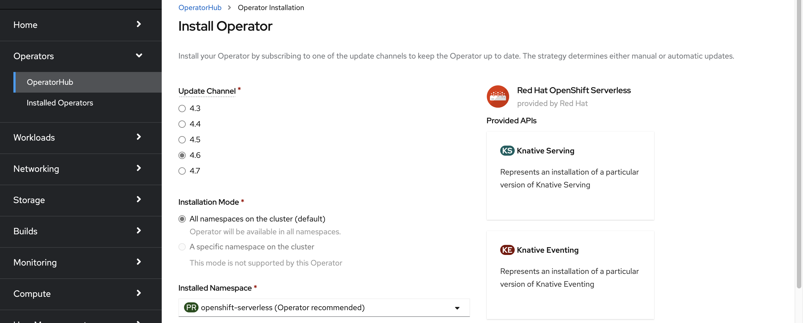

In a few minutes, the status page should reflect that the operator is installed and is ready for use. Click on the **View Operator** button to proceed.

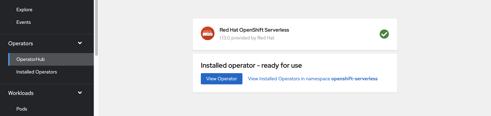

## Install Knative Serving

The capability to run any container in a serverless fashion on OpenShift Serverless is possible by using upstream Knative. Knative extends Kubernetes to provide a set of components for deploying, running, and managing modern applications using the serverless methodology.

### Create an instance of the Knative Serving

Switch to the `knative-serving` namespace by clicking on project drop-down list on the top left, then under *Provided APIs*, click on **Create Instance** in the *Knative Serving* card.

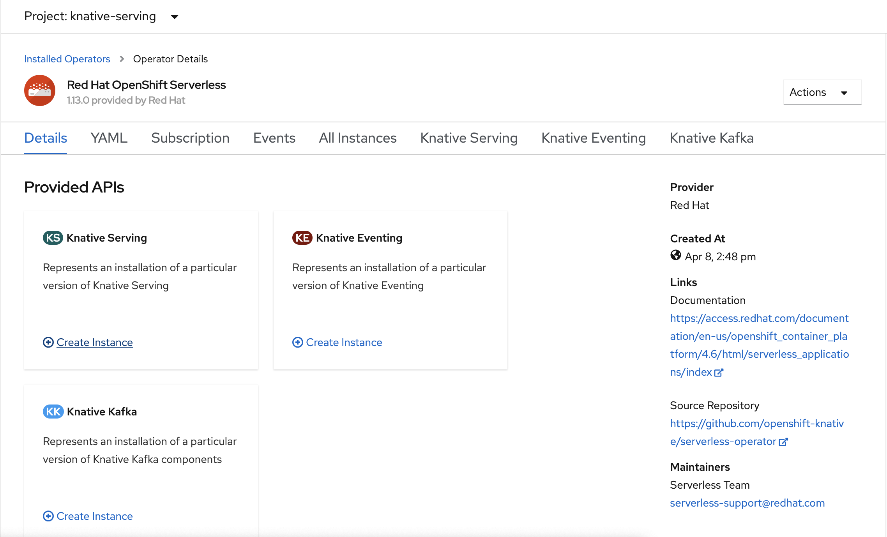

Keep the defaults, and scroll down in the *Create Knative Serving* page to click on the **Create** button.

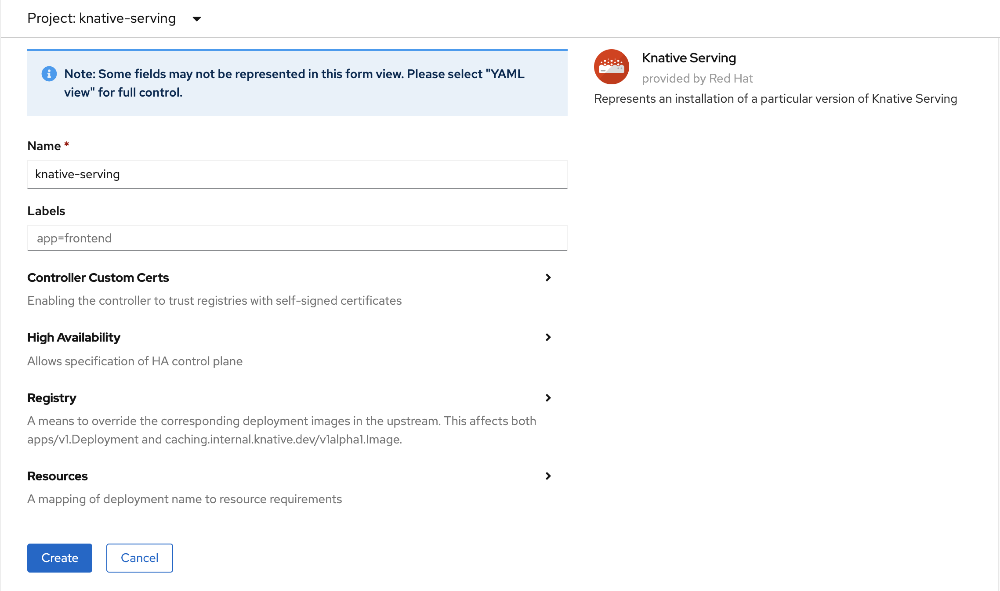

Wait until the *Status* column shows **Ready** then OpenShift Serverless should be installed and you're ready to create an OpenShift Serverless project.

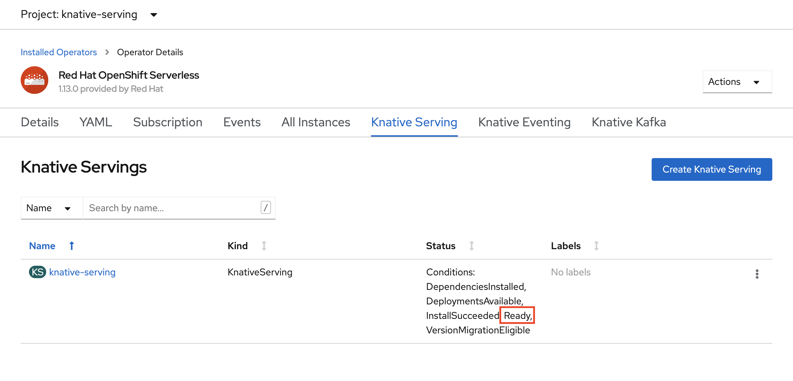

## Create a serverless project

To create a new project called `demoserverless`, run the command:

```azurecli-interactive
oc new-project demoserverless
```

You should see an output similar to:

```output
Now using project "demoserverless" on server "https://api.wzy5hg7x.eastus.aroapp.io:6443".

You can add applications to this project with the 'new-app' command. For example, try:

    oc new-app django-psql-example

to build a new example application in Python. Or use kubectl to deploy a simple Kubernetes application:

    kubectl create deployment hello-node --image=gcr.io/hello-minikube-zero-install/hello-node
```

Switch to the *Developer* perspective instead of the *Administrator* perspective in the left-hand side menu and select `demoserverless` in the list of projects. You should then be at the *Topology* page for the project.

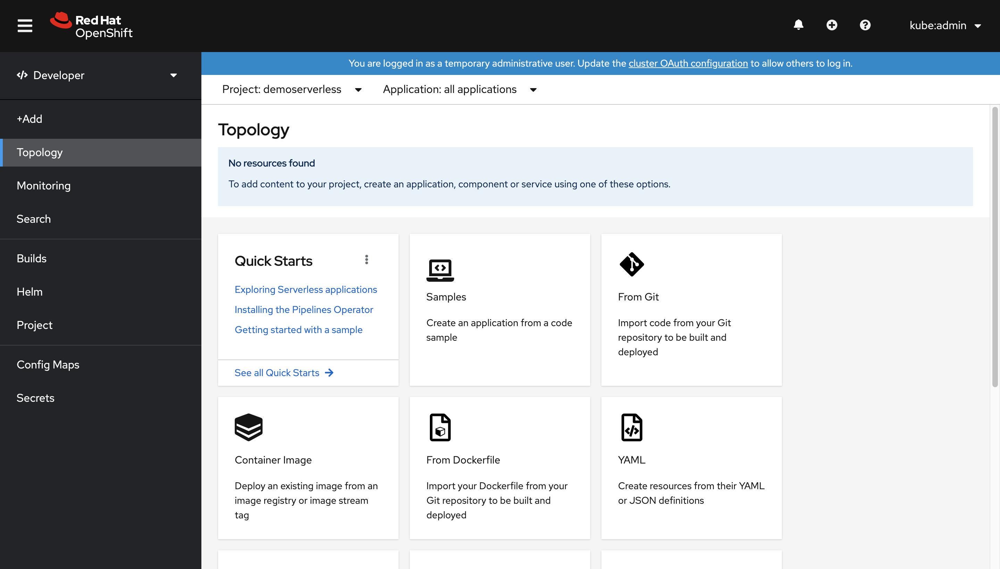

## Deploying using the web console

From the options presented for deploying an application, select *From Git*. This will land you on the *Import from Git* page. Use `https://github.com/sclorg/django-ex.git` as the **Git Repo URL**. The sample web application is implemented using the Python programming language.

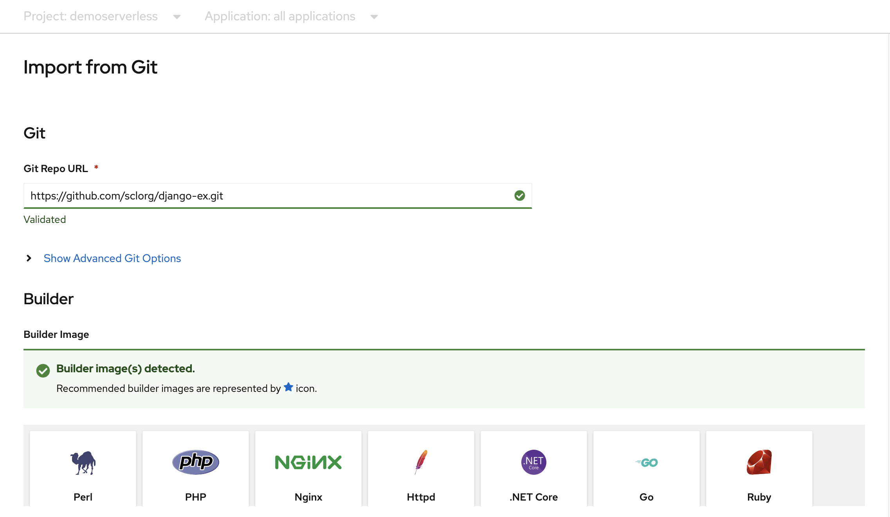

> [!NOTE]
> OpenShift detects that this is a Python project and selects the appropriate builder image.

Scroll down to *Resources* and make sure that **Knative Service** is selected as the resource type to generate. This action will create a Knative Service, a type of deployment that enables OpenShift Serverless scaling to zero when idle.

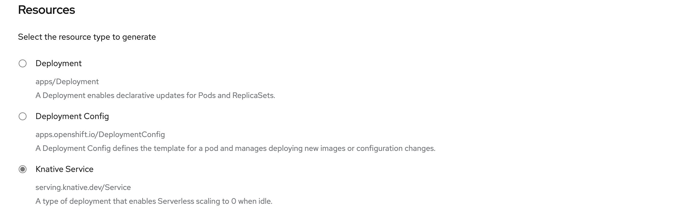


When you're ready, at the bottom of the page click on **Create**. This will create resources to manage the build and deployment of the application. You'll then be redirected to the topology overview for the project.

The topology overview provides a visual representation of the application you've deployed. With this view, you can see the overall application structure.

Wait for the build to complete. It may take a few minutes. After the build completes, a green checkmark appears in the lower-left corner of the service.


## See your application scale

From the *Display Options* list at the top of the Topology view, click *Pod Count*. Wait for the Pod count to scale down to zero Pods. Scaling down may take a few minutes.

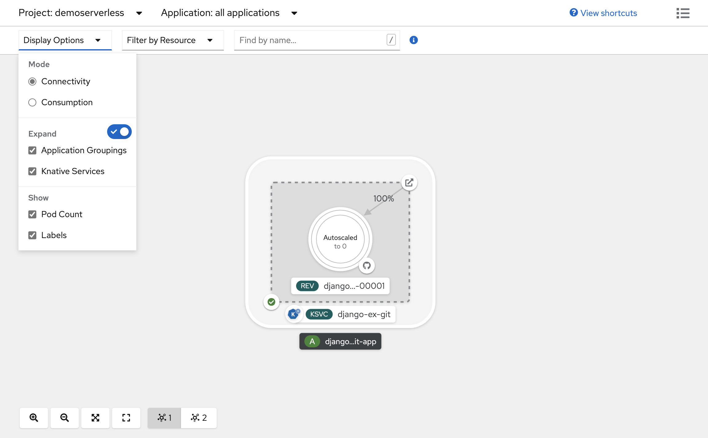

Click the *Open URL* icon in the upper-right corner of the Knative Service panel. The application opens in a new tab. Close the new browser tab and return to the Topology view. In the Topology view, you can see that your application scaled up to one Pod to accommodate your request. After a few minutes, your application scales back down to zero Pods.


## Forcing a new revision and setting traffic distribution

With each update to the configuration of a service, a new revision for the service is created. The service route points all traffic to the latest ready revision by default. You can change this behavior by defining which revision gets a portion of the traffic. Knative services allow for traffic mapping, which means that revisions of a service can be mapped to an allocated portion of traffic. Traffic mapping also provides an option to create unique URLs for particular revisions.

In the *Topology*, click the revision inside your service to view its details. The badges under the Pod ring and at the top of the detail panel should be `(REV)`. In the side panel, within the *Resources* tab, scroll down and click on the configuration associated with your service.

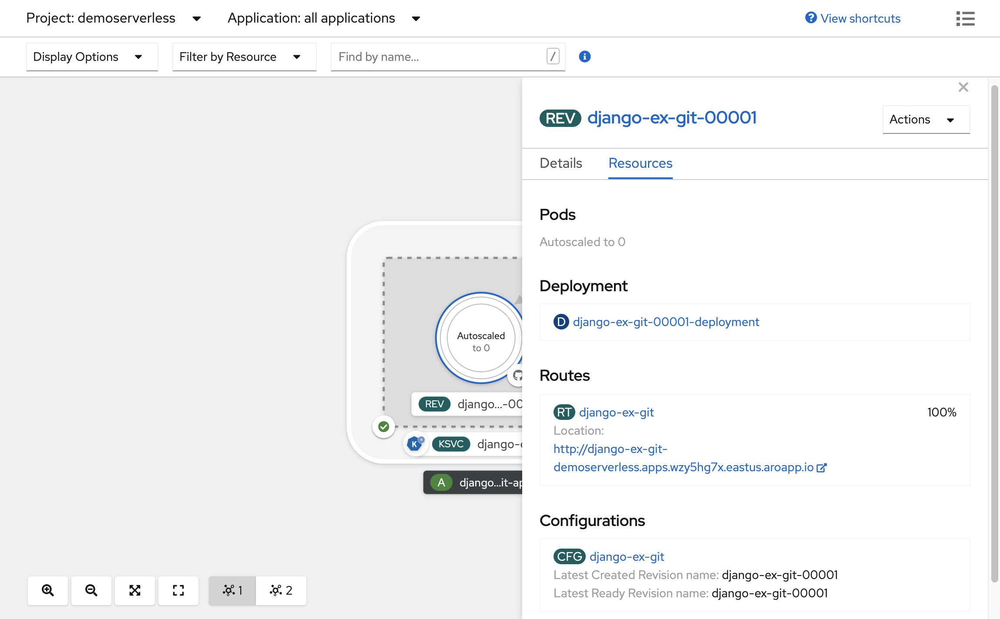

Force a configuration update by switching to the *YAML* tab and scrolling down to edit the value of `timeoutSeconds` to be `301`. Click on **Save** to save the updated configuration. In a real world scenario, such configuration update can also be triggered by updating the container image tag.

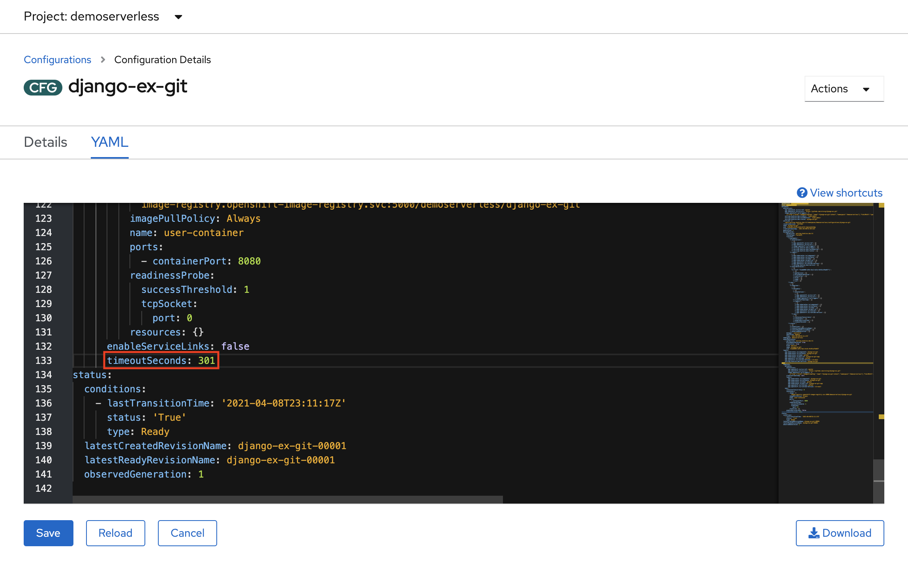

Go back to the *Topology* view, you'll see that a new revision has been deployed. Click the service ending with the badge `(KSVC)` and click on the **Set Traffic Distribution** button, you should now be able to divide the traffic between the different revisions of the service.

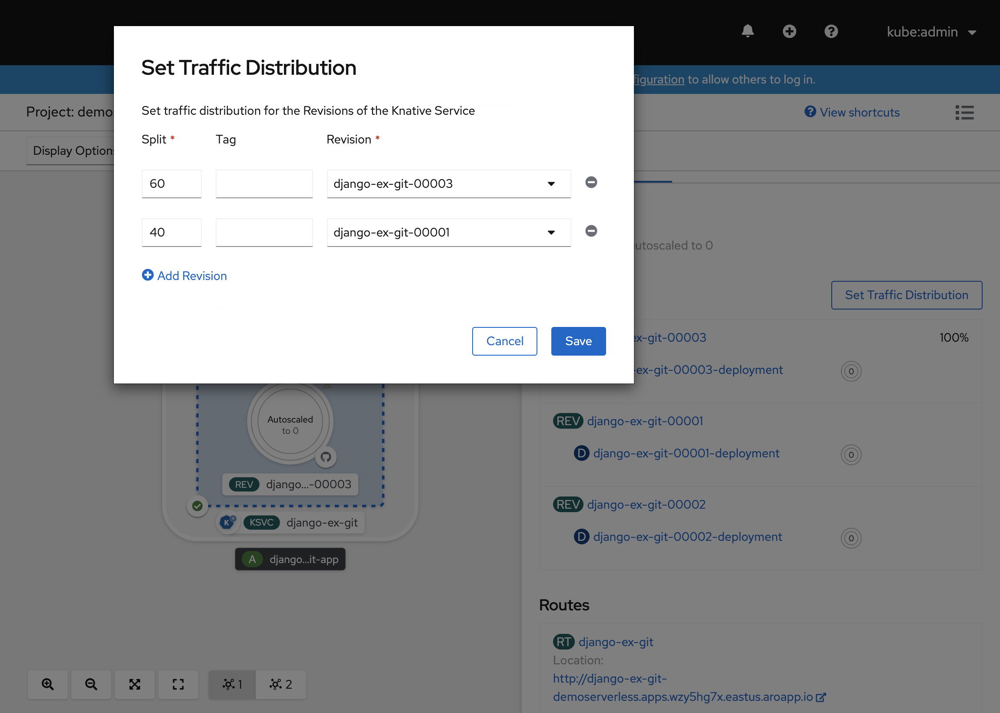

The *Topology* view will now show you how traffic is distributed between the two revisions.


## Using the Knative command-line tool (kn)

In the prior steps, you've used the OpenShift web console to create and deploy an application to OpenShift Serverless. Since OpenShift Serverless is running Knative underneath, you can also use the Knative command-line tool (kn) to create Knative services.

> [!NOTE]
> If you haven't installed the `kn` CLI already, make sure to follow the steps in the prerequisites section of this article. Also make sure that you've logged in using the OpenShift command-line tool `oc`.

We're going to use a container image that is already built at `quay.io/rhdevelopers/knative-tutorial-greeter`.

### Deploy a service

To deploy the service, run the following command:

```azurecli-interactive
kn service create greeter \
--image quay.io/rhdevelopers/knative-tutorial-greeter:quarkus \
--namespace demoserverless \
--revision-name greeter-v1
```

You'll see an output similar to the below.

```output
Creating service 'greeter' in namespace 'demoserverless':

  0.044s The Route is still working to reflect the latest desired specification.
  0.083s ...
  0.114s Configuration "greeter" is waiting for a Revision to become ready.
 10.420s ...
 10.489s Ingress has not yet been reconciled.
 10.582s Waiting for load balancer to be ready
 10.763s Ready to serve.

Service 'greeter' created to latest revision 'greeter-v1' is available at URL:
http://greeter-demoserverless.apps.wzy5hg7x.eastus.aroapp.io
```

You can retrieve a list of routes in the project by running:

```azurecli-interactive
kn route list
```

You'll get back a list of routes in the namespace. Open the URL in a browser to see the deployed service.

```output
NAME      URL                                                            READY
greeter   http://greeter-demoserverless.apps.wzy5hg7x.eastus.aroapp.io   True
```

### Deploy a new version of the service

Deploy a new version of the application by running the command below, passing the `:latest` image tag and an environment variable `MESSAGE_PREFIX`:

```azurecli-interactive
kn service update greeter \
 --image quay.io/rhdevelopers/knative-tutorial-greeter:latest \
 --namespace demoserverless \
 --env MESSAGE_PREFIX=GreeterV2 \
 --revision-name greeter-v2
```

You'll get back a confirmation that a new revision, `greeter-v2` has been deployed.

```output
Updating Service 'greeter' in namespace 'demoserverless':

  5.029s Traffic is not yet migrated to the latest revision.
  5.086s Ingress has not yet been reconciled.
  5.190s Waiting for load balancer to be ready
  5.332s Ready to serve.

Service 'greeter' updated to latest revision 'greeter-v2' is available at URL:
http://greeter-demoserverless.apps.wzy5hg7x.eastus.aroapp.io
```

To view a list of all revisions and their traffic distribution, run the following command:

```azurecli-interactive
kn revision list
```

You'll get a list similar to the below. Note that the new revision is getting 100% of the traffic.

```output
NAME            SERVICE   TRAFFIC   TAGS   GENERATION   AGE     CONDITIONS   READY   REASON
greeter-v2      greeter   100%             2            90s     3 OK / 4     True
greeter-v1      greeter                    1            5m32s   3 OK / 4     True
```

### Blue/green and canary deployments

By default, when a new revision is deployed, it gets 100% of the traffic. Let's say you want to implement a blue/green deployment strategy where you can quickly rollback to the older version of the application. Knative makes this easy.

Update the service to create three traffic tags while sending 100% of the traffic to the

- **current**: points at current deployed version
- **prev**: points at the previous version
- **latest**: always points at the latest version

```azurecli-interactive
kn service update greeter \
   --tag greeter-v2=current \
   --tag greeter-v1=prev \
   --tag @latest=latest
```

You'll get a confirmation similar to the below.

```output
Updating Service 'greeter' in namespace 'demoserverless':

  0.037s Ingress has not yet been reconciled.
  0.121s Waiting for load balancer to be ready
  0.287s Ready to serve.

Service 'greeter' with latest revision 'greeter-v2' (unchanged) is available at URL:
http://greeter-demoserverless.apps.wzy5hg7x.eastus.aroapp.io
```

List the routes using the command below:

```azurecli-interactive
kn route describe greeter
```

You'll get an output showing the URLs for each of the tags along with the traffic distribution.

```output
Name:       greeter
Namespace:  demoserverless
Age:        10m
URL:        http://greeter-demoserverless.apps.wzy5hg7x.eastus.aroapp.io
Service:    greeter

Traffic Targets:
  100%  @latest (greeter-v2) #latest
        URL:  http://latest-greeter-demoserverless.apps.wzy5hg7x.eastus.aroapp.io
    0%  greeter-v1 #prev
        URL:  http://prev-greeter-demoserverless.apps.wzy5hg7x.eastus.aroapp.io
    0%  greeter-v2 #current
        URL:  http://current-greeter-demoserverless.apps.wzy5hg7x.eastus.aroapp.io

[..]
```

Let's say you want to quickly rollback to the previous version, you can update the traffic distribution to send 100% of traffic to the previous tag:

```azurecli-interactive
kn service update greeter --traffic current=0 --traffic prev=100
```

Check again by listing the routes using the command below:

```azurecli-interactive
kn route describe greeter
```

You'll get an output showing 100% of traffic distribution is going to the previous version.

```output
Name:       greeter
Namespace:  demoserverless
Age:        19m
URL:        http://greeter-demoserverless.apps.wzy5hg7x.eastus.aroapp.io
Service:    greeter

Traffic Targets:
    0%  @latest (greeter-v2) #latest
        URL:  http://latest-greeter-demoserverless.apps.wzy5hg7x.eastus.aroapp.io
  100%  greeter-v1 #prev
        URL:  http://prev-greeter-demoserverless.apps.wzy5hg7x.eastus.aroapp.io
    0%  greeter-v2 #current
        URL:  http://current-greeter-demoserverless.apps.wzy5hg7x.eastus.aroapp.io

[..]
```

Play around with the traffic distribution while refreshing the main route (`http://greeter-demoserverless.apps.wzy5hg7x.eastus.aroapp.io` in this case) in your browser.

## Clean up resources

When you're done with the application, you can run the following command to delete the project:

```azurecli-interactive
oc delete project demoserverless
```

You can also delete the cluster by following the instructions in [Tutorial: Delete an Azure Red Hat OpenShift 4 cluster](./tutorial-delete-cluster.md).

## Next steps

In this guide, you learned how to:
> [!div class="checklist"]
>
> * Install the OpenShift Serverless operator and Knative Serving
> * Deploy a serverless project using the web console
> * Deploy a serverless project using the Knative CLI (kn)
> * Configure blue/green deployments and canary deployments using the Knative CLI (kn)

Learn more about how to build and deploy serverless, event-driven applications on Azure Red Hat OpenShift using [OpenShift Serverless](https://www.openshift.com/learn/topics/serverless), follow the [Getting started with OpenShift Serverless](https://docs.openshift.com/container-platform/4.6/serverless/serverless-getting-started.html) documentation and the [Creating and managing serverless applications](https://docs.openshift.com/container-platform/4.6/serverless/serving-creating-managing-apps.html) documentation.
