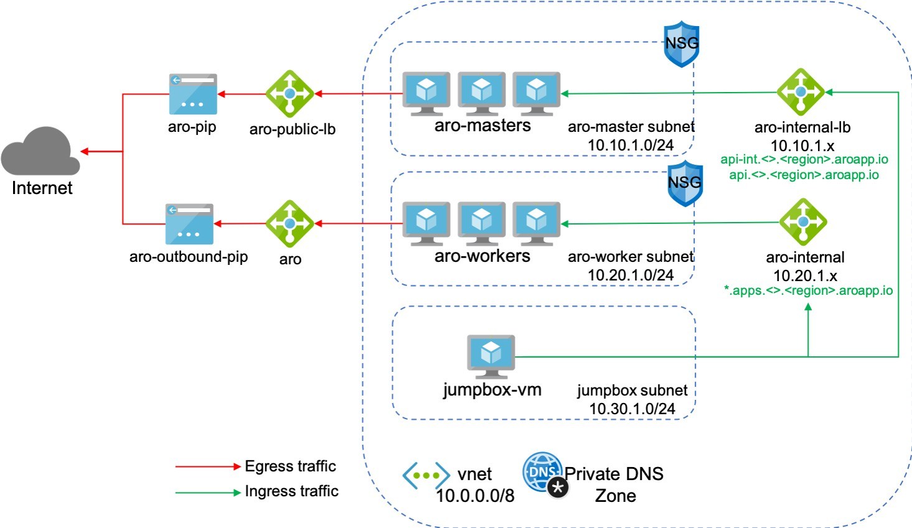
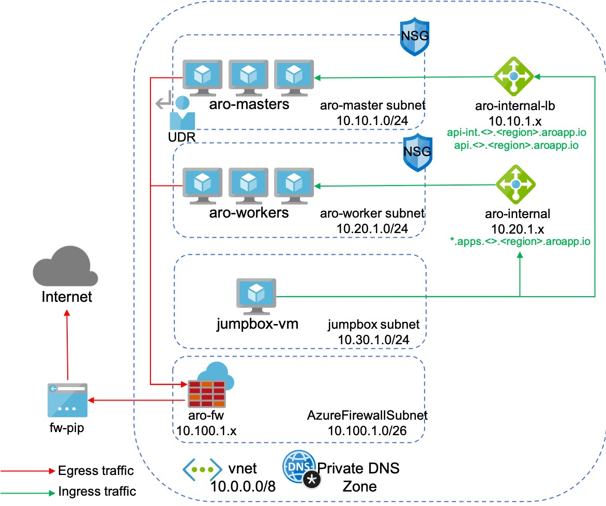

# Control egress traffic for your Azure Red Hat OpenShift (ARO) cluster

This article provides the necessary details that allow you to secure outbound traffic from your Azure Red Hat OpenShift cluster (ARO). With the release of the [Egress Lockdown Feature](./concepts-egress-lockdown.md), all of the required connections for a private cluster are proxied through the service. There are additional destinations that you may want to allow to use features such as Operator Hub, or Red Hat telemetry.  An [example](#private-aro-cluster-setup) is provided at the end showing how to configure these requirements with Azure Firewall. Keep in mind, you can apply this information to Azure Firewall or to any outbound restriction method or appliance.

> [!IMPORTANT]
> Do not attempt these instructions on older ARO clusters if those clusters don't have the Egress Lockdown feature enabled. To enable the Egress Lockdown feature on older ARO clusters, see [Enable Egress Lockdown](./concepts-egress-lockdown.md#enable-egress-lockdown).


## Before you begin

This article assumes that you're creating a new cluster. If you need a basic ARO cluster, see the [ARO quickstart](./tutorial-create-cluster.md).

## Minimum Required FQDN - Proxied through ARO service

This list is based on the list of FQDNs found in the OpenShift docs here: https://docs.openshift.com/container-platform/latest/installing/install_config/configuring-firewall.html

The following FQDNs are proxied through the service, and won't need additional firewall rules. They're here for informational purposes.

| Destination FQDN | Port | Use |
| ----------- | ----------- | ------------- |
| **`arosvc.azurecr.io`** | **HTTPS:443** | Global Internal Private registry for ARO Operators.  Required if you don't allow the service-endpoints Microsoft.ContainerRegistry on your subnets. |
| **`arosvc.$REGION.data.azurecr.io`** | **HTTPS:443** | Regional Internal Private registry for ARO Operators.  Required if you don't allow the service-endpoints Microsoft.ContainerRegistry on your subnets. |
| **`management.azure.com`** | **HTTPS:443** | Used by the cluster to access Azure APIs. |
| **`login.microsoftonline.com`** | **HTTPS:443** | Used by the cluster for authentication to Azure. |
| **`*.monitor.core.windows.net`** | **HTTPS:443** | Used for Microsoft Geneva Monitoring so that the ARO team can monitor the customer's cluster(s). |
| **`*.monitoring.core.windows.net`** | **HTTPS:443** | Used for Microsoft Geneva Monitoring so that the ARO team can monitor the customer's cluster(s). |
| **`*.blob.core.windows.net`** | **HTTPS:443** | Used for Microsoft Geneva Monitoring so that the ARO team can monitor the customer's cluster(s). |
| **`*.servicebus.windows.net`** | **HTTPS:443** | Used for Microsoft Geneva Monitoring so that the ARO team can monitor the customer's cluster(s). |
| **`*.table.core.windows.net`** | **HTTPS:443** | Used for Microsoft Geneva Monitoring so that the ARO team can monitor the customer's cluster(s). |

> [!NOTE] 
> For many customers exposing *.blob, *.table and other large address spaces creates a potential data exfiltration concern. You may want to consider using the [OpenShift Egress Firewall](https://docs.openshift.com/container-platform/latest/networking/openshift_sdn/configuring-egress-firewall.html) to protect applications deployed in the cluster from reaching these destinations and use Azure Private Link for specific application needs.

---

## List of optional FQDNs

### ADDITIONAL CONTAINER IMAGES

- **`registry.redhat.io`**: Used to provide images for things such as Operator Hub. 
- **`*.quay.io`**: May be used to download images from the Red Hat managed Quay registry. Also a possible fall-back target for ARO required system images. If your firewall can't use wildcards, you can find the [full list of subdomains in the Red Hat documentation.](https://docs.openshift.com/container-platform/latest/installing/install_config/configuring-firewall.html)

---

### TELEMETRY

You can opt out of telemetry, but make sure you understand this feature before doing so: https://docs.openshift.com/container-platform/4.12/support/remote_health_monitoring/about-remote-health-monitoring.html
- **`cert-api.access.redhat.com`**: Used for Red Hat telemetry.
- **`api.access.redhat.com`**: Used for Red Hat telemetry.
- **`infogw.api.openshift.com`**: Used for Red Hat telemetry.
- **`https://cloud.redhat.com/api/ingress`**: Used in the cluster for the insights operator that integrates with Red Hat Insights (required in 4.10 and earlier only).
- **`https://console.redhat.com/api/ingress`**: Used in the cluster for the insights operator that integrates with Red Hat Insights.

---

### OTHER POSSIBLE OPENSHIFT REQUIREMENTS

- **`mirror.openshift.com`**: Required to access mirrored installation content and images. This site is also a source of release image signatures.
- **`*.apps.<cluster_name>.<base_domain>`** (OR EQUIVALENT ARO URL): When allowlisting domains, this is used in your corporate network to reach applications deployed in OpenShift, or to access the OpenShift console.
- **`api.openshift.com`**: Used by the cluster for release graph parsing. https://access.redhat.com/labs/ocpupgradegraph/ can be used as an alternative.
- **`registry.access.redhat.com`**: Registry access is required in your VDI or laptop environment to download dev images when using the ODO CLI tool. (This CLI tool is an alternative CLI tool for developers who aren't familiar with kubernetes). https://docs.openshift.com/container-platform/4.6/cli_reference/developer_cli_odo/understanding-odo.html
- **`access.redhat.com`**: Used in conjunction with `registry.access.redhat.com` when pulling images. Failure to add this access could result in an error message.

## ARO integrations

### Azure Monitor container insights

ARO clusters can be monitored using the Azure Monitor container insights extension. Review the pre-requisites and instructions for [enabling the extension](../azure-monitor/containers/container-insights-enable-arc-enabled-clusters.md).


## Private ARO cluster setup
The goal is to secure ARO cluster by routing Egress traffic through an Azure Firewall
### Before:

### After:


## Create a private ARO cluster

### Set up VARS for your environment
```bash

CLUSTER=aro-cluster # Name of your created cluster
RESOURCEGROUP=aro-rg # The name of your resource group where you created the ARO cluster
AROVNET=aro-vnet # The name of your vnet from your created ARO cluster
JUMPSUBNET=jump-subnet
LOCATION=eastus # The location where ARO cluster is deployed

```

### Create a resource group
```azurecli
az group create -g "$RESOURCEGROUP" -l $LOCATION
```

### Create the virtual network
```azurecli
az network vnet create \
  -g $RESOURCEGROUP \
  -n $AROVNET \
  --address-prefixes 10.0.0.0/8
```

### Add two empty subnets to your virtual network
```azurecli
  az network vnet subnet create \
    -g "$RESOURCEGROUP" \
    --vnet-name $AROVNET \
    -n "$CLUSTER-master" \
    --address-prefixes 10.10.1.0/24 \
    --service-endpoints Microsoft.ContainerRegistry

  az network vnet subnet create \
    -g $RESOURCEGROUP \
    --vnet-name $AROVNET \
    -n "$CLUSTER-worker" \
    --address-prefixes 10.20.1.0/24 \
    --service-endpoints Microsoft.ContainerRegistry
```

### Disable network policies for Private Link Service on your virtual network and subnets. This is a requirement for the ARO service to access and manage the cluster.
```azurecli
az network vnet subnet update \
  -g "$RESOURCEGROUP" \
  --vnet-name $AROVNET \
  -n "$CLUSTER-master" \
  --disable-private-link-service-network-policies true
```
### Create a Firewall Subnet
```azurecli
az network vnet subnet create \
    -g "$RESOURCEGROUP" \
    --vnet-name $AROVNET \
    -n "AzureFirewallSubnet" \
    --address-prefixes 10.100.1.0/26
```

## Create a jump-host VM
### Create a jump-subnet
```azurecli
  az network vnet subnet create \
    -g "$RESOURCEGROUP" \
    --vnet-name $AROVNET \
    -n $JUMPSUBNET \
    --address-prefixes 10.30.1.0/24 \
    --service-endpoints Microsoft.ContainerRegistry
```
### Create a jump-host VM
```azurecli
VMUSERNAME=aroadmin

az vm create --name ubuntu-jump \
             --resource-group $RESOURCEGROUP \
             --generate-ssh-keys \
             --admin-username $VMUSERNAME \
             --image Ubuntu2204 \
             --subnet $JUMPSUBNET \
             --public-ip-address jumphost-ip \
             --vnet-name $AROVNET 
```

## Create an Azure Red Hat OpenShift cluster
### Get a Red Hat pull secret (optional)

A Red Hat pull secret enables your cluster to access Red Hat container registries along with other content. This step is optional but recommended.

1. **[Go to your Red Hat OpenShift cluster manager portal](https://cloud.redhat.com/openshift/install/azure/aro-provisioned) and log in.**

   You will need to log in to your Red Hat account or create a new Red Hat account with your business email and accept the terms and conditions.

2. **Click Download pull secret.**

Keep the saved `pull-secret.txt` file somewhere safe - it will be used in each cluster creation.

When running the `az aro create` command, you can reference your pull secret using the `--pull-secret @pull-secret.txt` parameter. Execute `az aro create` from the directory where you stored your `pull-secret.txt` file. Otherwise, replace `@pull-secret.txt` with `@<path-to-my-pull-secret-file`.

If you're copying your pull secret or referencing it in other scripts, format your pull secret as a valid JSON string.

```azurecli
az aro create \
  -g "$RESOURCEGROUP" \
  -n "$CLUSTER" \
  --vnet $AROVNET \
  --master-subnet "$CLUSTER-master" \
  --worker-subnet "$CLUSTER-worker" \
  --apiserver-visibility Private \
  --ingress-visibility Private \
  --pull-secret @pull-secret.txt
```

## Create an Azure Firewall

### Create a public IP Address
```azurecli
az network public-ip create -g $RESOURCEGROUP -n fw-ip --sku "Standard" --location $LOCATION
```
### Update install Azure Firewall extension
```azurecli
az extension add -n azure-firewall
az extension update -n azure-firewall
```

### Create Azure Firewall and configure IP Config
```azurecli
az network firewall create -g $RESOURCEGROUP -n aro-private -l $LOCATION
az network firewall ip-config create -g $RESOURCEGROUP -f aro-private -n fw-config --public-ip-address fw-ip --vnet-name $AROVNET

```

### Capture Azure Firewall IPs for a later use
```azurecli
FWPUBLIC_IP=$(az network public-ip show -g $RESOURCEGROUP -n fw-ip --query "ipAddress" -o tsv)
FWPRIVATE_IP=$(az network firewall show -g $RESOURCEGROUP -n aro-private --query "ipConfigurations[0].privateIPAddress" -o tsv)

echo $FWPUBLIC_IP
echo $FWPRIVATE_IP
```

### Create a UDR and Routing Table for Azure Firewall
```azurecli
az network route-table create -g $RESOURCEGROUP --name aro-udr

az network route-table route create -g $RESOURCEGROUP --name aro-udr --route-table-name aro-udr --address-prefix 0.0.0.0/0 --next-hop-type VirtualAppliance --next-hop-ip-address $FWPRIVATE_IP
```

### Add Application Rules for Azure Firewall
Example rule for telemetry to work. Additional possibilities are listed [here](https://docs.openshift.com/container-platform/4.3/installing/install_config/configuring-firewall.html#configuring-firewall_configuring-firewall):
```azurecli
az network firewall application-rule create -g $RESOURCEGROUP -f aro-private \
 --collection-name 'ARO' \
 --action allow \
 --priority 100 \
 -n 'required' \
 --source-addresses '*' \
 --protocols 'http=80' 'https=443' \
 --target-fqdns 'cert-api.access.redhat.com' 'api.openshift.com' 'api.access.redhat.com' 'infogw.api.openshift.com'
```
Optional rules for Docker images:
```azurecli
az network firewall application-rule create -g $RESOURCEGROUP -f aro-private \
 --collection-name 'Docker' \
 --action allow \
 --priority 200 \
 -n 'docker' \
 --source-addresses '*' \
 --protocols 'http=80' 'https=443' \
 --target-fqdns '*cloudflare.docker.com' '*registry-1.docker.io' 'apt.dockerproject.org' 'auth.docker.io'
```

### Associate ARO Subnets to FW
```azurecli
az network vnet subnet update -g $RESOURCEGROUP --vnet-name $AROVNET --name "$CLUSTER-master" --route-table aro-udr
az network vnet subnet update -g $RESOURCEGROUP --vnet-name $AROVNET --name "$CLUSTER-worker" --route-table aro-udr
```

## Test the configuration from the Jumpbox
These steps work only if you added rules for Docker images. 
### Configure the jumpbox
Log in to a jumpbox VM and install `azure-cli`, `oc-cli`, and `jq` utils. For the installation of openshift-cli, check the Red Hat customer portal.
```bash
#Install Azure-cli
curl -sL https://aka.ms/InstallAzureCLIDeb | sudo bash
#Install jq
sudo apt install jq -y
```
### Log in to the ARO cluster
List cluster credentials:
```bash

# Login to Azure
az login
# Set Vars in Jumpbox
CLUSTER=aro-cluster # Name of your created cluster
RESOURCEGROUP=aro-rg # The name of your resource group where you created the ARO cluster

#Get the cluster credentials
ARO_PASSWORD=$(az aro list-credentials -n $CLUSTER -g $RESOURCEGROUP -o json | jq -r '.kubeadminPassword')
ARO_USERNAME=$(az aro list-credentials -n $CLUSTER -g $RESOURCEGROUP -o json | jq -r '.kubeadminUsername')
```
Get an API server endpoint:
```azurecli
ARO_URL=$(az aro show -n $CLUSTER -g $RESOURCEGROUP -o json | jq -r '.apiserverProfile.url')
```

### Download the oc CLI to the jumpbox
```bash
cd ~
wget https://mirror.openshift.com/pub/openshift-v4/clients/ocp/latest/openshift-client-linux.tar.gz

mkdir openshift
tar -zxvf openshift-client-linux.tar.gz -C openshift
echo 'export PATH=$PATH:~/openshift' >> ~/.bashrc && source ~/.bashrc
```

Log in using `oc login`:
```bash
oc login $ARO_URL -u $ARO_USERNAME -p $ARO_PASSWORD
```

### Run CentOS to test outside connectivity
Create a pod
```bash
cat <<EOF | oc apply -f -
apiVersion: v1
kind: Pod
metadata:
  name: centos
spec:
  containers:
  - name: centos
    image: centos
    ports:
    - containerPort: 80
    command:
    - sleep
    - "3600"
EOF
```
Once the pod is running, exec into it and test outside connectivity.

```bash
oc exec -it centos -- /bin/bash
curl microsoft.com
```

## Access the web console of the private cluster

### Set up ssh forwards commands

```bash
sudo ssh -i $SSH_PATH -L 443:$CONSOLE_URL:443 aroadmin@$JUMPHOST

example:
sudo ssh -i /Users/jimzim/.ssh/id_rsa -L 443:console-openshift-console.apps.d5xm5iut.eastus.aroapp.io:443 aroadmin@104.211.18.56
```

### Modify the etc. hosts file on your local machine
```bash
##
# Host Database
#
127.0.0.1 console-openshift-console.apps.d5xm5iut.eastus.aroapp.io
127.0.0.1 oauth-openshift.apps.d5xm5iut.eastus.aroapp.io
```

### Use sshuttle as another option

[SSHuttle](https://github.com/sshuttle/sshuttle)


## Clean up resources

```azurecli

# Clean up the ARO cluster, vnet, firewall and jumpbox

# Remove udr from master and worker subnets first or will get error when deleting ARO cluster
az network vnet subnet update --vnet-name $AROVNET -n aro-cluster-master -g $RESOURCEGROUP --route-table aro-udr --remove routeTable
az network vnet subnet update --vnet-name $AROVNET -n aro-cluster-worker -g $RESOURCEGROUP --route-table aro-udr --remove routeTable

# Remove ARO Cluster
az aro delete -n $CLUSTER -g $RESOURCEGROUP

# Remove the resource group that contains the firewall, jumpbox and vnet
az group delete -n $RESOURCEGROUP
```
