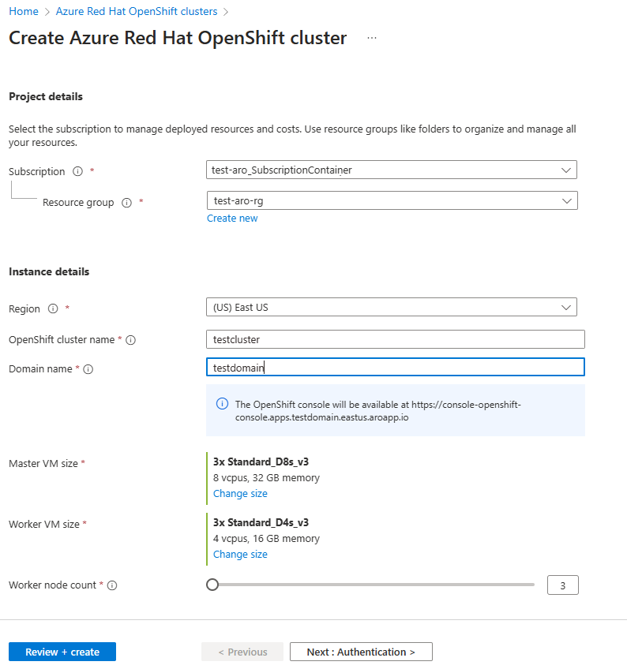
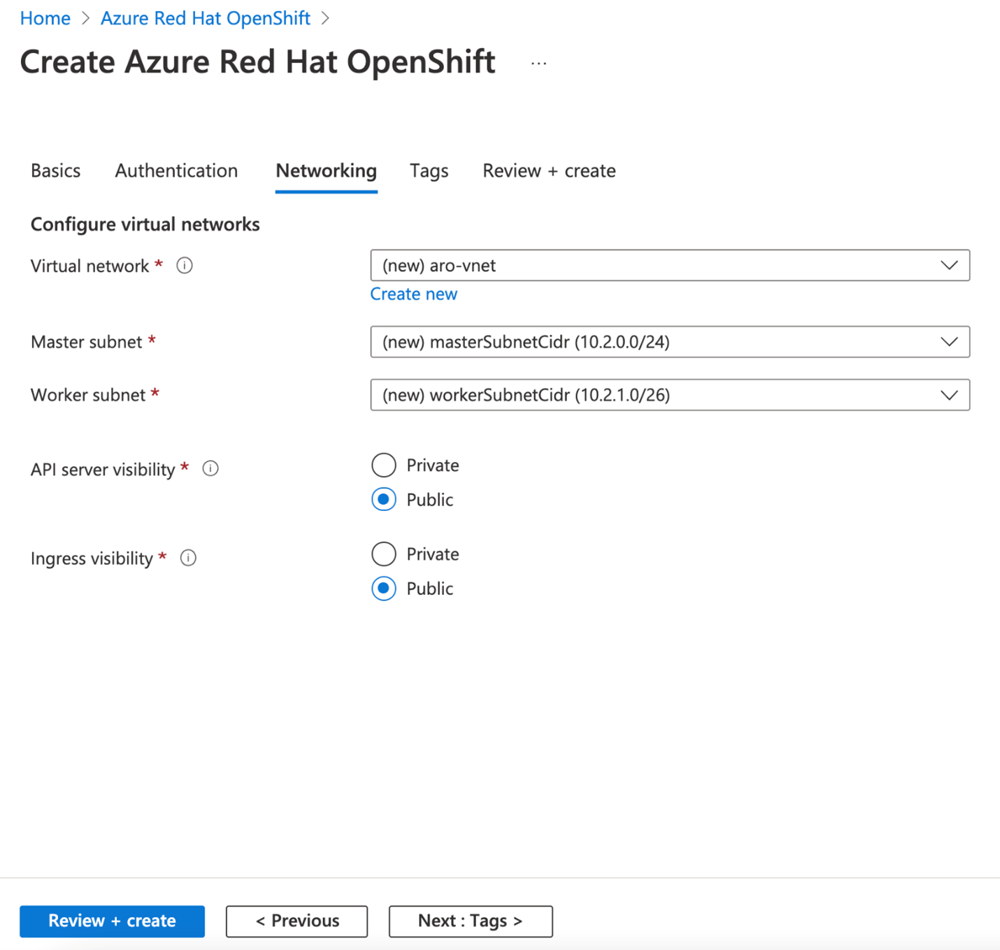
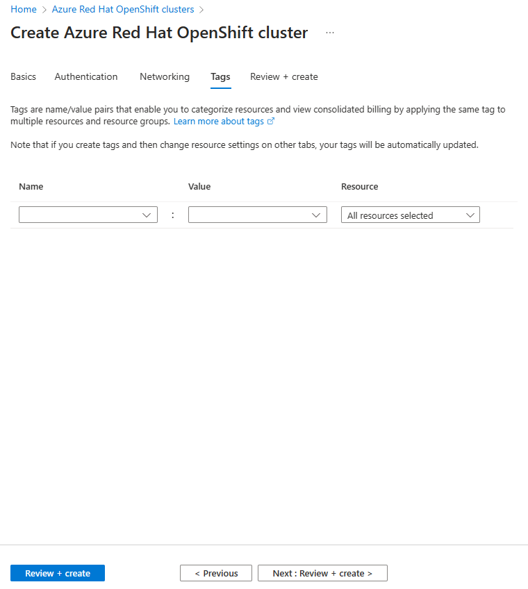
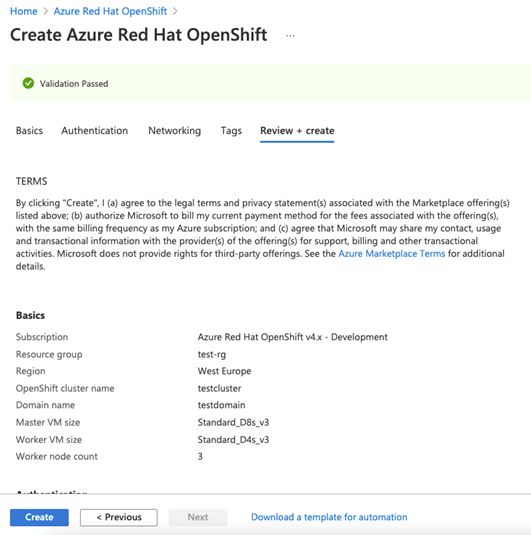

# Quickstart: Deploy an Azure Red Hat OpenShift cluster using the Azure portal  

Azure Red Hat OpenShift is a managed OpenShift service that lets you quickly deploy and manage clusters. In this quickstart, we'll deploy an Azure Red Hat OpenShift cluster using the Azure portal.           

## Prerequisites
Sign in to the [Azure portal](https://portal.azure.com). 

Create a service principal, as explained in [Use the portal to create a Microsoft Entra application and service principal that can access resources](../active-directory/develop/howto-create-service-principal-portal.md). **Be sure to save the client ID and the appID.** 

Register the `Microsoft.RedHatOpenShift` resource provider. For instructions on registering resource providers using Azure portal, see [Register resource provider](../azure-resource-manager/management/resource-providers-and-types.md#register-resource-provider).

## Create an Azure Red Hat OpenShift cluster
1.	On the Azure portal menu or from the **Home** page, select **All Services** under three horizontal bars on the top left hand page.
2.	Search for and select **Azure Red Hat OpenShift clusters**.
3.  Select **Create**.
4.	On the **Basics** tab, configure the following options:
    * **Project details**:
        *	Select an Azure **Subscription**.
        *	Select or create an Azure **Resource group**, such as *myResourceGroup*.
    * **Instance details**:
        * Select a **Region** for the Azure Red Hat OpenShift cluster.
        *	Enter an **OpenShift cluster name**, such as *myAROCluster*.
        *	Enter a **Domain name**.
        *	Select **Master VM Size** and **Worker VM Size**.
        *   Select **Worker node count** (i.e., the number of worker nodes to create). 

     > [!div class="mx-imgBorder"]
     > 
    
    > [!NOTE]
    > The **Domain name** field is pre-populated with a random string. You can either specify a domain name (e.g., *example.com*) or a string/prefix (e.g., *abc*) that will be used as part of the auto-generated DNS name for OpenShift console and API servers. This prefix is also used as part of the name of the resource group that is created to host the cluster VMs if a resource group name is not specified.

5. On the **Authentication** tab, complete the following sections.

    Under **Service principal information**, select either **Create new** or **Existing**. If you choose to use an existing service principal, enter the following information:

   - **Service principal client ID** is your appId. 
   - **Service principal client secret** is the service principal's decrypted Secret value.

    > [!NOTE]
    > If you need to create a service principal, see  [Creating and using a service principal with an Azure Red Hat OpenShift cluster](howto-create-service-principal.md).
    
   Under **Pull secret**, enter the **Red Hat pull secret** (i.e., your cluster's pull secret's decrypted value). If you don't have a pull secret, leave this field blank.

   :::image type="content" source="./media/openshift-service-principal-portal.png" alt-text="Screenshot that shows how to use the Authentication tab with Azure portal to create a service principal." lightbox="./media/openshift-service-principal-portal.png":::

6.	On the **Networking** tab, configure the required options.

       **Note**: Azure Red Hat OpenShift clusters running OpenShift 4 require a virtual network with two empty subnets: one for the control plane and one for worker nodes.

> [!div class="mx-imgBorder"]
> 

7.	On the **Tags** tab, add tags to organize your resources.

> [!div class="mx-imgBorder"]
> 
 
8.	Check **Review + create** and then **Create** when validation completes.   

 
9.	It takes approximately 35 to 45 minutes to create the Azure Red Hat OpenShift cluster. When your deployment is complete, navigate to your resource by either:
    *	Clicking **Go to resource**, or
    *	Browsing to the Azure Red Hat OpenShift cluster resource group and selecting the Azure Red Hat OpenShift resource.
        *	Per example cluster dashboard below: browsing for *myResourceGroup* and selecting *myAROCluster* resource.
