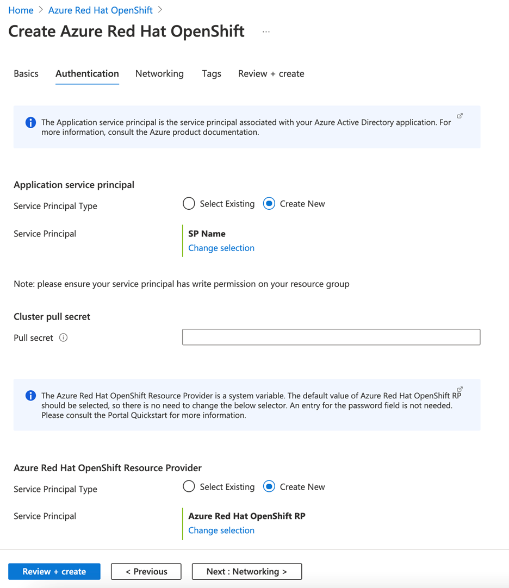

# Quickstart: Deploy an Azure Red Hat OpenShift (ARO) cluster using the Azure portal

Azure Red Hat OpenShift (ARO) is a managed OpenShift service that lets you quickly deploy and manage clusters. In this quickstart, we'll deploy an Azure Red Hat OpenShift cluster using the Azure portal.

## Prerequisites
Sign in to the [Azure portal](https://portal.azure.com).

## Create an Azure Red Hat OpenShift cluster
1.	On the Azure portal menu or from the **Home** page, select **All Services** under three horizontal bars on the top left hand page.
2.	Select **Containers** > **Azure Red Hat OpenShift**.
3.	On the **Basics** page, configure the following options:
    * **Project details**:
        *	Select an **Azure Subscription**.
        *	Select or create an **Azure Resource group**, such as *myResourceGroup*.
    * **Cluster details**:
        * Select a **Region** for the ARO cluster.
        *	Enter a OpenShift **cluster name**, such as *myAROCluster*.
        *	Enter **Domain name**.
        *	Select **Master VM Size** and **Worker VM Size**.

4.	On the **Authentication page**, configure the following options:
    a. Under Application service principal, **Select Existing** or **Create New** from the Service Principal Type selector 
    **Note**: Application service principal is the service principal associated with your Azure Active Directory application. For more information, consult the Azure product     
    documentation 
    b. Under **Cluster pull secret** Enter pull secret
    **Note**: A Red Hat pull secret enables your cluster to access Red Hat container registries along with additional content.
    c. Search for Azure Red Hat Open Shift RP and select that one.
    d. Azure Red Hat OpenShift Resource Provider is a system variable. The default value of the Azure Red Hat OpenShift RP should be selected, so there is no need to change the 
    selector. An entry for the password field is not needed.

5.	On the **Networking** tab make sure to configure:
   **Note**: Azure Red Hat OpenShift clusters running OpenShift 4 require a virtual network with two empty subnets: one for the master and one for worker nodes.

6.	On the **Tags** section, add tags to organize your resources.

 
7.	Click **Review + create** and then **Create** when validation completes.

 
8.	It takes approximately 35- 45 minutes to create the Azure Red Hat OpenShift cluster. When your deployment is complete, navigate to your resource by either:
    *	Clicking **Go to resource**, or
    *	Browsing to the Azure Red Hat OpenShift cluster resource group and selecting the Azure Red Hat OpenShift resource.
        *	Per example cluster dashboard below: browsing for *myResourceGroup* and selecting *myAROCluster* resource.
