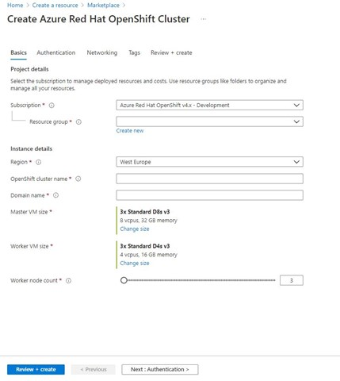
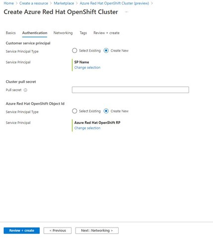
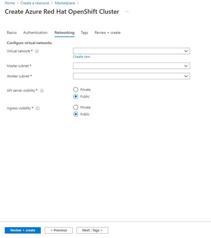
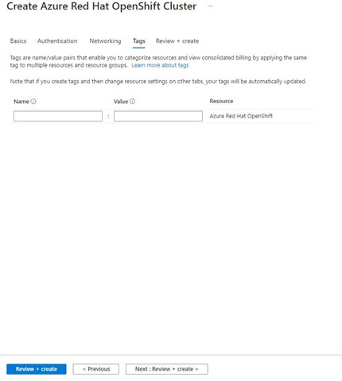
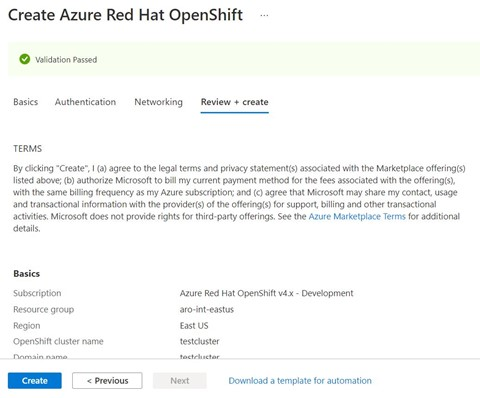

# Quickstart: Deploy an Azure Red Hat OpenShift (ARO) cluster using the Azure portal

Azure Red Hat OpenShift (ARO) is a managed OpenShift service that lets you quickly deploy and manage clusters. In this quickstart, we'll deploy an ARO cluster using the Azure portal.

## Prerequisites
Sign in to the [Azure portal](https://portal.azure.com).

## Create an ARO cluster
1.	On the Azure portal menu or from the **Home** page, select **Create a resource**.
2.	Select **Containers** > **Azure Red Hat OpenShift**.
3.	On the **Basics** page, configure the following options:
    * **Project details**:
        *	Select an **Azure Subscription**.
        *	Select or create an **Azure Resource group**, such as *myResourceGroup*.
    * **Cluster details**:
        * Select a **Region** for the ARO cluster.
        *	Enter a OpenShift **cluster name**, such as *myAROCluster*.
        *	Enter **Domain name**.
        *	Select **Master VM Size** and **Worker VM Size**.

4.	On the **Authentication page**, configure the following options:
    1) Choose **Select Existing** from the Service Principal Type selector (if it is already pre-selected no action is required and you can proceed further on the next steps).
    2) Search for Azure Red Hat Open Shift RP and select that one. 

>[!NOTE]
>Please ignore the "create new" button and other optional fields.

5.	On the **Networking** tab make sure to configure:
    * Virtual network
    * Master subnet
    * Worker subnet
    * API server visibility
    * Ingress visibility

6.	On the **Tags** section, add tags to organize your resources.

 
7.	Click **Review + create** and then **Create** when validation completes.

 
8.	It takes approximately 35- 45 minutes to create the ARO cluster. When your deployment is complete, navigate to your resource by either:
    *	Clicking **Go to resource**, or
    *	Browsing to the ARO cluster resource group and selecting the ARO resource.
        *	Per example cluster dashboard below: browsing for *myResourceGroup* and selecting *myAROCluster* resource.
