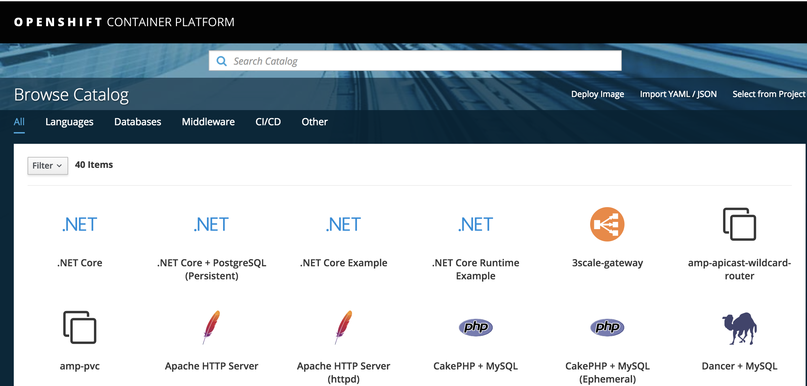

# Tutorial: Create an Azure Red Hat OpenShift cluster

This tutorial is part one of a series. You'll learn how to create a Microsoft Azure Red Hat OpenShift cluster using the Azure CLI, scale it, then delete it to clean up resources.

In part one of the series, you'll learn how to:

> [!div class="checklist"]
> * Create an Azure Red Hat OpenShift cluster

In this tutorial series you learn how to:
> [!div class="checklist"]
> * Create an Azure Red Hat OpenShift cluster
> * [Scale an Azure Red Hat OpenShift cluster](tutorial-scale-cluster.md)
> * [Delete an Azure Red Hat OpenShift cluster](tutorial-delete-cluster.md)

## Prerequisites

> [!IMPORTANT]
> This tutorial requires version 2.0.65 of the Azure CLI.

Before you begin this tutorial:

Make sure that you've [set up your development environment](howto-setup-environment.md), which includes:
- Installing the latest CLI (version 2.0.65 or above)
- Creating a tenant if you don't already have one
- Creating an Azure Application object if you don't already have one
- Creating a security group
- Creating an Active Directory user to sign in to the cluster.

## Step 1: Sign in to Azure

If you're running the Azure CLI locally, open a Bash command shell and  run `az login` to sign in to Azure.

```bash
az login
```

 If you have access to multiple subscriptions, run `az account set -s {subscription ID}` replacing `{subscription ID}` with the subscription you want to use.

## Step 2: Create an Azure Red Hat OpenShift cluster

In a Bash command window, set the following variables:

> [!IMPORTANT]
> Choose a name for you cluster that is unique and all lowercase or cluster creation will fail.

```bash
CLUSTER_NAME=<cluster name in lowercase>
```

Choose a location to create your cluster. For a list of azure regions that supports OpenShift on Azure, see [Supported Regions](supported-resources.md#azure-regions). For example: `LOCATION=eastus`.

```bash
LOCATION=<location>
```

Set  `APPID` to the value you saved in step 5 of [Create an Azure AD app registration](howto-aad-app-configuration.md#create-an-azure-ad-app-registration).

```bash
APPID=<app ID value>
```

Set 'GROUPID' to the value you saved in step 10 of [Create an Azure AD security group](howto-aad-app-configuration.md#create-an-azure-ad-security-group).

```bash
GROUPID=<group ID value>
```

Set `SECRET` to the value you saved in step 8 of [Create a client secret](howto-aad-app-configuration.md#create-a-client-secret).

```bash
SECRET=<secret value>
```

Set `TENANT` to the tenant ID value you saved in step 7 of [Create a new tenant](howto-create-tenant.md#create-a-new-azure-ad-tenant)

```bash
TENANT=<tenant ID>
```

Create the resource group for the cluster. Run the following command from the same Bash shell that you used to define the variables above:

```bash
az group create --name $CLUSTER_NAME --location $LOCATION
```

### Optional: Connect the cluster's virtual network to an existing virtual network

If you don't need to connect the virtual network (VNET) of the cluster you create to an existing VNET via peering, skip this step.

If peering to a network outside the default subscription then in that subscription, you will also need to register the provider Microsoft.ContainerService. To do this, run the below command in that subscription. Else, if the VNET you are peering is located in the same subscription, you can skip the registering step.

`az provider register -n Microsoft.ContainerService --wait`

First, get the identifier of the existing VNET. The identifier will be of the form:
`/subscriptions/{subscription id}/resourceGroups/{resource group of VNET}/providers/Microsoft.Network/virtualNetworks/{VNET name}`.

If you don't know the network name or the resource group the existing VNET belongs to, go to the [Virtual networks blade](https://ms.portal.azure.com/#blade/HubsExtension/BrowseResourceBlade/resourceType/Microsoft.Network%2FvirtualNetworks) and click on your virtual network. The Virtual network page appears and will list the name of the network and the resource group it belongs to.

Define a VNET_ID variable using the following CLI command in a BASH shell:

```bash
VNET_ID=$(az network vnet show -n {VNET name} -g {VNET resource group} --query id -o tsv)
```

For example: `VNET_ID=$(az network vnet show -n MyVirtualNetwork -g MyResourceGroup --query id -o tsv`

### Optional: Connect the cluster to Azure Monitoring

First, get the identifier of the **existing** log-analytics workspace. The identifier will be of the form:

`/subscriptions/{subscription}/resourceGroups/{resourcegroup}/providers/Microsoft.OperationalInsights/workspaces/{workspace-id}`.

If you don't know the log-analytics workspace name or the resource group the existing log-analytics workspace belongs to, go to the [Log-Analytics Workspace](https://portal.azure.com/#blade/HubsExtension/BrowseResourceBlade/resourceType/Microsoft.OperationalInsights%2Fworkspaces) and click on your log-analytics workspaces. The log-analytics workspace page appears and will list the name of the workspace and the resource group it belongs to.

_To create a log-analytics workspace see [Create log-analytics workspace](../azure-monitor/learn/quick-create-workspace-cli.md)_

Define a WORKSPACE_ID variable using the following CLI command in a BASH shell:

```bash
WORKSPACE_ID=$(az monitor log-analytics workspace show -g {RESOURCE_GROUP} -n {NAME} --query id -o tsv)
```

### Create the cluster

You're now ready to create a cluster. The following will create the cluster in the specified Azure AD tenant, specify the Azure AD app object and secret to use as a security principal, and the security group that contains the members that have admin access to the cluster.

> [!IMPORTANT]
> Make sure you have correctly added the appropriate permissions for the Azure AD app as [detailed here](howto-aad-app-configuration.md#add-api-permissions) before creating the cluster

If you are **not** peering your cluster to a virtual network or **do not** want Azure Monitoring, use the following command:

```bash
az openshift create --resource-group $CLUSTER_NAME --name $CLUSTER_NAME -l $LOCATION --aad-client-app-id $APPID --aad-client-app-secret $SECRET --aad-tenant-id $TENANT --customer-admin-group-id $GROUPID
```

If you **are** peering your cluster to a virtual network, use the following command which adds the `--vnet-peer` flag:

```bash
az openshift create --resource-group $CLUSTER_NAME --name $CLUSTER_NAME -l $LOCATION --aad-client-app-id $APPID --aad-client-app-secret $SECRET --aad-tenant-id $TENANT --customer-admin-group-id $GROUPID --vnet-peer $VNET_ID
```

If you **want** Azure Monitoring with your cluster use the following command which adds the `--workspace-id` flag:

```bash
az openshift create --resource-group $CLUSTER_NAME --name $CLUSTER_NAME -l $LOCATION --aad-client-app-id $APPID --aad-client-app-secret $SECRET --aad-tenant-id $TENANT --customer-admin-group-id $GROUPID --workspace-id $WORKSPACE_ID
```

> [!NOTE]
> If you get an error that the host name is not available, it may be because your
> cluster name is not unique. Try deleting your original app registration and
> redoing the steps with a different cluster name in [Create a new app registration](howto-aad-app-configuration.md#create-an-azure-ad-app-registration), omitting the
> step of creating a new user and security group.


After a few minutes, `az openshift create` will complete.

### Get the sign in URL for your cluster

Get the URL to sign in to your cluster by running the following command:

```bash
az openshift show -n $CLUSTER_NAME -g $CLUSTER_NAME
```

Look for the `publicHostName` in the output, for example: `"publicHostname": "openshift.xxxxxxxxxxxxxxxxxxxx.eastus.azmosa.io"`

The sign in URL for your cluster will be `https://` followed by the `publicHostName` value.  For example: `https://openshift.xxxxxxxxxxxxxxxxxxxx.eastus.azmosa.io`.  You will use this URI in the next step as part of the app registration redirect URI.

## Step 3: Update your app registration redirect URI

Now that you have the sign in URL for the cluster, set the app registration redirect UI:

1. Open the [App registrations blade](https://portal.azure.com/#blade/Microsoft_AAD_IAM/ActiveDirectoryMenuBlade/RegisteredAppsPreview).
2. Click on your app registration object.
3. Click on **Add a redirect URI**.
4. Ensure that **TYPE** is **Web** and set the **REDIRECT URI** using the following pattern:  `https://<public host name>/oauth2callback/Azure%20AD`. For example: `https://openshift.xxxxxxxxxxxxxxxxxxxx.eastus.azmosa.io/oauth2callback/Azure%20AD`
5. Click **Save**

## Step 4: Sign in to the OpenShift console

You're now ready to sign in to the OpenShift console for your new cluster. The [OpenShift Web Console](https://docs.openshift.com/aro/architecture/infrastructure_components/web_console.html) enables you to visualize, browse, and manage the contents of your OpenShift projects.

You'll need a fresh browser instance that hasn't cached the identity you normally use to sign in to the Azure portal.

1. Open an *incognito* window (Chrome) or *InPrivate* window (Microsoft Edge).
2. Navigate to the sign-on URL that you obtained above, for example: `https://openshift.xxxxxxxxxxxxxxxxxxxx.eastus.azmosa.io`

Sign in using the user name you created in step 3 of [Create a new Azure Active Directory user](howto-aad-app-configuration.md#create-a-new-azure-active-directory-user).

A **Permissions requested** dialog will appear. Click **Consent on behalf of your organization**  and then click **Accept**.

You are now logged into the cluster console.



 Learn more about [using the OpenShift console](https://docs.openshift.com/aro/getting_started/developers_console.html) to create and built images in the [Red Hat OpenShift](https://docs.openshift.com/aro/welcome/index.html) documentation.

## Step 5: Install the OpenShift CLI

The [OpenShift CLI](https://docs.openshift.com/aro/cli_reference/get_started_cli.html) (or *OC Tools*) provide commands for managing your applications and lower-level utilities for interacting with the various components of your OpenShift cluster.

In the OpenShift console, click the question mark in the upper right corner by your sign-in name and select **Command Line Tools**.  Follow the **Latest Release** link to download and install the supported oc CLI for Linux, MacOS, or Windows.

> [!NOTE]
> If you do not see the question mark icon in the upper right corner, select *Service Catalog* or *Application Console* from the upper left-hand drop-down.
>
> Alternately, you can [download the oc CLI](https://www.okd.io/download.html) directly.

The **Command Line Tools** page provides a command of the form `oc login https://<your cluster name>.<azure region>.cloudapp.azure.com --token=<token value>`.  Click the *Copy to clipboard* button to copy this command.  In a terminal window, [set your path](https://docs.okd.io/latest/cli_reference/get_started_cli.html#installing-the-cli) to include your local installation of the oc tools. Then sign in to the cluster using the oc CLI command you copied.

If you couldn't get the token value using the steps above, get the token value from: `https://<your cluster name>.<azure region>.cloudapp.azure.com/oauth/token/request`.

## Next steps

In this part of the tutorial, you learned how to:

> [!div class="checklist"]
> * Create an Azure Red Hat OpenShift cluster

Advance to the next tutorial:
> [!div class="nextstepaction"]
> [Scale an Azure Red Hat OpenShift cluster](tutorial-scale-cluster.md)
