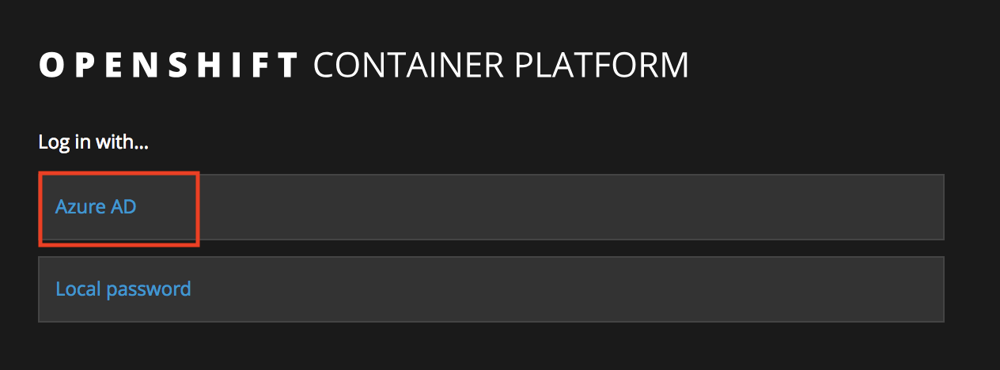

# Tutorial: Scale a Microsoft Azure Red Hat OpenShift cluster

This tutorial is part two of a series. You'll learn how to create a Microsoft Red Hat OpenShift cluster on Azure using the Azure CLI, scale it, and clean up unused Azure resources so that you are not charged for what you aren't using.

In part two of the series, you learn how to:

> [!div class="checklist"]
> * Scale a Red Hat OpenShift cluster

In this tutorial series you learn how to:
> [!div class="checklist"]
> * [Create an Azure Red Hat OpenShift cluster](tutorial-create-cluster.md)
> * Scale an Azure Red Hat OpenShift cluster
> * [Delete an Azure Red Hat OpenShift cluster](tutorial-delete-cluster.md)

## Prerequisites

Before you begin this tutorial:

* Create a cluster by following the [Create an Azure Red Hat OpenShift cluster](tutorial-create-cluster.md) tutorial.

## Step 1: Sign in to Azure

If you're running the Azure CLI locally, run `az login` to sign in to Azure.

```bash
az login
```

If you have access to multiple subscriptions, run `az account set -s
SUBSCRIPTION_ID` to default to the correct subscription.

## Step 2: Navigate to the OpenShift on Azure cluster console

After `az openshift create` has completed, open your browser and navigate to https://$FQDN/, for example, https://myuniqueclustername.eastus.cloudapp.azure.com/.

> [!NOTE]
> Currently, the OpenShift console certificate is untrusted, therefore when navigating to the console, you will need to manually
> accept the untrusted certificate in your browser.

To sign in to the cluster, click on `Azure AD`.



The cluster console appears:


## Step 3: Use the oc CLI

In the cluster console, click the question mark in the upper right corner and select `Command Line Tools`.  Follow the `Latest Release` link to download and
install the supported oc CLI for Linux, MacOS, or Windows.  If you can't sign in to the Red Hat portal, the oc CLI is also available [here](https://www.okd.io/download.html).

> [!NOTE]
> If you do not see the question mark icon in the upper right corner, select **Service Catalog** or **Application Console**
> from the upper left hand drop-down.

The same page also has a command of the form `oc login https://myuniqueclustername.eastus.cloudapp.azure.com --token=<hidden>`.  Click
the copy to clipboard button to copy this command.  Paste it in your terminal to sign in to the cluster using the oc CLI.  

You can also find your token here: `https://myuniqueclustername.eastus.cloudapp.azure.com/oauth/token/request`

## Step 4: Scale up to 5 compute nodes

From the Azure CLI, run:

```bash
az openshift scale --resource-group $CLUSTER_NAME --name $CLUSTER_NAME --compute-count 5
```

All being well, after a few minutes `az openshift create` will complete successfully and return a JSON document containing your cluster details.

In this part of the tutorial, you learned how to:

> [!div class="checklist"]
> * Scale an Azure Red Hat OpenShift cluster

Advance to the next tutorial:
> [!div class="nextstepaction"]
> [Delete an Azure Red Hat OpenShift cluster](tutorial-delete-cluster.md)