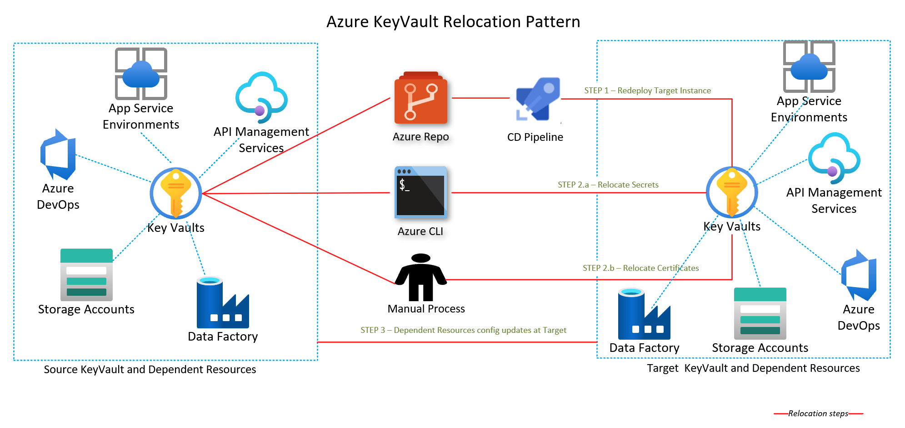

# Relocate Azure Key Vault to another region

Azure Key Vault doesn't support key vault relocation to another region. 

Instead of relocation, you need to:

- Create a new key vault with the relocation of the associated Azure services. 
- Regenerate any required [keys](/azure/key-vault/keys/about-keys), [secrets](/azure/key-vault/secrets/about-secrets), or [certificates](/azure/key-vault/certificates/about-certificates). In some cases, you may need to transfer the secrets or certificates from your existing key vault to the relocated key vault.



## Prerequisites

- Verify that your Azure subscription allows you to create key vaults in the target region.

- Create a dependency map with all the Azure services used by the Key Vault. For the services that are in scope of the relocation, you must choose the appropriate relocation strategy. 

- Depending on your Key Vault design, you may need to deploy and configure the [Virtual Network](./relocation-virtual-network.md) in the target region.

- Document and plan to re-configure in the Key Vault in the target region:
  - Access Policies and Network configuration settings.
  - Soft delete and purge protection.
  - Autorotation settings.

## Consideration for Service Endpoints

The virtual network service endpoints for Azure Key Vault restrict access to a specified virtual network. The endpoints can also restrict access to a list of IPv4 (internet protocol version 4) address ranges. Any user connecting to the Key Vault from outside those sources is denied access. If Service endpoints were configured in the source region for the Key Vault resource, the same would need to be done in the target one. 

For a successful recreation of the Key Vault to the target region, the VNet and Subnet must be created beforehand. In case the move of these two resources is being carried out with the Azure Resource Mover tool, the service endpoints won’t be configured automatically. Hence, they need to be configured manually, which can be done through the [Azure portal](/azure/key-vault/general/quick-create-portal), the [Azure CLI](/azure/key-vault/general/quick-create-cli), or [Azure PowerShell](/azure/key-vault/general/quick-create-powershell).


## Consideration for Private Endpoint

Azure Private Link provides private connectivity from a virtual network to [Azure platform as a service (PaaS), customer-owned, or Microsoft partner services](/azure/private-link/private-endpoint-overview). Private Link simplifies the network architecture and secures the connection between endpoints in Azure by eliminating data exposure to the public internet.

For a successful recreation of the Key Vault in the target region, the VNet and Subnet must be created before the actual recreation occurs.

### Consideration for Azure Private Endpoint DNS Integration

It’s important to correctly configure your DNS settings to resolve the private endpoint IP address to the fully qualified domain name (FQDN) of the connection string.

Existing Microsoft Azure services might already have a DNS configuration for a public endpoint. This configuration must be overridden to connect using your private endpoint.

The network interface associated with the private endpoint contains the information to configure your DNS. The network interface information includes FQDN and private IP addresses for your private link resource.

You can use the following options to configure your DNS settings for private endpoints:

- **Use the host file (only recommended for testing)**. You can use the host file on a virtual machine to override the DNS.
- **Use a private DNS zone.** You can use private DNS zones to override the DNS resolution for a private endpoint. A private DNS zone can be linked to your virtual network to resolve specific domains.
- **Use your DNS forwarder (optional).** You can use your DNS forwarder to override the DNS resolution for a private link resource. Create a DNS forwarding rule to use a private DNS zone on your DNS server hosted in a virtual network.

## Prepare

### [Portal](#tab/azure-portal)

To export a template by using Azure portal:

1. Sign in to the [Azure portal](https://portal.azure.com).

2. Select **All resources** and then select your key vault.

3. Select > **Automation** > **Export template**.

4. Choose **Download** in the **Export template** blade.

5. Locate the .zip file that you downloaded from the portal, and unzip that file to a folder of your choice.

   This zip file contains the .json files that comprise the template and scripts to deploy the template.

### [PowerShell](#tab/azure-powershell)

To export a template by using PowerShell:

1. Sign in to your Azure subscription with the [Connect-AzAccount](/powershell/module/az.accounts/connect-azaccount) command and follow the on-screen directions:

   ```azurepowershell-interactive
   Connect-AzAccount
   ```

2. If your identity is associated with more than one subscription, then set your active subscription to subscription of the key vault that you want to move.

   ```azurepowershell-interactive
   $context = Get-AzSubscription -SubscriptionId <subscription-id>
   Set-AzContext $context
   ```

3. Export the template of your source key vault. These commands save a json template to your current directory.

   ```azurepowershell-interactive
   $resource = Get-AzResource `
     -ResourceGroupName <resource-group-name> `
     -ResourceName <key-vault-name> `
     -ResourceType Microsoft.KeyVault/vaults `
   Export-AzResourceGroup `
     -ResourceGroupName <resource-group-name> `
     -Resource $resource.ResourceId
   ```

---

Keep in mind the following concepts:

- Key vault names are globally unique. You can't reuse a vault name.
- You need to reconfigure your access policies and network configuration settings in the new key vault.
- You need to reconfigure soft-delete and purge protection in the new key vault.
- The backup and restore operation doesn't preserve your autorotation settings. You might need to reconfigure the settings.

## Modify the template

Modify the template by changing the key vault name and region.

### [Portal](#tab/azure-portal)

To deploy the template by using Azure portal:

1. In the Azure portal, select **Create a resource**.

2. In **Search the Marketplace**, type **template deployment**, and then press **ENTER**.

3. Select **Template deployment**.

4. Select **Create**.

5. Select **Build your own template in the editor**.

6. Select **Load file**, and then follow the instructions to load the **template.json** file that you downloaded in the last section.

7. In the **template.json** file, name the key vault by setting the default value of the key vault name. This example sets the default value of the key vault name to `mytargetaccount`.

   ```json
   "$schema": "https://schema.management.azure.com/schemas/2019-04-01/deploymentTemplate.json#",
   "contentVersion": "1.0.0.0",
   "parameters": {
       "vaults_name": {
           "defaultValue": "key-vault-name",
           "type": "String"
       }
   },
   ```

8. Edit the **location** property in the **template.json** file to the target region. This example sets the target region to `centralus`.

   ```json
   "resources": [
       {
           "type": "Microsoft.KeyVault/vaults",
           "apiVersion": "2023-07-01",
           "name": "[parameters('vaults_name')]",
           "location": "centralus",
           ...
       },
       ...
   ]
   ```

   To obtain region location codes, see [Azure Locations](https://azure.microsoft.com/global-infrastructure/locations/). The code for a region is the region name with no spaces, **Central US** = **centralus**.

9. Remove resources of typ private endpoint in the template.

   ```json
   {
   "type": "Microsoft.KeyVault/vaults/privateEndpointConnections",
   ...
   }
   ```

10. In case you configured a service endpoint in your key vault, in the _networkAcl_ section, under _virtualNetworkRules_, add the rule for the target subnet. Ensure that the _ignoreMissingVnetServiceEndpoint_ flag is set to False, so that the IaC fails to deploy the Key Vault in case the service endpoint isn’t configured in the target region. 

    _parameter.json_

    ```json
    {
      "$schema": "https://schema.management.azure.com/schemas/2015-01-01/deploymentParameters.json#",
      "contentVersion": "1.0.0.0",
      "parameters": {
        "target_vnet_externalid": {
          "value": "virtualnetwork-externalid"
        },
        "target_subnet_name": {
          "value": "subnet-name"
        }
      }
    }
    ```

    \_template.json

    ```json
        "networkAcls": {
            "bypass": "AzureServices",
            "defaultAction": "Deny",
            "ipRules": [],
            "virtualNetworkRules": [
                {
                    "id": "[concat(parameters('target_subnet_name'), concat('/subnets/', parameters('target_subnet_name')]",
                    "ignoreMissingVnetServiceEndpoint": false
                }
            ]
        }
    ```

### [PowerShell](#tab/azure-powershell)

To deploy the template by using PowerShell:

1. In the **template.json** file, name the target key vault by setting the default value of the key vault name. This example sets the default value of the key vault name to `key-vault-name`.

   ```json
   "$schema": "https://schema.management.azure.com/schemas/2019-04-01/deploymentTemplate.json#",
   "contentVersion": "1.0.0.0",
   "parameters": {
       "vaults_name": {
           "defaultValue": "key-vault-name",
           "type": "String"
       }
   },
   ```

2. Edit the **location** property in the **template.json** file to the target region. This example sets the target region to `eastus`.

   ```json
   "resources": [
       {
           "type": "Microsoft.KeyVault/vaults",
           "apiVersion": "2023-07-01",
           "name": "[parameters('vaults_name')]",
           "location": "eastus",
           ...
       },
       ...
   ]
   ```

   You can obtain region codes by running the [Get-AzLocation](/powershell/module/az.resources/get-azlocation) command.

   ```azurepowershell-interactive
   Get-AzLocation | format-table
   ```

3. Remove resources of typ private endpoint in the template.

   ```json
   {
   "type": "Microsoft.KeyVault/vaults/privateEndpointConnections",
   ...
   }
   ```

4. In case you have configured a service endpoint in your key vault, in the _networkAcl_ section, under _virtualNetworkRules_, add the rule for the target subnet. Ensure that the _ignoreMissingVnetServiceEndpoint_ flag is set to False, so that the IaC fails to deploy the Key Vault in case the service endpoint isn’t configured in the target region.

   _parameter.json_

   ```json
   {
     "$schema": "https://schema.management.azure.com/schemas/2015-01-01/deploymentParameters.json#",
     "contentVersion": "1.0.0.0",
     "parameters": {
       "target_vnet_externalid": {
         "value": "virtualnetwork-externalid"
       },
       "target_subnet_name": {
         "value": "subnet-name"
       }
     }
   }
   ```

   _template.json_

   ```json
   "networkAcls": {
       "bypass": "AzureServices",
       "defaultAction": "Deny",
       "ipRules": [],
       "virtualNetworkRules": [
           {
               "id": "[concat(parameters('target_subnet_name'), concat('/subnets/', parameters('target_subnet_name')]",
               "ignoreMissingVnetServiceEndpoint": false
           }
       ]
   }
   ```

---

### Redeploy

Deploy the template to create a new key vault in the target region.

#### [Portal](#tab/azure-portal)

1. Save the **template.json** file.

2. Enter or select the property values:

   - **Subscription**: Select an Azure subscription.

   - **Resource group**: Select **Create new** and give the resource group a name.

   - **Location**: Select an Azure location.

3. Select **I agree to the terms and conditions stated above**, and then select **Select Purchase**.

4. Access Policies and Network configuration settings (private endpoints) need to be re-configured in the new Key Vault. Soft delete and purge protection need to be re-configured in the new key vault and the _Autorotation settings_.

#### [PowerShell](#tab/azure-powershell)

1. Obtain the subscription ID where you want to deploy the target public IP with [Get-AzSubscription](/powershell/module/az.accounts/get-azsubscription):

   ```azurepowershell-interactive
   Get-AzSubscription
   ```

2. Use these commands to deploy your template:

   ```azurepowershell-interactive
   $resourceGroupName = Read-Host -Prompt "Enter the Resource Group name"
   $location = Read-Host -Prompt "Enter the location (i.e. eastus)"

   New-AzResourceGroup -Name $resourceGroupName -Location "$location"
   New-AzResourceGroupDeployment -ResourceGroupName $resourceGroupName -TemplateUri "<name of your local template file>"
   ```

3. Access Policies and Network configuration settings (private endpoints) need to be re-configured in the new Key Vault. Soft delete and purge protection need to be re-configured in the new key vault and as the _Autorotation settings_.
---


> [!TIP]
> If you receive an error which states that the XML specified is not syntactically valid, compare the JSON in your template with the schemas described in the Azure Resource Manager documentation.

### Redeploy with data migration

>[!IMPORTANT] 
>If you plan to move a Key Vault across regions but within the same geography, it's recommended that you do  a [backup and restore for secrets, keys and certificates](/azure/key-vault/general/backup) is recommended. 

1. Follow steps in the described in the [redeploy approach](#redeploy).
2. For [secrets](/azure/key-vault/secrets/about-secrets):
    1. Copy and save the secret value in the source key vault.
    1. Recreate the secret in the target key vault and set the value to saved secret.
1. For [certificates](/azure/key-vault/certificates/about-certificates):
    1. Export the certificate into a PFX file.
    1. Import the PFX file into the target key vault. If you can't export the private key (`exportable` is not set) you must generate certificate a new certificate and import it into the target key vault.
1. With the relocation of the associated Azure service the [keys](/azure/key-vault/keys/about-keys) are regenerated. 
1. Confirm that the keys have been generated for the associated service.

## Verify

Before deleting your old key vault, verify that the new vault contains all of the required keys, secrets, and certificates after the relocation of the associated Azure services.

## Links

- [Azure Key Vault backup and restore](/azure/key-vault/general/backup)
- [Moving an Azure Key Vault across resource groups](/azure/key-vault/general/move-resourcegroup)
- [Moving an Azure Key Vault to another subscription](/azure/key-vault/general/move-subscription)
