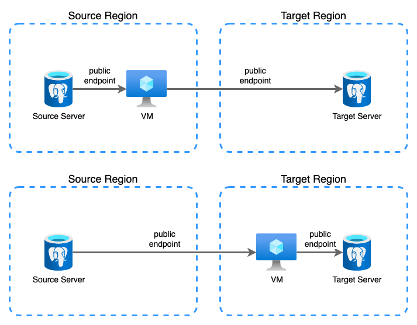
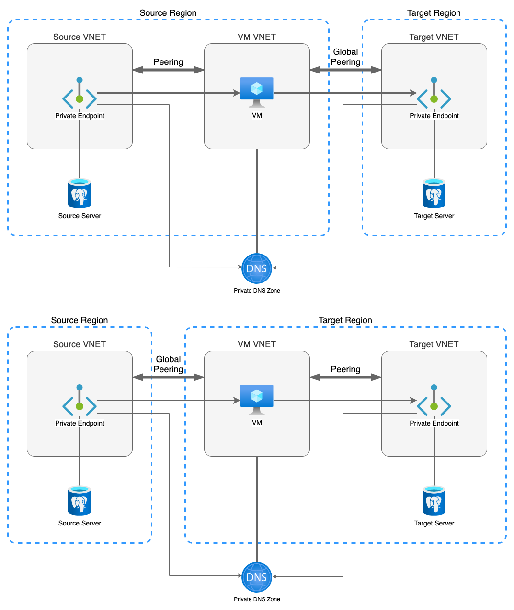

# Relocation guidance for Azure Database for PostgreSQL

This article covers relocation guidance for Azure Database for PostgreSQL, Single Server and Flexible Servers across geographies, where region pairs aren't available for replication and geo-restore.  For Azure Cosmos DB for PostgreSQL (formerly called Azure Database for PostgreSQL - Hyperscale (Citus)) [cross region replication is the only available option to relocate it between regions](https://learn.microsoft.com/en-us/azure/cosmos-db/postgresql/concepts-read-replicas).  

For an overview of the region pairs supported by native replication, see [cross-region replication](../postgresql/concepts-read-replicas.md#cross-region-replication).

The relocation process is based on [Azure region relocation architectural patterns](relocation-overview.md#relocation-architectural-patterns). 


## Relocation strategies

To move Azure PostgreSQL database to a new region, you can choose between [redeployment](#redeployment-strategy) or [redeployment with data migration](#redeploy-with-data-migration) strategies. 

>[!NOTE]
>Azure Resource Mover doesn't support moving services used by the Azure Database for PostgreSQL. To see which resources Resource Mover supports, see [What resources can I move across regions?](/azure/resource-mover/overview#what-resources-can-i-move-across-regions).

## Redeployment strategy 

Redeployment without data or configuration for Azure Database for PostgreSQL has minimal downtime due to its low complexity.


**To redeploy your PostgreSQL server without configuration or data:**

1. Export your PostgreSQL Server's existing configuration into an [ARM template](/azure/templates/microsoft.dbforpostgresql/flexibleservers?pivots=deployment-language-arm-template). 

1. Adjust template parameters to match the destination region.
  >[!IMPORTANT]
  >The target server must be different from source server name. You must reconfigure clients to point to the new server.

1. Redeploy the template to the new region. For an example of how to use an ARM template to create an Azure Database for PostgreSQL, see [Quickstart: Use an ARM template to create an Azure Database for PostgreSQL - Flexible Server](/azure/postgresql/flexible-server/quickstart-create-server-arm-template?tabs=portal%2Cazure-portal).
  

## Redeployment with Data Migration strategy 

In this section you learn how to redeploy your data and source server to the target server, using the same configuration of the source server. 

Configuration includes, but is not limited to:

- Network
- Administrator name
- SKU
- Server settings
- Extensions
- Backup
- Maintenance
- High availability 

Redeployment for Azure Database for PostgreSQL is based on logical backup and restore and requires the use of native tools. As a result you can expect noticeable downtime during restoration.

### Prerequisites

- To relocate PostgreSQL from one region to another, you must have an additional compute resource to run the backup and restore tools. The examples in this guide use an Azure VM running Ubuntu 20.04 LTS. The compute resources must:
  - Have network access to both the source and the target server, either on a private network or by inclusion in the firewall rules.
  - Be located in either the source or target region.
  - Use [Accelerated Networking](/azure/virtual-network/accelerated-networking-overview) (if available).
  - The database content is not saved to any intermediate storage; the output of the logical backup tool is sent directly to the target server.


- Depending on your Azure Database for PostgreSQL instance design, the following dependent resources may need to be created and configured in the target region prior to re-location:
    - [Public IP](/azure/virtual-network/move-across-regions-publicip-portal)
    - [Azure Private Link](./relocation-private-link.md)
    - [Virtual Network](./relocation-virtual-network.md)
    - [Network Peering](/azure/virtual-network/scripts/virtual-network-powershell-sample-peer-two-virtual-networks)
    - [Azure Private DNS]()


### Redeploy your PostgreSQL server with data migration

1. Export your PostgreSQL Server's existing configuration into an [ARM template](/azure/templates/microsoft.dbforpostgresql/flexibleservers?pivots=deployment-language-arm-template). 
1. Adjust template parameters to match the destination region.
  >[!IMPORTANT]
  >The target server must be different from source server name. You must reconfigure clients to point to the new server.
1. Redeploy the template to the new region. For an example of how to use an ARM template to create an Azure Database for PostgreSQL, see [Quickstart: Use an ARM template to create an Azure Database for PostgreSQL - Flexible Server](/azure/postgresql/flexible-server/quickstart-create-server-arm-template?tabs=portal%2Cazure-portal).
  
1. (Optional) If you created additional roles in the source server, create them in the target server. To get a list of existing roles,  use the following query:

    ```sql
    select *
    from pg_catalog.pg_roles

1. On the compute resource provisioned for the migration, install the PostgreSQL client tools for the PostgreSQL version to be migrated. The following example uses PostgreSQL version 13 on an Azure VM that runs Ubuntu 20.04 LTS:

    ```
      sudo sh -c 'echo "deb http://apt.postgresql.org/pub/repos/apt $(lsb_release -cs)-pgdg main" > /etc/apt/sources.list.d/pgdg.list'
      wget --quiet -O - https://www.postgresql.org/media/keys/ACCC4CF8.asc | sudo apt-key add -
      sudo apt-get update
      sudo apt-get install -y postgresql-client-13
    ```

    For more information for the installation of PostgreSQL components in Ubuntu, please refer to [Linux downloads (Ubuntu)](https://www.postgresql.org/download/linux/ubuntu/).

    For other platforms, go to [PostgreSQL Downloads](https://www.postgresql.org/download/).

1. (Optional) If you created additional roles in the source server, create them in the target server. To get a list of existing roles,  use the following query:

    ```sql
    select *
    from pg_catalog.pg_roles
    where rolname not like 'pg_%' and rolname not in ('azuresu', 'azure_pg_admin', 'replication')
    order by rolname;
    ```

1. To migrate each database, do the following steps:
    1. Stop all database activity on the source server.
    1. Replace credentials information, source server, target server, and database name in the following script:
    
      ```sql
          export USER=admin_username
          export PGPASSWORD=admin_password
          export SOURCE=pgsql-arpp-source.postgres.database.azure.com
          export TARGET=pgsql-arpp-target.postgres.database.azure.com
          export DATABASE=database_name
          pg_dump -h $SOURCE -U $USER --create --exclude-schema=pg_catalog $DATABASE | psql -h $TARGET -U $USER postgres
      ```
    1. Run the script to migrate the database.
    1. Configure the clients to point to the target server.
    1. Perform functional tests on the applications.
1. If service endpoints were configured for the source region of the database resource, the same must be done for the target region by doing the following steps:
    1. If you used Resource Mover to migrate the virtual network and subnet to the target region, you need to configure them manually. To manually configure the virtual network and subnet, see [Create and manage VNet service endpoints and VNet rules in Azure Database for PostgreSQL](/azure/postgresql/single-server/how-to-manage-vnet-using-cli)
    1. In the IaC of the Azure Database for PostgreSQL, do the following:
        1. In `networkAcl` section, under `virtualNetworkRules`, add the rule for the target subnet.
        1. Ensure that the `ignoreMissingVnetServiceEndpoint` flag is set to `False`, so that the IaC fails to deploy the database when the service endpoint isn’t configured in the target region. 


        ### Migration over public endpoint
        
        
        
        ### Migration over private endpoint
        
        
        
        | Strategy                     | Advantages            | Disadvantages                                                  |
        | ---------------------------- | --------------------- | -------------------------------------------------------------- |
        | Redeploy                     | Low complexity        | Does not cover data migration.                                 |
        | Redeploy with Data Migration | Covers data migration | High complexity, requires additional resources, long downtime. |
        
        Considering the redeploy with data migration strategy,the workload consisting of
        this service will have an implication of cold standby.
        


## Relocation for Azure Database for PostgreSQL - Hyperscale(Citus)

Using cross-region replica, User/Customer would be able to create a read replica
of their RW Hyperscale (Citus) server group in any of the supported regions.
Once created, we can monitor replication – the feature uses asynchronous
replication – and decide on the time for cut off (stop writes on the primary and
wait for them to replicate to the replica or promote with data loss). Promotion
is a simple operations in Azure portal.

1. Create read Replicas in targeted region.
2. Initiate the replication for data sync.
3. Cutoff stop the writes on the primary and wait for sync to complete.
4. Switch over workload to targeted region instance .
5. Resource Cleanup.

{} Note:Cross-region read replicas -
PostgreSQL - Hyperscale (Citus) server will support this feature later this
calendar year 2022. {}
