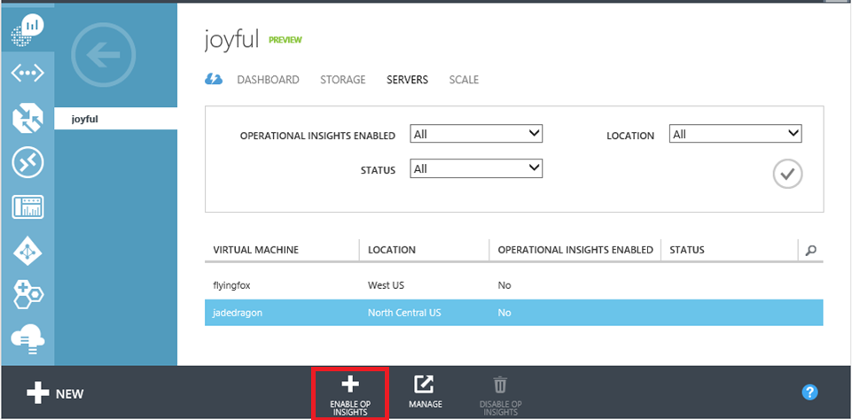
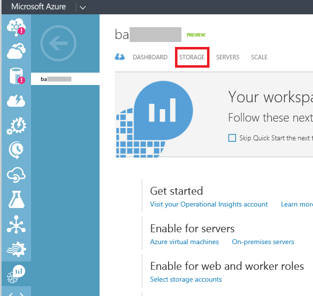

<properties 
   pageTitle="Analyze data from servers in Microsoft Azure" 
   description="Search event and IIS logs for cloud services and virtual machines by enabling Azure diagnostics." 
   services="operational-insights" 
   documentationCenter="" 
   authors="bandersmsft" 
   manager="jwhit" 
   editor=""/>

<tags
   ms.service="operational-insights"
   ms.devlang="na"
   ms.topic="article"
   ms.tgt_pltfrm="na"
   ms.workload="na" 
   ms.date="05/01/2015"
   ms.author="banders"/>
# Analyze data from servers in Microsoft Azure

[AZURE.INCLUDE [operational-insights-note-moms](../includes/operational-insights-note-moms.md)]

Operational Insights uses data from servers in your on-premises or cloud infrastructure. You can collect machine data from Azure storage when generated by Azure diagnostics.

Using the data you collect from Azure storage, you can quickly search event and IIS logs for cloud services and virtual machines by enabling [Azure diagnostics](operational-insights-log-collection.md). You can also get additional insights from your virtual machines by installing the Microsoft Monitoring Agent.

The Update Assessment, Change Tracking, and SQL Assessment intelligence packs all work with the Microsoft Monitoring Agent to provide deeper insights on your virtual machines. If you haven’t already, you can [add intelligence packs](operational-insights-add-intelligence-pack.md) when you’re signed into the [Operational Insights portal](https://preview.opinsights.azure.com/).

For Azure virtual machines, there are two easy ways to enable agent-based data collection:

- In the Microsoft Azure management portal

- Using PowerShell

When using agent-based collection for log data, you must configure which logs to collect in the Log Management configuration page of the [Operational Insights portal](https://preview.opinsights.azure.com/).

 >[AZURE.NOTE] If you’ve configured Operational Insights to index log data using Azure diagnostics and you configure the agent to collect logs, then the same logs will be indexed twice. 
You will be charged normal data rates for both data sources. 
If you have the agent installed, then you should collect log data using the agent and not index the logs collected by Azure diagnostics.

## Microsoft Azure Management Portal

You can install the agent for Operational Insights from the [Azure portal](https://manage.windowsazure.com/#Workspaces/OperationalInsightExtension/Workspaces).

### To install the agent for Operational Insights
1. In the Azure portal, go to your Operational Insights workspace and select the **Servers** tab.
2. On the tab, you’ll see a list of your virtual machines. Select the virtual machine you want to install the agent on and then click **Enable Op Insights**.

The agent is automatically installed and configured for your Operational Insights workspace.



 >[AZURE.NOTE] The [Azure VM agent](https://msdn.microsoft.com/library/azure/dn832621.aspx) must be installed to automatically install the agent for Operational Insights.


## PowerShell

If you prefer scripting to make changes to your Azure virtual machines, then you can enable the Microsoft Monitoring Agent using PowerShell.

The Microsoft Monitoring Agent is an [Azure virtual machine extension](https://msdn.microsoft.com/library/azure/dn832621.aspx) and you can manage it using PowerShell, as shown in the example below.

```powershell
Add-AzureAccount

$workspaceId="enter workspace here"
$workspaceKey="enter workspace key here"
$hostedService="enter hosted service here"

$vm = Get-AzureVM –ServiceName $hostedService
Set-AzureVMExtension -VM $vm -Publisher 'Microsoft.EnterpriseCloud.Monitoring' -ExtensionName 'MicrosoftMonitoringAgent' -Version '1.*' -PublicConfiguration "{'workspaceId':  '$workspaceId'}" -PrivateConfiguration "{'workspaceKey': '$workspaceKey' }" | Update-AzureVM -Verbose
```

When configuring using PowerShell, you need to provide the Workspace ID and Primary Key. You can find your Workspace ID and Primary Key on the **Settings** page of the Operational Insights portal.


## Collect data using Azure diagnostics

Operational Insights can analyze data written to Azure storage by Azure diagnostics. There are 2 main steps to perform:

- Configure the collection of diagnostic data to Azure storage
- Configure Operational Insights to analyze data in the storage account

The topics below describe how to enable collection of diagnostics data to Azure storage and then how to configure Operational Insights to analyze the data in Azure storage.

Azure Diagnostics is an Azure extensions that enables you to collect diagnostic data from a worker role, web role, or virtual machine running in Azure. The data is stored in an Azure storage account and can then be used by Operational Insights.

>[AZURE.NOTE] You'll be charged normal data rates for storage and transactions when you send diagnostics to a storage account and for when Operational Insights reads the data from your storage account.

Azure Diagnostics can collect the following types of telemetry:

<table border="1" cellspacing="4" cellpadding="4">
    <tbody>
    <tr align="left" valign="top">
		<td><b>Data Source</b></td>
		<td><b>

Description </b></td>
    </tr>
    <tr align="left" valign="top">
		<td>IIS Logs</td>
		<td>Information about IIS web sites.</td>
    </tr>
    <tr align="left" valign="top">
		<td>Azure Diagnostic infrastructure logs</td>
		<td>Information about Diagnostics itself.</td>
    </tr>
	<tr align="left" valign="top">
		<td>IIS Failed Request logs </td>
		<td>Information about failed requests to an IIS site or application.</td>
    </tr>
	    <tr align="left" valign="top">
		<td>Windows Event logs</td>
		<td>Information sent to the Windows event logging system.</td>
    </tr>
    <tr align="left" valign="top">
		<td>Performance counters</td>
		<td>Operating System and custom performance counters.</td>
    </tr>
    <tr align="left" valign="top">
		<td>Crash dumps</td>
		<td>Information about the state of the process in the event of an application crash.</td>
    </tr>
    <tr align="left" valign="top">
		<td>Custom error logs</td>
		<td>Logs created by your application or service.</td>
    </tr>
    <tr align="left" valign="top">
		<td>NET EventSource</td>
		<td>Events generated by your code using the .NET <a href="https://msdn.microsoft.com/library/system.diagnostics.tracing.eventsource(v=vs.110).aspx">EventSource class</td>
    </tr>
    <tr align="left" valign="top">
		<td>Manifest based ETW</td>
		<td>ETW events generated by any process.</td>
    </tr>
    </tbody>
    </table>


Currently, Operational Insights is able to analyze:

- IIS logs from Web roles and virtual machines
- Windows Event logs from Web roles, Worker roles and Azure virtual machines running a Windows operating system
- Syslog from Azure virtual machines running a Linux operating system

The logs must be in the following locations:

- WADWindowsEventLogsTable (Table Storage) – Contains information from Windows Event logs.
- wad-iis-logfiles (Blob Storage) – Contains information about IIS logs.
- LinuxsyslogVer1v0 (Table Storage) – Contains Linux syslog events.

 >[AZURE.NOTE] IIS logs from Azure Websites are not currently supported.

For virtual machines, you also have the option of installing the [Microsoft Monitoring Agent](http://go.microsoft.com/fwlink/?LinkId=517269) into your virtual machine to enable additional insights. In addition to being able to analyze IIS logs and Event Logs you will also allow be able to perform additional analysis including configuration change tracking, SQL assessment and update assessment.

You can help us prioritize additional logs for Operational Insights to analyze by voting on our [feedback page](http://feedback.azure.com/forums/267889-azure-operational-insights/category/88086-log-management-and-log-collection-policy).

## Enable Azure diagnostics in a Web role for IIS log and event collection

Refer to [How To Enable Diagnostics in a Cloud Service](https://msdn.microsoft.com/library/azure/dn482131.aspx). You’ll use the basic information from there and customize the steps here for use with Microsoft Azure Operational Insights.

With Azure diagnostics enabled:

- IIS logs are stored by default, with log data transferred at the scheduledTransferPeriod transfer interval.

- Windows Event Logs are not transferred by default.

### To enable diagnostics

To enable Windows Event Logs, or to change the scheduledTransferPeriod, configure Azure Diagnostics using the XML configuration file (diagnostics.wadcfg), as shown in [Step 2: Add the diagnostics.wadcfg file to your Visual Studio solution](https://msdn.microsoft.com/library/azure/dn482131.aspx#BKMK_step2) and [Step 3: Configure diagnostics for your application](https://msdn.microsoft.com/library/azure/dn482131.aspx#BKMK_step3) in the How To Enable Diagnostics in a Cloud Service topic.The following example configuration file collects IIS Logs and all Events from the Application and System logs:

    <?xml version="1.0" encoding="utf-8" ?>
    <DiagnosticMonitorConfiguration xmlns="http://schemas.microsoft.com/ServiceHosting/2010/10/DiagnosticsConfiguration"
          configurationChangePollInterval="PT1M"
          overallQuotaInMB="4096">
     
      <Directories bufferQuotaInMB="0"
         scheduledTransferPeriod="PT10M">  
        <!-- IISLogs are only relevant to Web roles -->
        <IISLogs container="wad-iis" directoryQuotaInMB="0" />
      </Directories>
     
      <WindowsEventLog bufferQuotaInMB="0"
         scheduledTransferLogLevelFilter="Verbose"
         scheduledTransferPeriod="PT10M">
        <DataSource name="Application!*" />
        <DataSource name="System!*" />
      </WindowsEventLog>
     
    </DiagnosticMonitorConfiguration>


In [Step 4: Configure storage of your diagnostics data](https://msdn.microsoft.com/library/azure/dn482131.aspx#BKMK_step4) of the How To Enable Diagnostics in a Cloud Service topic, ensure that your ConfigurationSettings specifies a storage account, as in the following example:


    <ConfigurationSettings>
       <Setting name="Microsoft.WindowsAzure.Plugins.Diagnostics.ConnectionString" value="DefaultEndpointsProtocol=https;AccountName=<AccountName>;AccountKey=<AccountKey>"/>
    </ConfigurationSettings>


The **AccountName** and **AccountKey** values are found in the Microsoft Azure Management Portal in the storage account dashboard, under Manage Access Keys. The protocol for the connection string must be **https**.

Once the updated diagnostic configuration is applied to your cloud service and it is writing diagnostics to Azure Storage, then you are ready to configure Operational Insights.

## Enable Azure diagnostics in a virtual machine for event log and IIS log collection

Use the following procedure to enable Azure diagnostics in a virtual machine for Event Log and IIS log collection using the Microsoft Azure management portal.

### To enable Azure diagnostics in a virtual machine with the Azure management portal

1. Install the VM Agent when you create a virtual machine. If the virtual machine already exists, verify that the VM Agent is already installed.
	- If you use the default Azure management portal to create the virtual machine, perform a **Custom Create** and select **Install the VM Agent**.
	- If you use the new Azure management portal to create a virtual machine, select **Optional Configuration**, then **Diagnostics** and set **Status** to **On**.
	
	Upon completion, the VM will automatically have the Azure Diagnostics extension installed and running which will be responsible for collecting your diagnostics data.

2. Enable monitoring and configure event logging on an existing VM. You can enable diagnostics at the VM level. To enable diagnostics and then configure event logging, perform the following steps:
	1. Select the VM.
	2. Click **Monitoring**.
	3. Click **Diagnostics**.
	4. Set the **Status** to **ON**.
	5. Select each diagnostics metric that you want to use. Operational Insights can analyze Windows event system logs, Windows event application logs and IIS logs.
	7. Click **OK**.

Using Azure PowerShell you can more precisely specify the events that are written to Azure Storage. Refer to the Azure Diagnostics 1.2 Configuration Schema for a sample configuration file and detailed documentation on its schema. Ensure that you install and configure Azure PowerShell version 0.8.7 or later from [How to install and configure Azure PowerShell](powershell-install-configure). If you have a version of Microsoft Azure Diagnostics installed that is earlier than version 1.2 you cannot use the new portal to enable or configure diagnostics.

You can enable and update the Agent using the following PowerShell script. You can also use this script with custom logging configuration. You will need to modify the script to set the storage account, service name and virtual machine name.

### To enable diagnostics in a virtual machine with Azure PowerShell

Review the following script sample, copy it, modify it as needed, save the sample as a PowerShell script file, and then run the script.


	#Connect to Azure
	Add-AzureAccount 
	
	# settings to change:
	$wad_storage_account_name = "myStorageAccount"
	$service_name = "myService"
	$vm_name = "myVM"
	
	#Construct Azure Diagnostics public config and convert to config format 
	
	# Collect just system error events:
	$wad_xml_config = "<WadCfg><DiagnosticMonitorConfiguration><WindowsEventLog scheduledTransferPeriod=""PT1M""><DataSource name=""System!* "" /></WindowsEventLog></DiagnosticMonitorConfiguration></WadCfg>"
	
	$wad_b64_config = [System.Convert]::ToBase64String([System.Text.Encoding]::UTF8.GetBytes($wad_xml_config))
	$wad_public_config = [string]::Format("{{""xmlCfg"":""{0}""}}",$wad_b64_config)
	
	#Construct Azure diagnostics private config
	
	$wad_storage_account_key = (Get-AzureStorageKey $wad_storage_account_name).Primary
	$wad_private_config = [string]::Format("{{""storageAccountName"":""{0}"",""storageAccountKey"":""{1}""}}",$wad_storage_account_name,$wad_storage_account_key)
	
	#Enable Diagnostics Extension for Virtual Machine
	
	$wad_extension_name = "IaaSDiagnostics"
	$wad_publisher = "Microsoft.Azure.Diagnostics"
	$wad_version = (Get-AzureVMAvailableExtension -Publisher $wad_publisher -ExtensionName $wad_extension_name).Version # Gets latest version of the extension
	
	(Get-AzureVM -ServiceName $service_name -Name $vm_name) | Set-AzureVMExtension -ExtensionName $wad_extension_name -Publisher $wad_publisher -PublicConfiguration $wad_public_config -PrivateConfiguration $wad_private_config -Version $wad_version | Update-AzureVM


## Enable Azure Storage analysis by Operational Insights

Use the following procedure to enable storage analysis and configure Operational Insights to read from the Azure Storage account with Azure Diagnostics.

### To enable analysis by Operational Insights

1. In the default Azure portal, navigate to your Operational Insights workspace and select the **Storage** tab.

2. Click **Add a Storage Account** to open the **Add Storage Account** box.
3. Select the storage account that you want to use.
4. In the **Data Type** list, select a data type: either **Events** or **IIS Logs**.
5. Click the **OK** image.

6. Repeat the above steps for each data type and storage account combination that you want to collect.

In approximately 1 hour you will begin to see data from the storage account available for analysis within Operational Insights.

## Related content

- [Connect computers directly to Operational Insights](operational-insights-direct-agent)
- [Blog post: Enable Operational Insights for Azure Virtual machines](http://azure.microsoft.com/updates/easily-enable-operational-insights-for-azure-virtual-machines/)

## Next steps

[Configure Proxy and Firewall settings (Optional)](operational-insights-proxy-filewall.md)
