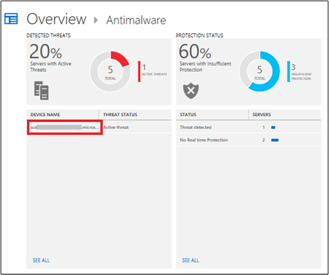
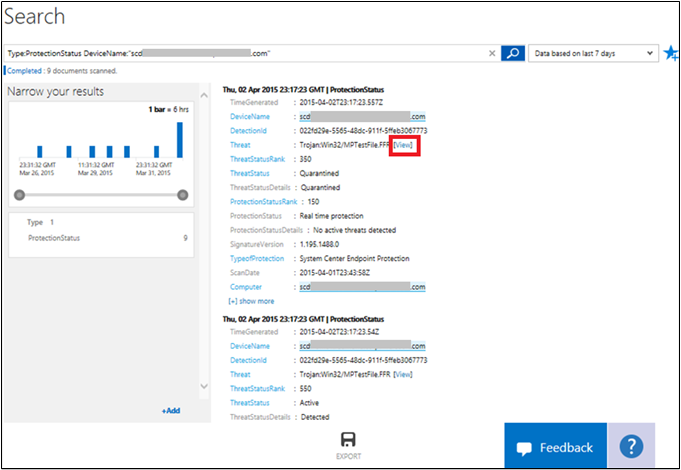

<properties
   pageTitle="Protect servers with antimalware"
   description="Use antimalware to help you protect the servers in your infrastructure from malware"
   services="operational-insights"
   documentationCenter=""
   authors="bandersmsft"
   manager="jwhit"
   editor="" />
<tags
   ms.service="operational-insights"
   ms.devlang="na"
   ms.topic="article"
   ms.tgt_pltfrm="na"
   ms.workload="na"
   ms.date="05/15/2015"
   ms.author="banders" />

# Protect servers with antimalware

[AZURE.INCLUDE [operational-insights-note-moms](../includes/operational-insights-note-moms.md)]

You can use the Antimalware solution in Microsoft Azure Operational Insights to help you protect the servers in your infrastructure from malware. You install the solution to update the Operations Manager agent and base configuration module for Operational Insights. Antimalware protection status and potential threats on the monitored servers are read, and then the data is sent to the Operational Insights service in the cloud for processing. Logic is applied to the received data and the cloud service records the data. If insufficient protection is found, servers with active threats and servers with insufficient protection are shown in the **Antimalware** dashboard. By using the information on the **Antimalware** dashboard, you can develop a plan to apply protection to the servers that need it.

## Use Antimalware

Before you can use antimalware in Microsoft Azure Operational Insights, you must have the solution installed. To read more about installing solutions, see [Use the Solutions Gallery to add or remove solutions](operational-insights-add-solution.md).

Some things you need to be aware of before you start:
 
- Operational Insights only uses Center Endpoint Protection 
- Reporting isn't available for Windows Defender, Windows servers running preliminary versions that use Windows Defender, servers running Windows Server 2008 and earlier, or other 3rd party antimalware product

### To review detected threats for servers

1. On the **Overview** page, click the **Antimalware Assessment** tile.

2. On the **Antimalware** dashboard, you will review the **Detected Threats** blade and click a server name with active threats.

3. On the **Search** page you can see detailed information about the detected threat. Next to **Threat**, click **View**.

4. On the **Search the malware encyclopedia** page, click the malware item to view more details about it.

5. On the Microsoft **Malware Protection Center** page for the malware item, review information in the **What to do now** and **Get more help** sections for ways to remove the threat or take other corrective actions. Recommendations are specific to the malware found

###To review protection status

1. On the **Antimalware** dashboard, you will review the **Protection Status** blade and click **no real time protection**.

2. Search shows a list of servers without protection.

3. At this point you now know what servers do not have  realtime protection.

