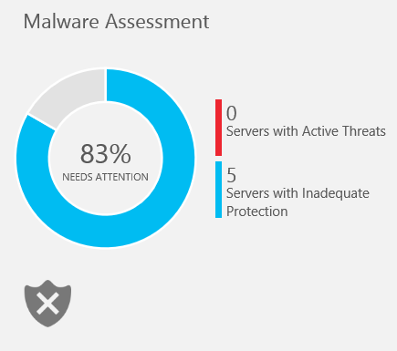
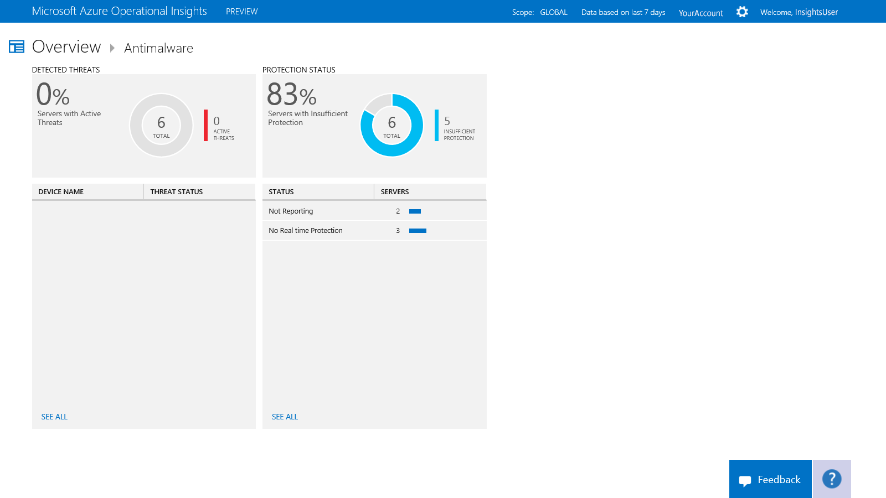

<properties 
   pageTitle="Protect servers with antimalware"
   description="Use antimalware to help you protect the servers in your infrastructure from malware"
   services="operational-insights"
   documentationCenter=""
   authors="bandersmsft"
   manager="jwhit"
   editor="" />
<tags 
   ms.service="operational-insights"
   ms.devlang="na"
   ms.topic="article"
   ms.tgt_pltfrm="na"
   ms.workload="na"
   ms.date="04/30/2015"
   ms.author="banders" />

# Protect servers with antimalware

[AZURE.INCLUDE [operational-insights-note-moms](../includes/operational-insights-note-moms.md)]

You can use the Antimalware intelligence pack in Microsoft Azure Operational Insights to help you protect the servers in your infrastructure from malware. You install the intelligence pack to update the Operations Manager agent and base configuration module for Operational Insights. Antimalware protection status and potential threats on the monitored servers are read, and then the data is sent to the Operational Insights service in the cloud for processing. Logic is applied to the received data and the cloud service records the data. If insufficient protection is found, servers with active threats and servers with insufficient protection are shown in the **Antimalware** dashboard. By using the information on the **Antimalware** dashboard, you can develop a plan to apply protection to the servers that need it.

## Use Antimalware

Before you can use antimalware in Microsoft Azure Operational Insights, you must have the intelligence pack installed. To read more about installing intelligence packs, see [Use the Gallery to add or remove intelligence packs](operational-insights-add-intelligence-pack.md). 

After it is installed, you can view an antimalware assessment of your monitored servers by using the **Antimalware Assessment** tile on the **Overview** dashboard in Operational Insights. 

The tile opens the **Antimalware** page where you can view an overall summary of threats and protection status. The page details the following categories:

- Detected threats, which show the device and threat status

- Protection status, which shows the status and the number of servers that are not fully protected

### To work with the antimalware assessment

1. On the **Overview** page, click the **Antimalware Assessment** tile.

2. On the **Antimalware** dashboard, view the categories and choose one to work with.

3. Click any item to view detailed information about it in the **Search** page.

4. By using the information you found, you can create a plan to apply antimalware software or other corrective measures to protect your servers.
