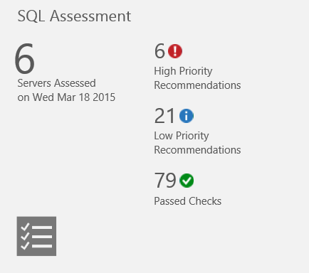
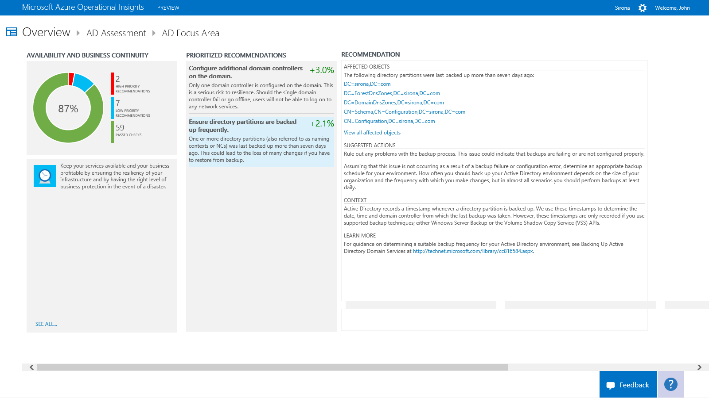

<properties 
   pageTitle="Optimize your environment with Assessment intelligence packs"
   description="Use Assessment intelligence packs to assess the risk and health of your server environments on a regular interval"
   services="operational-insights"
   documentationCenter=""
   authors="bandersmsft"
   manager="jwhit"
   editor="" />
<tags 
   ms.service="operational-insights"
   ms.devlang="na"
   ms.topic="article"
   ms.tgt_pltfrm="na"
   ms.workload="na"
   ms.date="04/30/2015"
   ms.author="banders" />

# Optimize your environment with Assessment intelligence packs

[AZURE.INCLUDE [operational-insights-note-moms](../includes/operational-insights-note-moms.md)]

You can use Assessment intelligence packs to assess the risk and health of your server environments on a regular interval. They provide a prioritized list of recommendations specific to your deployed server infrastructure. Recommendations are categorized across six focus areas which helps your quickly understand the risk and health of your infrastructure and to help you easily take action to decrease risk and improve health.

Currently, the following Assessment intelligence packs are available:

- Active Directory

- SQL Server

The recommendations made are based on the knowledge and experiences gained by Microsoft engineers from based on thousands of customer visits. Each recommendation provides guidance about why each issue might matter to you and how to implement the suggested changes.

You can choose focus areas that are most important to your organization and track your progress toward running a risk free and healthy environment.

You install the intelligence packs to update the Operations Manager agent and base configuration module for Operational Insights and add the AdvisorAssessment.exe file to monitored servers. Configuration data is read and then the data is sent to the Operational Insights service in the cloud for processing. Logic is applied to the received data and the cloud service records the data. When assessments are completed, summary information for focus areas are shown on the **Assessment** dashboard for the infrastructure in your environment. By using the information on the **Assessment** dashboard, you can view and then take recommended actions for your server infrastructure.

## Assessment Intelligence Packs FAQ

*How often does an assessment run?* 
The assessment runs every 7 days.

*Is there a way to configure how often the assessment runs?* 
Not at this time.

*If another server for is discovered after I’ve added an assessment intelligence pack, will it be assessed?* 
Yes, once it is discovered it is assessed from then on, every 7 days.

*If a server is decommissioned, when will it be removed from the assessment?* 
If a server does not submit data for 3 weeks, it is removed.

*What is the name of the process that does the data collection?* 
AdvisorAssessment.exe

*How long does it take for data to be collected?* 
The actual data collection on the server takes about 1 hour. It may take longer on servers that have a large number of Active Directory servers or SQL instances or databases.

*What type of data is collected?* 
The following types of data are collected:

- WMI
- Registry
- Performance counters
- SQL dynamic management views (DMV).

*Is there a way to configure when data is collected?* 
Not at this time.

*Why do I have to configure a Run As Account?* 
For SQL Server, a small number of SQL queries are run. In order for them to run, a Run As Account with VIEW SERVER STATE permissions to SQL must be used.  In addition, in order to query WMI, local administrator credentials are required.

*Why display only the top 10 recommendations?* 
Instead of giving you an exhaustive overwhelming list of tasks, we recommend that you focus on addressing the prioritized recommendations first. After you address them, additional recommendations will become available. If you prefer to see the detailed list, you can view all recommendations using the Operational Insights search.

*Is there a way to ignore a recommendation?* 
Not at this time.

## Understanding how recommendations are prioritized

Every recommendation made is given a weighting value that identifies the relative importance of the recommendation. Only the ten most important recommendations are shown.

### How weightings are calculated

Weightings are aggregate values based on three key factors:

- The *probability* that an issue identified will cause problems. A higher probability equates to a larger overall score for the recommendation.

- The *impact* of the issue on your organization if it does cause a problem. A higher impact equates to a larger overall score for the recommendation.

- The *effort* required to implement the recommendation. A higher effort equates to a smaller overall score for the recommendation.

The weighting for each recommendation is expressed as a percentage of the total score available for each focus area. For example, if a recommendation in the Security and Compliance focus area has a score of 5%, implementing that recommendation will increase your overall Security and Compliance score by 5%.

### Focus areas

**Security and Compliance** - Safeguard the reputation of your organization by defending yourself from security threats and breaches, enforcing corporate policies, and meeting technical, legal and regulatory compliance requirements.

**Availability and Business Continuity** - Keep your services available and your business profitable by ensuring the resiliency of your infrastructure and by having the right level of business protection in the event of a disaster.

**Performance and Scalability** - Help your organization to grow and innovate by ensuring that your IT environment can meet current performance requirements and can respond quickly to changing business needs.

**Upgrade, Migration and Deployment** - Position your IT department to be the key driver of change and innovation, by taking full advantage of new enabling technologies to unlock more business value for organizational units, workforce and customers.

**Operations and Monitoring** - Lower your IT maintenance budget by streamlining your IT operations and implementing a comprehensive preventative maintenance program to maximize business performance.

**Change and Configuration Management** - Protect the day-to-day operations of your organization and ensure that changes won't negatively affect the business by establishing change control procedures and by tracking and auditing system configurations.

### Should you aim to score 100% in every focus area?

Not necessarily. The recommendations made are based on the knowledge and experiences gained by Microsoft engineers across thousands of customer visits. However, no two server infrastructures are the same, and specific recommendations may be more or less relevant to you. For example, some security recommendations might be less relevant if your virtual machines are not exposed to the internet. Some availability recommendations may be less relevant for services that provide low priority ad hoc data collection and reporting. Issues that are important to a mature business may be less important to a start-up. You may want to identify which focus areas are your priorities and then look at how your scores change over time.

Every recommendation made includes guidance about why the recommendation might be important. You should use this guidance to evaluate whether implementing the recommendation is appropriate for you, given the nature of your IT services and the business needs of your organization.

## Use assessment focus area recommendations

Before you can use an assessment intelligence pack in Microsoft Azure Operational Insights, you must have the intelligence pack installed. To read more about installing intelligence packs, see [Use the Gallery to add or remove intelligence packs](operational-insights-add-intelligence-pack.md). After it is installed, you can view the summary of recommendations by using the Assessment tile on the Overview page in Operational Insights.

You can summary compliance assessments for your infrastructure and then drill-into recommendations.

### To view recommendations for a focus area and take corrective action

1. On the **Overview** page, click the **Assessment** tile for your server infrastructure.

2. On the **Assessment** page, review the summary information in one of the focus area blades and then click one to view recommendations for that focus area.

3. On any of the focus area pages, you can view the prioritized recommendations made for your environment. Click a recommendation to view its details about why the recommendation is made and it appears under **Affected Objects**.

4. Take corrective actions suggested in **Suggested Actions**. When the item has been addressed, later assessments will record that recommended actions were taken and your compliance score will increase. Corrected items appear as **Passed Objects**.
