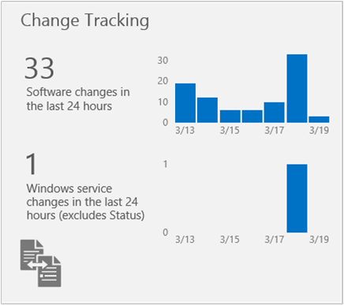
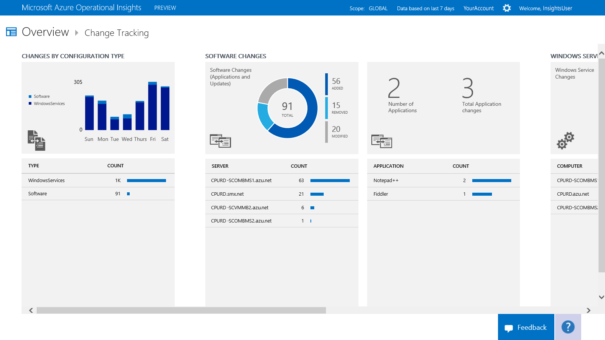
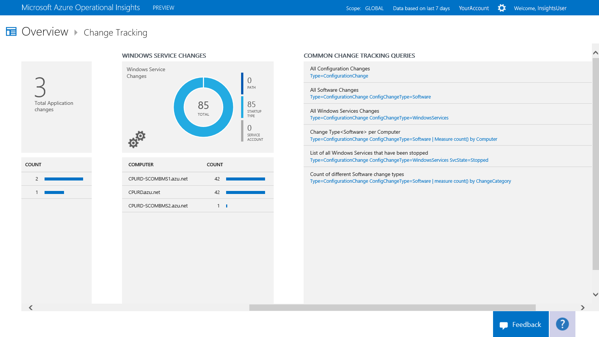

<properties 
   pageTitle="Identify differences with Change Tracking"
   description="Use the Configuration Change Tracking intelligence pack in Microsoft Azure Operational Insights to help you easily identify software and Windows Services changes that occur in your environment"
   services="operational-insights"
   documentationCenter=""
   authors="bandersmsft"
   manager="jwhit"
   editor="" />
<tags 
   ms.service="operational-insights"
   ms.devlang="na"
   ms.topic="article"
   ms.tgt_pltfrm="na"
   ms.workload="na"
   ms.date="04/30/2015"
   ms.author="banders" />

# Identify differences with Change Tracking

[AZURE.INCLUDE [operational-insights-note-moms](../includes/operational-insights-note-moms.md)]

You can use the Configuration Change Tracking intelligence pack in Microsoft Azure Operational Insights to help you easily identify software and Windows Services changes that occur in your environment — identifying these configuration changes can help you pinpoint operational issues.

You install the intelligence pack to update the Operations Manager agent and base configuration module for Operational Insights. Changes to installed software and Windows services on the monitored servers are read and then the data is sent to the Operational Insights service in the cloud for processing. Logic is applied to the received data and the cloud service records the data. When changes are found, servers with changes are shown in the Change Tracking dashbaoard. By using the information on the Change Tracking dashboard, you can easily see the changes that were made in your server infrastructure.

## Use Change Tracking

Before you can use Change Tracking in Operational Insights, you must have the intelligence pack installed. To read more about installing intelligence packs, see [Use the Gallery to add or remove intelligence packs](operational-insights-add-intelligence-pack.md). 

After it is installed, you can view the summary of changes for your monitored servers by using the **Change Tracking** tile on the **Overview** page in Operational Insights. 

You can view changes to your infrastructure and then drill-into details for the following categories:

- Changes by configuration type for software and Windows services

- Software changes to applications and updates for individual servers

- Total number of software changes for each application

- Windows service changes for individual servers

### To view changes for any change type

1. On the **Overview** page, click the **Change Tracking** tile.

2. On the **Change Tracking** dashboard, review the summary information in one of the change type blades and then click one to view detailed information about it in the **Search** page.

3. On any of the Search pages, you can view results by time, detailed results, and your search history. You can also filter by facets to narrow the results.

4. On any page in Search, you can **Export** the results details into a CSV file that you can open with Excel or other application that you can then view or modify.
