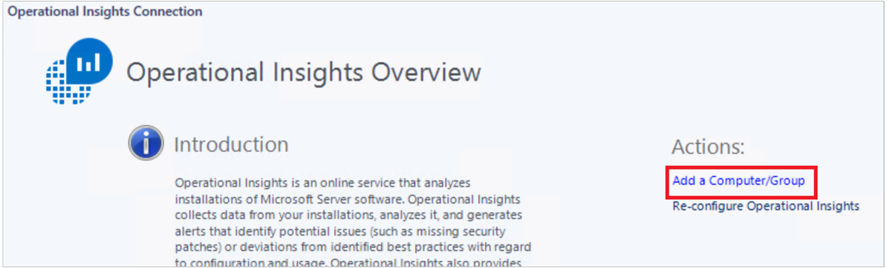

<properties 
   pageTitle="Connect to Operational Insights from System Center Operations Manager" 
   description="Learn about how to connect to Operational Insights through Operations Manager." 
   services="operational-insights" 
   documentationCenter="" 
   authors="lauracr" 
   manager="jwhit" 
   editor=""/>

<tags
   ms.service="operational-insights"
   ms.devlang="na"
   ms.topic="article"
   ms.tgt_pltfrm="na"
   ms.workload="na" 
   ms.date="04/30/2015"
   ms.author="lauracr"/>

# Connect to Operational Insights from System Center Operations Manager 

[AZURE.INCLUDE [operational-insights-note-moms](../includes/operational-insights-note-moms.md)]

You can connect Operational Insights to an existing System Center Operations Manager environment. This will allow you to use existing Operations Manager agents for data collection. For additional information about using Operations Manager with Operational Insights, see [Operations Manager considerations with Operational Insights](operational-insights-operations-manager.md).

If you use Operations Manager to monitor any of the following workloads, then you'll need to set Operations Manager run-as accounts for them. See [Operations Manager run-as accounts for Operational Insights](operational-insights-run-as.md) for more information about setting the accounts.

- SQL Assessment
- Virtual Machine Manager
- Lync Server
- SharePoint

 >[AZURE.NOTE] Support for Operational Insights is available as of Operations Manager 2012 SP1 UR6 and Operations Manager 2012 R2 UR2. Proxy support was added in System Center Operations Manager 2012 SP1 UR7 and System Center Operations Manager 2012 R2 UR3.

## To connect Operations Manager to Operational Insights and add agents

1. In the Operations Manager console, click **Administration**.

2. Expand the **Operational Insights** node and click **Operational Insights Connection**.

3. Click the **Register to Operational Insights** link and follow the onscreen instructions. 

4. After completing the registration wizard, click **Add a Computer/Group**.

5. In the **Computer Search** dialog box you can search for computers or groups monitored by Operations Manager. Select computers or groups to onboard to Operational Insights, click **Add**, and then click **OK**.

## Next steps

[Configure Proxy and Firewall settings (Optional)](operational-insights-proxy-firewall.md)
