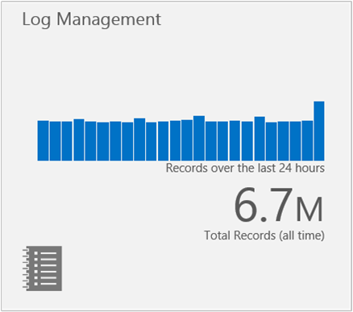
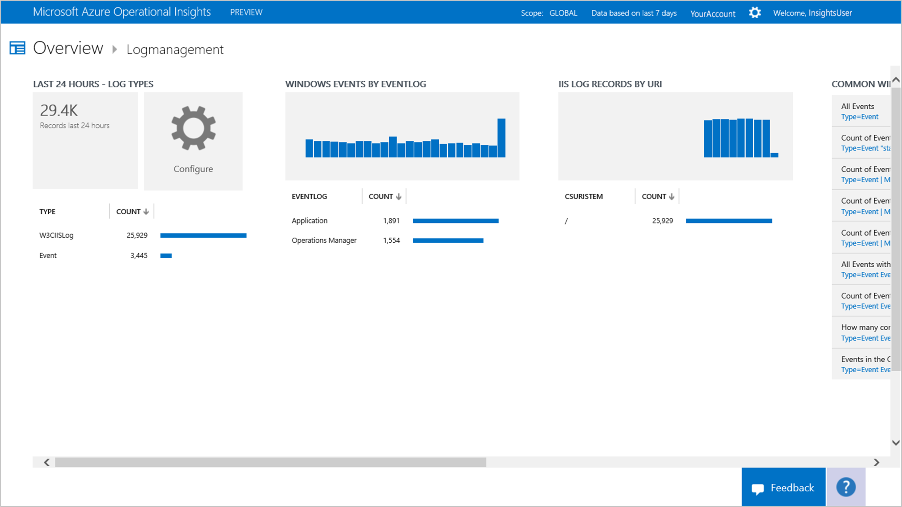
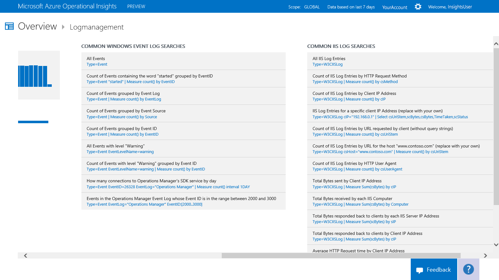

<properties 
   pageTitle="How to use Log Management" 
   description="With Log Management in Microsoft Azure Operational Insights you can view log events collected from your monitored servers" 
   services="operational-insights" 
   documentationCenter="" 
   authors="bandersmsft" 
   manager="jwhit" 
   editor=""/>

<tags
   ms.service="operational-insights"
   ms.devlang="na"
   ms.topic="article"
   ms.tgt_pltfrm="na"
   ms.workload="operational-insights" 
   ms.date="04/30/2015"
   ms.author="banders"/>

# Use Log Management

[AZURE.INCLUDE [operational-insights-note-moms](../includes/operational-insights-note-moms.md)]

Before you can use Log Management in Microsoft Azure Operational Insights, you must have the intelligence pack installed. Since this pack must be configured and does not collect anything by default, it is enabled by default in every new workspace. If you have removed it, you can add it again from the Intelligence Packs Gallery, see [Use the Gallery to add or remove intelligence packs](operational-insights-add-intelligence-pack.md). 

You can add new logs to collect events and choose which event levels or severity that you want to collect for the logs.
After Log Management is configured, it will then push your collection policy down and start collecting events.
You can access some initial breakdowns of log events collected from your monitored servers by using the **Log Management** tile on the **Overview** page in Operational Insights. 

The tile opens the **Log Management** page where you can view a summary of the events contained in the logs.
Or you can use search directly, like for any other data type.

The page details the following categories:

- Windows event logs
- IIS logs
- Other logs that you’ve added

## IIS Log File Format

The only IIS log format supported at the moment is W3C. Don't worry - it's the most common format, and the default format in IIS 7 and IIS 8. So, if you log in NCSA or IIS native format, Operational Insights won't pick those logs up at all. Even in W3C format, you’ll see that not all fields are logged by default. You can read more about the format at [Select W3C Fields to Log (IIS 7)](https://technet.microsoft.com/library/cc754702(v=WS.10).aspx). 

> [AZURE.TIP] For the best search experience, we recommend selecting all logging fields for each website using **Logging** in IIS. We also recommend changing the **Log File Rollover** schedule for new logs to **Hourly** - so smaller files will be uploaded to the cloud, saving bandwidth.

### To collect Windows event logs from Operations Manager or directly-connected agents

1. On the **Overview** page, click the **Log Management** tile. 

2. On the **Log Management** dashboard, click the **Configure** tile.
 
3. Type the name of the event log that you want to collect information from. If you’re unsure of the name to use, select the properties of the Windows event log in **Event Viewer**, copy the name in the **FullName** field, and paste it in the **Collect events from the following Event Logs** box.

4. Click **+** to add the log.

5. Select the event levels or severity that you want to collect for the log. **Audit Success** and **Audit Failure** events are not supported in this release.

6. Repeat the previous steps for each log that you want to collect information from, and then click **Save**.

7. Events should appear in Operational Insights in a few minutes, and then you can search the data. 

### To collect IIS logs from Operations Manager or directly-connected agents

1. On the **Overview** page, click the **Log Management** tile. 

2. On the **Log Management** dashbaord, click the **Configure** tile.
 
3. Under **IIS LOGS**, select **Collect logs from Operations Manager**.

### To collect IIS logs and/or Windows Events from Azure Diagnostics
This is configurable from the Azure Management Portal, not the Operational Insights portal, under your workspace, go to the **Storage** tab and you can enable log collection from that storage account.

### To work with log files
 
1. On the **Overview** page, click the **Log Management** tile.

2. On the **Log Management** dashbaord, view the event logs and choose one to work with.
  
3. Click any item to view detailed information about it in the **Search** page.

4. You can perform additional searches from the initial results and then analyze and correlate logs.

 
## Additional resources
- [IIS Log Format Requirements in Azure Operational Insights](http://blogs.technet.com/b/momteam/archive/2014/09/19/iis-log-format-requirements-in-system-center-advisor.aspx)
- See what other data sources and types of logs the community is asking us to implement in our [Feedback forum](http://feedback.azure.com/forums/267889-azure-operational-insights/category/88086-log-management-and-log-collection-policy).
