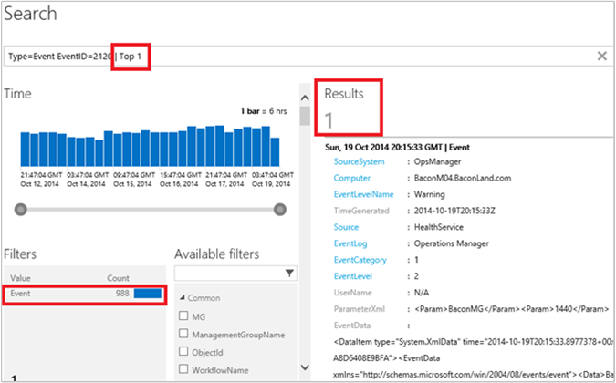
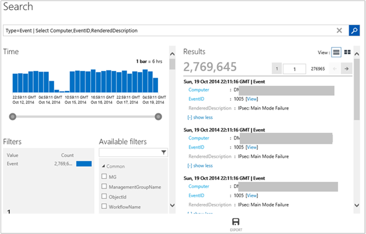
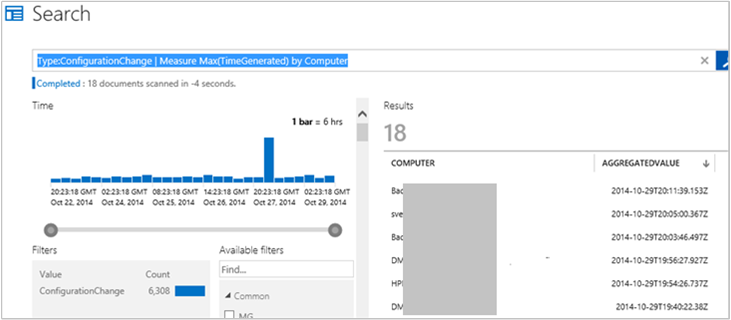
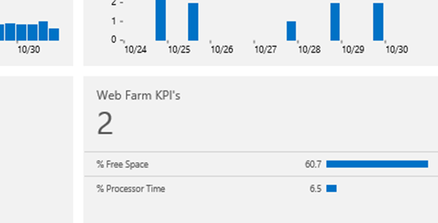
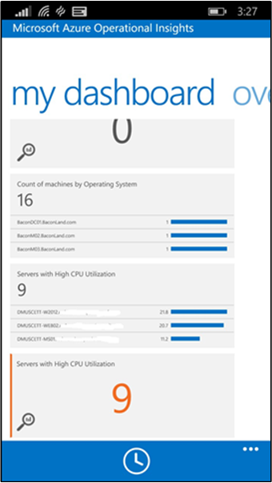

<properties 
   pageTitle="Search for data in Operational Insights"
   description="You can use search in Microsoft Azure Operational Insights to find data that you’re looking for"
   services="operational-insights"
   documentationCenter=""
   authors="bandersmsft"
   manager="jwhit"
   editor="" />
<tags 
   ms.service="operational-insights"
   ms.devlang="na"
   ms.topic="article"
   ms.tgt_pltfrm="na"
   ms.workload="tbd"
   ms.date="04/30/2015"
   ms.author="banders" />

# Search for data in Operational Insights

[AZURE.INCLUDE [operational-insights-note-moms](../includes/operational-insights-note-moms.md)]

At the core of Microsoft Azure Operational Insights is the search feature which allows you to combine and correlate any machine data from multiple sources within your environment. Intelligence Packs are also powered by search to bring you metrics pivoted around a particular problem area. 

On the Search page, you can create a query, and then when you search, you can filter the results by using facet controls. You can also create advanced queries to transform, filter, and report on your results.

Common search queries appear on most intelligence pack pages. Throughout the Operational Insights console, you can click tiles or drill in to other items to view details about the item by using Search.

In this tutorial, we'll walk through examples to cover all the basics when you use Search. 

We'll start with simple, practical examples and then build on them so that you can get an understanding of practical use cases about how to use the syntax to extract the insights you want from the data.

When you conduct searches in Operational Insights, you'll use the following techniques:

- Use basic filters
- Use additional filters
- Manipulate search results
- Use the measure command
- Use the max and min functions with the measure command
- Use the avg function with the measure command
- Use the where command

After you've familiar with search techniques, you can review the [Search syntax reference](#search-syntax-reference) and the [Search field and facet reference](#search-field-and-facet-reference).

## Use basic filters

The first thing to know is that the first part of a search query, before any “|” vertical pipe character, is always a *filter*. You can think of it as a WHERE clause in TSQL--it determines *what* subset of data to pull out of the Operational Insights data store. Searching from a the data store is largely about specifying the characteristics of the data that you want to extract, so it is natural that a query would start with the WHERE clause.

The most basic filters you can use are *keywords*, such as ‘error’ or ‘timeout’, or a computer name. These types of simple queries generally return diverse shapes of data within the same result set. This is because Operational Insights has different *types* of data in the system. 


### To conduct a simple search
1. In the Operational Insights portal, click **Search Data Explorer**.


2. In the query field, type `error` and then click **Search**.


For example, the query for `error` in the following image returned 100,000 **Event** records (collected by Log Management), 18 **Alert** records (generated by Configuration Assessment) and 12 **ConfigurationChange** records (captured by the Change Tracking).


These filters are not really object types/classes. *Type* is just a tag, or a property, or a string/name/category, that is attached to a piece of data. Some documents in the system are tagged as **Type:Alert** and some are tagged as **Type:PerfHourly**, or **Type:Event**, and so on. Each search result, document, record, or entry displays all the raw properties and their values for each of those pieces of data, and you can use those field names to specify in the filter when you want to retrieve only the records where the field has that given value.

*Type* is really just a field that all records have, it is not different from any other field. This was established based on the value of the Type field. That record will have a different shape or form. Incidentally, **Type=PerfHourly**, or **Type=Event** is also the syntax that you need to learn to query for hourly performance data aggregates or events. 

You can use either a colon (:) or a equal sign (=) after the field name and before the value. **Type:Event** and **Type=Event** are equivalent in meaning, you can chose the style you prefer.

So, if the Type=PerfHourly records have a field called 'CounterName', then you can write a query resembling `Type=PerfHourly CounterName="% Processor Time"`.

This will give you only the performance data where the performance counter name is "% Processor Time". 

### To search for processor time performance data
- In the search query field, type `Type=PerfHourly CounterName="% Processor Time"`

You can also be more specific and use **InstanceName=_'Total'** in the query, which is a Windows performance counter. You can also select a facet and another **field:value**. The filter is automatically added to your filter in the query bar. You can see this in the following image. It shows you where to click to add **InstanceName:’_Total’** to the query without typing anything.


Your query now becomes `Type=PerfHourly CounterName=”% Processor Time” InstanceName=”_Total”`

In this example, you don't have to specify **Type=PerfHourly** to get to this result. Because the fields CounterName and InstanceName only exist for records of Type=PerfHourly, the query is specific enough to return the same results as the longer, previous one: 
```
CounterName=”% Processor Time” InstanceName=”_Total”
```

This is because all the filters in the query are evaluated as being in *AND* with each other. Effectively, the more fields you add to the criteria, you get less, more specific and refined results. 

For example, the query `Type=Event EventLog="Windows PowerShell"` is identical to `Type=Event AND EventLog="Windows PowerShell"`. It returns all events that were logged in and collected from the Windows PowerShell event log. If you add a filter multiple times by repeatedly selecting the same facet, then the issue is purely cosmetic--it might clutter the Search bar, but it still returns the same results because the implicit AND operator is always there.

You can easily reverse the implicit AND operator by using a NOT operator explicitly. For example: 

`Type:Event NOT(EventLog:"Windows PowerShell")` or it's equivalent `Type=Event EventLog!="Windows PowerShell"` return all events from all other logs that are NOT the Windows PowerShell log.

Or, you can use other Boolean operator such as ‘OR’. The following query returns records for which the EventLog is either Application OR System.

```
EventLog=Application OR EventLog=System
```

Using the above query, you’ll get entries for both logs in the same result set. 

However, if you remove the OR by leaving the implicit AND in place, then the following query will not produce any results because there isn’t an event log entry that belongs to BOTH logs. Each event log entry was written to only one of the two logs.

```
EventLog=Application EventLog=System
```


## Use additional filters

The following query returns entries for 2 event logs for all the computers that have sent data.

```
EventLog=Application OR EventLog=System
```


Selecting one of the fields or filters will narrow the query to a specific computer, excluding all other ones. The resulting query would resemble the following.

```
EventLog=Application OR EventLog=System Computer=SERVER1.contoso.com
```

Which is equivalent to the following, because of the implicit AND.

```
EventLog=Application OR EventLog=System AND Computer=SERVER1.contoso.com
```

Each query is evaluated in the following explicit order. Note the parenthesis.

```
(EventLog=Application OR EventLog=System) AND Computer=SERVER1.contoso.com
```

Just like the event log field, you can retrieve data only for a set of specific computers by adding OR. For example:

```
(EventLog=Application OR EventLog=System) AND (Computer=SERVER1.contoso.com OR Computer=SERVER2.contoso.com OR Computer=SERVER3.contoso.com)
```

Similarly, this the following query return **% CPU Time** for the selected two computers only.

```
CounterName=”% Processor Time”  AND InstanceName=”_Total” AND (Computer=SERVER1.contoso.com OR Computer=SERVER2.contoso.com)
```


### Boolean operators
With datetime and numeric fields, you can search for values using *greater than*, *lesser than*, and *lesser than or equal*. You can use simple operators such as >, < , >=, <= , != in the query search bar.


You can query a specific event log for a specific period of time. For example, the last 24 hours is expressed with the following mnemonic expression.

```
EventLog=System TimeGenerated>NOW-24HOURS
```


#### To search using a boolean operator
- In the search query field, type `EventLog=System TimeGenerated>NOW-24HOURS"`


Although you can control the time interval graphically, and most times you might want to do that, there are advantages to including a time filter directly into the query. For example, this works great with dashboards where you can override the time for each tile, regardless of the *global* time selector on the dashboard page. For more information, see [Time Matters in Dashboard](http://cloudadministrator.wordpress.com/2014/10/19/system-center-advisor-restarted-time-matters-in-dashboard-part-6/).

When filtering by time, keep in mind that you get results for the *intersection* of the two time periods: the one specified in the Operational Insights portal (S1) and the one specified in the query (S2).


This means, if the time periods don’t intersect, for example in the Operational Insights portal where you choose **This week** and in the query where you define **last week**, then there is no intersection and you won't receive any results.

Comparison operators used for the TimeGenerated field are also useful in other situations. For example, with numeric fields.

For example, given that Configuration Assessment’s alerts have the following severity values:

- 0 = Information
- 1 = Warning
- 2 = Critical
 
You can query for both warning and critical alerts and also exclude informational ones with the following query:

```
Type=ConfigurationAlert  Severity>=1
```


You can also use range queries. This means that you can provide the beginning and end range of values in a sequence. For example, if you want events from the Operations Manager event log where the EventID is greater than or equal to 2100 but not greater than 2199, then the following query would return them.

```
Type=Event EventLog="Operations Manager" EventID:[2100..2199]
```


>[AZURE.NOTE] The range syntax you must use is the colon (:) field:value separator and *not* the equal sign (=). Enclose the lower and upper end of the range in square brackets and separate them with two periods (..).

## Manipulate search results

When you're searching for data, you'll want to refine your search query and have a good level of control over the results. When results are retrieved, you can apply commands to transform them.

Commands in Operational Insights searches *must* follow after the vertical pipe character (|). A filter must always be the first part of a query string. It defines the data set you're working with and then "pipes" those results into a command. You can then use the pipe to add additional commands. This is loosely similar to the Windows PowerShell pipeline. 

In general, the Operational Insights search language tries to follow PowerShell style and guidelines to make it similar to the IT pros, and to ease the learning curve. 

Commands have names of verbs so you can easily tell what they do.  

### Sort

The sort command allows you to define the sorting order by one or multiple fields. Even if you don’t use it, by default, a time descending order is enforced. The most recent results are always at the top of search results. This means that when you run a search, with `Type=Event EventID=1234` what really is executed for you is:

```
Type=Event EventID=1234 **| Sort TimeGenerated desc**
```

That's because it is the type of experience you are familiar with in logs. For example, in the Windows Event Viewer.

You can use Sort to change the way results are returned. The following examples show how this works.

```
Type=Event EventID=1234 | Sort TimeGenerated asc
```

```
Type=Event EventID=1234 | Sort Computer asc
```

```
Type=Event EventID=1234 | Sort Computer asc,TimeGenerated desc
```


The simple examples above show you how commands work--they change the shape of the results that the filter returned.

### Limit and top
Another less known command is LIMIT. Limit is a PowerShell-like verb. Limit is functionally identical to the TOP command. The following queries return the same results.

```
Type=Event EventID=2110 | Limit 1
```

```
Type=Event EventID=2110 | Top 1
```


#### To search using top
- In the search query field, type `Type=Event EventID=2110 | Top 1`



In the image above, there are 988 records with EventID=2110. The fields, facets, and filters on the left always show information about the results returned *by the filter portion* of the query, which is the the part before any pipe character. The **Results** pane only returns the most recent 1 result, because the example command shaped and transformed the results.

### Select

The SELECT command behaves like Select-Object in PowerShell. It returns filtered results that do not have all of their original properties. Instead, it selects only the properties that you specify.

#### To run a search using the select command

1. In Search, type `Type=Event` and then click **Search**.
2. Click **+ show more** in one of the results to view all the properties that the results have.
3. Select some of those explicitly, and the query changes to `Type=Event | Select Computer,EventID,RenderedDescription`.



This is command particularly useful when you want to control search output and choose only the portions of data that really matter for your exploration, which often isn’t the full record. This is also useful when records of different types have *some* common properties, but not *all* of their properties are common. The, you can generate output that looks more naturally like a table, or work well when exported to a CSV file and then massaged in Excel.

## Use the measure command

MEASURE is one of the most versatile commands in Operational Insights searches. It allows you to apply statistical *functions* to your data and aggregate results grouped by a given field. There are multiple statistical functions that Measure supports. 

### Measure count()

The first statistical function to work with, and one of the simplest to understand is the *count()* function.

Results from any search query such as `Type=Event`, show filters also called facets on the left side of search results. The filters show a distribution of values by a given field for the results in the search executed.


For example, in the image above you'll see the **Computer** field and it shows that within the almost 3 million events in the results, there are 20 unique and distinct values for the **Computer** field in those records. The tile only shows the top 5, which are the most common 5 values that are written in the **Computer** fields), sorted by the number of documents that contain that specific value in that field. In the image you can see that – among those almost 3 million events – 880 thousand come from the DM computer, 602 thousand from the DE computer, and so on.


What if you want to see all values, since the tile only shows only the top 5?

That’s what the measure command can do with the count() function. This function doesn't use any parameters. You just specify the field by which you want to group by – the **Computer** field in this case:

`Type=Event | Measure count() by Computer`


However, **Computer** is just a field used *in* each piece of data – there are no relational databases involved and there is no separate **Computer** object anywhere. Just the values *in* the data can describe which entity generated them, and a number of other characteristics and aspects of the data – hence the term *facet*. However, you can just as well group by other fields. Because the original results of almost 3 million events that  are piped into the measure command also have a field called **EventID**, you can apply the same technique to group by that field and get a count of events by EventID:

```
Type=Event | Measure count() by EventID
```

If you're not interested in the actual record count that contain a specific value, but instead if you only want a list of the values themselves, you can add a *Select* command at the end of it and just select the first column:

```
Type=Event | Measure count() by EventID | Select EventID
```

Then you can get more intricate and pre-sort the results in the query, or you can just click the columns in the grid, too.

```
Type=Event | Measure count() by EventID | Select EventID | Sort EventID asc
```

#### To search using measure count

- In the search query field, type `Type=Event | Measure count() by EventID`
- Append `| Select EventID` to the end of the query.
- Finally, append `| Sort EventID asc` to the end of the query.


There are a couple important points to notice and emphasize:

First, the results you see are not the original raw results anymore. Instead, they are aggregated results – essentially groups of results. This isn't a problem, but you should understand that you're interacting with a very different shape of data that differs from the original raw shape that gets created on the fly as a result of the aggregation/statistical function.

Second, **Measure count** currently returns only the top 100 distinct results. This limit does not apply to the other statistical functions. So, you'll usually need to use a more precise filter first to search for specific items before you apply measure count().

## Use the max and min functions with the measure command

There are various scenarios where **Measure Max()** and **Measure Min()** are useful. However, since each function is opposite of each other, we'll illustrate Max() and you can experiment with Min() on your own.

If you query for Configuration Assessment alerts, they have a **Severity** property that can be 0,1, or 2 representing information, warning, and critical. For example:

```
Type=Alert
```


If you want to view the highest value for all of the alerts given a common Computer, the group by field, you can use

```
Type=Alert | Measure Max(Severity) by Computer
```


It will display that for the computers that had **Alert** records, most of them have at least one critical alert, and the Bacc computer has a warning as its worst severity.

```
Type=Alert | Measure Max(Severity) by Computer
```



This function works well with numbers, but it also works with DateTime fields. It is useful to check for the last or most recent time stamp for any piece of data indexed for each computer. For example : When was the most recent configuration change reported by change tracking Intelligence Pack for each machine?

```
Type=ConfigurationChange | Measure Max(TimeGenerated) by Computer
```

## Use the avg function with the measure command

The Avg() statistical function used with measure allows you to calculate the average value for some field, and group results by the same or other field. This is useful in a variety of cases, such as performance data.

We'll start with performance data. However, note that Operational Insights currently collects only certain fabric-related performance counters for Virtual Machine Manager and Hyper-V hosts as part of the Capacity Management intelligence pack.

To search for *all* performance data, the most basic query is:

```
Type=PerfHourly
```


The first thing you'll notice is that Operational Insights shows you charts of the performance counters. At the bottom of the results, you'll see the actual records behind the charts.


In the image above, there are two sets of fields marked that indicate the following:

- the first set identifies Windows Performance Counter Name, Object Name, and Instance Name in the query filter. These are the fields you probably will most commonly use as facets/filters
- **SampleValue** is the actual value of the counter
- in the query, **Type=PerfHourly** is an hourly aggregate
- **TimeGenerated** is 21:00, in 24-hour time format. It is the aggregation for that hourly period from 20:00 to 21:00.
- **SampleCount** is the aggregation, computed using 12 samples (one every 5 minutes)
- the **min**, **max**, and **Percentile95** for the hourly period was, in this example for memory in a virtual machine, 6144 (megabytes)
- **SampleValue** is an hourly aggregate and it is populated with the *average* for the hourly period and is what is used to plot the performance charts

After reading about the PerfHourly record shape, and having read about other search techniques, you can use measure Avg() to aggregate this type of numerical data.

Here's a simple example:

```
Type=PerfHourly  ObjectName:Processor  InstanceName:_Total  CounterName:"% Processor Time" | Measure Avg(SampleValue) by Computer
```


In this example, you select the CPU Total Time performance counter and average by Computer. Because **SampleValue** is already an average, you actually query for an average of an average. That’s correct with Type=PerfHourly at this point. You should always use a filter on TimeGenerated to restrict the operation to a small or recent dataset, such as the last 4 hours--not 7 days. 

So the query above becomes:

```
Type=PerfHourly  ObjectName:Processor  InstanceName:_Total  CounterName:"% Processor Time" TimeGenerated>NOW-4HOURS | Measure Avg(SampleValue) by Computer
```

### To search using the avg function with the measure command
1. In the Search query box, type `Type=PerfHourly  ObjectName:Processor  InstanceName:_Total  CounterName:"% Processor Time" TimeGenerated>NOW-4HOURS | Measure Avg(SampleValue) by Computer`.
2. Notice that the recent average will generally be higher.
3. Calculate the average of the Maximum hourly values by revising your search query with `Type=PerfHourly  ObjectName:Processor  InstanceName:_Total  CounterName:"% Processor Time" TimeGenerated>NOW-4HOURS | Measure Avg(Max) by Computer`

You can aggregate and correlate data *across* computers. For example, imagine that you have a set of hosts in some sort of farm where each node is equal to any other one and they just do all the same type of work and load should be roughly balanced. You could get their counters all in one go with the following query and get averages for the entire farm. You can start by choosing the computers with the following example:

```
Type=PerfHourly AND (Computer=”SERVER1.contoso.com” OR Computer=”SERVER2.contoso.com” OR Computer=”SERVER3.contoso.com”)
```

Now that you have the computers, you also only want to select two key performance indicators (KPIs): % CPU Usage and % Free Disk Space. So, that part of the query becomes:

```
Type=PerfHourly  InstanceName:_Total  ((ObjectName:Processor AND CounterName:"% Processor Time") OR (ObjectName="LogicalDisk" AND CounterName="% Free Space")) AND TimeGenerated>NOW-4HOURS
```

Now you can add computers and counters with the following example:

```
Type=PerfHourly  InstanceName:_Total  ((ObjectName:Processor AND CounterName:"% Processor Time") OR (ObjectName="LogicalDisk" AND CounterName="% Free Space")) AND TimeGenerated>NOW-4HOURS AND (Computer=”SERVER1.contoso.com” OR Computer=”SERVER2.contoso.com” OR Computer=”SERVER3.contoso.com”)
```

Because you have a very specific selection, the **measure Avg()** command can return the average not by computer, but across the farm, simply by grouping by CounterName. For example:

```
Type=PerfHourly  InstanceName:_Total  ((ObjectName:Processor AND CounterName:"% Processor Time") OR (ObjectName="LogicalDisk" AND CounterName="% Free Space")) AND TimeGenerated>NOW-4HOURS AND (Computer=”SERVER1.contoso.com” OR Computer=”SERVER2.contoso.com” OR Computer=”SERVER3.contoso.com”) | Measure Avg(SampleValue) by CounterName
```

This gives you a useful compact view of a couple of your environment's KPIs. 


You can easily use this in a dashboard. To learn more about using dashboards, see [Operational Insights dashboards](operational-insights-use-dashboards). 



### Use the sum function with the measure command

The sum function is similar to other functions of the measure command. You can see an example about how to use the sum function at [W3C IIS Logs Search in Microsoft Azure Operational Insights](http://blogs.msdn.com/b/dmuscett/archive/2014/09/20/w3c-iis-logs-search-in-system-center-advisor-limited-preview.aspx). 

You can use Max() and Min() with numbers, datetimes and text strings. With text strings, they are sorted alphabetically and you get first and last.

However, you cannot use Sum() with anything other than numerical fields. This also applies to Avg().

## Use the where command 

The where command works like a filter, but it can be applied in the pipeline to further filter aggregated results that have been produced by a Measure command – as opposed to raw results that are filtered at the beginning of a query.

For example:

```
Type=PerfHourly  CounterName="% Processor Time"  InstanceName="_Total" | Measure Avg(SampleValue) as AVGCPU by Computer
```

You can add another pipe “|” character and the Where command to only get computers whose average CPU is above 80%, with the following example:

```
Type=PerfHourly  CounterName="% Processor Time"  InstanceName="_Total" | Measure Avg(SampleValue) as AVGCPU by Computer | Where AVGCPU>80
```

If you're familiar with Microsoft System Center - Operations Manager, you can think of the where command in management pack terms. If the example were a rule, the first part of the query would be the data source and the where command would be the condition detection.

You can use the query as a tile in **My Dashboard**, as a monitor of sorts, to see when computer CPUs are over-utilized. To learn more about dashboards, see [Operational Insights dashboards](operational-insights-use-dashboards). You can also create and use dashboards using the mobile app. For more information, see [Azure Operational Insights Mobile App ](http://www.windowsphone.com/en-us/store/app/operational-insights/4823b935-83ce-466c-82bb-bd0a3f58d865). In the bottom two tiles of the following image, you can see the monitor displayed a list and as a number. Essentially, you always want the number to be zero and the list to be empty. Otherwise, it indicates an alert condition. If needed, you can use it to take a look at which machines are under pressure.



## Search syntax reference

The following reference section about search language describe the general query syntax options you can use when searching for data and filtering expressions to help narrow your search. It also describes commands that you can use to take action on the data retrieved.

You can read about the fields returned in searches and the facets that help you dill-into similar categories of data at [Search field and facet reference](#Search-field-and-facet-reference).

### General query syntax

Syntax:

filterExpression | command1 | command2 …

The filter expression (**filterExpression**) defines the "where" condition for the query. The commands apply to the results returned by the query. Multiple commands must be separated by the pipe character ( | ).

#### General syntax examples

Examples:

	system

This query returns results that contain the word "system" in any field that has been indexed for full text or terms searching.

>[AZURE.NOTE] Not all fields are indexed this way, but the most common textual fields (such as descriptions and names) typically would be.

	system error

This query returns results that contain the words "system" and "error."

	system error | sort ManagementGroupName, TimeGenerated desc | top 10

This query returns results that contain the words "system" and "error." It then sorts the results by the **ManagementGroupName** field (in ascending order), and then by **TimeGenerated** (in descending order). It takes only the first 10 results.

>[AZURE.IMPORTANT] All the field names and the values for the string and text fields are case sensitive.

### Filter expression

The following subsections explain the filter expressions.

#### String literals

A string literal is any string that is not recognized by the parser as a keyword or a predefined data type (for example, a number or date).

Examples:

	These all are string literals


This query searches for results that contain occurrences of all five words. To perform a complex string search, enclose the string literal in quotation marks, for example:

	" Windows Server"

This only returns results with exact matches for “Windows Server”

#### Numbers

The parser supports the decimal integer and floating-point number syntax for numerical fields.

Examples:

	Type:PerfHourly 0.5


	HTTP 500

#### Date/Time

Every piece of data in the system has a **TimeGenerated** property, which represents the original date and time of the record. Some types of data can additionally have more Date/Time fields (for example, **LastModified**).

The timeline Chart/Time selector in Operational Insights shows a distribution of results over time (according to the current query being run), based on the **TimeGenerated** field. Date/Time fields have a specific string format that can be used in queries to restrict the query to a particular timeframe. You can also use syntax to refer to relative time intervals (for example, "between 3 days ago and 2 hours ago").

Syntax:

	yyyy-mm-ddThh:mm:ss.dddZ


	yyyy-mm-ddThh:mm:ss.ddd


	yyyy-mm-ddThh:mm:ss


	yyyy-mm-ddThh:mm:ss


	yyyy-mm-ddThh:mm


	yyyy-mm-dd


Example:

	TimeGenerated:2013-10-01T12:20

The previous command returns only records with a **TimeGenerated** value of exactly 12:20 on October 1, 2013. It is unlikely that it will provide any result, but you understand the idea.

The parser also supports the mnemonic Date/Time value, NOW.

Example:


Again, it is unlikely that this will yield any result because data doesn’t make it through the system that fast.

These examples are building blocks to use for relative and absolute dates. In the next three subsections, we’ll explain how to use them in more advanced filters with examples that use relative date ranges.

#### Date/Time math

Use the Date/Time math operators to offset or round the Date/Time value by using simple Date/Time calculations.

Syntax:

	datetime/unit


	datetime[+|-]count unit


<table border="1" cellspacing="4" cellpadding="4">
	<tr>
		<th>Operator</th>
		<th>Description</th>
	</tr>
	<tr>
		<td>
		<p>/</p>
		</td>
		<td>
		<p>Rounds Date/Time to the specified unit. </p>
		<p>Example:&nbsp;NOW/DAY rounds the current Date/Time to the midnight of the 
		current day. </p>
		</td>
	</tr>
	<tr>
		<td>
		<p>+ or -</p>
		</td>
		<td>
		<p>Offsets Date/Time by the specified number of units</p>
		<p>Examples:&nbsp; </p>
		<ul>
			<li class="unordered">NOW+1HOUR offsets the current Date/Time by one 
			hour ahead.<br><br></li>
			<li class="unordered">2013-10-01T12:00-10DAYS offsets the Date value 
			back by 10 days.</li>
		</ul>
		</td>
	</tr>
</table>


You can chain the Date/Time math operators together, for example:

	NOW+1HOUR-10MONTHS/MINUTE

The following table lists the supported Date/Time units.

<table border="1" cellspacing="4" cellpadding="4"><table>
	<tr>
		<th>Date/Time unit </th>
		<th>Description </th>
	</tr>
	<tr>
		<td>
		<p>YEAR, YEARS</p>
		</td>
		<td>
		<p>Rounds to current year, or offsets by the specified number of years.</p>
		</td>
	</tr>
	<tr>
		<td>
		<p>MONTH, MONTHS</p>
		</td>
		<td>
		<p>Rounds to current month, or offsets by the specified number of 
		months.</p>
		</td>
	</tr>
	<tr>
		<td>
		<p>DAY, DAYS, DATE</p>
		</td>
		<td>
		<p>Rounds to current day of the month, or offsets by the specified 
		number of days.</p>
		</td>
	</tr>
	<tr>
		<td>
		<p>HOUR, HOURS</p>
		</td>
		<td>
		<p>Rounds to current hour, or offsets by the specified number of hours.</p>
		</td>
	</tr>
	<tr>
		<td>
		<p>MINUTE, MINUTES</p>
		</td>
		<td>
		<p>Rounds to current minute, or offsets by the specified number of 
		minutes.</p>
		</td>
	</tr>
	<tr>
		<td>
		<p>SECOND, SECONDS</p>
		</td>
		<td>
		<p>Rounds to current second, or offsets by the specified number of 
		seconds.</p>
		</td>
	</tr>
	<tr>
		<td>
		<p>MILLISECOND, MILLISECONDS, MILLI, MILLIS</p>
		</td>
		<td>
		<p>Rounds to current millisecond, or offsets by the specified number of 
		milliseconds.</p>
		</td>
	</tr>
</table>


#### Field facets

By using field facets, you can specify the search condition for specific fields and their exact values, as opposed to writing "free text" queries for various terms throughout the index. We have already used this syntax in several examples in the previous paragraphs. Here, we provide more complex examples.

**Syntax**

*field:value*

*field=value*

**Description**

Searches the field for the specific value. The value can be a string literal, number, or Date/Time.

Example:


	TimeGenerated:NOW


	ObjectDisplayName:"server01.contoso.com"


	SampleValue:0.3

**Syntax**

*field>value*

*field<value*

*field>=value*

*field<=value*

*field!=value*

**Description**

Provides comparisons.

Example:

	TimeGenerated>NOW+2HOURS


**Syntax**

*field:[from..to]*

**Description**

Provides range faceting.

Example:

	TimeGenerated:[NOW..NOW+1DAY]


	SampleValue:[0..2]
#### Logical operators

The query languages support the logical operators (AND, OR, and NOT) and their C-style aliases (&&, ||, and !) respectively. You can use parentheses to group these operators.

Examples:

	system OR error


	Type:Alert AND NOT(Severity:1 OR ObjectId:"8066bbc0-9ec8-ca83-1edc-6f30d4779bcb8066bbc0-9ec8-ca83-1edc-6f30d4779bcb")
You can omit the logical operator for the top-level filter arguments. In this case, the AND operator is assumed.


<table border="1" cellspacing="4" cellpadding="4"><table>
	<tr>
		<th>Filter expression</th>
		<th>Equivalent to</th>
	</tr>
	<tr>
		<td>
		<p>system error</p>
		</td>
		<td>
		<p>system AND error</p>
		</td>
	</tr>
	<tr>
		<td>
		<p>system &quot; Windows Server&quot; OR Severity:1</p>
		</td>
		<td>
		<p>system AND (&quot;Windows Server&quot; OR Severity:1)</p>
		</td>
	</tr>
</table>


### Commands

The commands apply to the results that are returned by the query. Use the pipe character ( | ) to apply a command to the retrieved results. Multiple commands must be separated by the pipe character.

>[AZURE.NOTE] Command names can be written in upper case or lower case, unlike the field names and the data.

#### Sort

Syntax:

	sort field1 asc|desc, field2 asc|desc, …

Sorts the results by particular fields. The asc/desc prefix is optional. If they are omitted, the "asc" sort order is assumed. If a query does not use the **Sort** command explicitly, Sort **TimeGenerated** desc is the default behavior, and it will always return the most recent results first.

#### Top/Limit

Syntax:

	top number


	limit number
Limits the response to the top N results.

Example:

	Type:Alert errors detected | top 10

Returns the top 10 matching results.

#### Skip

Syntax:

	skip number

Skips the number of results listed.

Example:

	Type:Alert errors detected | top 10 | skip 200

Returns top 10 matching results starting at result 200.

#### Select

Syntax:

	select field1, field2, ...

Limits results to the fields you choose.

Example:

	Type:Alert errors detected | select Name, Severity

Limits the returned results fields to **Name** and **Severity**.

#### Measure

The **measure** command is used to apply statistical functions to the raw search results. This is very useful to get *group-by* views over the data. When you use the **measure** command, Operational Insights displays a table with aggregated results.

Syntax:

	measure aggregateFunction([aggregatedField]) [as fieldAlias] by groupField [interval interval]


	measure aggregateFunction([aggregatedField])  interval interval

Aggregates the results by **groupField** and calculates the aggregated measure values by using **aggregatedField**.


<table border="1" cellspacing="4" cellpadding="4"><table>
	<tr>
		<th>Measure statistical function </th>
		<th>Description </th>
	</tr>
	<tr>
		<td>
		<p><em>aggregateFunction</em> </p>
		<p></p>
		</td>
		<td>
		<p>The name of the aggregate function (case insensitive). The following 
		aggregate functions are supported :</p>
		<ul>
			<li class="unordered">COUNT<br><br></li>
			<li class="unordered">MAX<br><br></li>
			<li class="unordered">MIN<br><br></li>
			<li class="unordered">SUM<br><br></li>
			<li class="unordered">AVG<br><br></li>
			<li class="unordered">STDDEV<br><br></li>
		</ul>
		</td>
	</tr>
	<tr>
		<td>
		<p><em>aggregatedField</em> </p>
		</td>
		<td>
		<p>The field that is being aggregated. This field is optional for the 
		COUNT aggregate function, but has to be an existing numeric field for 
		SUM, MAX, MIN, AVG, or STDDEV.</p>
		</td>
	</tr>
	<tr>
		<td>
		<p><em>fieldAlias</em> </p>
		</td>
		<td>
		<p>The (optional) alias for the calculated aggregated value. If not 
		specified, the field name will be <em>AggregatedValue.</em></p>
		</td>
	</tr>
	<tr>
		<td>
		<p><em>groupField</em> </p>
		</td>
		<td>
		<p>The name of the field that the result set is grouped by. </p>
		</td>
	</tr>
	<tr>
		<td>
		<p><em>Interval</em> </p>
		</td>
		<td>
		<p>The time interval in the format: </p>
		<p><em>nnnNAME</em> </p>
		<p></p>
		<p>Where: </p>
		<p>nnn is the positive integer number</p>
		<p><em>NAME</em> is the interval name</p>
		<p>Supported interval names include (case sensitive): </p>
		<ul>
			<li class="unordered">MILLISECOND[S]<br><br></li>
			<li class="unordered">SECOND[S]<br><br></li>
			<li class="unordered">MINUTE[S]<br><br></li>
			<li class="unordered">HOUR[S]<br><br></li>
			<li class="unordered">DAY[S]<br><br></li>
			<li class="unordered">MONTH[S]<br><br></li>
			<li class="unordered">YEAR[S]<br></li>
		</ul>
		</td>
	</tr>
</table>


The interval option can only be used in Date/Time group fields (such as **TimeGenerated** and **TimeCreated**). Currently, this is not enforced by the service, but a field without Date/Time that is passed to the backend will cause a runtime error. When the schema validation is implemented, the service API rejects queries that use fields without Date/Time for interval aggregation. The current **Measure** implementation supports interval grouping for the **Count** aggregate function only.

If the BY clause is omitted but an interval is specified (as a second syntax), the **TimeGenerated** field is assumed by default.

Examples:

**Example 1**

	Type:Alert | measure count() as Count by ObjectId

*Explanation*

Groups the alerts by **ObjectID** and calculates the number of alerts for each group. The aggregated value is returned as the **Count** field (alias).

**Example 2**

	Type:Alert | measure count() interval 1HOUR

*Explanation*

Groups the alerts by 1-hour intervals by using the **TimeGenerated** field, and returns the number of alerts in each interval.

**Example 3**

	Type:Alert | measure count() as AlertsPerHour interval 1HOUR

*Explanation*

Same as the previous example, but with an aggregated field alias (**AlertsPerHour**).

**Example 4**

	* | measure count() by TimeCreated interval 5DAYS

*Explanation*

Groups the results by 5-day intervals by using the **TimeCreated** field, and returns the number of results in each interval.

**Example 5**

	Type:Alert | measure max(Severity) by WorkflowName

*Explanation*

Groups the alerts by workload name, and returns the maximum alert severity value for each workflow.

**Example 6**

	Type:Alert | measure min(Severity) by WorkflowName

*Explanation*

Same as the previous example, but with the **Min** aggregated function.

**Example 7**

	Type:PerfHourly | measure avg(SampleValue) by ObjectId

*Explanation*

Groups PerfHourly by ObjectId and calculates the average (avg).

**Example 8**

	Type:PerfHourly | measure sum(SampleValue) by ObjectId

*Explanation*

Same as the previous example, but uses **Sum**.

**Example 9**

	Type:PerfHourly | measure stddev(SampleValue) by ObjectId

*Explanation*

Same as the previous example, but uses **STDDEV**.

**Example 10**

	Type:Alert | measure count() as Count by WorkflowName | sort Count desc | top 5

*Explanation*

Gets the top five workflows with the maximum number of alerts.

#### Where

Syntax:

**where** AggregatedValue>20

Can only be used after a **Measure** command to further filter the aggregated results that the **Measure** aggregation function has produced.

Examples:

	Type:PerfHourly CounterName:"% Total Run Time" | Measure max(Max) as MAXCPU by 

	Type:PerfHourly CounterName:"% Total Run Time" | Measure max(Max) by RootObjectName | where (AggregatedValue>50 and AggregatedValue<90)


## Search field and facet reference

When you use Search to find data, results display various field and facets. However, some of the information you’ll see might not appear very descriptive. You can use the following information to help you understand the results.

<table border="1" cellspacing="4" cellpadding="4">
	<tr>
		<th><b>Field</b></th>
		<th><b>Search Type<b></th>
		<th><b>Description</b></th>
	</tr>
	<tr>
		<td>
		<p>TenantId</p>
		</td>
		<td>
		<p>All</p>
		</td>
		<td>
		<p>Used to partition data</p>
		</td>
	</tr>
	<tr>
		<td>
		<p>TimeGenerated</p>
		</td>
		<td>
		<p>All</p>
		</td>
		<td>
		<p>Used to drive the timeline, timeselectors (in search and in other 
		screens). It represents when the piece of data was generated (typically 
		on the agent). The time is expressed in ISO format and is always UTC. In 
		the case of &#39;types&#39; that are based on existing instrumentation (i.e. 
		events in a log) this is typically the real time that the log 
		entry/line/record was logged at; for some of the other types that are 
		produced either via management packs or in the cloud - i.e. 
		recommendations/alerts/updateagent/etc, this is the time when this new 
		piece of data with a snapshot of a configuration of some sort was 
		collected or a recommendation/alert was produced based on it</p>
		</td>
	</tr>
	<tr>
		<td>
		<p>EventID</p>
		</td>
		<td>
		<p>Event</p>
		</td>
		<td>
		<p>EventID in the Windows event log</p>
		</td>
	</tr>
	<tr>
		<td>
		<p>EventLog</p>
		</td>
		<td>
		<p>Event</p>
		</td>
		<td>
		<p>Event Log where the event was logged by Windows</p>
		</td>
	</tr>
	<tr>
		<td>
		<p>EventLevelName</p>
		</td>
		<td>
		<p>Event</p>
		</td>
		<td>
		<p>Critical / warning / information / success</p>
		</td>
	</tr>
	<tr>
		<td>
		<p>EventLevel</p>
		</td>
		<td>
		<p>Event</p>
		</td>
		<td>
		<p>Numerical value for critical / warning / information / success (use 
		EventLevelName instead for easier/more readable queries)</p>
		</td>
	</tr>
	<tr>
		<td>
		<p>SourceSystem</p>
		</td>
		<td>
		<p>All</p>
		</td>
		<td>
		<p>Where the data comes from (in terms of &#39;attach&#39; mode to the service - 
		i.e. Operations Manager, Operational Insights (=the data is generated in 
		the cloud), Azure Storage (data coming from WAD) and so on</p>
		</td>
	</tr>
	<tr>
		<td>
		<p>ObjectName</p>
		</td>
		<td>
		<p>PerfHourly</p>
		</td>
		<td>
		<p>Windows perfomance object name</p>
		</td>
	</tr>
	<tr>
		<td>
		<p>InstanceName</p>
		</td>
		<td>
		<p>PerfHourly</p>
		</td>
		<td>
		<p>Windows performance counter instance name</p>
		</td>
	</tr>
	<tr>
		<td>
		<p>CounteName</p>
		</td>
		<td>
		<p>PerfHourly</p>
		</td>
		<td>
		<p>Windows performance counter name</p>
		</td>
	</tr>
	<tr>
		<td>
		<p>ObjectDisplayName</p>
		</td>
		<td>
		<p>PerfHourly, Alert, ConfigurationObject, ConfigurationObjectProperty</p>
		</td>
		<td>
		<p>Display name of the object targeted by a performance collection rule 
		in Operations Manager, or that of the object discovered by Operational 
		Insights, or against which the alert was generated</p>
		</td>
	</tr>
	<tr>
		<td>
		<p>RootObjectName</p>
		</td>
		<td>
		<p>PerfHourly, Alert, ConfigurationObject, ConfigurationObjectProperty</p>
		</td>
		<td>
		<p>Display name of the parent of the parent (in a double hosting 
		relationship: i.e. SqlDatabase hosted by SqlInstance hosted by Windows 
		Computer) of the object targeted by a performance collection rule in 
		Operations Manager, or that of the object discovered by Operational 
		Insights, or against which the alert was generated</p>
		</td>
	</tr>
	<tr>
		<td>
		<p>Computer</p>
		</td>
		<td>
		<p>Most types </p>
		</td>
		<td>
		<p>Computer name that the data belongs to</p>
		</td>
	</tr>
	<tr>
		<td>
		<p>DeviceName</p>
		</td>
		<td>
		<p>ProtectionStatus</p>
		</td>
		<td>
		<p>Computer name the data belongs to (same as &#39;Computer&#39;)</p>
		</td>
	</tr>
	<tr>
		<td>
		<p>DetectionId</p>
		</td>
		<td>
		<p>ProtectionStatus</p>
		</td>
		<td>
		<p></p>
		</td>
	</tr>
	<tr>
		<td>
		<p>ThreatStatusRank</p>
		</td>
		<td>
		<p>ProtectionStatus</p>
		</td>
		<td>
		<p>Threat status rank is a numerical representation of the threat 
		status, and similar to HTTP response codes, we&#39;ve left gaps between the 
		numbers (which is why no threats is 150 and not 100 or 0) so that we&#39;ve 
		got some room to add new states. When we do a rollup for threat status 
		and protection status, we want to show the worst state that the computer 
		has been in during the selected time period. We use the numbers to rank 
		the different states so we can look for the record with the highest 
		number.</p>
		</td>
	</tr>
	<tr>
		<td>
		<p>ThreatStatus</p>
		</td>
		<td>
		<p>ProtectionStatus</p>
		</td>
		<td>
		<p>Description of ThreatStatus, maps 1:1 with ThreatStatusRank</p>
		</td>
	</tr>
	<tr>
		<td>
		<p>TypeofProtection</p>
		</td>
		<td>
		<p>ProtectionStatus</p>
		</td>
		<td>
		<p>Anti-malware product that is detected in the computer: none, 
		Microsoft Malware Removal tool, Forefront, and so on</p>
		</td>
	</tr>
	<tr>
		<td>
		<p>ScanDate</p>
		</td>
		<td>
		<p>ProtectionStatus</p>
		</td>
		<td>
		<p></p>
		</td>
	</tr>
	<tr>
		<td>
		<p>SourceHealthServiceId</p>
		</td>
		<td>
		<p>ProtectionStatus, RequiredUpdate</p>
		</td>
		<td>
		<p>HealthService ID for this computer&#39;s agent</p>
		</td>
	</tr>
	<tr>
		<td>
		<p>HealthServiceId</p>
		</td>
		<td>
		<p>Most types </p>
		</td>
		<td>
		<p>HealthService ID for this computer&#39;s agent</p>
		</td>
	</tr>
	<tr>
		<td>
		<p>ManagementGroupName</p>
		</td>
		<td>
		<p>Most types </p>
		</td>
		<td>
		<p>Management Group Name for Operations Manager-attached agents; 
		otherwise it will be null/blank</p>
		</td>
	</tr>
	<tr>
		<td>
		<p>ObjectType</p>
		</td>
		<td>
		<p>ConfigurationObject</p>
		</td>
		<td>
		<p>Type (as in Operations Manager management pack&#39;s &#39;type&#39;/class) for 
		this object discovered by Operational Insights configuration assessment</p>
		</td>
	</tr>
	<tr>
		<td>
		<p>UpdateTitle</p>
		</td>
		<td>
		<p>RequiredUpdate</p>
		</td>
		<td>
		<p>Name of the update that was found not installed</p>
		</td>
	</tr>
	<tr>
		<td>
		<p>PublishDate</p>
		</td>
		<td>
		<p>RequiredUpdate</p>
		</td>
		<td>
		<p>When was the update published on Microsoft update?</p>
		</td>
	</tr>
	<tr>
		<td>
		<p>Server</p>
		</td>
		<td>
		<p>RequiredUpdate</p>
		</td>
		<td>
		<p>Computer name the data belongs to (same as &#39;Computer&#39;)</p>
		</td>
	</tr>
	<tr>
		<td>
		<p>Product</p>
		</td>
		<td>
		<p>RequiredUpdate</p>
		</td>
		<td>
		<p>Product that the update applies to</p>
		</td>
	</tr>
	<tr>
		<td>
		<p>UpdateClassification</p>
		</td>
		<td>
		<p>RequiredUpdate</p>
		</td>
		<td>
		<p>Type of update (update rollup, service pack, etc)</p>
		</td>
	</tr>
	<tr>
		<td>
		<p>KBID</p>
		</td>
		<td>
		<p>RequiredUpdate</p>
		</td>
		<td>
		<p>KB article ID that describes this best practice or update</p>
		</td>
	</tr>
	<tr>
		<td>
		<p>WorkflowName</p>
		</td>
		<td>
		<p>Alert</p>
		</td>
		<td>
		<p>Name of the rule or monitor that produced the alert</p>
		</td>
	</tr>
	<tr>
		<td>
		<p>Severity</p>
		</td>
		<td>
		<p>Alert</p>
		</td>
		<td>
		<p>Severity of the alert</p>
		</td>
	</tr>
	<tr>
		<td>
		<p>Priority</p>
		</td>
		<td>
		<p>Alert</p>
		</td>
		<td>
		<p>Priority of the alert</p>
		</td>
	</tr>
	<tr>
		<td>
		<p>IsMonitorAlert</p>
		</td>
		<td>
		<p>Alert</p>
		</td>
		<td>
		<p>Is this alert generated by a monitor (true) or a rule (false)?</p>
		</td>
	</tr>
	<tr>
		<td>
		<p>AlertParameters</p>
		</td>
		<td>
		<p>Alert</p>
		</td>
		<td>
		<p>XML with the parameters of the Operations Manager/Operational 
		Insights alert</p>
		</td>
	</tr>
	<tr>
		<td>
		<p>Context</p>
		</td>
		<td>
		<p>Alert</p>
		</td>
		<td>
		<p>XML with the &#39;context&#39; of the Operations Manager/Operational Insights 
		alert</p>
		</td>
	</tr>
	<tr>
		<td>
		<p>Workload</p>
		</td>
		<td>
		<p>Alert</p>
		</td>
		<td>
		<p>Technology or &#39;workload&#39; that the alert refers to </p>
		</td>
	</tr>
	<tr>
		<td>
		<p>AdvisorWorkload</p>
		</td>
		<td>
		<p>Recommendation</p>
		</td>
		<td>
		<p>Technology or &#39;workload&#39; that the recommendation refers to</p>
		</td>
	</tr>
	<tr>
		<td>
		<p>Description</p>
		</td>
		<td>
		<p>Alert</p>
		</td>
		<td>
		<p>Alert description (short)</p>
		</td>
	</tr>
	<tr>
		<td>
		<p>DaysSinceLastUpdate</p>
		</td>
		<td>
		<p>UpdateAgent</p>
		</td>
		<td>
		<p>How many days ago (relative to &#39;TimeGenerated&#39; of this record) did 
		this agent install any update from WSUS/Microsoft Update?</p>
		</td>
	</tr>
	<tr>
		<td>
		<p>DaysSinceLastUpdateBucket</p>
		</td>
		<td>
		<p>UpdateAgent</p>
		</td>
		<td>
		<p>Based on DaysSinceLastUpdate, a categorization in &#39;time buckets&#39; of 
		how long ago was a computer last installed any update from 
		WSUS/Microsoft Update</p>
		</td>
	</tr>
	<tr>
		<td>
		<p>AutomaticUpdateEnabled</p>
		</td>
		<td>
		<p>UpdateAgent</p>
		</td>
		<td>
		<p>Is automatic update checking enabled or disabled on this agent?</p>
		</td>
	</tr>
	<tr>
		<td>
		<p>AutomaticUpdateValue</p>
		</td>
		<td>
		<p>UpdateAgent</p>
		</td>
		<td>
		<p>Is automatic update checking set to automatically download and 
		install, only download, or only check?</p>
		</td>
	</tr>
	<tr>
		<td>
		<p>WindowsUpdateAgentVersion</p>
		</td>
		<td>
		<p>UpdateAgent</p>
		</td>
		<td>
		<p>Version number of the Microsoft Update agent</p>
		</td>
	</tr>
	<tr>
		<td>
		<p>WSUSServer</p>
		</td>
		<td>
		<p>UpdateAgent</p>
		</td>
		<td>
		<p>Which WSUS server is this update agent targeting?</p>
		</td>
	</tr>
	<tr>
		<td>
		<p>OSVersion</p>
		</td>
		<td>
		<p>UpdateAgent</p>
		</td>
		<td>
		<p>Version of the operating system this update agent is running on</p>
		</td>
	</tr>
	<tr>
		<td>
		<p>Name</p>
		</td>
		<td>
		<p>Recommendation, ConfigurationObjectProperty</p>
		</td>
		<td>
		<p>Name/title of the recommendation, or name of the property from 
		Operational Insights Configuration Assessment</p>
		</td>
	</tr>
	<tr>
		<td>
		<p>Value</p>
		</td>
		<td>
		<p>ConfigurationObjectProperty</p>
		</td>
		<td>
		<p>Value of a property from Operational Insights Configuration 
		Assessment</p>
		</td>
	</tr>
	<tr>
		<td>
		<p>KBLink</p>
		</td>
		<td>
		<p>Recommendation</p>
		</td>
		<td>
		<p>URL to the KB article that describes this best practice or update</p>
		</td>
	</tr>
	<tr>
		<td>
		<p>RecommendationStatus</p>
		</td>
		<td>
		<p>Recommendation</p>
		</td>
		<td>
		<p>Recommendations are among the few types whose records get &#39;updated&#39;, 
		not just added to the search index. This status changes whether the 
		recommendation is active/open or if Operational Insights detects that it 
		has been resolved</p>
		</td>
	</tr>
	<tr>
		<td>
		<p>RenderedDescription</p>
		</td>
		<td>
		<p>Event</p>
		</td>
		<td>
		<p>Rendered description (reused text with populated parameters) of a 
		Windows event</p>
		</td>
	</tr>
	<tr>
		<td>
		<p>ParameterXml</p>
		</td>
		<td>
		<p>Event</p>
		</td>
		<td>
		<p>XML with the parameters in the &#39;data&#39; section of a Windows Event (as 
		seen in event viewer)</p>
		</td>
	</tr>
	<tr>
		<td>
		<p>EventData</p>
		</td>
		<td>
		<p>Event</p>
		</td>
		<td>
		<p>XML with the whole &#39;data&#39; section of a Windows Event (as seen in 
		event viewer)</p>
		</td>
	</tr>
	<tr>
		<td>
		<p>Source</p>
		</td>
		<td>
		<p>Event</p>
		</td>
		<td>
		<p>Event log source that generated the event</p>
		</td>
	</tr>
	<tr>
		<td>
		<p>EventCategory</p>
		</td>
		<td>
		<p>Event</p>
		</td>
		<td>
		<p>Category of the event , directly from the Windows event log</p>
		</td>
	</tr>
	<tr>
		<td>
		<p>UserName</p>
		</td>
		<td>
		<p>Event</p>
		</td>
		<td>
		<p>User name of the Windows event (typically, NT AUTHORITY\LOCALSYSTEM)</p>
		</td>
	</tr>
	<tr>
		<td>
		<p>SampleValue</p>
		</td>
		<td>
		<p>PerfHourly</p>
		</td>
		<td>
		<p>Average value for the hourly aggregation of a performance counter </p>
		</td>
	</tr>
	<tr>
		<td>
		<p>Min</p>
		</td>
		<td>
		<p>PerfHourly</p>
		</td>
		<td>
		<p>Minimum value in the hourly interval of a performance counter hourly 
		aggregate</p>
		</td>
	</tr>
	<tr>
		<td>
		<p>Max</p>
		</td>
		<td>
		<p>PerfHourly</p>
		</td>
		<td>
		<p>Maximum value in the hourly interval of a performance counter hourly 
		aggregate</p>
		</td>
	</tr>
	<tr>
		<td>
		<p>Percentile95</p>
		</td>
		<td>
		<p>PerfHourly</p>
		</td>
		<td>
		<p>The 95th percentile value for the hourly interval of a performance 
		counter hourly aggregate</p>
		</td>
	</tr>
	<tr>
		<td>
		<p>SampleCount</p>
		</td>
		<td>
		<p>PerfHourly</p>
		</td>
		<td>
		<p>How many &#39;raw&#39; perf counter samples were used to produce this hourly 
		aggregate record</p>
		</td>
	</tr>
	<tr>
		<td>
		<p>Threat</p>
		</td>
		<td>
		<p>ProtectionStatus</p>
		</td>
		<td>
		<p>Name of malware found</p>
		</td>
	</tr>
	<tr>
		<td>
		<p>StorageAccount</p>
		</td>
		<td>
		<p>W3CIISLog</p>
		</td>
		<td>
		<p>Azure storage account the log was read from</p>
		</td>
	</tr>
	<tr>
		<td>
		<p>AzureDeploymentID</p>
		</td>
		<td>
		<p>W3CIISLog</p>
		</td>
		<td>
		<p>Azure deployment ID of the cloud service the log belongs to</p>
		</td>
	</tr>
	<tr>
		<td>
		<p>Role</p>
		</td>
		<td>
		<p>W3CIISLog</p>
		</td>
		<td>
		<p>Role of the Azure Cloud Service the log belongs to</p>
		</td>
	</tr>
	<tr>
		<td>
		<p>RoleInstance</p>
		</td>
		<td>
		<p>W3CIISLog</p>
		</td>
		<td>
		<p>RoleInstance of the Azure Role that the log belongs to</p>
		</td>
	</tr>
	<tr>
		<td>
		<p>sSiteName</p>
		</td>
		<td>
		<p>W3CIISLog</p>
		</td>
		<td>
		<p>IIS Website that the log belongs to (metabase notation); the 
		s-sitename field in the original log</p>
		</td>
	</tr>
	<tr>
		<td>
		<p>sComputerName</p>
		</td>
		<td>
		<p>W3CIISLog</p>
		</td>
		<td>
		<p>Same as &#39;Computer&#39;. The s-computername field in the original log</p>
		</td>
	</tr>
	<tr>
		<td>
		<p>sIP</p>
		</td>
		<td>
		<p>W3CIISLog</p>
		</td>
		<td>
		<p>Server IP address the HTTP request was addressed to. The s-ip field 
		in the original log</p>
		</td>
	</tr>
	<tr>
		<td>
		<p>csMethod</p>
		</td>
		<td>
		<p>W3CIISLog</p>
		</td>
		<td>
		<p>HTTP Method (GET/POST/etc) used by the client in the HTTP request. 
		The cs-method in the original log</p>
		</td>
	</tr>
	<tr>
		<td>
		<p>cIP</p>
		</td>
		<td>
		<p>W3CIISLog</p>
		</td>
		<td>
		<p>Client IP address the HTTP request came from. The c-ip field in the 
		original log</p>
		</td>
	</tr>
	<tr>
		<td>
		<p>csUserAgent</p>
		</td>
		<td>
		<p>W3CIISLog</p>
		</td>
		<td>
		<p>HTTP User-Agent declared by the client (browser or otherwise). The 
		cs-user-agent in the original log</p>
		</td>
	</tr>
	<tr>
		<td>
		<p>scStatus</p>
		</td>
		<td>
		<p>W3CIISLog</p>
		</td>
		<td>
		<p>HTTP Status code (200/403/500/etc) returned by the server to the 
		client. The cs-status in the original log</p>
		</td>
	</tr>
	<tr>
		<td>
		<p>TimeTaken</p>
		</td>
		<td>
		<p>W3CIISLog</p>
		</td>
		<td>
		<p>How long (in milliseconds) that the request took to complete. The 
		timetaken field in the original log</p>
		</td>
	</tr>
	<tr>
		<td>
		<p>csUriStem</p>
		</td>
		<td>
		<p>W3CIISLog</p>
		</td>
		<td>
		<p>Relative Uri (without host address, i.e. &#39;/search&#39; ) that was 
		requested. The cs-uristem field in the original log</p>
		</td>
	</tr>
	<tr>
		<td>
		<p>csUriQuery</p>
		</td>
		<td>
		<p>W3CIISLog</p>
		</td>
		<td>
		<p>URI query. URI queries are necessary only for dynamic pages, such as 
		ASP pages, so this field usually contains a hyphen for static pages.</p>
		</td>
	</tr>
	<tr>
		<td>
		<p>sPort</p>
		</td>
		<td>
		<p>W3CIISLog</p>
		</td>
		<td>
		<p>Server port that the HTTP request was sent to (and IIS listens to, 
		since it picked it up)</p>
		</td>
	</tr>
	<tr>
		<td>
		<p>csUserName</p>
		</td>
		<td>
		<p>W3CIISLog</p>
		</td>
		<td>
		<p>authenticated user name, if the request is authenticated and not 
		anonymous</p>
		</td>
	</tr>
	<tr>
		<td>
		<p>csVersion</p>
		</td>
		<td>
		<p>W3CIISLog</p>
		</td>
		<td>
		<p>HTTP Protocol version used in the request (i.e. &#39;HTTP/1.1&#39;)</p>
		</td>
	</tr>
	<tr>
		<td>
		<p>csCookie</p>
		</td>
		<td>
		<p>W3CIISLog</p>
		</td>
		<td>
		<p>Cookie information</p>
		</td>
	</tr>
	<tr>
		<td>
		<p>csReferer</p>
		</td>
		<td>
		<p>W3CIISLog</p>
		</td>
		<td>
		<p>Site that the user last visited. This site provided a link to the 
		current site. </p>
		</td>
	</tr>
	<tr>
		<td>
		<p>csHost</p>
		</td>
		<td>
		<p>W3CIISLog</p>
		</td>
		<td>
		<p>Host header (i.e. &#39;www.mysite.com&#39;) that was requested</p>
		</td>
	</tr>
	<tr>
		<td>
		<p>scSubStatus</p>
		</td>
		<td>
		<p>W3CIISLog</p>
		</td>
		<td>
		<p>Substatus error code</p>
		</td>
	</tr>
	<tr>
		<td>
		<p>scWin32Status</p>
		</td>
		<td>
		<p>W3CIISLog</p>
		</td>
		<td>
		<p>Windows Status code</p>
		</td>
	</tr>
	<tr>
		<td>
		<p>csBytes</p>
		</td>
		<td>
		<p>W3CIISLog</p>
		</td>
		<td>
		<p>Bytes sent in the request from the client to the server</p>
		</td>
	</tr>
	<tr>
		<td>
		<p>scBytes</p>
		</td>
		<td>
		<p>W3CIISLog</p>
		</td>
		<td>
		<p>Bytes returned back in the response from the server to the client</p>
		</td>
	</tr>
	<tr>
		<td>
		<p>ConfigChangeType </p>
		</td>
		<td>
		<p>ConfigurationChange</p>
		</td>
		<td>
		<p>Type of change (WindowsServices / Software / etc)</p>
		</td>
	</tr>
	<tr>
		<td>
		<p>ChangeCategory </p>
		</td>
		<td>
		<p>ConfigurationChange</p>
		</td>
		<td>
		<p>Category of the change (Modified / Added / Removed)</p>
		</td>
	</tr>
	<tr>
		<td>
		<p>SoftwareType </p>
		</td>
		<td>
		<p>ConfigurationChange</p>
		</td>
		<td>
		<p>Type of software (Update / Application)</p>
		</td>
	</tr>
	<tr>
		<td>
		<p>SoftwareName </p>
		</td>
		<td>
		<p>ConfigurationChange</p>
		</td>
		<td>
		<p>Name of the software (only applicable to software changes)</p>
		</td>
	</tr>
	<tr>
		<td>
		<p>Publisher </p>
		</td>
		<td>
		<p>ConfigurationChange</p>
		</td>
		<td>
		<p>Vendor who publishes the software (only applicable to software 
		changes)</p>
		</td>
	</tr>
	<tr>
		<td>
		<p>SvcChangeType </p>
		</td>
		<td>
		<p>ConfigurationChange</p>
		</td>
		<td>
		<p>Type of change that was applied on a Windows service (State / 
		StartupType / Path / ServiceAccount) - only applicable to Windows 
		service changes</p>
		</td>
	</tr>
	<tr>
		<td>
		<p>SvcDisplayName </p>
		</td>
		<td>
		<p>ConfigurationChange</p>
		</td>
		<td>
		<p>Display name of the service that was changed</p>
		</td>
	</tr>
	<tr>
		<td>
		<p>SvcName </p>
		</td>
		<td>
		<p>ConfigurationChange</p>
		</td>
		<td>
		<p>Name of the service that was changed</p>
		</td>
	</tr>
	<tr>
		<td>
		<p>SvcState </p>
		</td>
		<td>
		<p>ConfigurationChange</p>
		</td>
		<td>
		<p>New (current) state of the service</p>
		</td>
	</tr>
	<tr>
		<td>
		<p>SvcPreviousState</p>
		</td>
		<td>
		<p>ConfigurationChange</p>
		</td>
		<td>
		<p>Previous known state of the service (only applicable if service state 
		changed)</p>
		</td>
	</tr>
	<tr>
		<td>
		<p>SvcStartupType </p>
		</td>
		<td>
		<p>ConfigurationChange</p>
		</td>
		<td>
		<p>Service startup type</p>
		</td>
	</tr>
	<tr>
		<td>
		<p>SvcPreviousStartupType</p>
		</td>
		<td>
		<p>ConfigurationChange</p>
		</td>
		<td>
		<p>Previous service startup type (only applicable if service startup 
		type changed)</p>
		</td>
	</tr>
	<tr>
		<td>
		<p>SvcAccount </p>
		</td>
		<td>
		<p>ConfigurationChange</p>
		</td>
		<td>
		<p>Service account</p>
		</td>
	</tr>
	<tr>
		<td>
		<p>SvcPreviousAccount</p>
		</td>
		<td>
		<p>ConfigurationChange</p>
		</td>
		<td>
		<p>Previous service account (only applicable if service account changed)</p>
		</td>
	</tr>
	<tr>
		<td>
		<p>SvcPath</p>
		</td>
		<td>
		<p>ConfigurationChange</p>
		</td>
		<td>
		<p>Path to the executable of the Windows service</p>
		</td>
	</tr>
	<tr>
		<td>
		<p>SvcPreviousPath</p>
		</td>
		<td>
		<p>ConfigurationChange</p>
		</td>
		<td>
		<p>Previous path of the executable for the Windows service (only 
		applicable if it changed)</p>
		</td>
	</tr>
	<tr>
		<td>
		<p>SvcDescription</p>
		</td>
		<td>
		<p>ConfigurationChange</p>
		</td>
		<td>
		<p>Description of the service</p>
		</td>
	</tr>
	<tr>
		<td>
		<p>Previous </p>
		</td>
		<td>
		<p>ConfigurationChange</p>
		</td>
		<td>
		<p>Previous state of this software (Installed / Not Installed / previous 
		version)</p>
		</td>
	</tr>
	<tr>
		<td>
		<p>Current</p>
		</td>
		<td>
		<p>ConfigurationChange</p>
		</td>
		<td>
		<p>Latest state of this software (Installed / Not Installed / current 
		version)</p>
		</td>
	</tr>
</table>

## Blog posts - Search use cases
- [W3C IIS Logs Search in Microsoft Azure Operational Insights](http://blogs.msdn.com/b/dmuscett/archive/2014/09/20/w3c-iis-logs-search-in-system-center-advisor-limited-preview.aspx)
- [Monitoring SQL Backup Failures with Azure Operational Insights Search and Dashboards](http://blogs.msdn.com/b/dmuscett/archive/2015/02/21/monitoring-sql-backup-failures-with-azure-operational-insights-search-and-dashboards.aspx)
- [IIS Management Pack Event-Alerting Rules’s OpInsights Searches Equivalents](http://blogs.msdn.com/b/dmuscett/archive/2014/11/05/iis-mp-event-alerting-rules-s-opinsights-searches-equivalents.aspx)
- [Useful Operational Insights Search Query Collection](http://blogs.msdn.com/b/dmuscett/archive/2014/10/19/advisor-searches-collection.aspx)

## Other resources
Stefan Roth created a handy Search cheat sheet. Check out his [blog](http://stefanroth.net/2014/11/05/microsoft-azure-operational-insights-search-data-explorer-cheat-sheet/) to learn more and to download his cheat sheet. 
