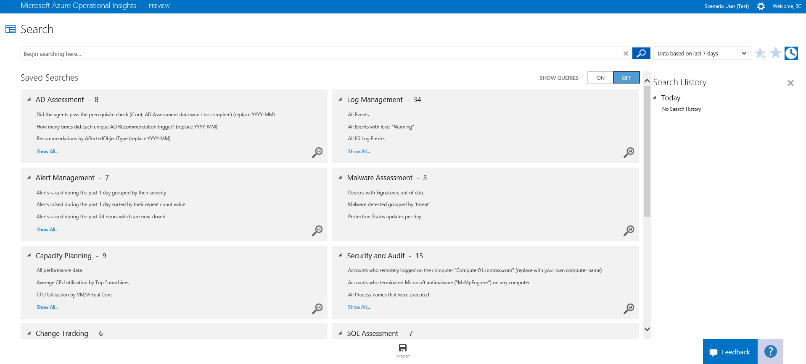

<properties 
	pageTitle="Operational Insights Search" 
	description="You can use the Search feature in Azure Operational Insights to find the data that you’re looking for" 
	services="operational-insights" 
	documentationCenter="" 
	authors="bandersmsft" 
	manager="jwhit" 
	editor=""/>

<tags 
	ms.service="operational-insights" 
	ms.workload="na" 
	ms.tgt_pltfrm="na" 
	ms.devlang="na" 
	ms.topic="article" 
	ms.date="03/20/2015" 
	ms.author="banders"/>

# Operational Insights Search
At the core of Microsoft Azure Operational Insights is our search feature which allows you to combine and correlate any machine data from multiple sources within your environment. Intelligence Packs are also powered by search to bring you metrics pivoted around a particular problem area.

## Search for data
You can use the **Search** feature in Azure Operational Insights to find the data that you’re looking for. 

On the **Search** page, you can create a query, and then when you search, you can filter the results by using facet controls. You can also create advanced queries to transform, filter, and report on your results.

Common search queries appear on most search pages. Throughout the Operational Insights console, you can click tiles or drill in to other items to view details about the item by using **Search**.
You can use facets and filter controls to narrow your results. Assisted typing with autocomplete helps you learn the syntax and produces results quickly.

##Topics in the Azure library 
- [Search Syntax Reference](https://msdn.microsoft.com/library/azure/dn884655.aspx  "Search Syntax Reference")
- [Search field and facet reference](https://msdn.microsoft.com/library/azure/dn884648.aspx "Search field and facet reference")  
 
 
## Blog posts and tutorials to learn the Search syntax
- [Azure Operational Insights Search How To: Part I – How to filter big data](http://blogs.msdn.com/b/dmuscett/archive/2014/10/19/advisor-search-first-steps-how-to-filter-data-part-i.aspx)
- [Azure Operational Insights Search How To: Part II – More on Filtering, using Boolean Operators, the Time Dimension, Numbers and Ranges](http://blogs.msdn.com/b/dmuscett/archive/2014/10/19/advisor-search-how-to-part-ii-more-on-filtering-using-boolean-operators-and-the-time-dimension.aspx)
- [Azure Operational Insights Search How To: Part III – Manipulating Results: the pipeline “|” and Search Commands](http://blogs.msdn.com/b/dmuscett/archive/2014/10/19/advisor-search-how-to-part-iii-manipulating-results-the-pipeline-and-search-commands.aspx)
- [Azure Operational Insights Search How To: Part IV – Introducing the MEASURE command](http://blogs.msdn.com/b/dmuscett/archive/2014/10/29/operational-insights-search-how-to-part-iv-introducing-the-measure-command.aspx)
- [Azure Operational Insights Search HowTo: Part V – Max() and Min() Statistical functions with Measure command](http://blogs.msdn.com/b/dmuscett/archive/2014/10/29/azure-operational-insights-search-howto-part-v-max-and-min-statistical-functions-with-measure-command.aspx)
- [Azure Operational Insights Search How To: Part VI – Measure Avg(), and an exploration of Type=PerfHourly](http://blogs.msdn.com/b/dmuscett/archive/2014/10/31/azure-operational-insights-search-how-to-part-vi-measure-avg-and-an-exploration-of-type-perfhourly.aspx)
- [Azure Operational Insights Search How To: Part VII – Measure Sum() and Where command](http://blogs.msdn.com/b/dmuscett/archive/2014/11/10/azure-operational-insights-search-hot-to-part-vii-measure-sum-and-where-command.aspx)

## Blog posts - Search use cases
- [W3C IIS Logs Search in Microsoft Azure Operational Insights](http://blogs.msdn.com/b/dmuscett/archive/2014/09/20/w3c-iis-logs-search-in-system-center-advisor-limited-preview.aspx)
- [Monitoring SQL Backup Failures with Azure Operational Insights Search and Dashboards](http://blogs.msdn.com/b/dmuscett/archive/2015/02/21/monitoring-sql-backup-failures-with-azure-operational-insights-search-and-dashboards.aspx)
- [IIS Management Pack Event-Alerting Rules’s OpInsights Searches Equivalents](http://blogs.msdn.com/b/dmuscett/archive/2014/11/05/iis-mp-event-alerting-rules-s-opinsights-searches-equivalents.aspx)
- [Useful Operational Insights Search Query Collection](http://blogs.msdn.com/b/dmuscett/archive/2014/10/19/advisor-searches-collection.aspx)