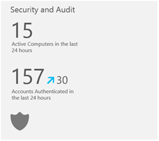
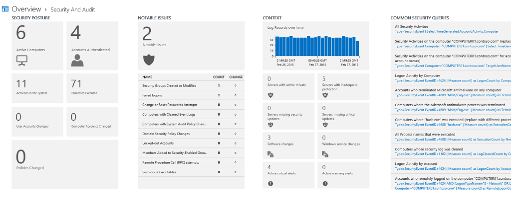

<properties 
   pageTitle="Explore security and audit data"
   description="Learn about how you can use the Security and Audit intelligence pack to get a comprehensive view into your organization’s IT security posture with built-in search queries for notable issues that require your attention"
   services="operational-insights"
   documentationCenter=""
   authors="bandersmsft"
   manager="jwhit"
   editor="tysonn" />
<tags 
   ms.service="operational-insights"
   ms.devlang="na"
   ms.topic="article"
   ms.tgt_pltfrm="na"
   ms.workload="na"
   ms.date="03/20/2015"
   ms.author="banders" />

# Explore security and audit data

The Operational Insights Security and Audit intelligence pack provides a comprehensive view into your organization’s IT security posture with built-in search queries for notable issues that require your attention.

The Security and Audit intelligence pack helps you perform:

- forensic analysis

- data breach pattern investigation

- audit scenarios

## Forensic analysis

A forensic analysis conducted with the intelligence pack uses evidence that potentially malicious users leave behind. Regardless of what users are doing in their IT environment, many of the activities they participate in generate security artifacts.  It’s important to note that logs are often wiped by attackers and it is often the first step they take in hiding their path. However, whether users are accessing their own computers or accessing them remotely, evidence about their use is stored in event logs.

Operational Insights collects these artifacts as soon as they occur, before anyone can tamper with them, and allows you to perform different types of analysis by correlating data across multiple computers.

To get the most out of the Security and Audit Intelligence pack, configure the level of audit events gathered by your Windows environment that will best suit your needs, using the following resources.

- [How to Configure Security Policy Settings](https://technet.microsoft.com/library/dn135243(v=ws.10).aspx)

- [Advanced Audit Policy Configuration](https://technet.microsoft.com/library/jj852202(v=ws.10).aspx)

- [Audit Policy Recommendations](https://technet.microsoft.com/library/dn487457.aspx)

We also recommend that you enable AppLocker events, to get rich information about process executions that occur in your IT environment. For more information, see [To Configure an AppLocker Policy for Audit Only](https://technet.microsoft.com/library/hh994622.aspx)

The Windows computing environment gives you the ability to configure the capture level of security-related records. For example, you can configure your environment so that anytime someone accesses a file, reads a file, or opens a file, an event is generated. The level of detail that you want to collect will vary, depending on your needs. However, every option that you enable comes with some sort of cost because you need to store all the information that you collect. For this reason, in many organization’s IT environments, people decide not to enable object read or object write data collection. Every time someone accesses any file, thousands of events might be generated, some of which are useless noise. The collection level that that is decided upon depends on the administrator’s best judgment.

>[AZURE.NOTE] If you are using the direct agent and you have a proxy server in your organization, you should configure it to allow the agent to access Operational Insights. For more information, see Configure proxy and firewall settings.

## Security breach pattern investigation

Security breaches usually originate from legitimate credentials and require a malicious user to attempt to get an elevated privilege through attacks. The Security and Audit intelligence pack does not focus on intrusion detection—instead, it helps you to investigate and discover patterns of abnormal activities, such as:

- unusual logons on a computer from a user who doesn’t normally use it

- unusual network enumeration from atypical users or computers

- new users accounts created with administrative rights

- changes to logging or security policies

## Audit scenarios

Many organizations have computer and network compliance policies and regulations they must abide by that require extensive auditing records. For example, within finance companies, they might need to keep records that prove for any given point in time, which user performed a specific operation on the network. They may also be required to generate reports detailing the activity of a specific user, or selected server on-demand, and go back in time many months—sometimes even years back.

The Security and Audit intelligence pack allows Operational Insights to collect auditing data throughout your IT environment, whether your computers are on premise or in the cloud. All auditing data is stored, indexed, and with a Premium subscription to Operational Insights all data is stored indefinitely. Then you can view auditing data, perform searches, and correlate across different data types and computers to get comprehensive results for any time interval since the data was collected.

Any auditing data that you want to collect and send to Operational Insights is fully managed with Group Policy. You use it to define security configurations as part of a Group Policy Object (GPO), which are linked to Active Directory containers such as sites, domains, and organizational units, and they help you manage security settings. Policy data is logged and later sent to the Operational Insights service. In addition to local policy settings, if you use AppLocker to gather auditing data, Operational Insights will gather the data and then you can view it.

## View security and audit data

You can view security and audit information from the **Overview** page by clicking the **Security and Audit** tile. This tile shows the number of active computers sending security and audit data to the Operational Insights service, the number of accounts that were authenticated in the last 24 hours, and the change in number over the same period.

### Security and Audit dashboard

The Security and Audit dashboard shows the following areas:

#### Security Posture

This area shows a variety of data. For each tile with data, the total number of items is shown and items changed in the last 24 hours.

#### Notable Issues

This area shows the notable issues found by the Security and Audit intelligence pack. When notable issues are found in your environment, you should review them because they might lead you to security threats. If needed, you can perform a forensic analysis or a security breach pattern investigation for suspicious activity.

This section also displays notable issues broken down by type. For each type, it displays changes from the day before.

#### Security Context

This area can show a variety of data, for an at-a-glance review of other data that might relate to your security posture. Security log data record history is shown and if you have any of the following intelligence packs installed, then data for each is displayed; otherwise, you’ll see an option to install.

- Malware Assessment

- System Update

- Change Tracking

- Alert Management (for System Center Operations Manager users only)

#### Common Security Queries

This area contains pre-built queries that the Operational Insights software development team has created to help you get started with common security investigations.

