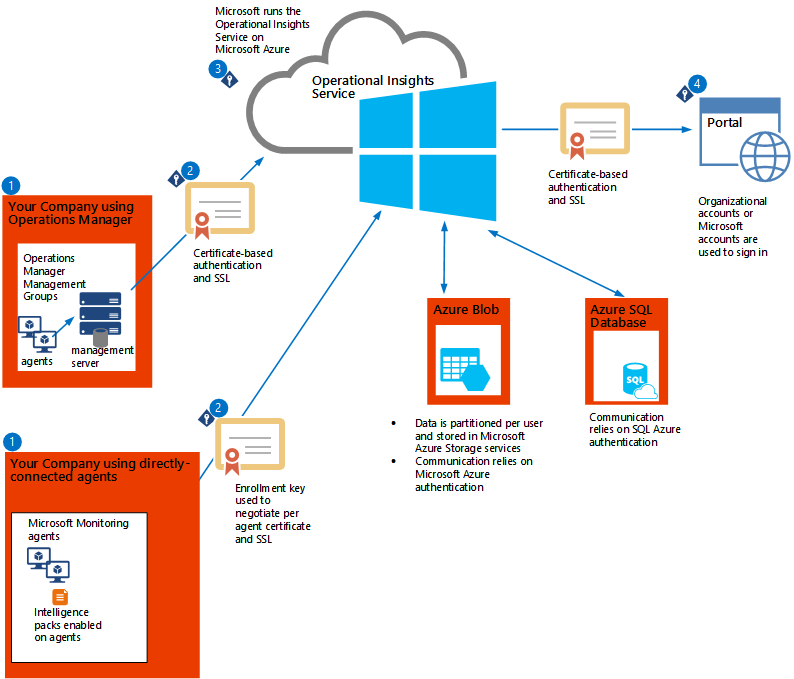

<properties 
	pageTitle="Operational Insights Security" 
	description="Learn about how Operational Insights protects your privacy and secures your data." 
	services="operational-insights" 
	documentationCenter="" 
	authors="bandersmsft" 
	manager="jwhit" 
	editor=""/>

<tags 
	ms.service="operational-insights" 
	ms.workload="dev-center-name" 
	ms.tgt_pltfrm="na" 
	ms.devlang="na" 
	ms.topic="article" 
	ms.date="04/30/2015" 
	ms.author="banders"/>

# Operational Insights security

[AZURE.INCLUDE [operational-insights-note-moms](../includes/operational-insights-note-moms.md)]

Microsoft is committed to protecting your privacy and securing your data, while delivering software and services that help you manage the IT infrastructure of your organization. We recognize that when you entrust your data to others, that trust requires rigorous security. Microsoft adheres to strict compliance and security guidelines—from coding to operating a service.

Securing and protecting data is a top priority at Microsoft. Please contact us with any questions, suggestions, or issues about any of the following information, including our security policies at [Azure support options](http://azure.microsoft.com/support/options/).

This article explains how data is collected, processed, and secured in Microsoft Azure Operational Insights. You can use either agents to connect directly to the web service or you can use System Center Operations Manager to collect operational data for the Operational Insights service. The collected data is sent over the Internet to the Operational Insights service, which is hosted in Microsoft Azure.

The Operational Insights service manages your data securely by using the following methods:

**Data segregation:** Customer data is kept logically separate on each component throughout the Operational Insights service. All data is tagged per organization. This tagging persists throughout the data lifecycle, and it is enforced at each layer of the service. 

Each customer has a dedicated Azure blob that houses the long-term data. The blob is encrypted with unique per-customer keys, which are changed every 90 days.

**Data retention:** Aggregated metrics for each of the intelligence packs is stored in a SQL Database hosted by Microsoft Azure. This data is stored for 390 days. Indexed search data is stored for 10 days on average before the data is groomed. If the upper limit of 20 million records for each data type is reached earlier, Operational Insights grooms the data earlier than 10 days. If the data limit is not reached by 10 days, Operational Insights waits until the limit is reached to groom it.

**Physical security:** The Operational Insights service is manned by Microsoft personnel and all activities are logged and can be audited. The Operational Insights service runs completely in Azure and complies with the Azure common engineering criteria. You can view details about the physical security of Azure assets on page 18 of the [Microsoft Azure Security Overview](http://download.microsoft.com/download/6/0/2/6028B1AE-4AEE-46CE-9187-641DA97FC1EE/Windows%20Azure%20Security%20Overview%20v1.01.pdf).

**Compliance and certifications:** The Operational Insights software development and service team is actively working with the Microsoft Legal and Compliance teams and other industry partners to acquire a variety of certifications, including ISO, before the Operational Insights service is generally available.

We currently meet the following security standards:

- Windows Common Engineering Criteria
- Microsoft Trustworthy Computing Certification

## Data flow security 
The following diagram shows the flow of information from your company and how it is secured as is moves to the Operational Insights service, ultimately seen by you in Operational Insights. More information about each step follows the diagram.

### 1. Sign up for Operational Insights and collect data

For your organization to send data to the Operational Insights service, you must either configure Microsoft Monitoring agents when connecting directly to the web service or use a configuration wizard in the Operations console in Operations Manager. Users (which might be you, other individual users, or a group of people) must create one or more Operational Insights accounts and register either each directly-connected agent or their Operations Manager environment by using one of the following accounts:

- [Organizational ID](sign-up-organization.md)

- [Microsoft Account - Outlook, Office Live, MSN](sign-up-organization.md)

An Operational Insights account is where data is collected, aggregated, analyzed, and presented. An Operational Insights account is primarily used as a means to partition data, and each Operational Insights account is unique. For example, you might want to have your production data managed with one Operational Insights account and your test data managed with another account. Accounts also help an administrator control user access to the data. Each Operational Insights account can have multiple user accounts associated with it, and each user account can have multiple Operational Insights accounts.

When the configuration wizard is complete, each Operations Manager management group establishes a connection with the Operational Insights service. You then use the Add Computers Wizard to choose which computers in the management group are allowed to send data to the service.

Both types of agents collect data for Operational Insights. The type of data that is collected is dependent on the types of intelligence packs used. An intelligence pack is a bundle of predefined views, search queries, data collection rules, and processing logic. Only Operational Insights administrators can use Operational Insights to import an intelligence pack. After the intelligence pack is imported, it is moved to the Operations Manager management servers (if used), and then to the Operations Manager agents that you have chosen. Afterward, the agents collect the data.

The following table lists the available intelligence packs in Operational Insights and the types of data they collect.

<table border="1" cellspacing="4" cellpadding="4">
    <tbody>
    <tr align="left" valign="top">
		<td><b>Intelligence pack</b></td>
		<td><b>Data types</b></td>
    </tr>
    <tr align="left" valign="top">
		<td>Configuration Assessment</td>
		<td>Configuration data, metadata, and state data</td>
    </tr>
    <tr align="left" valign="top">
		<td>Capacity Planning</td>
		<td>Performance data, metadata, and state data</td>
    </tr>
	<tr align="left" valign="top">
		<td>Antimalware</td>
		<td>Configuration data, metadata, and state data</td>
    </tr>
	    <tr align="left" valign="top">
		<td>System Update Assessment</td>
		<td>Metadata and state data</td>
    </tr>
    <tr align="left" valign="top">
		<td>Log Management</td>
		<td>User-defined event logs</td>
    </tr>
    <tr align="left" valign="top">
		<td>Change Tracking</td>
		<td>Software inventory and Windows service metadata</td>
    </tr>
    <tr align="left" valign="top">
		<td>SQL and Active Directory Assessment</td>
		<td>WMI data, registry data, performance data, and SQL Server dynamic management view results</td>
    </tr>
    </tbody>
    </table>

The following table shows examples of data types:

<table border="1" cellspacing="4" cellpadding="4">
    <tbody>
    <tr align="left" valign="top">
		<td><b>Data type</b></td>
		<td><b>Fields </b></td>
    </tr>
    <tr align="left" valign="top">
		<td>Alert</td>
		<td>Alert Name, Alert Description, BaseManagedEntityId, Problem ID, IsMonitorAlert, RuleId, ResolutionState, Priority, Severity, Category, Owner, ResolvedBy, TimeRaised, TimeAdded, LastModified, LastModifiedBy, LastModifiedExceptRepeatCount, TimeResolved, TimeResolutionStateLastModified, TimeResolutionStateLastModifiedInDB, RepeatCount</td>
    </tr>
    <tr align="left" valign="top">
		<td>Configuration</td>
		<td>CustomerID, AgentID, EntityID, ManagedTypeID, ManagedTypePropertyID, CurrentValue, ChangeDate</td>
    </tr>
	<tr align="left" valign="top">
		<td>Event</td>
		<td>EventId, EventOriginalID, BaseManagedEntityInternalId, RuleId, PublisherId, PublisherName, FullNumber, Number, Category, ChannelLevel, LoggingComputer, EventData, EventParameters, TimeGenerated, TimeAdded
<b>Note:</b> When you log events with custom fields into the Windows event log, Operational Insights collects them. </td>
    </tr>
	    <tr align="left" valign="top">
		<td>Metadata</td>
		<td>BaseManagedEntityId, ObjectStatus, OrganizationalUnit, ActiveDirectoryObjectSid, PhysicalProcessors, NetworkName, IPAddress, ForestDNSName, NetbiosComputerName, VirtualMachineName, LastInventoryDate, HostServerNameIsVirtualMachine, IP Address, NetbiosDomainName, LogicalProcessors, DNSName, DisplayName, DomainDnsName, ActiveDirectorySite, PrincipalName, OffsetInMinuteFromGreenwichTime</td>
    </tr>
    <tr align="left" valign="top">
		<td>Performance</td>
		<td>ObjectName, CounterName, PerfmonInstanceName, PerformanceDataId, PerformanceSourceInternalID, SampleValue, TimeSampled, TimeAdded</td>
    </tr>
    <tr align="left" valign="top">
		<td>State</td>
		<td>StateChangeEventId, StateId, NewHealthState, OldHealthState, Context, TimeGenerated, TimeAdded, StateId2, BaseManagedEntityId, MonitorId, HealthState, LastModified, LastGreenAlertGenerated, DatabaseTimeModified</td>
    </tr>
    </tbody>
    </table>

### 2. Send data from agents

With agents that connect directly to the web service, you register them with a key and a secure connection is established between the agent and the Operational Insights service by using port 443.

With Operations Manager, you register an account with the Operational Insights service and a secure HTTPS connection is established between the Operations Manager management server and the Operational Insights service by using port 443. If Operations Manager is unable to communicate to the service for any reason, the collected data is stored in a temporary cache and the management server tries to resend the data every 8 minutes for 2 hours. Collected data is compressed and sent to the Operational Insights service, bypassing on-premises databases, so it does not add any load to them. After the collected data is sent, it is removed from the cache.

### 3. The Operational Insights service receives and processes data

The Operational Insights service ensures that incoming data is from a trusted source by validating certificates and the data integrity. The unprocessed raw data is then stored as a blob in [Microsoft Azure Storage](http://azure.microsoft.com/documentation/services/storage/). Each Operational Insights user has a dedicated Azure blob, which is accessible only to that user. The type of data that is stored is dependent on the types of intelligence packs that were imported and used to collect data.

The Operational Insights service processes the raw data, and the aggregated processed data is stored in a SQL database. Communication between the Operational Insights service and SQL database relies on SQL database authentication.

### 4. Use Operational Insights to access the data

You can sign in to Operational Insights by using the account you set up previously. All traffic between Operational Insights and the Operational Insights service is sent over a secure HTTPS channel.

