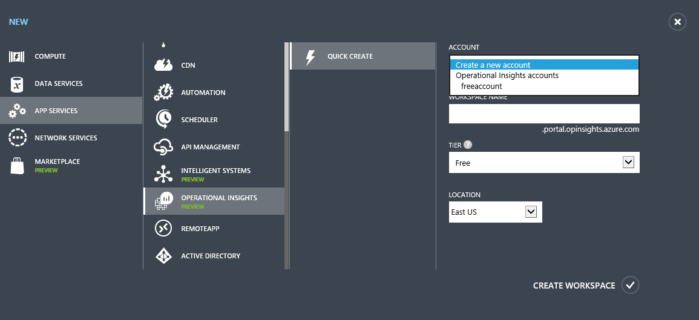
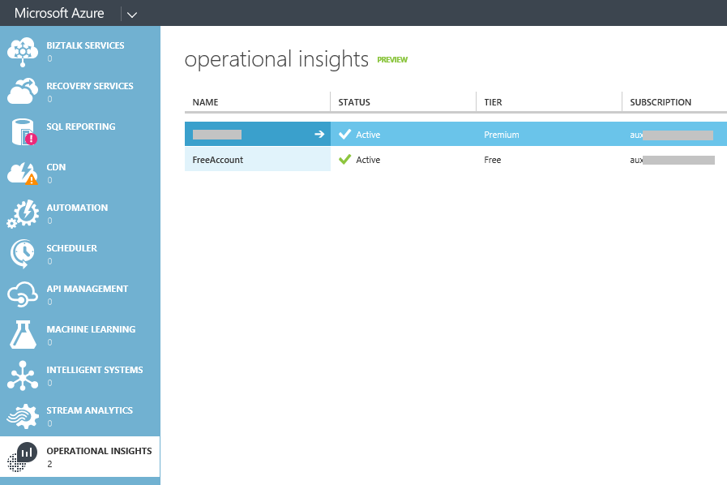
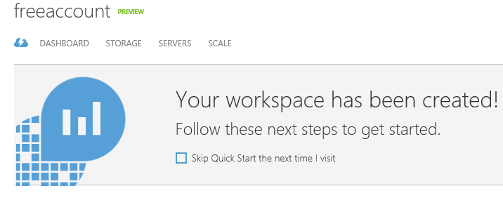
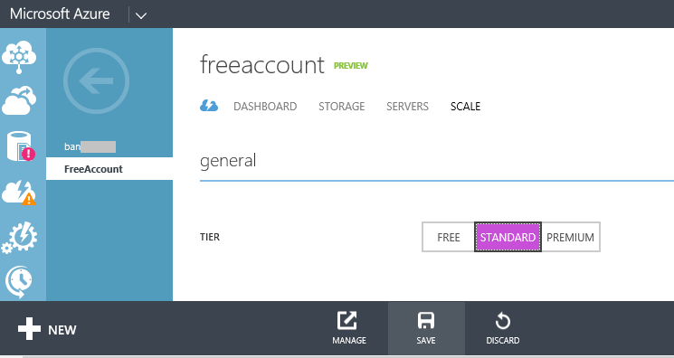
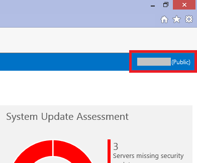
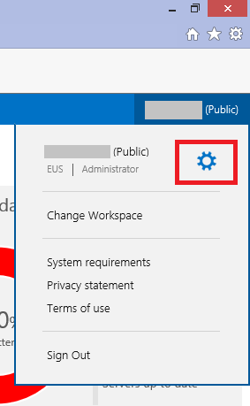
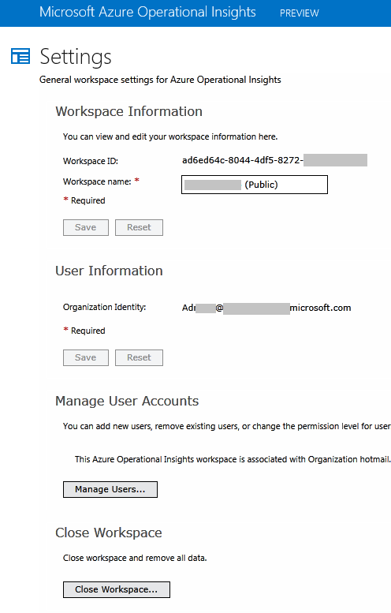
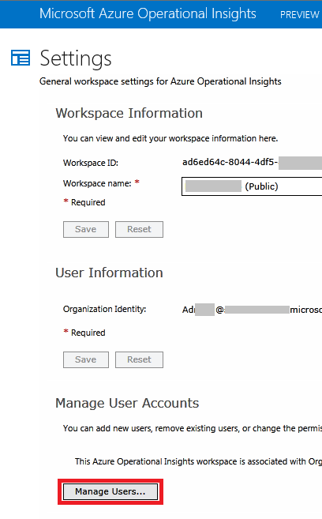
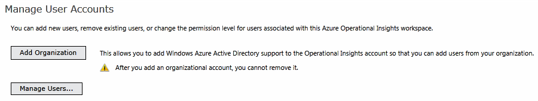

<properties 
    pageTitle="Set up your workspace and manage setings" 
    description="Learn about how to set up your workspace and manage settings in Microsoft Azure Operational Insights" 
    services="operational-insights" 
    documentationCenter="" 
    authors="bandersmsft" 
    manager="jwhit" 
    editor=""/>

<tags 
    ms.service="operational-insights" 
    ms.workload="operational-insights" 
    ms.tgt_pltfrm="na" 
    ms.devlang="na" 
    ms.topic="article" 
    ms.date="04/30/2015" 
    ms.author="banders"/>

# Set up your workspace and manage settings 

[AZURE.INCLUDE [operational-insights-note-moms](../includes/operational-insights-note-moms.md)]

To create a new Microsoft Azure Operational Insights workspace, you choose a workspace name, associate it with your account, and you choose a geographical location. An Operational Insights workspace is essentially a container that includes account information and simple configuration information for the account. You or other members of your organization might use multiple Operational Insights workspaces to manage different sets of data that is collected from all or portions of your IT infrastructure.

After the workspace is created, you can perform other tasks using the workspace, such as manage Operational Insights, view your usage data in the dashboard, select storage accounts, and directly connect agents or to connect to System Center Operations Manager. And, you can manage the settings for each workspace.

To learn out more on how to create a workspace using Azure, watch the following video:

> [AZURE.VIDEO creating-a-workspace-for-azure-customers-opinsights]

## How many workspaces do I need?
A workspace is seen as an Azure resource within the Azure Management Portal.

You can either create a new workspace or link to an existing Preview workspace you might have opened earlier for use with System Center Operations Manager, but you haven't yet associated with an Azure subscription (necessary for billing).
A workspace represents the level at which data is collected, aggregated, analyzed, and presented in the Operational Insights portal. 
You might choose to have multiple workspaces to segregate data from different environments and systems; each Operations Manager management group (and all its agents) or individual VMs/agents can each be connected with only one workspace.

Each workspace can have multiple user accounts associated with it, and each user account (Microsoft account or Organizational account) can have access to multiple Operational Insights workspaces.
By default, the Microsoft account or Organizational account used to create the workspace becomes the Administrator of the workspace. The administrator can then invite additional Microsoft accounts or pick users from his Azure Active Directory.

##Link an existing workspace to an Azure subscription

It is possible to create a workspace from [opinsights.azure.com](http://opinsights.azure.com).  However, certain limits exist for these workspaces, the most notable being a limit of 500MB/day of data uploads if you're using a free account.  To make changes to this workspace you will need to **link your existing workspace to an Azure subscription**.

>[AZURE.IMPORTANT] In order to link a workspace, your Azure account must already have access to the workspace you'd like to link.  In other words, the account you use to access the Azure portal should be **the same** as the account you use to access your Operational Insights workspace. If this is not the case, see [Add a user to an existing workspace](#addusertoexistingworkspace).

1. Sign in to the Azure Management Portal.
2. In the bottom left of the portal, click **+ New**.
3. Click **App Services**, scroll to **Operational Insights** and select it.
4. Click **Quick Create**.
5. On the **Account** list, you should see a list of your existing workspaces that have *not yet* been linked to your Azure subscription. Select an account.

	>[AZURE.NOTE] If you do not see the workspace you'd like to link here, this means your Azure subscription does not have access to your Operational Insights workspace.  You will need to grant access to this account from inside your Operational Insights workspace.  To do so, see [Add a user to an existing workspace](#addusertoexistingworkspace).

6. Fill in the remaining fields and then select **Create Workspace**.

## Upgrade workspace to a paid plan

There are three workspace plan types for Operational Insights: **Free**, **Standard** and **Premium**.  If you are on a *free* plan, you may have hit your data cap of 500MB.  You will need to upgrade your workspace to a '**pay-as-you-go plan**' in order to collect data beyond this limit. At any time your can convert your plan type.  For more information on Operational Insights pricing, see [Pricing Details](http://azure.microsoft.com/pricing/operational-insights/)

>[AZURE.IMPORTANT] Workspace plans can only be changed if they are *linked* to an Azure subscription.  If you created your workspace in Azure or if you've *already* linked your workspace, you can ignore this message.  If you created your workspace from [opinsights.azure.com](http://opinsights.azure.com), you will need to follow the steps at [Link an existing workspace to an Azure subscription](#linkworkspace). 

### Change plan type

In the Azure Management Portal, navigate to the Operational Insights workspace you'd like to upgrade to:

Select this workspace and select **SCALE** from the tabs at the top of the screen

Finally, choose the plan you'd like to upgrade to and click **SAVE**.  You will see the changes reflected in the portal and will now be able to collect data beyond the "free" data cap.

## Change the workspace name

If you are the administrator of an Microsoft Azure Operational Insights workspace, you can change the name of the workspace.

###To change the workspace name

1. Click your workspace name.

2. Click the configure icon.

3. On the **Settings** page  in Operational Insights, in the **Manage User Accounts** section, click **Manage users**.

 

4. In the Operational Insights portal, on the **Settings** page enter the new name in the **Workspace name** field.

5. Click **Save**.

## Change user information

You can change the name associated with an Operational Insights user, but you cannot change the name of the Microsoft account that is associated with that user.

For users with a Microsoft account, you can also change the notification settings. If you used an organizational account through Azure Active Directory, you cannot currently use the **Notifications** feature in Operational Insights.

### To change user information
1. On the **Settings** page in Operational Insights, in the **User Information** section, enter the name in the **First name** and **Last name** fields.

2. For Microsoft account users, change your notification settings. By default, all account users are notified when an alert is generated. If you want users to stop receiving these notifications, clear the **Receive email notifications of new Operational Insights alerts** option.

3. Click **Save**.

## Change notification settings

By default, all users who are associated with an Operational Insights workspace receive an email that summarizes any configuration assessment alerts that have been generated in the past seven days. On the **Settings** page, users can control whether they receive these email notifications.

>[AZURE.NOTE] Notifications are only available for users with a Microsoft account. If you used an organizational account through Azure Active Directory, you cannot currently use the **Notifications** feature in Operational Insights.

Are you not seeing emails that you think you should? Try checking your spam filters. Ensure that emails from *operationalinsights@opinsights.azure.com* are not being filtered out.

1. On the **Settings** page in Operational Insights, in the **User Information** section, clear the **Receive email notifications of new Operational Insights alerts** option.

2. Click **Save**.

##Add a user to an existing workspace

Use the following steps to add a user or group to an Operational Insights workspace. The user or group will be able to view and act on all alerts that are associated with this workspace.

>[AZURE.NOTE] If you want to add a user or group from your Azure Active Directory organizational account, you must first ensure that you have associated your Operational Insights account with your Active Directory domain. See [Add an Azure Active Directory Organization to an existing workspace](#).

### To add a user to an existing workspace
1. Click your workspace name.
2. Click the configure icon.
3. On the **Settings** page  in Operational Insights, in the **Manage User Accounts** section, click **Manage users**.

 

4. In the **Manage Users** window, click **Add**.

5. If your Operational Insights account is associated with Azure Active Directory, specify **Organizational account**.

    >[AZURE.NOTE] You will not see this step if your Operational Insights account uses only Microsoft accounts.

6. Enter the new user information for the Microsoft account or the organizational account.If you are adding an organizational account, you can enter part of the user or group’s name or email alias, and then click **Check Names** to locate the specific user or group.
 
    >[AZURE.NOTE] For the best performance results, limit the number of Active Directory groups associated with a single Operational Insights account to two—one for administrators and one for users. Using more groups might impact the performance of Operational Insights.

7. Select the role for this new user: **Administrator** or **User**.

 
 

8. Click **OK**.
    
    If you are adding a Microsoft account, an invitation to join your account is sent to the email you provided. After the user follows the instructions in the invitation to join Operational Insights, the user can view the alerts and account information for this Operational Insights account, and you will be able to view the user information in the **Manage Users** window.
 
    If you are adding an organizational account, the user will be able to access Operational Insights immediately.

## Add an Azure Active Directory Organization to an existing workspace

You can associate your Operational Insights workspace with an Azure Active Directory domain. This enables you to add users from Active Directory directly to your Operational Insights workspace without requiring a separate Microsoft account.

### To add an Azure Active Directory Organization to an existing workspace

1. On the Settings page in Operational Insights, click **Add Organization**.

2. Review the information about organizational accounts, and then click **Next**.

3. Enter the identity information for the administrator of your Azure Active Directory domain, and then click **Sign in**.

4. Click **Grant access** to enable Operational Insights to use the identity information in your Active Directory domain.

 
 

## Edit an existing user account

You can change the account role for a user associated with your Operational Insights account. You have the following role options:

 - *Administrator*: Can manage users, view and act on all alerts, and add and remove servers

 - *User*: Can view and act on all alerts, and add and remove servers

### To edit an account
1. On the **Settings** page in Operational Insights, in the **Manage User Accounts** section, click **Manage users**.

2. In the **Manage Users** window, select the name of the user you want to change, and then click **Edit user**.

3. Select the role for this user: **Administrator** or **User**.

4. Click **OK**.

## Remove a user from an Operational Insights workspace

Use the following steps to remove a user from an Operational Insights workspace. Note that this does not close the user’s workspace. Instead, it removes the association between that user and the workspace. If a user is associated with multiple workspaces, that user will still be able to sign in to Operational Insights.

### To remove a user from a workspace

1. On the **Settings** page in Operational Insights, in the **Manage User Account** section, click **Manage users**.

2. In the **Manage Users** window, click the name of the user you want to remove, and then click **Remove user**.

3. Click **OK** to confirm that you want to remove the user.

## Close your Operational Insights workspace

When you close an Operational Insights workspace, all data related to your workspace is deleted from the Operational Insights service not more than 30 days after you close the workspace.

If you are an administrator, and there are multiple users associated with the workspace, the association between those users and the workspace is broken. If the users are associated with other workspaces, then they can continue using Operational Insights with those other workspaces. However, if they are not associated with other workspaces then they will need to create a new workspace to use Operational Insights.

### To close an Operational Insights workspace

1. On the **Settings** page in Operational Insights, in the **Close Workspace** section, click **Close Workspace**.

2. Select one of the reasons for closing your workspace, or enter a different reason in the text box.

3. Click **Close workspace**.

