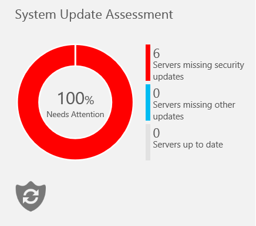
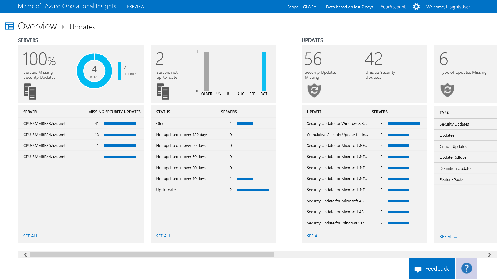
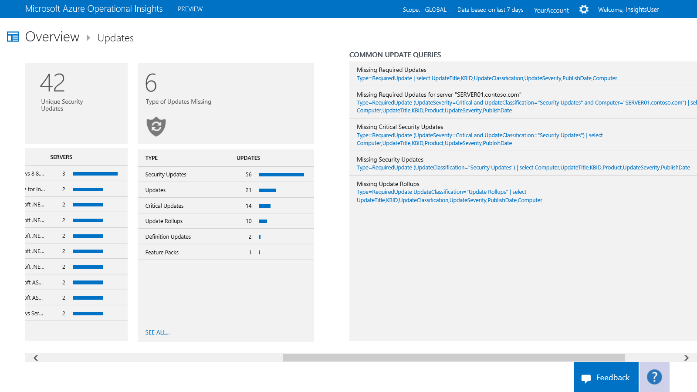

<properties 
   pageTitle="Update servers with System Updates"
   description="Learn how you can use the System Updates intelligence pack in Microsoft Azure Operational Insights to help you apply missing updates to servers in your infrastructure"
   services="operational-insights"
   documentationCenter=""
   authors="bandersmsft"
   manager="jwhit"
   editor="tysonn" />
<tags 
   ms.service="operational-insights"
   ms.devlang="na"
   ms.topic="article"
   ms.tgt_pltfrm="na"
   ms.workload="na"
   ms.date="05/05/2015"
   ms.author="banders" />

# Update servers with System Updates

[AZURE.INCLUDE [operational-insights-note-moms](../includes/operational-insights-note-moms.md)]

You can use the System Updates intelligence pack in Microsoft Azure Operational Insights to help you apply missing updates to servers in your infrastructure. You install the intelligence pack to update the Operations Manager agent and base configuration module for Operational Insights. Update information is read on the monitored servers and then update data is sent to the Operational Insights service in the cloud for processing. Logic is applied to the update data and the cloud service records the data. If missing updates are found, they are shown on the **Updates** dashboard. You can use the **Updates** dashboard to work with missing updates and develop a plan to apply them to the servers that need them.

## Use System Updates to update servers

Before you can use system updates in Microsoft Azure Operational Insights, you must have the intelligence pack installed. To read more about installing intelligence packs, see [Use the Gallery to add or remove intelligence packs](operational-insights-add-intelligence-pack.md). After it is installed, you can view the updates that are missing from your monitored servers by using the **System Update Assessment** tile on the **Overview** page in Operational Insights. 

The tile opens the **Updates** dashboard where you can view an overall summary of missing updates. The page details the following categories:

- Servers that are missing security updates

- Servers that haven’t been updated recently

- Updates that should be applied to specific servers

- Type of updates that are missing

You can click any tile or item to view its details in the **Search** page to get more information about the missing update. 

## Search results##
Update search results include:

- Server

- Update title

- Knowledge Base ID

- Product the update is for

- Update severity

- Publication date

*Server* search results include:

- Server name

- Operating system version name

- Automatic update enabling method

- Days since last update

- Windows Update agent version

## To work with updates

1. On the **Overview** page, click the **System Update Assessment** tile.

2. On the **Updates** dashboard, view the update categories and choose one to work with.

3. Click a tile or any item to view detailed information about it in the **Search** page.

4. By using the information you've found, you can create a plan to apply missing updates.
