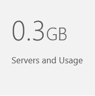
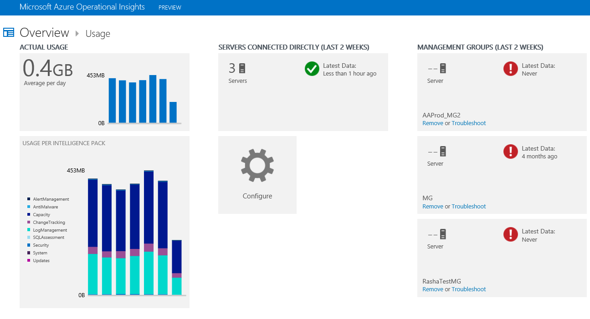

<properties 
   pageTitle="Manage servers and usage data"
   description="Learn about how much data is sent to the Operational Insights service from your servers"
   services="operational-insights"
   documentationCenter=""
   authors="bandersmsft"
   manager="jwhit"
   editor="tysonn" />
<tags 
   ms.service="operational-insights"
   ms.devlang="na"
   ms.topic="article"
   ms.tgt_pltfrm="na"
   ms.workload="na"
   ms.date="05/05/2015"
   ms.author="banders" />

# Manage servers and usage data

[AZURE.INCLUDE [operational-insights-note-moms](../includes/operational-insights-note-moms.md)]

Operational Insights collects data and sends it to the Operational Insights service periodically.  You can use the **Usage** dashboard to view how much data is being sent to the Operational Insights service. The **Usage** dashboard also shows you how much data is being sent daily by intelligence packs and how often your management groups are sending data.

>[AZURE.NOTE] If you have a free account, you're limited to sending 500 MB of data to the Operational Insights service daily. If you reach the daily limit, data analyzing will stop and resume at the start of the next day.

You can view your usage by using the **Servers and Usage** tile on the **Overview** dashboard in Operational Insights.

If you have exceeded your daily usage limit, or if you are near your limit, you can optionally remove an intelligence pack to reduce the amount of data that you send to the Operational Insights service. For more information about removing intelligence packs, see [Use the Gallery to add or remove intelligence packs](operational-insights-add-intelligence-pack.md).

If an Operations Manager management group is having problems sending data to the Operational Insights service, you can troubleshoot the issue, or you can remove the group from Operational Insights, if needed.

The **Usage** dashboard displays the following information:

- Average usage per day

- Data usage for each intelligence pack for today

- How often the servers in each management group are sending data to the Operational Insights service

## To work with usage data

1. On the **Overview** page, click the **Servers and Usage** tile.

2. On the **Usage** dashboard, view the usage categories that show areas you’re concerned about.

3. If there is data about an intelligence pack that is unnecessarily using a lot of the allotted quota, you might consider removing that intelligence pack.

## To troubleshoot or remove management groups

1. On the **Overview** page, click the **Servers and Usage** tile.

2. On the **Usage** dashboard, view information about the management groups that aren’t sending data.

3. If there’s a management group that isn’t sending data, you can click **Troubleshoot** to get detailed troubleshooting information. If you no longer want to keep a management group and all the agents that report to it, click **Remove**.

