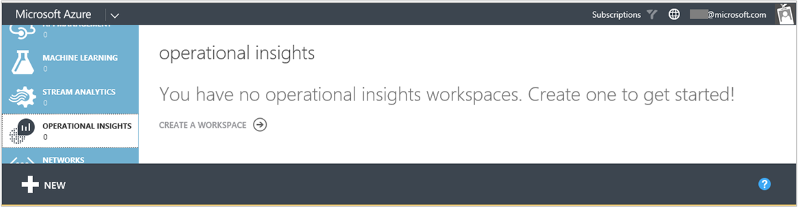
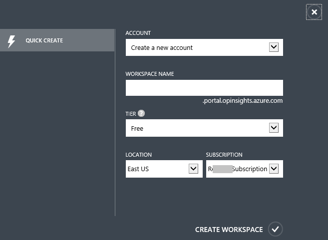
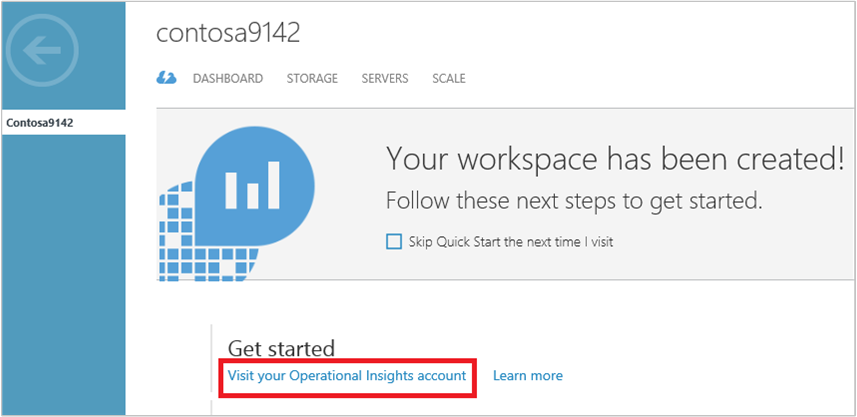
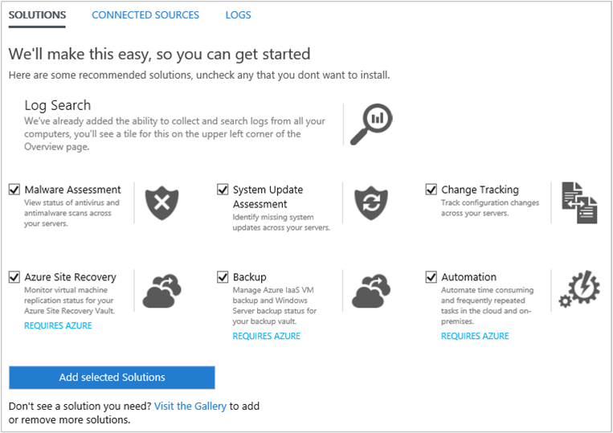
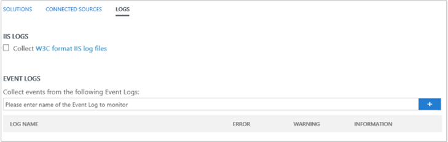
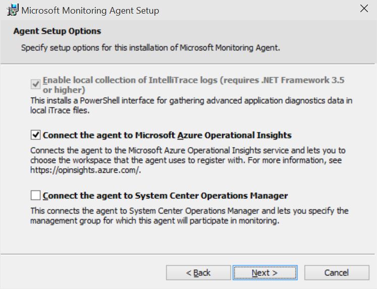

<properties
    pageTitle="Onboard to Operational Insights in minutes | Microsoft Azure"
    description="Learn about how you can get set up with Azure Operational Insights in minutes"
    services="operational-insights"
    documentationCenter=""
    authors="bandersmsft"
    manager="jwhit"
    editor=""/>

<tags
    ms.service="operational-insights"
    ms.workload="operational-insights"
    ms.tgt_pltfrm="na"
    ms.devlang="na"
    ms.topic="hero-article"
    ms.date="08/27/2015"
    ms.author="banders"/>

# Onboard to Azure Operational Insights in minutes

[AZURE.INCLUDE [operational-insights-note-moms](../../includes/operational-insights-note-moms.md)]

You can get up and running with Azure Operational Insights in minutes. You have two options when choosing how to create an Operational Insights workspace, which is similar to an account:

- Microsoft Operations Management Suite
- Microsoft Azure subscription

You can create an Operations Management Suite workspace using the Operations Management Suite website. Or, you can use a Microsoft Azure subscription to create an Operational Insights workspace. Currently, both workspaces are functionally equivalent. The only difference between the two is the name. If you use an Azure subscription, you can also use that subscription to access other Azure services. Regardless of the method that you use to create the workspace, you'll create the workspace with either a Microsoft account or organizational account.

Here's a look at the process:

## Sign up in 3 steps using the Operations Management Suite

1. Go to the [Operations Management Suite](http://microsoft.com/oms) website and click **Try for free**. Sign in with your Microsoft account such as Outlook.com, or with an organizational account provided by your company or educational institution to use with Office 365 or other Microsoft services.
2. Provide a unique workspace name. A workspace is a logical container where your management data is stored. It provides you a way to partition data between different teams in your organization, as the data is exclusive to its workspace. Specify an email address and the region where you want to have your data stored.  
    
3. Next, you can create a new Azure subscription or link to an existing Azure subscription. If you would like to proceed using the Free Trial, click **Not Now**.

You're ready to get started with the Operations Management Suite portal.

You can learn more about setting up your workspace and linking existing Azure accounts to workspaces created with the Operations Management Suite at [Set up your workspace and manage settings](operational-insights-setup-workspace.md).

## Sign up quickly using Microsoft Azure

1. Go to the [Azure portal](https://manage.windowsazure.com) and sign in, then in the list of services, select **Operational Insights**.
    
2. Click **Create a workspace**, then click **Quick Create**, and then under **Account**, type a workspace name, choose a tier, and then choose a location to store the workspace data. If you have multiple subscriptions, then you can choose which one to use and then click **Create Workspace**.
    
3. Select the workspace you created and then click **Visit your Operational Insights account** to open the Operations Management Suite website.
    
4. In the Operations Management Suite website, enter your email address and click **Confirm and continue**. A confirmation email will be sent to you. Open the email and inside it, click **Confirm now**.
5. The Operations Management Suite website displays the Overview page. Click **Get started** to continue.

You're ready to get started with the Operations Management Suite portal.

You can learn more about setting up your workspace and linking existing workspaces that you created with the Operations Management Suite to Azure subscriptions at [Set up your workspace and manage settings](operational-insights-setup-workspace.md).

## Getting started with the Operations Management Suite portal
To choose solutions and connect the servers that you want to manage, click the **Get Started** tile and follow the steps in this section.  

  

- Select the solutions you would like to use and then click **Add selected Solutions**.  
    
- Choose how you would like to connect to your server environment to gather data:
    - Connect any Windows Server or client directly by installing an agent.
    - Use System Center Operations Manager to attach your management groups or your entire Operations Manager deployment.
    - Use an Azure storage account configured with the Windows or Linux Azure diagnostic VM extension.
- Configure at least one log to populate your data. You can select the IIS logs and/or add event logs and then select **Save** at the bottom of the page. For event logs, you can specify the type of messages including error, warning, and information to monitor.
    

## Optionally, connect servers directly to the Operations Management Suite by installing an agent
1. In the Get Started view, click the **Connect a data source** node and then click **Download Windows Agent**. You can only install the agent on Windows Server 2008 SP 1 or later or on Windows 7 SP1 or later. Servers need to have an x64 architecture.
2. Install the agent on one or more servers. You can install agents one-by-one, or using a more automated method with a [custom script](operational-insights-direct-agent.md#configure-the-microsoft-monitoring-agent-optional), or you can use an existing software distribution solution that you might have.
3. After you agree to the license agreement and you choose your installation folder, select **Connect the agent to Microsoft Azure Operational Insights**.  
    
4. On the next page, you are asked for your Workspace ID and Workspace Key. Your Workspace ID and key are displayed on the screen where you downloaded the agent file.  
    
5. During installation, you can click **Advanced** to optionally set up your proxy server and provide authentication information. Click the **Next** button to return to the workspace information screen.
6. Click **Next** to validate your Workspace ID and Key. If any errors are found, you can click **Back** to make corrections. When your Workspace ID and Key are validated, click **Install** to complete the agent installation.
7. Log back in to the Operations Management Suite portal, and click the **Settings** tile on the Overview page. A green check mark icon will appear when the agents communicate with the Operations Management Suite service. Initially, this takes about 5-10 minutes.

> [AZURE.NOTE] The capacity management and configuration assessment solutions are not currently supported by servers connected directly to the Operations Management Suite.

You can also connect the agent to System Center Operations Manager 2012 SP1 and later. To do so, select **Connect the agent to System Center Operations Manager**. When you choose that option, you send data to the service without requiring additional hardware or load on your management groups.

You can read more about connecting agents directly to the Operations Management Suite at [Connect computers directly to Operational Insights](operational-insights-direct-agent.md).

## Optionally, connect servers using System Center Operations Manager

1. In the Operations Manager console, select **Administration**.
2. Expand the **Operational Insights** node and select **Operational Insights Connection**.
3. Click the **Register to Operational Insights** link towards the top right and follow the instructions.
4. After completing the registration wizard, click the **Add a Computer/Group** link.
5. In the **Computer Search** dialog box you can search for computers or groups monitored by Operations Manager. Select computers or groups to onboard them to Operational Insights, click **Add**, and then click **OK**. You can verify that the Operational Insights service is receiving data by going to the **Usage** tile in the Operations Management Suite portal. Data should appear in about 5-10 minutes.

You can read more about connecting Operations Manager to the Operations Management Suite at [Connect to Operational Insights from System Center Operations Manager](operational-insights-connect-scom.md).

## Optionally, analyze data from cloud services in Microsoft Azure

With the Operations Management Suite, you can quickly search event and IIS logs for cloud services and virtual machines by enabling diagnostics for Azure Cloud Services. You can also receive additional insights for your Azure virtual machines by installing the Microsoft Monitoring Agent. You can read more about how to configure your Azure environment to use the Operations Management Suite at [Analyze data from servers in Microsoft Azure](operational-insights-analyze-data-azure.md).

## Next steps
- Start using [solutions](operational-insights-solutions.md).
- Get familiar with [search](operational-insights-search.md).
- Use [dashboards](operational-insights-use-dashboards.md) to save and display your custom searches.
