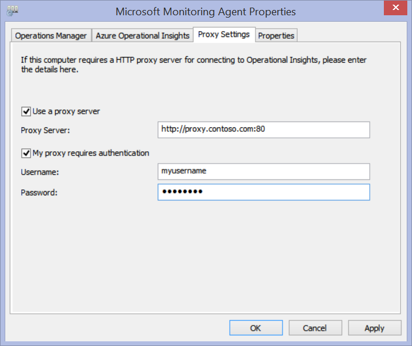
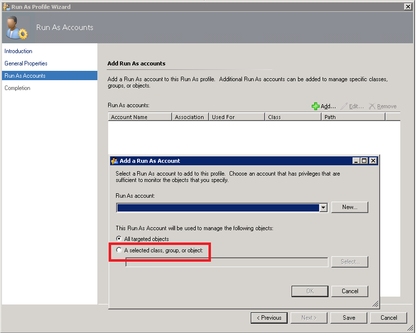
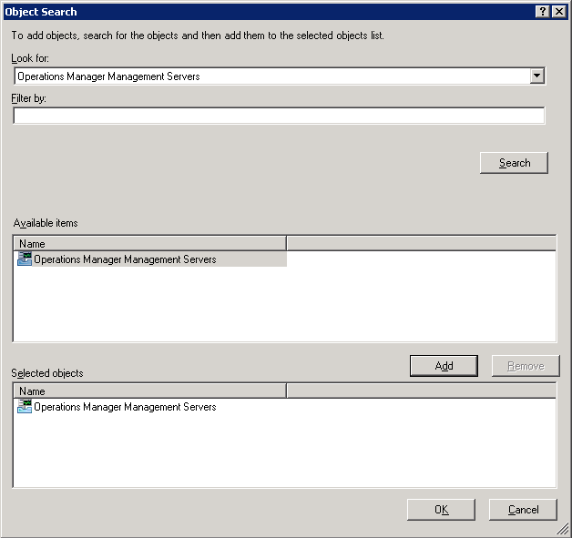
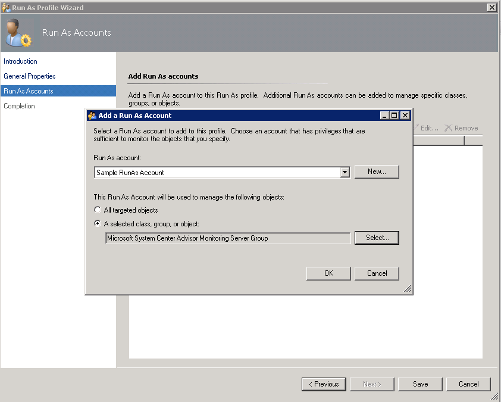
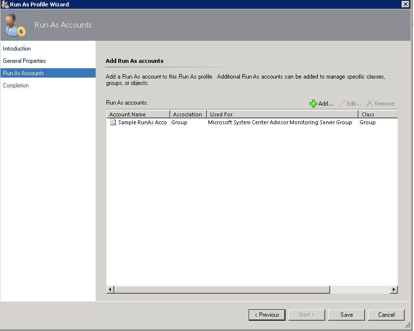
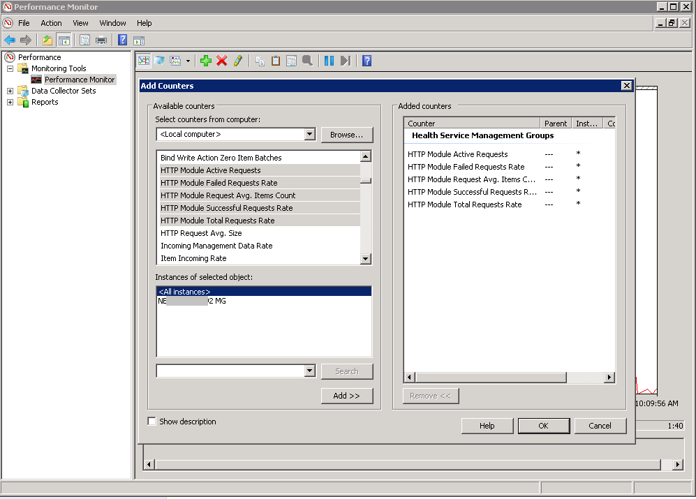

<properties
   pageTitle="Configure proxy and firewall settings for Operational Insights"
   description="Learn about the proxy and firewall settings that you need to configure for the type of agent that you use with Operational Insights"
   services="operational-insights"
   documentationCenter=""
   authors="bandersmsft"
   manager="jwhit"
   editor="tysonn" />
<tags
   ms.service="operational-insights"
   ms.devlang="na"
   ms.topic="get-started-article"
   ms.tgt_pltfrm="na"
   ms.workload="na"
   ms.date="07/21/2015"
   ms.author="banders" />

# Configure proxy and firewall settings for Operational Insights

[AZURE.INCLUDE [operational-insights-note-moms](../../includes/operational-insights-note-moms.md)]

Actions needed to configure proxy and firewall settings for Operational Insights differ when you use Operations Manager and it’s agents versus Microsoft Monitoring Agents that connect directly to servers. Review the following sections for the type of agent that you use.

## Configure proxy and firewall settings with the Microsoft Monitoring Agent

For the Microsoft Monitoring Agent to connect to and register with the Operational Insights service, it must have access to the port number of your domains and the URLs. If you use a proxy server for communication between the agent and the Operational Insights service, you’ll need to ensure that the appropriate resources are accessible. If you use a firewall to restrict access to the Internet, you need to configure your firewall to permit access to Operational Insights. The following tables list the ports that Operational Insights needs.

|**Agent Resource**|**Ports**|
|--------------|-----|
|*.ods.opinsights.azure.com|Port 443|
|*.oms.opinsights.azure.com|Port 443|
|ods.systemcenteradvisor.com|Port 443|
|*.blob.core.windows.net/*|Port 443|

You can use the following procedure to configure proxy settings for the Microsoft Monitoring Agent using Control Panel. You'll need to use the procedure for each server. If you have many servers that you need to configure, you might find it easier to use a script to automate this process. If so, see the next procedure *To configure proxy settings for the Microsoft Monitoring Agent using a script*.

### To configure proxy settings for the Microsoft Monitoring Agent using Control Panel

1. Open **Control Panel**.

2. Open **Microsoft Monitoring Agent**.

3. Click the **Proxy Settings** tab.  
  

4. Select **Use a proxy server** and type the URL and port number, if one is needed, similar to the example shown. If your proxy server requires authentication, type the username and password to access the proxy server.

Use the following procedure to create a PowerShell script that you can run to set the proxy settings for each agent that connects directly to servers.

### To configure proxy settings for the Microsoft Monitoring Agent using a script


- Copy the following sample, update it with information specific to your environment, save it with a PS1 file name extension, and then run the script on each computer that connects directly to the Operational Insights service.


```
param($ProxyDomainName="http://proxy.contoso.com:80", $cred=(Get-Credential))

# First we get the health service configuration object.  We need to determine if we
# have the right update rollup with the API we need.  If not, no need to run the rest of the script.
$healthServiceSettings = New-Object -ComObject 'AgentConfigManager.MgmtSvcCfg'

$proxyMethod = $healthServiceSettings | Get-Member -Name 'SetProxyInfo'

if (!$proxyMethod)
{
    Write-Output 'Health Service proxy API not present, will not update settings.'
    return
}


Write-Output "Clearing proxy settings."
$healthServiceSettings.SetProxyInfo('', '', '')

$ProxyUserName = $cred.username;


Write-Output "Setting Proxy to ${ProxyDomainName} with proxy username of (${ProxyUserName})."
$healthServiceSettings.SetProxyInfo($ProxyDomainName, $ProxyUserName, $cred.GetNetworkCredential().password)
```

## Configure proxy and firewall settings with Operations Manager

For an Operations Manager management group to connect to and register with the Operational Insights service, it must have access to the port numbers of your domains and URLs. If you use a proxy server for communication between the Operations Manager management server and the Operational Insights service, you’ll need to ensure that the appropriate resources are accessible. If you use a firewall to restrict access to the Internet, you need to configure your firewall to permit access to Operational Insights. Even if an Operations Manager management server is not behind a proxy server, it's agents might. In this case, the proxy server should to be configured the same manner as agents are in order to enable and allow Security and Log Management solution data to get sent to the Operational Insights web service.

In order for Operations Manager agents to communicate with the Operational Insights service, your Operations Manager infrastructure (including agents) should have the correct proxy settings and version. The proxy setting for agents is specified in the Operations Manager console. Your version should be one of the of the following:

- Operations Manager 2012 SP1 Update Rollup 7 or later
- Operations Manager 2012 R2 Update Rollup 3 or later


The following tables list the ports related to these tasks.

>[AZURE.NOTE] Some of the following resources mention Advisor. However, the listed resources will change in the future.

|**Agent Resource**|**Ports**|
|--------------|-----|
|*.ods.opinsights.azure.com|Port 443|
|*.oms.opinsights.azure.com|Port 443|
|ods.systemcenteradvisor.com|Port 443|
|*.blob.core.windows.net/*|Port 443|

|**Management server resource**|**Ports**|
|--------------|-----|
|*.ods.opinsights.azure.com|Port 443|
|service.systemcenteradvisor.com|Port 443|
|scadvisor.accesscontrol.windows.net|Port 443|
|scadvisorservice.accesscontrol.windows.net|Port 443|
|*.blob.core.windows.net/*|Port 443|
|data.systemcenteradvisor.com|Port 443|
|ods.systemcenteradvisor.com|Port 443|
|*.systemcenteradvisor.com|Port 443|


|**Operational Insights and Operations Manager console resource**|**Ports**|
|---|---|
|*.systemcenteradvisor.com|Port 80 and 443|
|*.live.com|Port 80 and 443|
|*.microsoftonline.com|Port 80 and 443|
|login.windows.net|Port 80 and 443|


Use the following procedures to register your Operations Manager management group with the Operational Insights service. If you are having communication problems between the management group and the Operational Insights service, use the validation procedures to troubleshoot data transmission to the Operational Insights service.

### To request exceptions for the Operational Insights service endpoints

1. Use the information from the first table presented previously to ensure that the resources needed for the Operations Manager management server are accessible through any firewalls you might have.

2. Use the information from the second table presented previously to ensure that the resources needed for the Operations console in Operations Manager and Operational Insights are accessible through any firewalls you might have.

3. If you use a proxy server with Internet Explorer, ensure that it is configured and works correctly. To verify, you can open a secure web connection (https), for example [https://bing.com](https://bing.com). If the secure web connection doesn’t work in a browser, it probably won’t work in the Operations Manager management console with web services in the cloud.

### To configure the proxy server in the Operations Manager console

1. Open the Operations Manager console and select the **Administration** workspace.

2. Expand **Operational Insights**, and then select **Operational Insights Connection**.


3. In the Operational Insights Connection view, click **Configure Proxy Server**.


4. In Operational Insights Settings Wizard: Proxy Server, select **Use a proxy server to access the Operational Insights Web Service**, and then type the URL with the port number, for example, **http://myproxy:80**.


### To specify credentials if the proxy server requires authentication
 Proxy server credentials and settings need to propagate to managed computers that will report to Operational Insights. Those servers should be in the *Microsoft System Center Advisor Monitoring Server Group*. Credentials are encrypted in the registry of each server in the group.

1. Open the Operations Manager console and select the **Administration** workspace.

2. Under **RunAs Configuration**, select **Profiles**.

3. Open the **System Center Advisor Run As Profile Proxy** profile.

4. In the Run As Profile Wizard, click **Add** to use a Run As account. You can create a new Run As account or use an existing account. This account needs to have sufficient permissions to pass through the proxy server.


5. To set the account to manage, choose **A selected class, group, or object** to open the Object Search box.

6. Search for then select **Microsoft System Center Advisor Monitoring Server Group**.

7. Click **OK** to close the Add a Run As account box

8. Complete the wizard and save the changes.



### To validate that Operational Insights management packs are downloaded

- If you added solutions by using Operational Insights, you can view them in the Operations Manager console as management packs under **Administration**. Search for *System Center Advisor* to quickly find them.

- Or, You can also check for Operational Insights management packs by using the following Windows PowerShell commands in the Operations Manager management server:

        get-scommanagementpack | where {$_.DisplayName -match 'Advisor'} | select Name,DisplayName,Version,KeyToken

        get-scommanagementpack | where {$_.DisplayName -match 'Advisor'} | select Name,DisplayName,Version | ft

### To validate that Operations Manager is sending data to the Operational Insights service

1. In the Operations Manager management server, open Performance Monitor (perfmon.exe), and select **Performance Monitor**.

2. Click **Add**, and then select **Health Service Management Groups**.

3. Add all the counters that start with **HTTP**.

4. If your Operations Manager configuration is good, you will see activity for Health Service Management counters for events and other data items, based on the management packs that you added in Operational Insights and the configured log collection policy.

