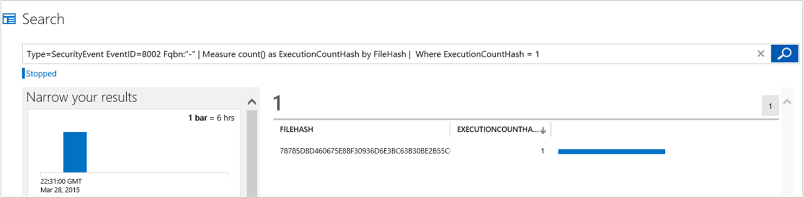
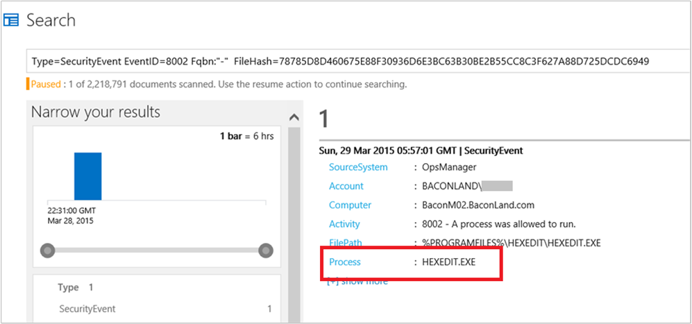
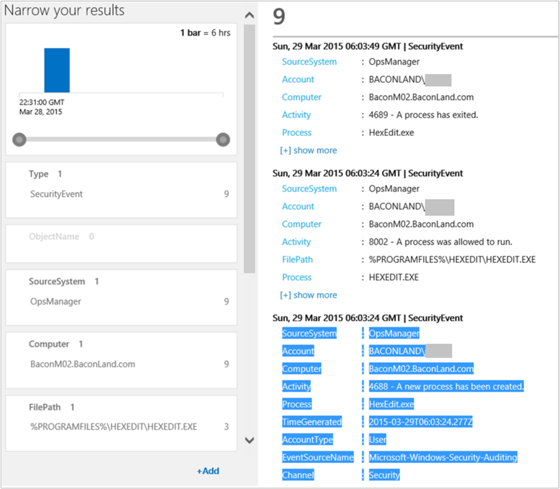

<properties
   pageTitle="Explore Operational Insights security and audit data"
   description="Learn about how you can use the Security and Audit solution to get a comprehensive view into your organization’s IT security posture with built-in search queries for notable issues that require your attention"
   services="operational-insights"
   documentationCenter=""
   authors="bandersmsft"
   manager="jwhit"
   editor="tysonn" />
<tags
   ms.service="operational-insights"
   ms.devlang="na"
   ms.topic="article"
   ms.tgt_pltfrm="na"
   ms.workload="na"
   ms.date="07/21/2015"
   ms.author="banders" />

# Explore Operational Insights security and audit data

[AZURE.INCLUDE [operational-insights-note-moms](../../includes/operational-insights-note-moms.md)]

The Operational Insights Security and Audit solution provides a comprehensive view into your organization’s IT security posture with built-in search queries for notable issues that require your attention.

In this article, you will:

- Conduct a simple investigation for a suspicious executable
- Understand best practices for forensic analysis
- Understand best practices for security breach pattern investigations
- Understand best practices for audit scenarios

## Conduct a simple investigation for a suspicious executable

1. Sign in to Operational Insights.
2. On the **Overview** page, review information displayed in the **Security and Audit** tile and then click it.
 
3. On the **Security and Audit** page, review the information in the **NOTABLE ISSUES** blade. In the example image, you'll see 6 notable issues for today, with 2 from yesterday. In this example, there is 1 suspicious executable. Click **Suspicious Executables** in the **NOTABLE ISSUES** blade.
 
4. Search displays the query and results for the suspicious executable that you clicked. In the example, there is 1 result and its file hash is displayed. Click the **FILEHASH** ID.
 
5. Search displays additional information about the executable file, including its file path and process name. Click the **Process &lt;file name&gt;**. In the example, this is HEXEDIT.EXE.

6. Search appends the name of the process in quotations marks to the query. "**HEXEDIT.EXE"**, in this example.
 
7. In the Search query box, remove everything but the process name and quotation marks and then click the Search icon.
 
8. Search displays detailed information about the process, including the computers where the process ran, the user account that the process ran under, and the date and time that an event was created for the process.
9. Using the information that you find, you can take corrective action as needed. For example, if you determine that the executable is malware then you'll want to take action to remove it from all the computer systems that it affects. After the executable is removed and Operational Insights receives updated log and audit events for your computer systems, values on the NOTABLE ISSUES blade will change on the following day.

[AZURE.INCLUDE [operational-insights-export](../../includes/operational-insights-export.md)]

## Best practices for forensic analysis

**Look for evidence**

When you conduct a forensic analysis using the Security and Audit solution, you're looking for evidence that potentially malicious users leave behind. Regardless of what users are doing in their IT environment, many of the activities they participate in generate security artifacts. You should note that logs are often wiped by attackers and it is often the first step they take in hiding their path.

However, whether users are accessing their own computers or accessing them remotely, evidence about their use is stored in event logs. Operational Insights collects these artifacts *as soon as they occur*, before anyone can tamper with them, and allows you to perform different types of analysis by correlating data across multiple computers.

**Understand how to configure and collect audit events**

To get the most out of the Security and Audit solution, you should configure the level of audit events gathered by your Windows environment that will best suit your needs, using the following resources.

- [How to Configure Security Policy Settings](https://technet.microsoft.com/library/dn135243(v=ws.10).aspx)

- [Advanced Audit Policy Configuration](https://technet.microsoft.com/library/jj852202(v=ws.10).aspx)

- [Audit Policy Recommendations](https://technet.microsoft.com/library/dn487457.aspx)

**Enable AppLocker**

You should also enable AppLocker events, to get rich information about process executions that occur in your IT environment. For more information, see [To Configure an AppLocker Policy for Audit Only](https://technet.microsoft.com/library/hh994622.aspx)

**Configure the audit level for Windows events**

The Windows computing environment gives you the ability to configure the capture-level of security-related records. For example, you can configure your environment so that anytime someone accesses a file, reads a file, or opens a file, an event is generated. The level of detail that you want to collect will vary, depending on your needs. However, every option that you enable comes with some sort of cost because you need to store all the information that you collect. For this reason, in many organization’s IT environments, people decide not to enable object read or object write data collection. Every time someone accesses any file, thousands of events might be generated, some of which are useless noise. The collection level that you decide upon depends on the your best judgment.

>[AZURE.NOTE] If you are using the direct agent and you have a proxy server in your organization, you should configure it to allow the agent to access Operational Insights. For more information, see [Configure proxy and firewall settings](operational-insights-proxy-firewall.md).

## Best practices for security breach pattern investigations

**Investigate abnormal activity patterns**

Security breaches usually originate from legitimate credentials and require a malicious user to attempt to get an elevated privilege through attacks. The Security and Audit solution does not focus on intrusion detection—instead, but it does help you to investigate and discover patterns of abnormal activities with Notable Issues. For example, you should investigate the following abnormal activities and any others that appear under **Notable Issues**.

- unusual logons on a computer from a user who doesn’t normally use it

- unusual network enumeration from atypical users or computers

- new users accounts created with administrative rights

- changes to logging or security policies

- suspicious executables

## Best practices for audit scenarios

Your organization might have computer and network compliance policies and regulations that you must abide by, requiring extensive auditing records. For example, if your organization is a finance company you might need to keep records that prove for any given point in time, which user performed a specific operation on the network. You might also be required to generate reports detailing the activity of a specific user, or selected server on-demand, and go back in time many months—sometimes even years back.

You can use the Security and Audit solution to collect auditing data throughout your IT environment, whether your computers are on premise or in the cloud. All auditing data is stored, indexed, and retained per your subscription. With a Premium subscription to Operational Insights, an unlimited amount of data is stored for one year. Then you can view auditing data, perform searches, and correlate across different data types and computers to get comprehensive results for any time interval since the data was collected.

**Use Group Policy to collect auditing data**

Any auditing data that you want to collect and send to Operational Insights is fully managed with Group Policy. You use it to define security configurations as part of a Group Policy Object (GPO), which are linked to Active Directory containers such as sites, domains, and organizational units, and they help you manage security settings. Policy data is logged and later sent to the Operational Insights service.

**Use AppLocker to gather auditing data**

In addition to local policy settings, if you use AppLocker to gather auditing data, Operational Insights will gather the data and then you can view it.
