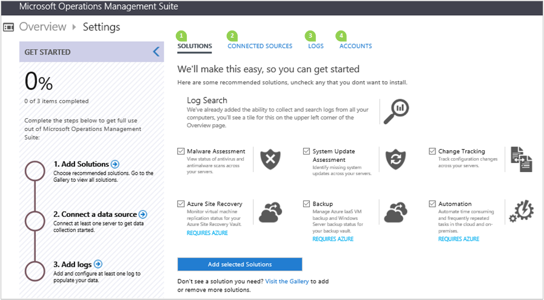
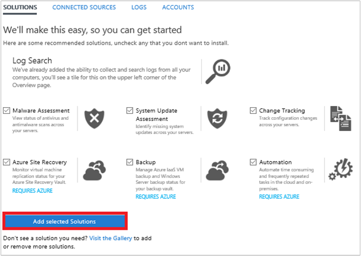
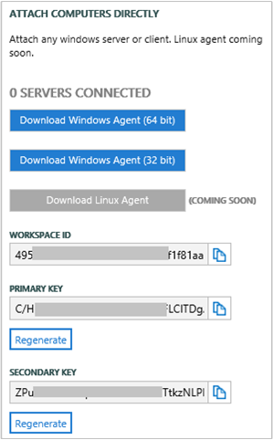
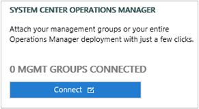
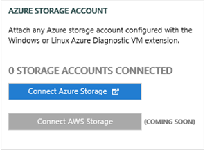
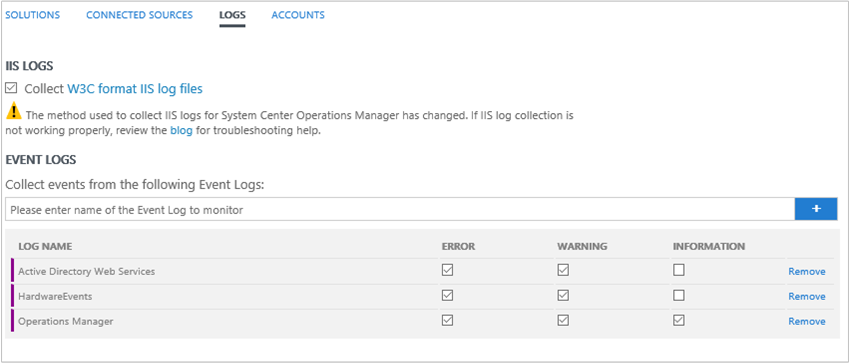
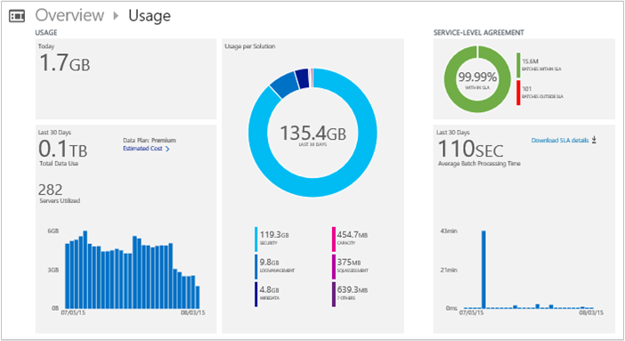
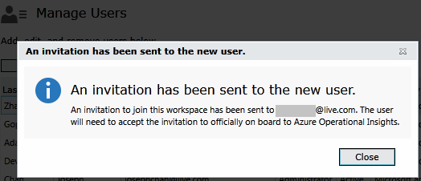
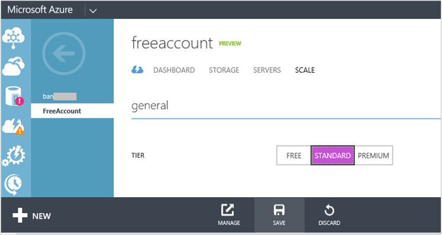

<properties
    pageTitle="Set up your workspace and manage setings"
    description="Learn about how to set up your workspace and manage settings in Microsoft Azure Operational Insights"
    services="operational-insights"
    documentationCenter=""
    authors="bandersmsft"
    manager="jwhit"
    editor=""/>

<tags
    ms.service="operational-insights"
    ms.workload="operational-insights"
    ms.tgt_pltfrm="na"
    ms.devlang="na"
    ms.topic="get-started-article"
    ms.date="08/05/2015"
    ms.author="banders"/>

# Set up your workspace and manage settings

[AZURE.INCLUDE [operational-insights-note-moms](../../includes/operational-insights-note-moms.md)]

To create a new Microsoft Azure Operational Insights workspace, you choose a workspace name, associate it with your account, and you choose a geographical location. An Operational Insights workspace is essentially a container that includes account information and simple configuration information for the account. You or other members of your organization might use multiple Operational Insights workspaces to manage different sets of data that is collected from all or portions of your IT infrastructure.

After the workspace is created, you can perform other tasks using the workspace, such as manage Operational Insights, add solution, connect data sources, add logs, select storage accounts, view your usage data in the dashboard, and you can manage the settings for each workspace.

The [Onboard in minutes](./operational-insights-onboard-in-minutes.md) article shows you how to quickly get up and running and the rest of this article describes in more detail some of the actions you'll need to do finish getting started and manage your workspace.

We'll cover all the commonly used tasks that you use in the following sections:

1. Add solutions
2. Connect data sources
3. Add and manage logs
4. Manage accounts and users

## 1 Add solutions

Microsoft Azure Operational Insights includes base Configuration Assessment functionality, so you don't need to install a solution to enable it. However, you can get additional functionality by adding solutions to it from the Settings or Solution Gallery pages.

After you have added a solution, data is collected from the servers in your infrastructure and sent to the Operational Insights service. Processing by the Operational Insights service can take from a few minutes to several hours. After the service processes the data, you can view it in Operational Insights.

You can easily remove a solution when it is no longer needed. When you remove a solution, its data is not sent to Operational Insights, which reduces the amount of data used by your daily quota.

### Solutions supported by the Microsoft Monitoring Agent

At this time, servers that are connected directly to Microsoft Azure Operational Insights using the Microsoft Monitoring Agent can use most of the solutions available, including:

- [System Updates](operational-insights-updates.md)
- [Antimalware](operational-insights-antimalware.md)
- [Change Tracking](operational-insights-change-tracking.md)
- [SQL and Active Directory Assessment](operational-insights-assessment.md)

However, the following solutions are *not* supported with the Microsoft Monitoring Agent and require System Center Operations Manager (SCOM).

- [Capacity Management](operational-insights-capacity.md)
- [Alert Management](operational-insights-alerts.md)
- [Configuration Assessment](operational-insights-solutions.md#configuration-assessment)

Refer to [Operations Manager considerations with Operational Insights](operational-insights-operations-manager.md) for guidance on using these solutions with Operations Manager.

IIS log collection is supported on computers with:

- Windows Server 2012
- Windows Server 2012 R2

### To add solutions using the Settings page

- Select the solutions that you want to add and then click **Add selected Solutions**. Not all the solutions that are available are shown there. If you want to add solutions that are not listed, use the next procedure.
    

### To add a solution using the Solutions Gallery

1. On the Overview page in Operational Insights, click the **Solutions Gallery** tile.    
    
2. On the Operational Insights Solutions Gallery page, you can learn about each available solution. Click the name of the solution that you want to add to Operational Insights.
3. On the page for the solution that you chose, detailed information about the solution is displayed. Click **Add**.
4. On the Confirmation page, click **Accept** to agree to the privacy statement and terms of use.
5. A new tile for the solution that you added appears on the Overview page in Operational Insights and you can start using it after the Operational Insights service processes your data.

### To remove a solution using the Solutions Gallery

1. On the Overview page in Operational Insights, click the **Solutions Gallery** tile.
2. On the Operational Insights Solutions Gallery page, under the solution that you want to remove, click **Remove**.
3. On the confirmation page, click **Yes** to remove the solution.

## 2 Connect data sources

There are three ways to connect data sources:

- Attach computers directly to Operational Insights. See [Connect computers directly to Operational Insights](./operational-insights-direct-agent.md) for more information.  
    
- Attach Operations Manager management groups. See [Connect to Operational Insights from System Center Operations Manager](./operational-insights-connect-scom.md) for more information.  
    
- Attach an Azure storage account. See [Analyze data from servers in Microsoft Azure](./operational-insights-analyze-data-azure.md) for more information.  
    

## 3 Add and manage logs

Before you add logs, you need to have a solution that will use log data installed. Then you can add new logs to collect events and choose which event levels or severity that you want to collect for the logs. You can collect:

- Windows event logs
- IIS logs
- Other logs that you've added

### IIS Log File Format

The only IIS log format supported at the moment is W3C. Don't worry - it's the most common format, and the default format in IIS 7 and IIS 8. So, if you log in NCSA or IIS native format, Operational Insights won't pick those logs up at all. Even in W3C format, you'll see that not all fields are logged by default. You can read more about the format at [Select W3C Fields to Log (IIS 7)](https://technet.microsoft.com/library/cc754702(v=WS.10).aspx).

> [AZURE.TIP] For the best log search experience, we recommend selecting all logging fields for each website using **Logging** in IIS. We also recommend changing the **Log File Rollover** schedule for new logs to **Hourly** - so smaller files will be uploaded to the cloud, saving bandwidth.

### To collect Windows event logs from Operations Manager or directly-connected agents

1. On the **Overview** page, click the **Settings** tile and then click the **Logs** tab.
2. Type the name of the event log that you want to collect information from. If you're unsure of the name to use, select the properties of the Windows event log in **Event Viewer**, copy the name in the **FullName** field, and paste it in the **Collect events from the following Event Logs** box.
3. Click **+** to add the log.
4. Select the event levels or severity that you want to collect for the log. **Audit Success** and **Audit Failure** events are not supported in this release.
5. Repeat the previous steps for each log that you want to collect information from, and then click **Save**.
6. Events should appear in Operational Insights in a few minutes, and then you can search the data.

### To collect IIS logs from Operations Manager or directly-connected agents

1. On the **Overview** page, click the **Settings** tile and then click the **Logs** tab.
2. On the **Logs** tab, under **Event logs**, select **Collect logs from Operations Manager**.

### To collect IIS logs and/or Windows Events from Azure Diagnostics
This is configurable from the Azure Management Portal, not the Operational Insights portal, under your workspace, go to the **Storage** tab and you can enable log collection from that storage account.

### After log collection is configured
After log collection is configured, your log collection policy is sent to agents or through management groups to agents and the service starts collecting events.

You can access some initial breakdowns of log events collected from your monitored servers by viewing the **Usage** page.

## 4 Manage accounts and users
You manage accounts and users using the **Accounts** tab in the Settings page. There, you can perform the following tasks.  

## Add a user to an existing workspace

Use the following steps to add a user or group to an Operational Insights workspace. The user or group will be able to view and act on all alerts that are associated with this workspace.

>[AZURE.NOTE] If you want to add a user or group from your Azure Active Directory organizational account, you must first ensure that you have associated your Operational Insights account with your Active Directory domain. See [Add an Azure Active Directory Organization to an existing workspace](#).

### To add a user to an existing workspace
1. In Operational Insights, click the **Settings** tile.
2. Click the **Accounts** tab.
3. In the **Manage Users** section, choose the account type to add: **Organizational Account** or **Microsoft Account**.
    - If  you choose Microsoft Account, type the email address of the user associated with the Microsoft Account.
    - If you choose Organizational Account, you can enter part of the user or group’s name or email alias and a list of users and groups will appear. Select a user or  group.
        >[AZURE.NOTE] For the best performance results, limit the number of Active Directory groups associated with a single Operational Insights account to two—one for administrators and one for users. Using more groups might impact the performance of Operational Insights.
7. Choose the type of user or group to add: **Administrator** or **User**.  
8. Click **Add**.

  If you are adding a Microsoft account, an invitation to join the workspace is sent to the email you provided. After the user follows the instructions in the invitation to join Operational Insights, the user can view the alerts and account information for this Operational Insights account, and you will be able to view the user information on the **Accounts**  tab of the **Settings** page.
  If you are adding an organizational account, the user will be able to access Operational Insights immediately.  
  

### How many workspaces do I need?
A workspace is seen as an Azure resource within the Azure Management Portal.

You can either create a new workspace or link to an existing workspace you might have opened earlier for use with System Center Operations Manager, but you haven't yet associated with an Azure subscription (necessary for billing).
A workspace represents the level at which data is collected, aggregated, analyzed, and presented in the Operational Insights portal.
You might choose to have multiple workspaces to segregate data from different environments and systems; each Operations Manager management group (and all its agents) or individual VMs/agents can each be connected with only one workspace.

Each workspace can have multiple user accounts associated with it, and each user account (Microsoft account or Organizational account) can have access to multiple Operational Insights workspaces.
By default, the Microsoft account or Organizational account used to create the workspace becomes the Administrator of the workspace. The administrator can then invite additional Microsoft accounts or pick users from his Azure Active Directory.

## Link an existing workspace to an Azure subscription

It is possible to create a workspace from [microsoft.com/oms](https://microsoft.com/oms).  However, certain limits exist for these workspaces, the most notable being a limit of 500MB/day of data uploads if you're using a free account.  To make changes to this workspace you will need to **link your existing workspace to an Azure subscription**.

>[AZURE.IMPORTANT] In order to link a workspace, your Azure account must already have access to the workspace you'd like to link.  In other words, the account you use to access the Azure portal should be **the same** as the account you use to access your Operational Insights workspace. If this is not the case, see [Add a user to an existing workspace](#add-an-azure-active-directory-organization-to-an-existing-workspace).

1. Sign in to the Azure Management Portal.
2. In the bottom left of the portal, click **+ New**.
3. Click **App Services**, scroll to **Operational Insights** and select it.
4. Click **Quick Create**.
5. On the **Account** list, you should see a list of your existing workspaces that have *not yet* been linked to your Azure subscription. Select an account.

  >[AZURE.NOTE] If you do not see the workspace you'd like to link here, this means your Azure subscription does not have access to your Operational Insights workspace.  You will need to grant access to this account from inside your Operational Insights workspace.  To do so, see [Add a user to an existing workspace](#add-a-user-to-an-existing-workspace).

  

6. Fill in the remaining fields and then select **Create Workspace**.

## Upgrade workspace to a paid data plan

There are three workspace data plan types for Operational Insights: **Free**, **Standard** and **Premium**.  If you are on a *free* plan, you may have hit your data cap of 500MB.  You will need to upgrade your workspace to a '**pay-as-you-go plan**' in order to collect data beyond this limit. At any time your can convert your plan type.  For more information on Operational Insights pricing, see [Pricing Details](http://azure.microsoft.com/pricing/operational-insights/)

>[AZURE.IMPORTANT] Workspace plans can only be changed if they are *linked* to an Azure subscription.  If you created your workspace in Azure or if you've *already* linked your workspace, you can ignore this message.  If you created your workspace from [opinsights.azure.com](http://opinsights.azure.com), you will need to follow the steps at [Link an existing workspace to an Azure subscription](#link-an-existing-workspace-to-an-Azure-subscription).

### Change plan type

In the Azure Management Portal, navigate to the Operational Insights workspace you'd like to upgrade to:

Select this workspace and select **SCALE** from the tabs at the top of the screen

Finally, choose the plan you'd like to upgrade to and click **SAVE**.  You will see the changes reflected in the portal and will now be able to collect data beyond the "free" data cap.

## Add an Azure Active Directory Organization to an existing workspace

You can associate your Operational Insights workspace with an Azure Active Directory domain. This enables you to add users from Active Directory directly to your Operational Insights workspace without requiring a separate Microsoft account.

### To add an Azure Active Directory Organization to an existing workspace

1. On the Settings page in Operational Insights, click **Accounts** and then click **Add Organization**.
  
2. Review the information about organizational accounts, and then click **Next**.
3. Enter the identity information for the administrator of your Azure Active Directory domain, and then click **Sign in**.
4. Click **Grant access** to enable Operational Insights to use the identity information in your Active Directory domain.
  

## Edit an existing user type

You can change the account role for a user associated with your Operational Insights account. You have the following role options:

 - *Administrator*: Can manage users, view and act on all alerts, and add and remove servers

 - *User*: Can view and act on all alerts, and add and remove servers

### To edit an account
1. On the **Settings** page in the **Accounts** tab in Operational Insights, select the role for the user that you want to change.
2. Click **OK**.

## Remove a user from an Operational Insights workspace

Use the following steps to remove a user from an Operational Insights workspace. Note that this does not close the user’s workspace. Instead, it removes the association between that user and the workspace. If a user is associated with multiple workspaces, that user will still be able to sign in to Operational Insights.

### To remove a user from a workspace

1. On the **Settings** page in the **Accounts** tab of Operational Insights, click Remove next to the user name that you want to remove.
2. Click **OK** to confirm that you want to remove the user.

## Close your Operational Insights workspace

When you close an Operational Insights workspace, all data related to your workspace is deleted from the Operational Insights service not more than 30 days after you close the workspace.

If you are an administrator, and there are multiple users associated with the workspace, the association between those users and the workspace is broken. If the users are associated with other workspaces, then they can continue using Operational Insights with those other workspaces. However, if they are not associated with other workspaces then they will need to create a new workspace to use Operational Insights.

### To close an Operational Insights workspace

1. On the **Settings** page in the **Accounts** tab of Operational Insights, click **Close Workspace**.

2. Select one of the reasons for closing your workspace, or enter a different reason in the text box.

3. Click **Close workspace**.

## Additional resources
- [IIS Log Format Requirements in Azure Operational Insights](http://blogs.technet.com/b/momteam/archive/2014/09/19/iis-log-format-requirements-in-system-center-advisor.aspx)
- See what other data sources and types of logs the community is asking us to implement in our [Feedback forum](http://feedback.azure.com/forums/267889-azure-operational-insights/category/88086-log-management-and-log-collection-policy).
