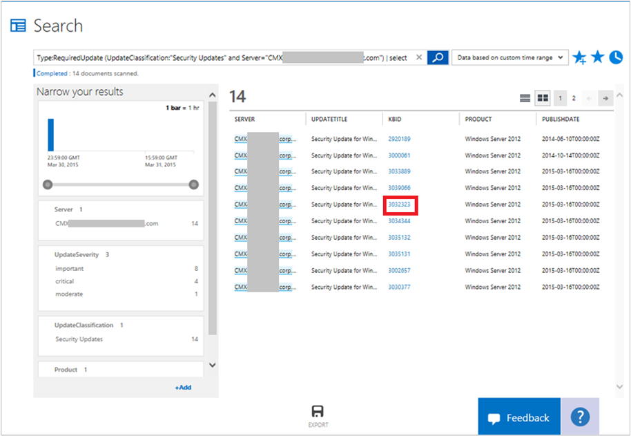

<properties
   pageTitle="Update servers with System Updates"
   description="Learn how you can use the System Updates solution in Microsoft Azure Operational Insights to help you apply missing updates to servers in your infrastructure"
   services="operational-insights"
   documentationCenter=""
   authors="bandersmsft"
   manager="jwhit"
   editor="tysonn" />
<tags
   ms.service="operational-insights"
   ms.devlang="na"
   ms.topic="article"
   ms.tgt_pltfrm="na"
   ms.workload="na"
   ms.date="08/05/2015"
   ms.author="banders" />

# Update servers with System Updates

[AZURE.INCLUDE [operational-insights-note-moms](../../includes/operational-insights-note-moms.md)]

You can use the System Updates solution in Microsoft Azure Operational Insights to help you apply missing updates to servers in your infrastructure. You install the solution to update the Operations Manager agent and base configuration module for Operational Insights. Update information is read on the monitored servers and then update data is sent to the Operational Insights service in the cloud for processing. Logic is applied to the update data and the cloud service records the data. If missing updates are found, they are shown on the **Updates** dashboard. You can use the **Updates** dashboard to work with missing updates and develop a plan to apply them to the servers that need them.

## Use System Updates to update servers

Before you can use system updates in Microsoft Azure Operational Insights, you must have the solution installed. To read more about installing solutions, see [Use the Solutions Gallery to add or remove solutions](operational-insights-setup-workspace.md). After it is installed, you can view the updates that are missing from your monitored servers by using the **System Update Assessment** tile on the **Overview** page in Operational Insights.

### To work with updates

1. On the **Overview** page, click the **System Update Assessment** tile.

2. On the **Updates** dashboard, view the update categories.

3. Scroll to the right of the page to view the **Type of Updates Missing** blade and then click **Security Updates**.

4. On the Search page, a list of security updates that were found missing from servers in your infrastructure is shown. Click a Knowledge Base article ID (KBID)  to view more information about the update that is missing. In this example, *KBID 3032323*.

5. Your web browser opens the Knowledge Base article that describes the update.

6. Using the using the information you've found, you can create a plan to apply missing updates.

[AZURE.INCLUDE [operational-insights-export](../../includes/operational-insights-export.md)]
