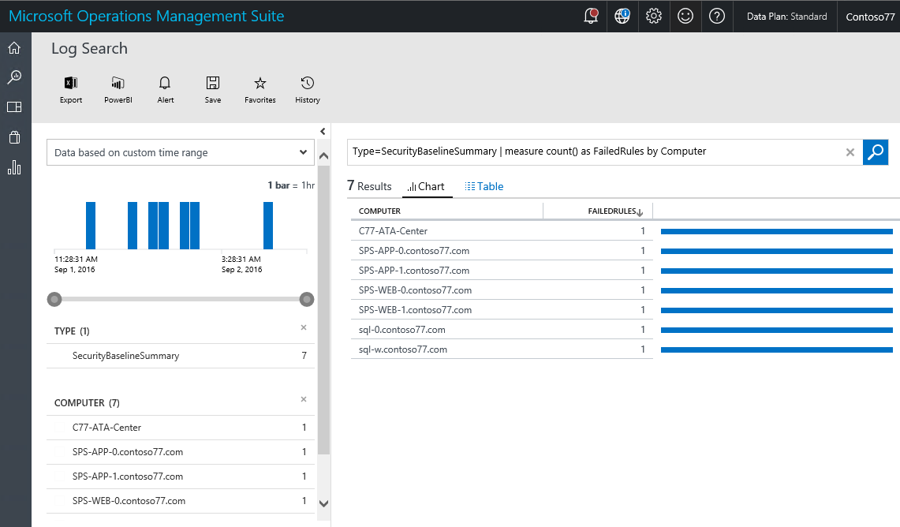
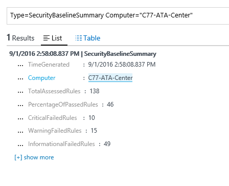
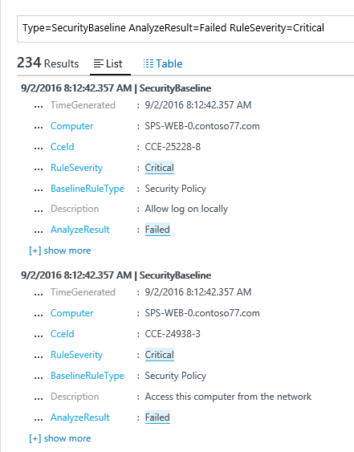

# Baseline Assessment in Operations Management Suite Security and Audit Solution
This document helps you to use [Operations Management Suite (OMS) Security and Audit Solution](operations-management-suite-overview.md) baseline assessment capabilities to access the secure state of your monitored resources.

## What is Baseline Assessment?
Microsoft, together with industry and government organizations worldwide, defines a Windows configuration that represents highly secure server deployments. This configuration is a set of registry keys, audit policy settings, and security policy settings along with Microsoft’s recommended values for these settings. This set of rules is known as Security baseline. OMS Security and Audit baseline assessment capability can seamlessly scan all your computers for compliance. 

There are three types of rules:

* **Registry rules**: check that registry keys are set correctly.
* **Audit policy rules**: rules regarding your audit policy.
* **Security policy rules**: rules regarding the user’s permissions on the machine.

> [!NOTE]
> Read [Use OMS Security to assess the Security Configuration Baseline](https://blogs.technet.microsoft.com/msoms/2016/08/12/use-oms-security-to-assess-the-security-configuration-baseline/) for a brief overview of this feature.
> 
> 

## Security Baseline Assessment
You can review your current security baseline assessment for all computers that are monitored by OMS Security and Audit using the dashboard.  Execute the following steps to access the security baseline assessment dashboard:

1. In the **Microsoft Operations Management Suite** main dashboard, click **Security and Audit** tile.
2. In the **Security and Audit** dashboard, click **Baseline Assessment** under **Security Domains**. The **Security Baseline Assessment** dashboard appears as shown in the following image:
   
    

This dashboard is divided in three major areas:

* **Computers compared to baseline**: this section gives a summary of the number of computers that were accessed and the percentage of computers that passed the assessment. It also gives the top 10 computers and the percentage result for the assessment.
* **Required Rules Status**: this section has the intent to bring awareness of the failed rules by severity and failed rules by type. By looking to the first graph you can quickly identify if most the failed rules are critical, or not. It also gives a list of the top 10 failed rules and their severity. The second graph shows the type of rule that failed during the assessment. 
* **Computers missing baseline assessment**: this section list the computers that were not accessed due to operating system incompatibility or failures. 

### Accessing computers compared to baseline
Ideally all your computers are be compliant with the security baseline assessment. However it is expected that in some circumstances this doesn't happen. As part of the security management process, it is important to include reviewing the computers that failed to pass all security assessment tests. A quick way to visualize that is by selecting the option **Computers accessed** located in the **Computers compared to baseline** section. You should see the log search result showing the list of computers as shows in the following screen:

The search result is shown in a table format, where the first column has the computer name and the second color has the number of rules that failed. To retrieve the information regarding the type of rule that failed, click in the number of failed rules besides the computer name. You should see a result similar to the one shown in the following image:

In this search result, you have the total of accessed rules, the number of critical rules that failed, the warning rules and the information failed rules.

### Accessing required rules status
After obtaining the information regarding the percentage number of computers that passed the assessment, you may want to obtain more information about which rules are failing according to the criticality. This visualization helps you to prioritize which computers should be addressed first to ensure they will be compliant in the next assessment. Hover over the Critical part of the graph located in the **Failed rules by severity** tile, under **Required rules status** and click it. You should see a result similar to the following screen:

 

In this log result you see the type of baseline rule that failed, the description of this rule, and the Common Configuration Enumeration (CCE) ID of this security rule. These attributes should be enough to perform a corrective action to fix this problem in the target computer.

> [!NOTE]
> For more information about CCE, access the [National Vulnerability Database](https://nvd.nist.gov/cce/index.cfm).
> 
> 

### Accessing computers missing baseline assessment
OMS supports the domain member and Domain Controller baseline profile on Windows Server 2008 R2 up to Windows Server 2012 R2. Windows Server 2016 baseline isn’t final yet and will be added as soon as it is published. All other operating systems scanned via OMS Security and Audit baseline assessment appears under the **Computers missing baseline assessment** section.

## See also
In this document, you learned about OMS Security and Audit baseline assessment. To learn more about OMS Security, see the following articles:

* [Operations Management Suite (OMS) overview](operations-management-suite-overview.md)
* [Monitoring and Responding to Security Alerts in Operations Management Suite Security and Audit Solution](oms-security-responding-alerts.md)
* [Monitoring Resources in Operations Management Suite Security and Audit Solution](oms-security-monitoring-resources.md)

